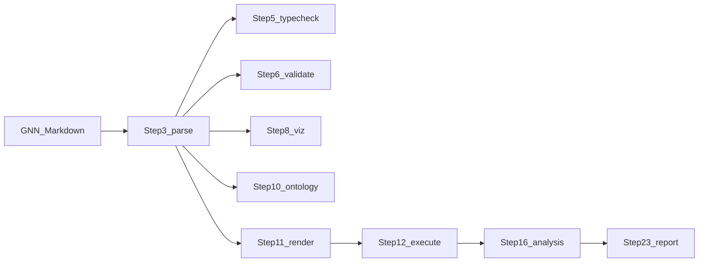
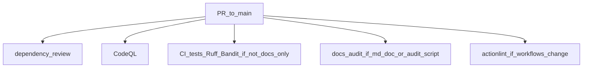

# GNN on GitHub — project hub

**Generalized Notation Notation (GNN)** is a text-based language for [Active Inference](https://activeinference.org/) generative models. This repository implements a **25-step pipeline** (steps 0–24) that discovers and parses GNN sources (Markdown with structured sections), registers models, type-checks and validates them, exports and visualizes structure, attaches ontology annotations, **renders** executable code for multiple simulation frameworks, **executes** those scripts, and continues through LLM-assisted analysis, ML integration, audio, statistical analysis, integration/security/research steps, static site generation, MCP exposure, GUI tooling, reporting, and intelligent analysis.

This file is the **GitHub-oriented entry point**: GNN concepts, deep links into language and pipeline docs, repository layout, CI, and local validation. The narrative overview, badges, publication block, and long examples live in the root [README.md](../README.md).

**Last updated**: 2026-03-24

---

## Contents

- [What GNN is](#what-gnn-is)
- [GNN files and data flow](#gnn-files-and-data-flow)
- [Pipeline: all 25 steps](#pipeline-all-25-steps)
- [Render and execute backends](#render-and-execute-backends)
- [Interfaces: CLI, API, LSP, MCP](#interfaces-cli-api-lsp-mcp)
- [Active Inference and cognitive modeling docs](#active-inference-and-cognitive-modeling-docs)
- [Deep link map (doc/gnn and neighbors)](#deep-link-map-docgnn-and-neighbors)
- [Canonical documentation](#canonical-documentation)
- [Repository map](#repository-map)
- [Community and policies](#community-and-policies)
- [Automation in this folder](#automation-in-this-folder)
  - [Directory index](#directory-index)
  - [Dependabot](#dependabot)
  - [Workflows](#workflows)
  - [Why CI and docs-audit split](#why-ci-and-docs-audit-split)
  - [Automation on a typical PR](#automation-on-a-typical-pr)
- [Local validation](#local-validation-parity-with-automation)
- [Related tooling docs](#related-tooling-docs)

---

## What GNN is

- **Notation**: Models are written as **Markdown** with labeled sections (for example `## GNNSection`, `## StateSpaceBlock`, `## Connections`, `## InitialParameterization`, ontology annotations). The normative and reference material is split across [doc/gnn/gnn_syntax.md](../doc/gnn/gnn_syntax.md) (v1.1 living spec), [doc/gnn/reference/gnn_syntax.md](../doc/gnn/reference/gnn_syntax.md) (examples and patterns), and the [language hub](../doc/gnn/language/README.md).
- **Processing**: A single orchestrator ([src/main.py](../src/main.py)) runs the numbered steps in order (or a subset via `--only-steps` / `--skip-steps`). Step **3** produces parsed representations consumed by type checking, validation, export, visualization, ontology, render, LLM, and related steps; **11 → 12** is the main **generate code → run simulation** bridge. See [doc/gnn/reference/architecture_reference.md](../doc/gnn/reference/architecture_reference.md) and [doc/gnn/reference/technical_reference.md](../doc/gnn/reference/technical_reference.md).
- **Architecture**: Each step is a **thin orchestrator** (`src/N_*.py`) delegating to `src/<module>/` with `AGENTS.md` and usually `processor.py`. Diagram and conventions: root [AGENTS.md](../AGENTS.md), [ARCHITECTURE.md](../ARCHITECTURE.md), [src/README.md](../src/README.md).

---

## GNN files and data flow

**Typical inputs**

- Model files under [input/gnn_files/](../input/gnn_files/) (samples and tests).
- Defaults and knobs in [input/config.yaml](../input/config.yaml).

**Typical outputs**

- Per-step folders under [output/](../output/) (see root README directory overview). Policy: tracked in git per [AGENTS.md](AGENTS.md) / project conventions.



Troubleshooting and operator notes: [doc/gnn/operations/gnn_troubleshooting.md](../doc/gnn/operations/gnn_troubleshooting.md), [doc/gnn/operations/gnn_tools.md](../doc/gnn/operations/gnn_tools.md).

---

## Pipeline: all 25 steps

Orchestrator scripts live in [src/](../src/); module AGENTS in each folder; per-step **documentation** in [doc/gnn/modules/](../doc/gnn/modules/).

| Step | Module | Orchestrator | [Module AGENTS](../src/AGENTS.md) | [Step doc](../doc/gnn/modules/README.md) |
|-----:|--------|--------------|-----------------------------------|----------------------------------------|
| 0 | template | [0_template.py](../src/0_template.py) | [template/AGENTS.md](../src/template/AGENTS.md) | [00_template.md](../doc/gnn/modules/00_template.md) |
| 1 | setup | [1_setup.py](../src/1_setup.py) | [setup/AGENTS.md](../src/setup/AGENTS.md) | [01_setup.md](../doc/gnn/modules/01_setup.md) |
| 2 | tests | [2_tests.py](../src/2_tests.py) | [tests/AGENTS.md](../src/tests/AGENTS.md) | [02_tests.md](../doc/gnn/modules/02_tests.md) |
| 3 | gnn | [3_gnn.py](../src/3_gnn.py) | [gnn/AGENTS.md](../src/gnn/AGENTS.md) | [03_gnn.md](../doc/gnn/modules/03_gnn.md) |
| 4 | model_registry | [4_model_registry.py](../src/4_model_registry.py) | [model_registry/AGENTS.md](../src/model_registry/AGENTS.md) | [04_model_registry.md](../doc/gnn/modules/04_model_registry.md) |
| 5 | type_checker | [5_type_checker.py](../src/5_type_checker.py) | [type_checker/AGENTS.md](../src/type_checker/AGENTS.md) | [05_type_checker.md](../doc/gnn/modules/05_type_checker.md) |
| 6 | validation | [6_validation.py](../src/6_validation.py) | [validation/AGENTS.md](../src/validation/AGENTS.md) | [06_validation.md](../doc/gnn/modules/06_validation.md) |
| 7 | export | [7_export.py](../src/7_export.py) | [export/AGENTS.md](../src/export/AGENTS.md) | [07_export.md](../doc/gnn/modules/07_export.md) |
| 8 | visualization | [8_visualization.py](../src/8_visualization.py) | [visualization/AGENTS.md](../src/visualization/AGENTS.md) | [08_visualization.md](../doc/gnn/modules/08_visualization.md) |
| 9 | advanced_visualization | [9_advanced_viz.py](../src/9_advanced_viz.py) | [advanced_visualization/AGENTS.md](../src/advanced_visualization/AGENTS.md) | [09_advanced_viz.md](../doc/gnn/modules/09_advanced_viz.md) |
| 10 | ontology | [10_ontology.py](../src/10_ontology.py) | [ontology/AGENTS.md](../src/ontology/AGENTS.md) | [10_ontology.md](../doc/gnn/modules/10_ontology.md) |
| 11 | render | [11_render.py](../src/11_render.py) | [render/AGENTS.md](../src/render/AGENTS.md) | [11_render.md](../doc/gnn/modules/11_render.md) |
| 12 | execute | [12_execute.py](../src/12_execute.py) | [execute/AGENTS.md](../src/execute/AGENTS.md) | [12_execute.md](../doc/gnn/modules/12_execute.md) |
| 13 | llm | [13_llm.py](../src/13_llm.py) | [llm/AGENTS.md](../src/llm/AGENTS.md) | [13_llm.md](../doc/gnn/modules/13_llm.md) |
| 14 | ml_integration | [14_ml_integration.py](../src/14_ml_integration.py) | [ml_integration/AGENTS.md](../src/ml_integration/AGENTS.md) | [14_ml_integration.md](../doc/gnn/modules/14_ml_integration.md) |
| 15 | audio | [15_audio.py](../src/15_audio.py) | [audio/AGENTS.md](../src/audio/AGENTS.md) | [15_audio.md](../doc/gnn/modules/15_audio.md) |
| 16 | analysis | [16_analysis.py](../src/16_analysis.py) | [analysis/AGENTS.md](../src/analysis/AGENTS.md) | [16_analysis.md](../doc/gnn/modules/16_analysis.md) |
| 17 | integration | [17_integration.py](../src/17_integration.py) | [integration/AGENTS.md](../src/integration/AGENTS.md) | [17_integration.md](../doc/gnn/modules/17_integration.md) |
| 18 | security | [18_security.py](../src/18_security.py) | [security/AGENTS.md](../src/security/AGENTS.md) | [18_security.md](../doc/gnn/modules/18_security.md) |
| 19 | research | [19_research.py](../src/19_research.py) | [research/AGENTS.md](../src/research/AGENTS.md) | [19_research.md](../doc/gnn/modules/19_research.md) |
| 20 | website | [20_website.py](../src/20_website.py) | [website/AGENTS.md](../src/website/AGENTS.md) | [20_website.md](../doc/gnn/modules/20_website.md) |
| 21 | mcp | [21_mcp.py](../src/21_mcp.py) | [mcp/AGENTS.md](../src/mcp/AGENTS.md) | [21_mcp.md](../doc/gnn/modules/21_mcp.md) |
| 22 | gui | [22_gui.py](../src/22_gui.py) | [gui/AGENTS.md](../src/gui/AGENTS.md) | [22_gui.md](../doc/gnn/modules/22_gui.md) |
| 23 | report | [23_report.py](../src/23_report.py) | [report/AGENTS.md](../src/report/AGENTS.md) | [23_report.md](../doc/gnn/modules/23_report.md) |
| 24 | intelligent_analysis | [24_intelligent_analysis.py](../src/24_intelligent_analysis.py) | [intelligent_analysis/AGENTS.md](../src/intelligent_analysis/AGENTS.md) | [24_intelligent_analysis.md](../doc/gnn/modules/24_intelligent_analysis.md) |

**Also documented**: [init.md](../doc/gnn/modules/init.md) (template init), [main.md](../doc/gnn/modules/main.md) (orchestrator). **Infrastructure** (not separate numbered steps): [pipeline/AGENTS.md](../src/pipeline/AGENTS.md), [utils/AGENTS.md](../src/utils/AGENTS.md), [api/AGENTS.md](../src/api/AGENTS.md), [cli/AGENTS.md](../src/cli/AGENTS.md), [lsp/AGENTS.md](../src/lsp/AGENTS.md), [src/doc/AGENTS.md](../src/doc/AGENTS.md).

**Run examples**

```bash
uv run python src/main.py --target-dir input/gnn_files --verbose
uv run python src/main.py --only-steps "3,5,11,12" --verbose
uv run python src/3_gnn.py --target-dir input/gnn_files --output-dir output --verbose
```

More command patterns: [CLAUDE.md](../CLAUDE.md), [doc/gnn/operations/gnn_tools.md](../doc/gnn/operations/gnn_tools.md).

---

## Render and execute backends

Code generation and execution are organized under [src/render/](../src/render/) and [src/execute/](../src/execute/). Documentation:

| Topic | Link |
|------|------|
| Integration overview | [framework_integration_guide.md](../doc/gnn/integration/framework_integration_guide.md) |
| Implementation patterns | [gnn_implementation.md](../doc/gnn/integration/gnn_implementation.md) |
| Per-framework index | [implementations/README.md](../doc/gnn/implementations/README.md) |
| PyMDP | [pymdp.md](../doc/gnn/implementations/pymdp.md), [doc/pymdp/gnn_pymdp.md](../doc/pymdp/gnn_pymdp.md) |
| JAX | [jax.md](../doc/gnn/implementations/jax.md) |
| RxInfer | [rxinfer.md](../doc/gnn/implementations/rxinfer.md), [doc/rxinfer/gnn_rxinfer.md](../doc/rxinfer/gnn_rxinfer.md) |
| ActiveInference.jl | [activeinference_jl.md](../doc/gnn/implementations/activeinference_jl.md), [activeinference-jl.md](../doc/activeinference_jl/activeinference-jl.md) |
| NumPyro | [numpyro.md](../doc/gnn/implementations/numpyro.md) |
| PyTorch | [pytorch.md](../doc/gnn/implementations/pytorch.md) |
| DisCoPy | [discopy.md](../doc/gnn/implementations/discopy.md), [doc/discopy/gnn_discopy.md](../doc/discopy/gnn_discopy.md) |
| Stan | [stan.md](../doc/gnn/implementations/stan.md) |
| CatColab | [catcolab.md](../doc/gnn/implementations/catcolab.md), [doc/catcolab/catcolab_gnn.md](../doc/catcolab/catcolab_gnn.md) |

Visualization and export docs: [integration/gnn_visualization.md](../doc/gnn/integration/gnn_visualization.md), [integration/gnn_export.md](../doc/gnn/integration/gnn_export.md). Optional Julia installs for Julia backends are called out in [CLAUDE.md](../CLAUDE.md) and [SETUP_GUIDE.md](../SETUP_GUIDE.md).

---

## Interfaces: CLI, API, LSP, MCP

| Interface | Code | Documentation |
|-----------|------|----------------|
| CLI (`gnn` command) | [src/cli/](../src/cli/) | [cli/README.md](../src/cli/README.md), [cli/AGENTS.md](../src/cli/AGENTS.md) |
| REST API | [src/api/](../src/api/) | [api/AGENTS.md](../src/api/AGENTS.md), [doc/api/README.md](../doc/api/README.md) |
| LSP | [src/lsp/](../src/lsp/) | [lsp/AGENTS.md](../src/lsp/AGENTS.md), [lsp/README.md](../src/lsp/README.md) |
| MCP tools | [src/mcp/](../src/mcp/) | [doc/gnn/mcp/README.md](../doc/gnn/mcp/README.md), [doc/gnn/mcp/tool_reference.md](../doc/gnn/mcp/tool_reference.md), [doc/gnn/testing/mcp_audit.md](../doc/gnn/testing/mcp_audit.md) |

---

## Active Inference and cognitive modeling docs

| Resource | Link |
|----------|------|
| Active Inference (conceptual hub in this repo) | [doc/active_inference/README.md](../doc/active_inference/README.md) |
| Learning paths | [doc/learning_paths.md](../doc/learning_paths.md) |
| Cognitive phenomena examples | [doc/cognitive_phenomena/README.md](../doc/cognitive_phenomena/README.md) |
| GNN + LLM / neurosymbolic | [gnn_llm_neurosymbolic_active_inference.md](../doc/gnn/advanced/gnn_llm_neurosymbolic_active_inference.md) |
| Ontology system | [ontology_system.md](../doc/gnn/advanced/ontology_system.md) |

---

## Deep link map (doc/gnn and neighbors)

**Hub and manifest**

- [doc/gnn/README.md](../doc/gnn/README.md) — full documentation index (pipelines, language, tutorials, integration).
- [doc/gnn/AGENTS.md](../doc/gnn/AGENTS.md) — subtree manifest and metrics notes.

**Language and reference**

- [gnn_overview.md](../doc/gnn/gnn_overview.md), [about_gnn.md](../doc/gnn/about_gnn.md), [gnn_paper.md](../doc/gnn/gnn_paper.md)
- [reference/gnn_file_structure_doc.md](../doc/gnn/reference/gnn_file_structure_doc.md), [reference/gnn_schema.md](../doc/gnn/reference/gnn_schema.md), [reference/gnn_type_system.md](../doc/gnn/reference/gnn_type_system.md)
- [reference/gnn_dsl_manual.md](../doc/gnn/reference/gnn_dsl_manual.md), [reference/gnn_standards.md](../doc/gnn/reference/gnn_standards.md)

**Tutorials and examples**

- [tutorials/quickstart_tutorial.md](../doc/gnn/tutorials/quickstart_tutorial.md), [tutorials/gnn_examples_doc.md](../doc/gnn/tutorials/gnn_examples_doc.md)
- [advanced/advanced_modeling_patterns.md](../doc/gnn/advanced/advanced_modeling_patterns.md), [advanced/gnn_multiagent.md](../doc/gnn/advanced/gnn_multiagent.md)

**Operations and quality**

- [operations/resource_metrics.md](../doc/gnn/operations/resource_metrics.md), [operations/improvement_analysis.md](../doc/gnn/operations/improvement_analysis.md), [operations/REPO_COHERENCE_CHECK.md](../doc/gnn/operations/REPO_COHERENCE_CHECK.md)
- [testing/README.md](../doc/gnn/testing/README.md), [testing/test_patterns.md](../doc/gnn/testing/test_patterns.md)

**Templates (authoring)**

- [doc/templates/README.md](../doc/templates/README.md)

---

## Canonical documentation

| Resource | Description |
|----------|-------------|
| [README.md](../README.md) | Main project overview, quick start, pipeline table, examples |
| [AGENTS.md](../AGENTS.md) | Master registry of all pipeline modules and agent scaffolding |
| [CLAUDE.md](../CLAUDE.md) | Contributor quick reference: commands, architecture, key paths |
| [DOCS.md](../DOCS.md) | Consolidated documentation map and diagrams |
| [ARCHITECTURE.md](../ARCHITECTURE.md) | Implementation patterns (thin orchestrators, data flow) |
| [SETUP_GUIDE.md](../SETUP_GUIDE.md) | Installation and optional dependency groups |
| [CONTRIBUTING.md](../CONTRIBUTING.md) | How to contribute; includes CI parity commands |
| [SECURITY.md](../SECURITY.md) | Security policy and reporting |
| [CODE_OF_CONDUCT.md](../CODE_OF_CONDUCT.md) | Community standards |
| [SUPPORT.md](../SUPPORT.md) | Help and community links |
| [SKILL.md](../SKILL.md) | In-repo skill / tooling notes for agents |
| [CHANGELOG.md](../CHANGELOG.md) | Release history |
| [CITATION.cff](../CITATION.cff) | Citation metadata |

### Doc tree entry points

| Path | Role |
|------|------|
| [doc/README.md](../doc/README.md) | Documentation subtree overview |
| [doc/INDEX.md](../doc/INDEX.md) | Machine-oriented index |
| [doc/START_HERE.md](../doc/START_HERE.md) | Guided entry into docs |
| [doc/quickstart.md](../doc/quickstart.md) | Step-by-step first pipeline run |
| [doc/gnn/README.md](../doc/gnn/README.md) | GNN language and pipeline doc hub |
| [doc/development/docs_audit.py](../doc/development/docs_audit.py) | Markdown link and AGENTS/README pairing audit |
| [doc/development/agents_readme_triple_review.md](../doc/development/agents_readme_triple_review.md) | Three-pass AGENTS/README review checklist |

---

## Repository map

| Path | Description |
|------|-------------|
| [src/main.py](../src/main.py) | Pipeline orchestrator (run full or selected steps) |
| [src/AGENTS.md](../src/AGENTS.md) | Per-folder technical notes for `src/` |
| [src/gnn/](../src/gnn/), [src/render/](../src/render/), [src/execute/](../src/execute/) | Parse, codegen, simulation |
| [src/tests/](../src/tests/) | Pytest suite |
| [input/gnn_files/](../input/gnn_files/) | Sample GNN models; [input/config.yaml](../input/config.yaml) defaults |
| [output/](../output/) | Pipeline outputs (tracked per repo policy) |
| [pyproject.toml](../pyproject.toml) | Dependencies and tool config |
| [pytest.ini](../pytest.ini) | Test markers and pytest settings |

---

## Community and policies

| Link | Use |
|------|-----|
| [Issues](https://github.com/ActiveInferenceInstitute/GeneralizedNotationNotation/issues) | Bugs and tracked work |
| [Discussions](https://github.com/ActiveInferenceInstitute/GeneralizedNotationNotation/discussions) | Ideas and Q&A |
| [Contributors](https://github.com/ActiveInferenceInstitute/GeneralizedNotationNotation/graphs/contributors) | Contribution history |

Publication reference and DOI appear in the root [README.md](../README.md) (Overview).

---

## Automation in this folder

This directory holds **Dependabot** configuration and **GitHub Actions** workflows. Workflow-focused summary: [workflows/README.md](workflows/README.md). Maintainer guardrails: [AGENTS.md](AGENTS.md).

### Directory index

| Path | Role |
|------|------|
| [dependabot.yml](dependabot.yml) | Dependabot version updates (pip + GitHub Actions) |
| [AGENTS.md](AGENTS.md) | Permissions, standards, maintenance checklist |
| [README.md](README.md) | This hub |
| [workflows/ci.yml](workflows/ci.yml) | Tests, Ruff, Bandit on application code paths |
| [workflows/docs-audit.yml](workflows/docs-audit.yml) | Strict Markdown / doc structure audit |
| [workflows/actionlint.yml](workflows/actionlint.yml) | Workflow YAML lint |
| [workflows/dependency-review.yml](workflows/dependency-review.yml) | PR dependency and license gate |
| [workflows/codeql.yml](workflows/codeql.yml) | CodeQL static analysis (Python) |
| [workflows/supply-chain-audit.yml](workflows/supply-chain-audit.yml) | Scheduled `pip-audit` on lockfile exports |
| [workflows/README.md](workflows/README.md) | Workflow table and local actionlint |
| [workflows/AGENTS.md](workflows/AGENTS.md) | Workflow agent guide |

### Dependabot

Configured in [dependabot.yml](dependabot.yml):

- **pip** (`directory: /`): weekly Monday **06:00 UTC**, target branch `main`, grouped `pip-dependencies` pattern `*`, labels `dependencies` / `python`, commit prefix `deps(pip)`, up to 15 open PRs, auto rebase.
- **github-actions** (`directory: /`): weekly Monday **06:30 UTC**, same branch, commit prefix `deps(actions)`, labels `dependencies` / `github-actions`, auto rebase.

### Workflows

| Workflow | Triggers | What it runs |
|----------|----------|--------------|
| [ci.yml](workflows/ci.yml) | `push` and `pull_request` to `main` (`opened`, `synchronize`, `reopened`, `ready_for_review`); **`paths-ignore`**: `**/*.md`, `doc/**`. `workflow_dispatch` | **test**: matrix 3.11 / 3.12 / 3.13 — `uv sync --frozen --extra dev`, `pytest` with JUnit artifact + summary; MCP count ≥ 131 on 3.12. **lint**: Ruff. **security**: Bandit + JSON artifact (including on failure). |
| [docs-audit.yml](workflows/docs-audit.yml) | `push` / `pull_request` to `main` when paths include `**/*.md`, `doc/**`, root `AGENTS.md`, `CLAUDE.md`, `README.md`, `SKILL.md`, or `doc/development/docs_audit.py`. `workflow_dispatch` | `uv sync --frozen --extra dev`, `uv run python doc/development/docs_audit.py --strict` |
| [actionlint.yml](workflows/actionlint.yml) | `push` / `pull_request` when `.github/workflows/**` changes. `workflow_dispatch` | `rhysd/actionlint@v1.7.11` |
| [dependency-review.yml](workflows/dependency-review.yml) | `pull_request` to `main`. `workflow_dispatch` | `fail-on-severity: high`, AGPL deny list, PR comment summary on failure ([fork limitations](https://docs.github.com/en/code-security/supply-chain-security/understanding-your-software-supply-chain/about-dependency-review#dependency-review-for-forked-repositories)). |
| [codeql.yml](workflows/codeql.yml) | `push` / `pull_request` (paths-ignore doc-only), weekly schedule, `workflow_dispatch` | `init` → `uv sync --frozen --extra dev` → `analyze` (Python). |
| [supply-chain-audit.yml](workflows/supply-chain-audit.yml) | Weekly cron (`0 6 * * 1` UTC), `workflow_dispatch` | **pip-audit (core)** and **pip-audit (all extras, no dev)** via frozen `uv export`; OSV; job summaries. |

**Fork PRs:** Dependency review may be limited for PRs from forks; see the link in the dependency-review row above.

### Why CI and docs-audit split

[ci.yml](workflows/ci.yml) ignores Markdown-only and `doc/**` path changes so documentation edits do not spin the full Python matrix. [docs-audit.yml](workflows/docs-audit.yml) runs when those paths (or the audit script) change, keeping relative links and AGENTS/README pairing checks enforced.

### Automation on a typical PR



---

## Local validation (parity with automation)

From the repository root:

```bash
uv run python doc/development/docs_audit.py --strict
actionlint .github/workflows/*.yml

uv sync --frozen --extra dev
uv run pytest -m "not pipeline and not mcp" --tb=short -q

uv run ruff check src/
uv run bandit -r src -c pyproject.toml --severity-level medium --confidence-level medium
```

Full local suite (broader than default CI marker filter): `uv run pytest src/tests/ -v`. Ollama integration tests may need a local daemon; see [README.md](../README.md) and [pytest.ini](../pytest.ini).

---

## Related tooling docs

- [doc/style_guide.md](../doc/style_guide.md) — documentation style
- [doc/development/README.md](../doc/development/README.md) — development doc folder
