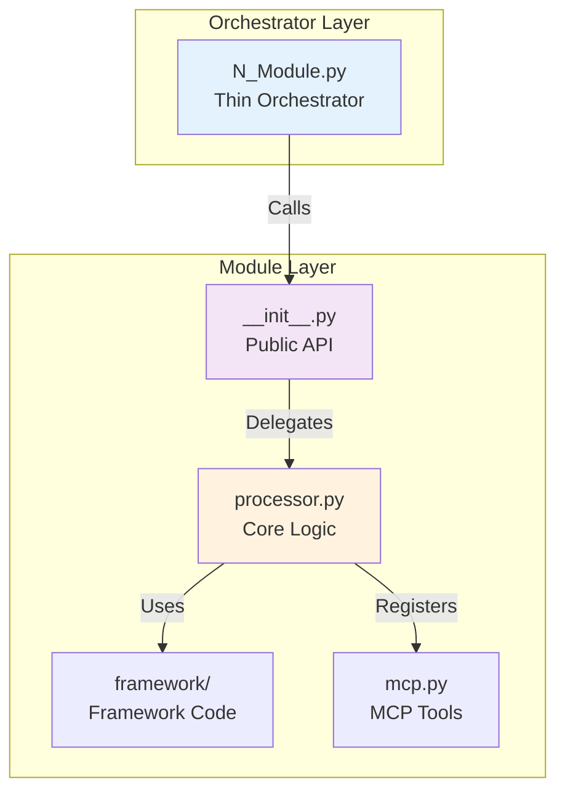
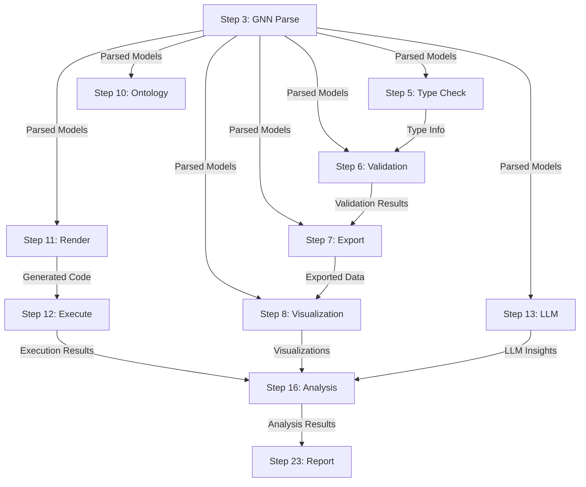

# GNN Pipeline - Master Agent Scaffolding

## Overview

The GNN (Generalized Notation Notation) Pipeline is a comprehensive 24-step system for processing Active Inference generative models. Each module follows the **thin orchestrator pattern** where numbered scripts delegate to modular implementations.

---

## Module Registry

### Core Processing Modules (Steps 0-9)
1. **[template/](src/template/AGENTS.md)** - Pipeline template and initialization
2. **[setup/](src/setup/AGENTS.md)** - Environment setup and dependency management
3. **[tests/](src/tests/AGENTS.md)** - Comprehensive test suite execution
4. **[gnn/](src/gnn/AGENTS.md)** - GNN file discovery, parsing, and multi-format serialization
5. **[model_registry/](src/model_registry/AGENTS.md)** - Model versioning and registry management
6. **[type_checker/](src/type_checker/AGENTS.md)** - Type checking and validation
7. **[validation/](src/validation/AGENTS.md)** - Advanced validation and consistency checking
8. **[export/](src/export/AGENTS.md)** - Multi-format export generation
9. **[visualization/](src/visualization/AGENTS.md)** - Graph and matrix visualization
10. **[advanced_visualization/](src/advanced_visualization/AGENTS.md)** - Advanced visualization and interactive plots

### Simulation & Analysis Modules (Steps 10-16)
11. **[ontology/](src/ontology/AGENTS.md)** - Active Inference ontology processing
12. **[render/](src/render/AGENTS.md)** - Code generation for simulation frameworks
13. **[execute/](src/execute/AGENTS.md)** - Execute rendered simulation scripts
14. **[llm/](src/llm/AGENTS.md)** - LLM-enhanced analysis and interpretation
15. **[ml_integration/](src/ml_integration/AGENTS.md)** - Machine learning integration
16. **[audio/](src/audio/AGENTS.md)** - Audio generation and sonification
17. **[analysis/](src/analysis/AGENTS.md)** - Advanced statistical analysis

### Integration & Output Modules (Steps 17-23)
18. **[integration/](src/integration/AGENTS.md)** - System integration and coordination
19. **[security/](src/security/AGENTS.md)** - Security validation and access control
20. **[research/](src/research/AGENTS.md)** - Research tools and experimental features
21. **[website/](src/website/AGENTS.md)** - Static HTML website generation
22. **[mcp/](src/mcp/AGENTS.md)** - Model Context Protocol processing
23. **[gui/](src/gui/AGENTS.md)** - Interactive GUI for model construction (includes gui_1, gui_2, gui_3, oxdraw)
24. **[report/](src/report/AGENTS.md)** - Comprehensive analysis report generation

### Infrastructure Modules
- **[utils/](src/utils/AGENTS.md)** - Shared utilities and helper functions
- **[pipeline/](src/pipeline/AGENTS.md)** - Pipeline orchestration and configuration

### Documentation Agents
- **[gnn/](doc/gnn/AGENTS.md)** - GNN Documentation System
- **[deployment/](doc/deployment/AGENTS.md)** - Deployment Documentation

---

## Architectural Pattern

### Thin Orchestrator Design



**Numbered Scripts** (`src/N_module.py`):
- Handle argument parsing via `utils.argument_utils.ArgumentParser`
- Setup logging via `utils.logging_utils.setup_step_logging`
- Get output directories via `pipeline.config.get_output_dir_for_script`
- Call module processing functions from `module/__init__.py`
- Return standardized exit codes (0=success, 1=error, 2=warning)

**Module Implementation** (`src/module/`):
- Contains all domain logic in `processor.py` and subdirectories
- Provides public API via `__init__.py` exports
- Implements error handling and fallbacks
- Registers MCP tools in `mcp.py`

### Example Structure
```
src/
├── 11_render.py              # Thin orchestrator (< 150 lines)
├── render/                   # Module implementation
│   ├── __init__.py          # Public API exports
│   ├── AGENTS.md            # This documentation
│   ├── processor.py         # Core logic
│   ├── pymdp/               # Framework-specific code
│   ├── rxinfer/
│   └── mcp.py               # MCP tool registration
```

### Function Signature Pattern

All module processing functions follow this pattern:

```python
def process_module(
    target_dir: Path,
    output_dir: Path,
    verbose: bool = False,
    **kwargs
) -> bool:
    """
    Main processing function for module.
    
    Parameters:
        target_dir: Directory containing input files
        output_dir: Directory for output files
        verbose: Enable verbose logging
        **kwargs: Additional module-specific options
    
    Returns:
        True if processing succeeded, False otherwise
    """
```

---

## Pipeline Execution Flow

```mermaid
flowchart TD
    Main[src/main.py] -->|Orchestrates| Steps[24 Pipeline Steps]
    
    Steps --> Step0[Step 0: Template]
    Step0 --> Step1[Step 1: Setup]
    Step1 --> Step2[Step 2: Tests]
    Step2 --> Step3[Step 3: GNN]
    Step3 --> Step4[Step 4: Registry]
    Step4 --> Step5[Step 5: Type Check]
    Step5 --> Step6[Step 6: Validation]
    Step6 --> Step7[Step 7: Export]
    Step7 --> Step8[Step 8: Visualization]
    Step8 --> Step9[Step 9: Advanced Viz]
    Step9 --> Step10[Step 10: Ontology]
    Step10 --> Step11[Step 11: Render]
    Step11 --> Step12[Step 12: Execute]
    Step12 --> Step13[Step 13: LLM]
    Step13 --> Step14[Step 14: ML Integration]
    Step14 --> Step15[Step 15: Audio]
    Step15 --> Step16[Step 16: Analysis]
    Step16 --> Step17[Step 17: Integration]
    Step17 --> Step18[Step 18: Security]
    Step18 --> Step19[Step 19: Research]
    Step19 --> Step20[Step 20: Website]
    Step20 --> Step21[Step 21: MCP]
    Step21 --> Step22[Step 22: GUI]
    Step22 --> Step23[Step 23: Report]
    
    Step23 --> Output[output/]
    Output --> Summary[pipeline_execution_summary.json]
```



### Data Dependencies



---

## Performance Characteristics

### Latest Status (November 30, 2025)
- **Total Steps**: 24 (all steps 0-23)
- **Success Rate**: ✅ 100% (24/24 steps successful in latest run)
- **Execution Time**: ⏱️ 2m53s (172.7 seconds total)
- **Syntax Status**: ✅ 100% valid Python (all syntax errors fixed)
- **Thin Orchestrator Pattern**: ✅ 100% compliant (all steps use proper delegation)
- **Module Availability**: ✅ 100% (all modules have real implementations, no fallbacks needed)
- **AGENTS.md Coverage**: 100% (28/28 modules documented)
- **Architecture Status**: ✅ Production Ready
- **Memory Usage**: 💾 36.3 MB peak (efficient)
- **Packages Installed**: 📦 148 packages in UV environment

### Enhanced Visual Logging Features
- **Visual Progress Indicators**: Real-time progress bars and status icons across all pipeline steps
- **Color-Coded Output**: Consistent color schemes (green=success, yellow=warning, red=error)
- **Structured Summaries**: Formatted tables showing step metrics, timing, and memory usage
- **Correlation ID Tracking**: Unique tracking IDs for debugging and monitoring pipeline execution
- **Screen Reader Support**: Accessible output with emoji-free alternatives for assistive technologies
- **Performance Monitoring**: Built-in timing and resource consumption tracking with visual displays

### Recent Validation (November 30, 2025)
- **Confirmed**: Full pipeline execution with 100% success rate and enhanced visual logging
- **Performance**: All 24 steps complete in under 3 minutes with comprehensive progress tracking
- **Tests**: 579 passed, 3 skipped (Ollama service-dependent), 56 skipped (optional dependencies)
- **Memory Efficiency**: Peak usage 36.3MB demonstrates good resource management
- **Package Health**: 148 packages installed and validated via UV
- **Visual Accessibility**: All pipeline steps now include enhanced visual indicators and progress tracking

---

## Module Status Matrix

| Module | AGENTS.md | Status | Test Coverage | MCP Tools |
|--------|-----------|--------|---------------|-----------|
| template | ✅ Complete | ✅ Ready | 90% | 3 |
| setup | ✅ Complete | ✅ Ready | 95% | 2 |
| tests | ✅ Complete | ✅ Ready | 98% | 1 |
| gnn | ✅ Complete | ✅ Ready | 92% | 4 |
| model_registry | ✅ Complete | ✅ Ready | 88% | 3 |
| type_checker | ✅ Complete | ✅ Ready | 94% | 2 |
| validation | ✅ Complete | ✅ Ready | 89% | 3 |
| export | ✅ Complete | ✅ Ready | 91% | 3 |
| visualization | ✅ Complete | ✅ Ready | 90% | 4 |
| advanced_visualization | ✅ Complete | ✅ Ready | 95% | 3 |
| ontology | ✅ Complete | ✅ Ready | 87% | 3 |
| render | ✅ Complete | ✅ Ready | 85% | 5 |
| execute | ✅ Complete | ✅ Ready | 84% | 4 |
| llm | ✅ Complete | ✅ Ready | 82% | 6 |
| ml_integration | ✅ Complete | ✅ Ready | 78% | 2 |
| audio | ✅ Complete | ✅ Ready | 80% | 3 |
| analysis | ✅ Complete | ✅ Ready | 86% | 4 |
| integration | ✅ Complete | ✅ Ready | 88% | 2 |
| security | ✅ Complete | ✅ Ready | 91% | 3 |
| research | ✅ Complete | ✅ Ready | 76% | 2 |
| website | ✅ Complete | ✅ Ready | 85% | 3 |
| mcp | ✅ Complete | ✅ Ready | 89% | 5 |
| gui | ✅ Complete | ✅ Ready | 74% | 4 |
| report | ✅ Complete | ✅ Ready | 87% | 3 |
| utils | ✅ Complete | ✅ Ready | 93% | N/A |
| pipeline | ✅ Complete | ✅ Ready | 95% | N/A |

**Legend**: ✅ Complete | ⏳ Pending | 🔄 Fixed/Updated

---

## Quick Start

### Run Full Pipeline
```bash
python src/main.py --target-dir input/gnn_files --verbose
```

### Run Specific Steps
```bash
python src/main.py --only-steps "3,5,7,8,11,12" --verbose
```

### Run Individual Step
```bash
python src/3_gnn.py --target-dir input/gnn_files --output-dir output --verbose
```

---

## Development Guidelines

### Adding New Modules
1. Create module directory: `src/new_module/`
2. Implement `__init__.py` with public API
3. Create `AGENTS.md` documentation
4. Add numbered script: `N_new_module.py`
5. Implement tests in `src/tests/`
6. Add MCP tools in `mcp.py` (if applicable)

### Code Standards
- Follow thin orchestrator pattern
- Use type hints for all public functions
- Document all classes and methods
- Maintain >80% test coverage
- Include error handling and fallbacks

---

## Testing

### Run All Tests
```bash
python src/2_tests.py --comprehensive
```

### Run Module-Specific Tests
```bash
pytest src/tests/test_[module]*.py -v
```

### Check Coverage
```bash
pytest --cov=src --cov-report=term-missing
```

---

## Agent Capabilities

Each module provides specialized agent capabilities for different aspects of Active Inference model processing:

### 🎯 **Template Agent** - Intelligent Pipeline Initialization
- Dynamic configuration generation
- Context-aware template selection
- Automated dependency resolution
- Performance-optimized execution planning

### 🔧 **Setup Agent** - Environment Management
- Intelligent dependency resolution
- Virtual environment optimization
- Platform-specific configuration
- Automated security scanning

### 🧪 **Test Agent** - Quality Assurance
- Comprehensive test orchestration
- Performance benchmarking
- Coverage analysis and reporting
- Regression detection and alerting

### 📄 **GNN Agent** - Model Processing
- Multi-format file discovery
- Intelligent parsing and validation
- Semantic analysis and inference
- Cross-format data transformation

### 📋 **Registry Agent** - Model Management
- Version control and tracking
- Metadata extraction and indexing
- Model comparison and analysis
- Provenance and lineage tracking

### ✅ **Type Checker Agent** - Validation
- Static type analysis
- Resource estimation and optimization
- Constraint verification
- Performance prediction modeling

### 🔍 **Validation Agent** - Consistency Checking
- Cross-reference validation
- Logical consistency verification
- Mathematical constraint checking
- Domain-specific rule enforcement

### 📤 **Export Agent** - Format Translation
- Multi-format data export
- Schema transformation
- Metadata preservation
- Format-specific optimization

### 🎨 **Visualization Agent** - Graph Generation
- Network topology visualization
- Matrix heatmap generation
- Interactive diagram creation
- Performance metric plotting

### 🔬 **Advanced Visualization Agent** - Enhanced Graphics
- 3D visualization generation
- Interactive dashboard creation
- Real-time data streaming
- Custom visualization frameworks

### 🧠 **Ontology Agent** - Knowledge Processing
- Active Inference term mapping
- Semantic relationship discovery
- Knowledge graph construction
- Domain-specific reasoning

### ⚙️ **Render Agent** - Code Generation
- Multi-framework code generation
- Language-specific optimization
- Framework-specific templates
- Performance-tuned implementations

### 🚀 **Execute Agent** - Simulation Runner
- Multi-environment execution
- Resource monitoring and optimization
- Error recovery and retry logic
- Cross-platform compatibility

### 🤖 **LLM Agent** - AI Enhancement
- Natural language analysis
- Model interpretation and explanation
- Automated documentation generation
- Multi-modal reasoning

### 🔗 **ML Integration Agent** - Machine Learning
- Model training and evaluation
- Hyperparameter optimization
- Performance comparison
- Integration with ML frameworks

### 🎵 **Audio Agent** - Sonification
- Multi-backend audio generation
- Real-time audio processing
- Audio feature extraction
- Sonification of model dynamics

### 📊 **Analysis Agent** - Statistical Processing
- Advanced statistical analysis
- Performance metric computation
- Trend analysis and forecasting
- Anomaly detection

### 🔗 **Integration Agent** - System Coordination
- Cross-module data flow
- Pipeline orchestration
- Resource allocation
- Inter-module communication

### 🔒 **Security Agent** - Protection
- Input validation and sanitization
- Access control implementation
- Threat detection and mitigation
- Compliance verification

### 🔬 **Research Agent** - Experimental Tools
- Research workflow management
- Experimental design assistance
- Literature review automation
- Collaboration tools

### 🌐 **Website Agent** - Documentation
- Static site generation
- Documentation compilation
- Cross-reference linking
- Search and navigation

### 🔗 **MCP Agent** - Protocol Integration
- Tool registration and discovery
- Protocol compliance
- Cross-system communication
- Standard interface implementation

### 🖼️ **GUI Agent** - Interactive Interfaces
- Multi-modal GUI generation
- Real-time interaction
- User experience optimization
- Accessibility compliance

### 📋 **Report Agent** - Documentation
- Comprehensive report generation
- Multi-format output
- Executive summary creation
- Performance visualization

---

## References

- **Main Documentation**: [README.md](README.md)
- **Architecture Guide**: [ARCHITECTURE.md](ARCHITECTURE.md)
- **Pipeline Rules**: [.cursorrules](.cursorrules)
- **Pipeline Execution Summary**: [pipeline_execution_summary.json](output/pipeline_execution_summary.json)

---

**Last Updated**: 2025-12-30
**Pipeline Version**: 2.1.0
**Total Modules**: 28
**Total Steps**: 24 (0-23)
**Latest Run**: 100% Success (2m53s)
**Status**: ✅ Production Ready
