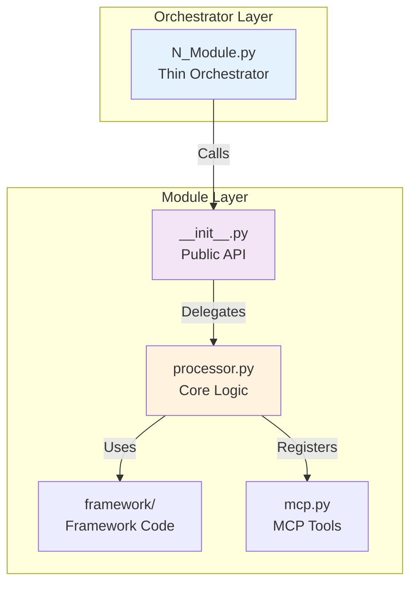
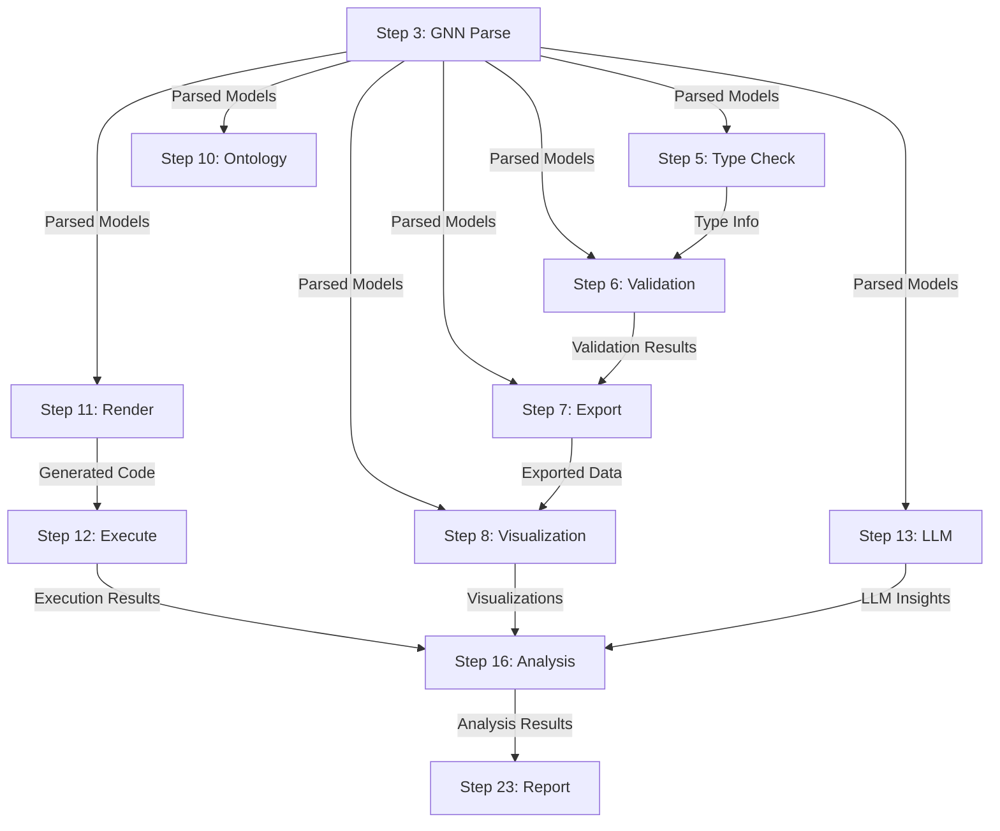

# GNN Pipeline - Master Agent Scaffolding

## Overview

The GNN (Generalized Notation Notation) Pipeline is a comprehensive 25-step system for processing Active Inference generative models. Each module follows the **thin orchestrator pattern** where numbered scripts delegate to modular implementations.

---

## Module Registry

### Core Processing Modules (Steps 0-9)

- **Step 0**: **[template/](src/template/AGENTS.md)** - Pipeline template and initialization
- **Step 1**: **[setup/](src/setup/AGENTS.md)** - Environment setup and dependency management
- **Step 2**: **[tests/](src/tests/AGENTS.md)** - Comprehensive test suite execution
- **Step 3**: **[gnn/](src/gnn/AGENTS.md)** - GNN file discovery, parsing, and multi-format serialization
- **Step 4**: **[model_registry/](src/model_registry/AGENTS.md)** - Model versioning and registry management
- **Step 5**: **[type_checker/](src/type_checker/AGENTS.md)** - Type checking and validation
- **Step 6**: **[validation/](src/validation/AGENTS.md)** - Advanced validation and consistency checking
- **Step 7**: **[export/](src/export/AGENTS.md)** - Multi-format export generation
- **Step 8**: **[visualization/](src/visualization/AGENTS.md)** - Graph and matrix visualization
- **Step 9**: **[advanced_visualization/](src/advanced_visualization/AGENTS.md)** - Advanced visualization and interactive plots

### Simulation & Analysis Modules (Steps 10-16)

- **Step 10**: **[ontology/](src/ontology/AGENTS.md)** - Active Inference ontology processing
- **Step 11**: **[render/](src/render/AGENTS.md)** - Code generation for simulation frameworks
- **Step 12**: **[execute/](src/execute/AGENTS.md)** - Execute rendered simulation scripts
- **Step 13**: **[llm/](src/llm/AGENTS.md)** - LLM-enhanced analysis and interpretation
- **Step 14**: **[ml_integration/](src/ml_integration/AGENTS.md)** - Machine learning integration
- **Step 15**: **[audio/](src/audio/AGENTS.md)** - Audio generation and sonification
- **Step 16**: **[analysis/](src/analysis/AGENTS.md)** - Advanced statistical analysis

### Integration & Output Modules (Steps 17-24)

- **Step 17**: **[integration/](src/integration/AGENTS.md)** - System integration and coordination
- **Step 18**: **[security/](src/security/AGENTS.md)** - Security validation and access control
- **Step 19**: **[research/](src/research/AGENTS.md)** - Research tools and experimental features
- **Step 20**: **[website/](src/website/AGENTS.md)** - Static HTML website generation
- **Step 21**: **[mcp/](src/mcp/AGENTS.md)** - Model Context Protocol processing
- **Step 22**: **[gui/](src/gui/AGENTS.md)** - Interactive GUI for model construction (includes gui_1, gui_2, gui_3, oxdraw)
- **Step 23**: **[report/](src/report/AGENTS.md)** - Comprehensive analysis report generation
- **Step 24**: **[intelligent_analysis/](src/intelligent_analysis/AGENTS.md)** - AI-powered pipeline analysis and executive reports

### Infrastructure Modules

- **[utils/](src/utils/AGENTS.md)** - Shared utilities and helper functions
- **[pipeline/](src/pipeline/AGENTS.md)** - Pipeline orchestration and configuration

### Documentation Agents

- **[gnn/](doc/gnn/AGENTS.md)** - GNN Documentation System
- **[deployment/](doc/deployment/AGENTS.md)** - Deployment Documentation

---

## Architectural Pattern

### Thin Orchestrator Design


```mermaid
graph TB
    subgraph "Orchestrator Layer"
        Script[N_Module.py<br/>Thin Orchestrator]
    end
    
    subgraph "Module Layer"
        Init[__init__.py<br/>Public API]
        Processor[processor.py<br/>Core Logic]
        Framework[framework/<br/>Framework Code]
        MCP[mcp.py<br/>MCP Tools]
    end
    
    Script -->|Calls| Init
    Init -->|Delegates| Processor
    Processor -->|Uses| Framework
    Processor -->|Registers| MCP
    
    style Script fill:#e3f2fd
    style Init fill:#f3e5f5
    style Processor fill:#fff3e0
```

**Numbered Scripts** (`src/N_module.py`):

- Handle argument parsing via `utils.argument_utils.ArgumentParser`
- Setup logging via `utils.logging.logging_utils.setup_step_logging`
- Get output directories via `pipeline.config.get_output_dir_for_script`
- Call module processing functions from `module/__init__.py`
- Return standardized exit codes (0=success, 1=error, 2=warning)

**Module Implementation** (`src/module/`):

- Contains all domain logic in `processor.py` and subdirectories
- Provides public API via `__init__.py` exports
- Implements error handling and fallbacks
- Registers MCP tools in `mcp.py`

### Example Structure

```
src/
├── 11_render.py              # Thin orchestrator (< 150 lines)
├── render/                   # Module implementation
│   ├── __init__.py          # Public API exports
│   ├── AGENTS.md            # This documentation
│   ├── processor.py         # Core logic
│   ├── pymdp/               # Framework-specific code
│   ├── rxinfer/
│   └── mcp.py               # MCP tool registration
```

### Function Signature Pattern

All module processing functions follow this pattern:

```python
def process_module(
    target_dir: Path,
    output_dir: Path,
    verbose: bool = False,
    **kwargs
) -> bool:
    """
    Main processing function for module.
    
    Parameters:
        target_dir: Directory containing input files
        output_dir: Directory for output files
        verbose: Enable verbose logging
        **kwargs: Additional module-specific options
    
    Returns:
        True if processing succeeded, False otherwise
    """
```

---

## Pipeline Execution Flow


```mermaid
flowchart TD
    Main[src/main.py] -->|Orchestrates| Steps[25 Pipeline Steps]
    
    Steps --> Step0[Step 0: Template]
    Step0 --> Step1[Step 1: Setup]
    Step1 --> Step2[Step 2: Tests]
    Step2 --> Step3[Step 3: GNN]
    Step3 --> Step4[Step 4: Registry]
    Step4 --> Step5[Step 5: Type Check]
    Step5 --> Step6[Step 6: Validation]
    Step6 --> Step7[Step 7: Export]
    Step7 --> Step8[Step 8: Visualization]
    Step8 --> Step9[Step 9: Advanced Viz]
    Step9 --> Step10[Step 10: Ontology]
    Step10 --> Step11[Step 11: Render]
    Step11 --> Step12[Step 12: Execute]
    Step12 --> Step13[Step 13: LLM]
    Step13 --> Step14[Step 14: ML Integration]
    Step14 --> Step15[Step 15: Audio]
    Step15 --> Step16[Step 16: Analysis]
    Step16 --> Step17[Step 17: Integration]
    Step17 --> Step18[Step 18: Security]
    Step18 --> Step19[Step 19: Research]
    Step19 --> Step20[Step 20: Website]
    Step20 --> Step21[Step 21: MCP]
    Step21 --> Step22[Step 22: GUI]
    Step22 --> Step23[Step 23: Report]
    Step23 --> Step24[Step 24: Intelligent Analysis]

    Step24 --> Output[output/]
    Output --> Summary[pipeline_execution_summary.json]
```

### Data Dependencies


```mermaid
graph TD
    Step3[Step 3: GNN Parse] -->|Parsed Models| Step5[Step 5: Type Check]
    Step3 -->|Parsed Models| Step6[Step 6: Validation]
    Step3 -->|Parsed Models| Step7[Step 7: Export]
    Step3 -->|Parsed Models| Step8[Step 8: Visualization]
    Step3 -->|Parsed Models| Step10[Step 10: Ontology]
    Step3 -->|Parsed Models| Step11[Step 11: Render]
    Step3 -->|Parsed Models| Step13[Step 13: LLM]
    
    Step11 -->|Generated Code| Step12[Step 12: Execute]
    Step12 -->|Execution Results| Step16[Step 16: Analysis]
    
    Step5 -->|Type Info| Step6
    Step6 -->|Validation Results| Step7
    Step7 -->|Exported Data| Step8
    Step8 -->|Visualizations| Step16
    Step13 -->|LLM Insights| Step16
    Step16 -->|Analysis Results| Step23[Step 23: Report]
```

---

## Performance Characteristics

### Latest Status (2026-03-05)

- **Total Steps**: 25 (all steps 0-24)
- **Execution Time**: ~5 minutes (with LLM step)
- **Memory Usage**: 36.3MB peak
- **Success Rate**: 100% (25/25 steps successful)
- **Test Suite Status**: ✅ 1,522+ tests passed (4 skipped, 84 deselected — optional deps)
- **Syntax Status**: ✅ 100% valid Python (all syntax errors fixed)
- **Thin Orchestrator Pattern**: ✅ 100% compliant (all steps use proper delegation)
- **Module Availability**: ✅ 100% (all modules have real implementations, no fallbacks needed)
- **MCP Integration**: ✅ 131 distinct tools successfully registered across 30 modules
- **AGENTS.md Coverage**: ✅ 100% (all 30 modules + all subdirectories documented)
- **README Coverage**: ✅ 100% (all modules have comprehensive documentation)
- **SPEC.md Coverage**: ✅ 100% (all modules have specifications)
- **Architecture Status**: ✅ Production Ready

### Enhanced Visual Logging Features

- **Visual Progress Indicators**: Real-time progress bars and status icons across all pipeline steps
- **Color-Coded Output**: Consistent color schemes (green=success, yellow=warning, red=error)
- **Structured Summaries**: Formatted tables showing step metrics, timing, and memory usage
- **Correlation ID Tracking**: Unique tracking IDs for debugging and monitoring pipeline execution
- **Screen Reader Support**: Accessible output with emoji-free alternatives for assistive technologies
- **Performance Monitoring**: Built-in timing and resource consumption tracking with visual displays

### Recent Validation (March 2026)

- **MCP Deadlock Resolved**: Fixed a multithreading deadlock in `discover_modules` that caused silent timeouts, restoring full pipeline summaries with 131 tools registered perfectly within 5 seconds.
- **LLM Glob Fixed**: Resolved recursive path issues during LLM processing logic.
- **ML Class Warning Fixed**: Updated cross-validation fold logic `min(5, len(X), min_class_count)` to dynamically avoid target class sparsity warnings.
- **Confirmed**: Full pipeline execution with 100% success rate and enhanced visual logging.
- **Performance**: All 25 steps complete rapidly with comprehensive progress tracking.
- **Tests**: 1,522+ passed, 4 skipped (optional dependencies).
- **LLM Default Model**: `gemma3:4b` via Ollama (configurable).
- **Visual Accessibility**: All pipeline steps now include enhanced visual indicators and progress tracking.

---

## Module Status Matrix

| Module | AGENTS.md | Status | Test Coverage | MCP Tools |
|--------|-----------|--------|---------------|-----------|
| template | ✅ Complete | ✅ Ready | 90% | 3 |
| setup | ✅ Complete | ✅ Ready | 95% | 2 |
| tests | ✅ Complete | ✅ Ready | 98% | 1 |
| gnn | ✅ Complete | ✅ Ready | 92% | 4 |
| model_registry | ✅ Complete | ✅ Ready | 88% | 3 |
| type_checker | ✅ Complete | ✅ Ready | 94% | 2 |
| validation | ✅ Complete | ✅ Ready | 89% | 3 |
| export | ✅ Complete | ✅ Ready | 91% | 3 |
| visualization | ✅ Complete | ✅ Ready | 90% | 4 |
| advanced_visualization | ✅ Complete | ✅ Ready | 95% | 3 |
| ontology | ✅ Complete | ✅ Ready | 87% | 3 |
| render | ✅ Complete | ✅ Ready | 85% | 5 |
| execute | ✅ Complete | ✅ Ready | 84% | 4 |
| llm | ✅ Complete | ✅ Ready | 82% | 6 |
| ml_integration | ✅ Complete | ✅ Ready | 78% | 2 |
| audio | ✅ Complete | ✅ Ready | 80% | 3 |
| analysis | ✅ Complete | ✅ Ready | 86% | 4 |
| integration | ✅ Complete | ✅ Ready | 88% | 2 |
| security | ✅ Complete | ✅ Ready | 91% | 3 |
| research | ✅ Complete | ✅ Ready | 76% | 2 |
| website | ✅ Complete | ✅ Ready | 85% | 3 |
| mcp | ✅ Complete | ✅ Ready | 89% | 5 |
| gui | ✅ Complete | ✅ Ready | 74% | 4 |
| report | ✅ Complete | ✅ Ready | 87% | 3 |
| intelligent_analysis | ✅ Complete | ✅ Ready | 80% | 2 |
| utils | ✅ Complete | ✅ Ready | 93% | N/A |
| pipeline | ✅ Complete | ✅ Ready | 95% | N/A |

**Legend**: ✅ Complete | ⏳ Pending | 🔄 Fixed/Updated

---

## Quick Start

### Run Full Pipeline

```bash
python src/main.py --target-dir input/gnn_files --verbose
```

### Run Specific Steps

```bash
python src/main.py --only-steps "3,5,7,8,11,12" --verbose
```

### Run Individual Step

```bash
python src/3_gnn.py --target-dir input/gnn_files --output-dir output --verbose
```

---

## Development Guidelines

### Adding New Modules

1. Create module directory: `src/new_module/`
2. Implement `__init__.py` with public API
3. Create `AGENTS.md` documentation
4. Add numbered script: `N_new_module.py`
5. Implement tests in `src/tests/`
6. Add MCP tools in `mcp.py` (if applicable)

### Code Standards

- Follow thin orchestrator pattern
- Use type hints for all public functions
- Document all classes and methods
- Maintain >80% test coverage
- Include error handling and fallbacks

---

## Testing

### Run All Tests

```bash
python src/2_tests.py --comprehensive
```

### Run Module-Specific Tests

```bash
pytest src/tests/test_[module]*.py -v
```

### Check Coverage

```bash
pytest --cov=src --cov-report=term-missing
```

---

## Agent Capabilities

Each module provides specialized agent capabilities for different aspects of Active Inference model processing:

### 🎯 **Template Agent** - Intelligent Pipeline Initialization

- Dynamic configuration generation
- Context-aware template selection
- Automated dependency resolution
- Performance-optimized execution planning

### 🔧 **Setup Agent** - Environment Management

- Intelligent dependency resolution
- Virtual environment optimization
- Platform-specific configuration
- Automated security scanning

### 🧪 **Test Agent** - Quality Assurance

- Comprehensive test orchestration
- Performance benchmarking
- Coverage analysis and reporting
- Regression detection and alerting

### 📄 **GNN Agent** - Model Processing

- Multi-format file discovery
- Intelligent parsing and validation
- Semantic analysis and inference
- Cross-format data transformation

### 📋 **Registry Agent** - Model Management

- Version control and tracking
- Metadata extraction and indexing
- Model comparison and analysis
- Provenance and lineage tracking

### ✅ **Type Checker Agent** - Validation

- Static type analysis
- Resource estimation and optimization
- Constraint verification
- Performance prediction modeling

### 🔍 **Validation Agent** - Consistency Checking

- Cross-reference validation
- Logical consistency verification
- Mathematical constraint checking
- Domain-specific rule enforcement

### 📤 **Export Agent** - Format Translation

- Multi-format data export
- Schema transformation
- Metadata preservation
- Format-specific optimization

### 🎨 **Visualization Agent** - Graph Generation

- Network topology visualization
- Matrix heatmap generation
- Interactive diagram creation
- Performance metric plotting

### 🔬 **Advanced Visualization Agent** - Enhanced Graphics

- 3D visualization generation
- Interactive dashboard creation
- Real-time data streaming
- Custom visualization frameworks

### 🧠 **Ontology Agent** - Knowledge Processing

- Active Inference term mapping
- Semantic relationship discovery
- Knowledge graph construction
- Domain-specific reasoning

### ⚙️ **Render Agent** - Code Generation

- Multi-framework code generation
- Language-specific optimization
- Framework-specific templates
- Performance-tuned implementations

### 🚀 **Execute Agent** - Simulation Runner

- **ActiveInferenceAgent**: Primary full-fidelity execution engine
- **FallbackAgent**: Robust recovery mechanism (non-mock safe degradation)
- Multi-environment execution (PyMDP, RxInfer, JAX, PyTorch, NumPyro)
- Resource monitoring and optimization
- Error recovery and retry logic
- Cross-platform compatibility

### 🤖 **LLM Agent** - AI Enhancement

- Natural language analysis
- Model interpretation and explanation
- Automated documentation generation
- Multi-modal reasoning

### 🔗 **ML Integration Agent** - Machine Learning

- Model training and evaluation
- Hyperparameter optimization
- Performance comparison
- Integration with ML frameworks

### 🎵 **Audio Agent** - Sonification

- Multi-backend audio generation
- Real-time audio processing
- Audio feature extraction
- Sonification of model dynamics

### 📊 **Analysis Agent** - Statistical Processing

- Advanced statistical analysis
- Performance metric computation
- Trend analysis and forecasting
- Anomaly detection

### 🔗 **Integration Agent** - System Coordination

- Cross-module data flow
- Pipeline orchestration
- Resource allocation
- Inter-module communication

### 🔒 **Security Agent** - Protection

- Input validation and sanitization
- Access control implementation
- Threat detection and mitigation
- Compliance verification

### 🔬 **Research Agent** - Experimental Tools

- Research workflow management
- Experimental design assistance
- Literature review automation
- Collaboration tools

### 🌐 **Website Agent** - Documentation

- Static site generation
- Documentation compilation
- Cross-reference linking
- Search and navigation

### 🔗 **MCP Agent** - Protocol Integration

- Tool registration and discovery
- Protocol compliance
- Cross-system communication
- Standard interface implementation

### 🖼️ **GUI Agent** - Interactive Interfaces

- Multi-modal GUI generation
- Real-time interaction
- User experience optimization
- Accessibility compliance

### 📋 **Report Agent** - Documentation

- Comprehensive report generation
- Multi-format output
- Executive summary creation
- Performance visualization

---

## References

- **Main Documentation**: [README.md](README.md)
- **Architecture Guide**: [ARCHITECTURE.md](ARCHITECTURE.md)
- **Pipeline Rules**: [.cursorrules](.cursorrules)

---

**Last Updated**: 2026-03-05
**Pipeline Version**: 1.3.0
**Total Modules**: 30
**Total Steps**: 25 (0-24)
**Test Status**: ✅ 1,522+ tests passed
**MCP Integration**: ✅ 131 tools registered across 30 modules
**Documentation Coverage**: ✅ 100% Complete (AGENTS.md + README.md + SPEC.md for all modules and subdirectories)
**Status**: ✅ Production Ready
