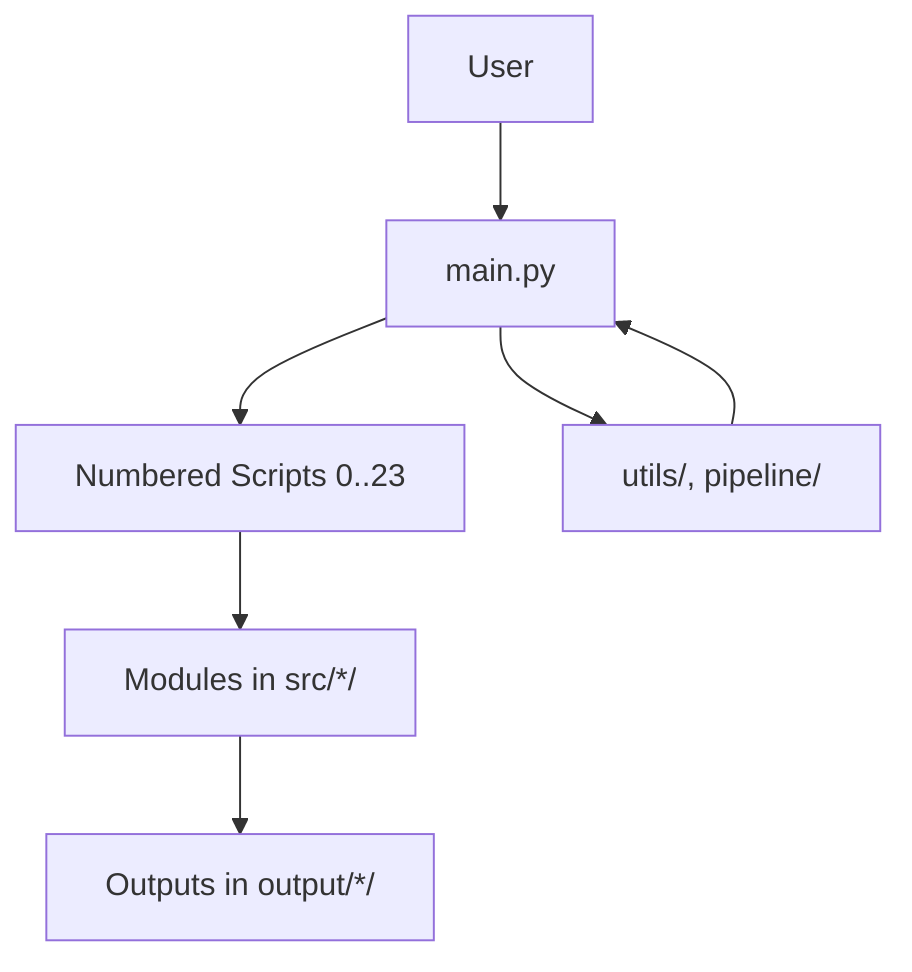
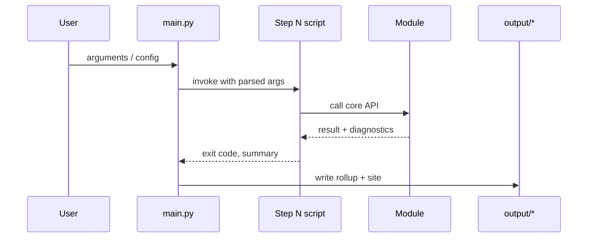
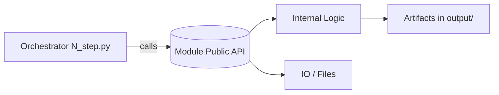
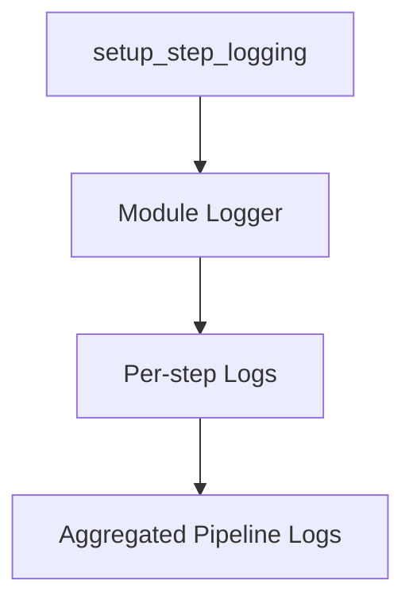
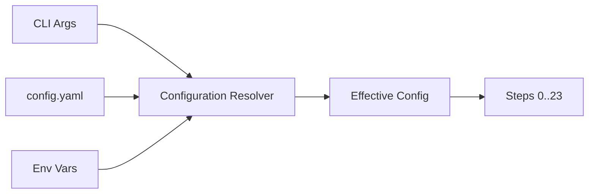
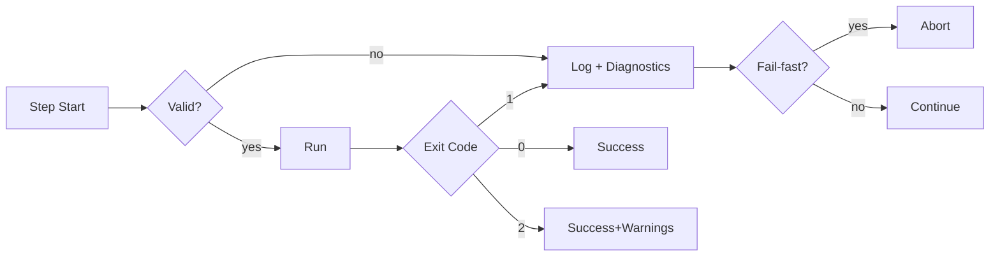

# GNN Architecture Guide

This guide details the architecture of the Generalized Notation Notation (GNN) system. It complements `DOCS.md` and `doc/pipeline/README.md` with an implementation-oriented perspective for developers.

## Principles

- Thin orchestrators: numbered scripts delegate to modules
- Clear module boundaries and explicit dependencies
- Deterministic outputs and reproducible runs
- Standard exit codes with config-driven continuation
- Centralized logging, configuration, and output management

## System Overview

## Execution Flow (High-Level)

## Thin Orchestrator Pattern

- Orchestrators handle: argument parsing, logging setup, output dir, calling module APIs, summarizing results
- Modules implement: domain logic, IO, validations, transformations, rendering, execution

## Module Dependencies

```mermaid
graph LR
  GNN[gnn] --> TYPE[type_checker]
  TYPE --> VAL[validation]
  VAL --> EXP[export]
  EXP --> VIS[visualization]
  VIS --> AV[advanced_visualization]
  AV --> ONT[ontology]
  ONT --> RENDER[render]
  RENDER --> EXEC[execute]
  EXEC --> LLM[llm]
  LLM --> ML[ml_integration]
  ML --> AUDIO[audio]
  AUDIO --> ANA[analysis]
  ANA --> INT[integration]
  INT --> SEC[security]
  SEC --> RES[research]
  RES --> WEB[website]
  WEB --> MCP[mcp]
  MCP --> GUI[gui]
  GUI --> REP[report]
```

## Logging Architecture

## Configuration Flow

## Output Management

- Each step writes to `output/<step_subdir>/`
- `get_output_dir_for_script()` ensures consistent paths
- Site and reports summarize artifacts across steps

## Error Handling

- Exit codes: 0=success, 1=critical error, 2=success with warnings
- Continuation policy controlled via config (fail-fast vs continue)
- Rich diagnostics persisted alongside artifacts

## Extension Pattern

1. Add `N_newstep.py` orchestrator
2. Implement `src/newstep/` module with public API
3. Register config and logging per established patterns
4. Add tests in `src/tests/`
5. Document in `doc/pipeline/` and link from module README

## References

- `DOCS.md` — Conceptual overview and complete pipeline diagrams
- `doc/pipeline/README.md` — Detailed step-by-step descriptions
- `.cursorrules` — Canonical rules for scripts and modules
- `src/main.py` — Orchestrator implementation

