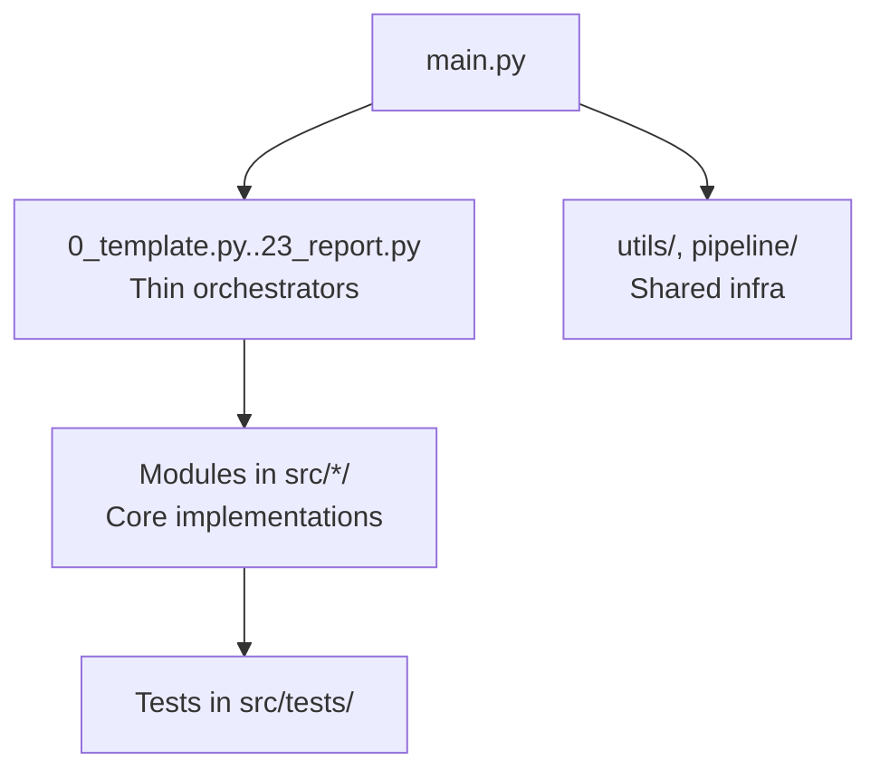
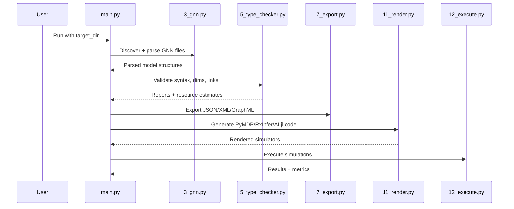
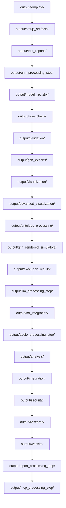
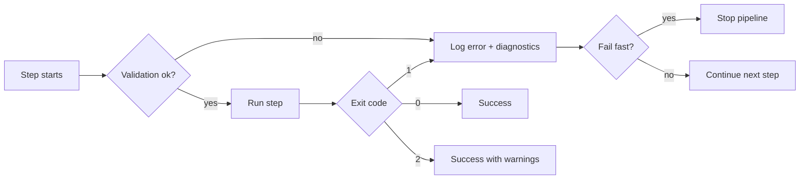

# Generalized Notation Notation (GNN) — Comprehensive Documentation

This document provides a complete, machine-parsable and human-accessible overview of GNN: the what, why, and how. It consolidates architecture, pipeline, data flows, artifacts, and integration points with multiple Mermaid diagrams.

## What is GNN?

- A standardized, text-based language for specifying Active Inference generative models.
- Unifies model communication across natural language, math, diagrams, and executable code.
- Enables end-to-end processing via a 24-step pipeline (0–23) from specification to simulation, analysis, GUI construction, and reporting.

## Why GNN?

- Consistent, reproducible model specification and sharing
- Interoperability across ecosystems (PyMDP, RxInfer.jl, ActiveInference.jl, JAX)
- Traceable artifact lineage and rigorous validation

## High-Level Concept Map


## Pipeline Overview (0–23)

```mermaid
flowchart LR
  subgraph Pipeline (0–23)
    S0[0 Template] --> S1[1 Setup]
    S1 --> S2[2 Tests]
    S2 --> S3[3 GNN]
    S3 --> S4[4 Model Registry]
    S4 --> S5[5 Type Checker]
    S5 --> S6[6 Validation]
    S6 --> S7[7 Export]
    S7 --> S8[8 Visualization]
    S8 --> S9[9 Advanced Viz]
    S9 --> S10[10 Ontology]
    S10 --> S11[11 Render]
    S11 --> S12[12 Execute]
    S12 --> S13[13 LLM]
    S13 --> S14[14 ML Integration]
    S14 --> S15[15 Audio]
    S15 --> S16[16 Analysis]
    S16 --> S17[17 Integration]
    S17 --> S18[18 Security]
    S18 --> S19[19 Research]
    S19 --> S20[20 Website]
    S20 --> S21[21 MCP]
    S21 --> S22[22 GUI]
    S22 --> S23[23 Report]
  end
```

## Architecture (Thin Orchestrator Pattern)



## Data Flow From GNN Spec to Simulation



## Artifact Map (Outputs per Step)



## Module Interaction Map


## Error Handling and Continuation

- Standard exit codes: 0=success, 1=critical error, 2=success with warnings
- Structured logging and correlation IDs
- Per-step graceful degradation and diagnostics



## Configuration Pointers

- Command-line options via `src/main.py --help`
- Centralized config examples in `doc/configuration/README.md`

## Integration Notes

- PyMDP, RxInfer.jl, ActiveInference.jl rendering configured in `src/render/`
- Execution backends in `src/execute/`
- MCP tools in `src/mcp/`

## References

- `.cursorrules` — canonical pipeline description (0–23)
- `src/main.py` — orchestrator implementation
- `doc/pipeline/README.md` — step details and flow
- `ARCHITECTURE.md` — implementation-oriented architecture
- `doc/pipeline/steps_index.json` — machine-readable step index (0–23)
- `doc/api/api_index.json` — machine-generated API index

## Machine-Readable Step Index

```json
{
  "steps": [
    {"n": 0,  "script": "0_template.py",        "module": "template",          "output": "template/"},
    {"n": 1,  "script": "1_setup.py",           "module": "setup",             "output": "setup_artifacts/"},
    {"n": 2,  "script": "2_tests.py",           "module": "tests",             "output": "test_reports/"},
    {"n": 3,  "script": "3_gnn.py",             "module": "gnn",               "output": "gnn_processing_step/"},
    {"n": 4,  "script": "4_model_registry.py",  "module": "model_registry",    "output": "model_registry/"},
    {"n": 5,  "script": "5_type_checker.py",    "module": "type_checker",      "output": "type_check/"},
    {"n": 6,  "script": "6_validation.py",      "module": "validation",        "output": "validation/"},
    {"n": 7,  "script": "7_export.py",          "module": "export",            "output": "gnn_exports/"},
    {"n": 8,  "script": "8_visualization.py",   "module": "visualization",     "output": "visualization/"},
    {"n": 9,  "script": "9_advanced_viz.py",    "module": "advanced_visualization", "output": "advanced_visualization/"},
    {"n": 10, "script": "10_ontology.py",       "module": "ontology",          "output": "ontology_processing/"},
    {"n": 11, "script": "11_render.py",         "module": "render",            "output": "gnn_rendered_simulators/"},
    {"n": 12, "script": "12_execute.py",        "module": "execute",           "output": "execution_results/"},
    {"n": 13, "script": "13_llm.py",            "module": "llm",               "output": "llm_processing_step/"},
    {"n": 14, "script": "14_ml_integration.py", "module": "ml_integration",    "output": "ml_integration/"},
    {"n": 15, "script": "15_audio.py",          "module": "audio",             "output": "audio_processing_step/"},
    {"n": 16, "script": "16_analysis.py",       "module": "analysis",          "output": "analysis/"},
    {"n": 17, "script": "17_integration.py",    "module": "integration",       "output": "integration/"},
    {"n": 18, "script": "18_security.py",       "module": "security",          "output": "security/"},
    {"n": 19, "script": "19_research.py",       "module": "research",          "output": "research/"},
    {"n": 20, "script": "20_website.py",        "module": "website",           "output": "website/"},
    {"n": 21, "script": "21_mcp.py",            "module": "mcp",               "output": "mcp_processing_step/"},
    {"n": 22, "script": "22_gui.py",            "module": "gui",               "output": "gui_processing_step/"},
    {"n": 23, "script": "23_report.py",         "module": "report",            "output": "report_processing_step/"}
  ]
}
```

