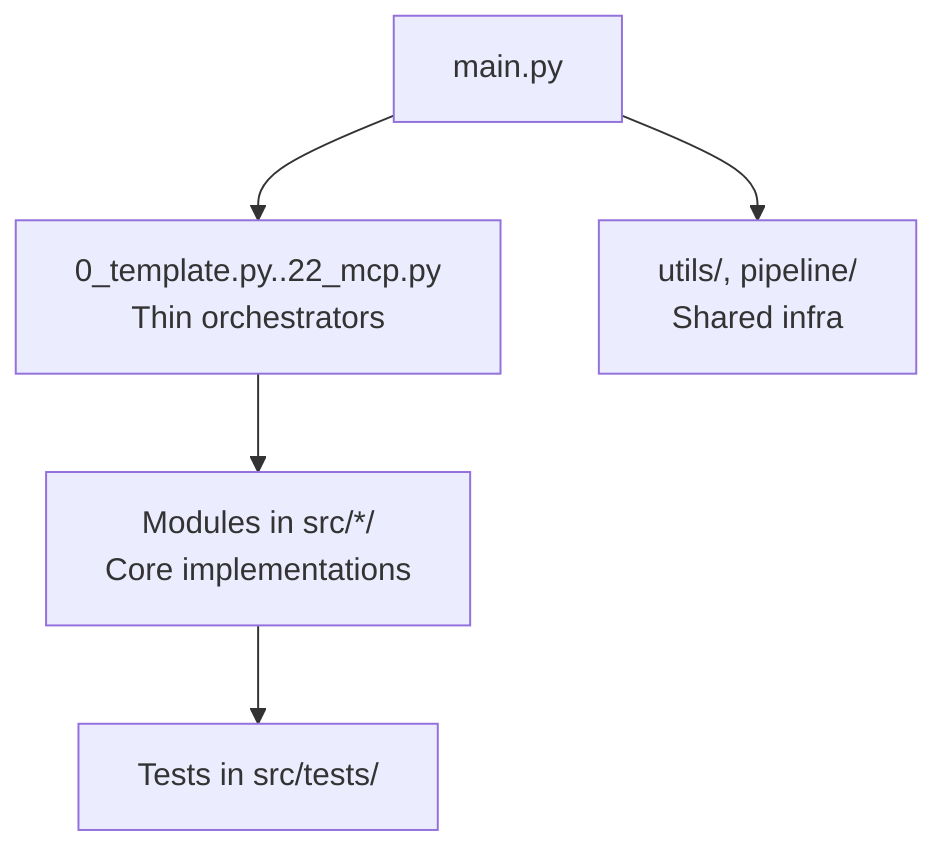

# Generalized Notation Notation (GNN) — Comprehensive Documentation

This document provides a complete, machine-parsable and human-accessible overview of GNN: the what, why, and how. It consolidates architecture, pipeline, data flows, artifacts, and integration points with multiple Mermaid diagrams.

## What is GNN?

- A standardized, text-based language for specifying Active Inference generative models.
- Unifies model communication across natural language, math, diagrams, and executable code.
- Enables end-to-end processing via a 23-step pipeline (0–22) from specification to simulation, analysis, and reporting.

## Why GNN?

- Consistent, reproducible model specification and sharing
- Interoperability across ecosystems (PyMDP, RxInfer.jl, ActiveInference.jl, JAX)
- Traceable artifact lineage and rigorous validation

## High-Level Concept Map


## Pipeline Overview (0–22)

```mermaid
flowchart LR
  subgraph Pipeline (0–22)
    S0[0 Template] --> S1[1 Setup]
    S1 --> S2[2 Tests]
    S2 --> S3[3 GNN]
    S3 --> S4[4 Model Registry]
    S4 --> S5[5 Type Checker]
    S5 --> S6[6 Validation]
    S6 --> S7[7 Export]
    S7 --> S8[8 Visualization]
    S8 --> S9[9 Advanced Viz]
    S9 --> S10[10 Ontology]
    S10 --> S11[11 Render]
    S11 --> S12[12 Execute]
    S12 --> S13[13 LLM]
    S13 --> S14[14 ML Integration]
    S14 --> S15[15 Audio]
    S15 --> S16[16 Analysis]
    S16 --> S17[17 Integration]
    S17 --> S18[18 Security]
    S18 --> S19[19 Research]
    S19 --> S20[20 Website]
    S20 --> S21[21 Report]
    S21 --> S22[22 MCP]
  end
```

## Architecture (Thin Orchestrator Pattern)



## Data Flow From GNN Spec to Simulation


## Artifact Map (Outputs per Step)


## Module Interaction Map

```mermaid
graph LR
  GNN[gnn/] --> TC[type_checker/]
  TC --> VAL[validation/]
  VAL --> EXP[export/]
  EXP --> VIS[visualization/]
  VIS --> AV[advanced_visualization/]
  AV --> ONT[ontology/]
  ONT --> RENDER[render/]
  RENDER --> EXEC[execute/]
  EXEC --> LLM[llm/]
  LLM --> ML[ml_integration/]
  ML --> AUD[audio/]
  AUD --> ANA[analysis/]
  ANA --> INT[integration/]
  INT --> SEC[security/]
  SEC --> RES[research/]
  RES --> WEB[website/]
  WEB --> REP[report/]
  REP --> MCP[mcp/]
```



## Error Handling and Continuation

- Standard exit codes: 0=success, 1=critical error, 2=success with warnings
- Structured logging and correlation IDs
- Per-step graceful degradation and diagnostics


## Configuration Pointers

- Command-line options via `src/main.py --help`
- Centralized config examples in `doc/configuration/README.md`

## Integration Notes

- PyMDP, RxInfer.jl, ActiveInference.jl rendering configured in `src/render/`
- Execution backends in `src/execute/`
- MCP tools in `src/mcp/`

## References

- `.cursorrules` — canonical pipeline description (0–22)
- `src/main.py` — orchestrator implementation
- `doc/pipeline/README.md` — step details and flow
- `ARCHITECTURE.md` — implementation-oriented architecture

