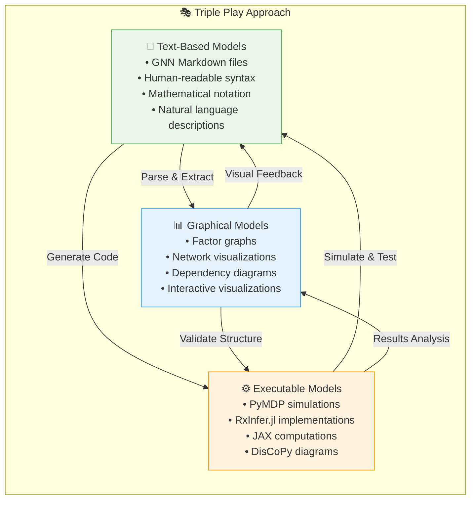
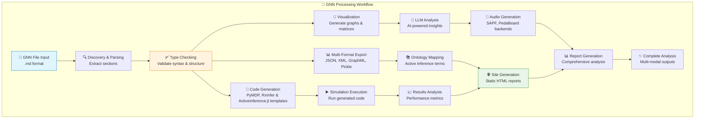

# GeneralizedNotationNotation (GNN)

<div align="center">

[](./LICENSE.md)
[](https://www.python.org/downloads/)
[](https://activeinference.org/)
[](https://doi.org/10.5281/zenodo.7803328)
[](#%EF%B8%8F-processing-pipeline)
[](#-key-features)
[](#-documentation)

**A standardized text-based language for Active Inference generative models**

[🚀 Quick Start](#-quick-start) •
[📖 Documentation](#-documentation) •
[🎯 Examples](#-examples) •
[🛠️ Tools](#%EF%B8%8F-tools-and-utilities) •
[🤝 Contributing](#-contributing)

</div>

---

## 📋 Table of Contents

- [🌟 Overview](#-overview)
- [🎯 Motivation and Goals](#-motivation-and-goals)
- [✨ Key Features](#-key-features)
- [🏗️ Project Architecture](#%EF%B8%8F-project-architecture)
- [⚙️ Processing Pipeline](#%EF%B8%8F-processing-pipeline)
- [🛠️ Tools and Utilities](#%EF%B8%8F-tools-and-utilities)
- [🚀 Quick Start](#-quick-start)
- [📖 Documentation](#-documentation)
- [🎯 Examples](#-examples)
- [🤝 Contributing](#-contributing)
- [📄 License](#-license)

---

## 🌟 Overview

**Generalized Notation Notation (GNN)** is a text-based language designed to standardize the representation and communication of [Active Inference](https://activeinference.org/) generative models. It aims to enhance clarity, reproducibility, and interoperability in the field of Active Inference and cognitive modeling.

### 📚 Initial Publication

**Smékal, J., & Friedman, D. A. (2023)**. *Generalized Notation Notation for Active Inference Models*. Active Inference Journal.  
📖 **DOI:** [10.5281/zenodo.7803328](https://doi.org/10.5281/zenodo.7803328)  
📁 **Archive:** [zenodo.org/records/7803328](https://zenodo.org/records/7803328)

### 🎯 Core Design Principles

GNN provides a structured and standardized way to describe complex cognitive models. It is designed to be:

- **🧑‍💻 Human-readable**: Easy to understand and use for researchers from diverse backgrounds
- **🤖 Machine-parsable**: Can be processed by software tools for analysis, visualization, and code generation
- **🔄 Interoperable**: Facilitates the exchange and reuse of models across different platforms and research groups
- **🔬 Reproducible**: Enables precise replication of model specifications

GNN addresses the challenge of communicating Active Inference models, which are often described using a mix of natural language, mathematical equations, diagrams, and code. By offering a unified notation, GNN aims to streamline collaboration, improve model understanding, and accelerate research.

---

## 🎯 Motivation and Goals

### 🚫 Current Challenges

The primary motivation behind GNN is to overcome the limitations arising from the lack of a standardized notation for Active Inference models. This fragmentation can lead to difficulties in:

- **💬 Effective Communication**: Making complex models hard to explain and understand
- **🔄 Reproducibility**: Hindering the ability to replicate research findings  
- **⚙️ Consistent Implementation**: Leading to variations when translating models into code
- **📊 Systematic Comparison**: Making it challenging to compare different models

### 🎯 Our Goals

The goals of GNN are to:

- ✅ Facilitate clear communication and understanding of Active Inference models
- ✅ Promote collaboration among researchers
- ✅ Enable the development of tools for model validation, visualization, and automated code generation
- ✅ Support the creation of a shared repository of Active Inference models
- ✅ Bridge the gap between theoretical concepts and practical implementations

---

## ✨ Key Features

### 🎭 The Triple Play Approach

GNN supports three complementary modalities for model representation, known as the **"Triple Play"**:



1. **📝 Text-Based Models**: GNN files are plain text and can be rendered into mathematical notation, pseudocode, or natural language descriptions. This forms the core representation.

2. **📊 Graphical Models**: The structure defined in GNN (variables and their connections) can be visualized as graphical models (e.g., factor graphs), clarifying dependencies and model architecture.

3. **⚙️ Executable Cognitive Models**: GNN specifications can serve as a high-level blueprint or pseudocode for implementing executable simulations in various programming environments. This ensures consistency and aids in the translation from theory to practice.

### 📋 Structured File Format

GNN defines a specific file structure, typically using Markdown, to organize model components. This includes sections for:

- 🏷️ Model metadata (name, version, annotations)
- 🌐 State space (variable definitions)  
- 🔗 Connections (relationships between variables)
- ⚙️ Initial parameterization
- 📐 Equations
- ⏰ Time settings (for dynamic models)
- 🧠 Mapping to Active Inference Ontology terms

---

## 🏗️ Project Architecture


### 📁 Directory Structure

<details>
<summary><strong>📂 src/ Directory Structure</strong></summary>

The `src/` directory contains the 23-step pipeline scripts (`0_template.py` → `22_mcp.py`), their corresponding modules, and shared infrastructure. See `DOCS.md` and `doc/pipeline/README.md` for the full step-by-step mapping.

```
src/
├── 📜 Pipeline Scripts (0-22)
│   ├── 0_template.py … 22_mcp.py   # Thin orchestrators (0–22)
├── 🧠 Core Modules
│   ├── gnn/ render/ execute/ llm/ visualization/ export/ type_checker/ ontology/ mcp/
│   ├── setup/ tests/ website/ audio/ analysis/ integration/ security/ research/ report/
├── 🔧 Infrastructure: utils/ pipeline/
└── 🗂️ Orchestrator: main.py
```

</details>

<details>
<summary><strong>📂 doc/ Directory Structure</strong></summary>

The `doc/` directory contains all supplementary documentation, including conceptual explanations, syntax guides, and examples.

```
doc/
├── 📖 Core Documentation
│   ├── gnn/                       # GNN specifications
│   ├── quickstart.md             # Getting started guide
│   ├── SETUP.md                  # Installation instructions
│   └── README.md                 # Documentation overview
├── 🎯 Domain Applications
│   ├── cognitive_phenomena/       # Cognitive modeling examples
│   ├── pymdp/                    # PyMDP integration
│   ├── rxinfer/                  # RxInfer.jl integration
│   └── templates/                # Model templates
├── 🛠️ Technical Integration
│   ├── mcp/                      # Model Context Protocol
│   ├── llm/                      # LLM integration
│   ├── discopy/                  # DisCoPy categorical diagrams
│   └── sympy/                    # SymPy mathematical processing
└── 📚 Resources
    ├── troubleshooting/          # Common issues & solutions
    ├── testing/                  # Testing documentation
    └── security/                 # Security guidelines
```

</details>

---

## ⚙️ Processing Pipeline

The GNN processing pipeline consists of **23 comprehensive steps (0-22)**, each handling a specific aspect of model processing from parsing to final report generation. The pipeline follows a **thin orchestrator pattern** where numbered scripts orchestrate execution while delegating core functionality to modular components.

```mermaid
flowchart TD
    A["🚀 Start Pipeline"] --> B["0️⃣ Template Init<br/>src/template/"]
    B --> C["1️⃣ Setup & Dependencies<br/>src/setup/"]
    C --> D["2️⃣ Tests<br/>src/tests/"]
    D --> E["3️⃣ GNN Discovery & Parsing<br/>src/gnn/"]
    E --> F["4️⃣ Model Registry<br/>src/model_registry/"]
    F --> G["5️⃣ Type Checking<br/>src/type_checker/"]
    G --> H["6️⃣ Validation<br/>src/validation/"]
    H --> I["7️⃣ Export<br/>src/export/"]
    I --> J["8️⃣ Visualization<br/>src/visualization/"]
    J --> K["9️⃣ Advanced Viz<br/>src/advanced_visualization/"]
    K --> L["1️⃣0️⃣ Ontology<br/>src/ontology/"]
    L --> M["1️⃣1️⃣ Rendering<br/>src/render/"]
    M --> N["1️⃣2️⃣ Execution<br/>src/execute/"]
    N --> O["1️⃣3️⃣ LLM Analysis<br/>src/llm/"]
    O --> P["1️⃣4️⃣ ML Integration<br/>src/ml_integration/"]
    P --> Q["1️⃣5️⃣ Audio<br/>src/audio/"]
    Q --> R["1️⃣6️⃣ Analysis<br/>src/analysis/"]
    R --> S["1️⃣7️⃣ Integration<br/>src/integration/"]
    S --> T["1️⃣8️⃣ Security<br/>src/security/"]
    T --> U["1️⃣9️⃣ Research<br/>src/research/"]
    U --> V["2️⃣0️⃣ Website<br/>src/website/"]
    V --> W["2️⃣1️⃣ Report<br/>src/report/"]
    W --> X["2️⃣2️⃣ MCP<br/>src/mcp/"]
    X --> Y["✅ Complete"]

    style A fill:#e1f5fe
    style G fill:#fff3e0,stroke:#ff9800,stroke-width:2px
    style Y fill:#e8f5e8,stroke:#4caf50
```



### 🎯 GNN Processing Workflow



### 🏗️ Pipeline Architecture: Three-Tier Pattern

The pipeline follows a **three-tier architectural pattern** for maintainability and modularity:

```
main.py → Numbered Scripts (Thin Orchestrators) → Modular Scripts in Folders
```

#### 🏛️ Architectural Components

1. **Main Pipeline Orchestrator** (`src/main.py`): Central coordinator that executes numbered scripts in sequence
2. **Thin Orchestrators** (`src/0_template.py`, `src/1_setup.py`, etc.): Minimal scripts that delegate to modules
3. **Modular Scripts** (`src/template/`, `src/setup/`, etc.): Core functionality implementation

#### 📋 Current Status

**✅ Compliant Scripts (7/23):**
- `src/0_template.py` → `src/template/`
- `src/1_setup.py` → `src/setup/`
- `src/6_validation.py` → `src/validation/`
- `src/7_export.py` → `src/export/`
- `src/8_visualization.py` → `src/visualization/`
- `src/10_ontology.py` → `src/ontology/`
- `src/11_render.py` → `src/render/`

**🔄 Pending Refactoring (16/23):**
- `src/2_tests.py` → `src/tests/` (8 functions)
- `src/3_gnn.py` → `src/gnn/` (1 function)
- `src/4_model_registry.py` → `src/model_registry/` (3 functions)
- `src/5_type_checker.py` → `src/type_checker/` (4 functions)
- `src/9_advanced_viz.py` → `src/advanced_visualization/` (10 functions)
- `src/12_execute.py` → `src/execute/` (14 functions)
- And 10 more scripts...

#### 📁 Example Structure

```
src/
├── main.py                          # Main pipeline orchestrator
├── 0_template.py                    # Thin orchestrator - imports from template/
├── template/                        # Modular template implementation
│   ├── __init__.py                 # Module exports and initialization
│   ├── processor.py                # Core template processing logic
│   └── mcp.py                      # Model Context Protocol integration
└── tests/
    └── test_template_integration.py # Tests for template module
```

#### 📚 Documentation

For comprehensive architectural documentation, see:
- `src/template/README.md`: Reference implementation and pattern documentation
- `ARCHITECTURE.md`: Complete architectural guide

### 🚀 Running the Pipeline

Navigate to the project's root directory and execute:

```bash
python src/main.py [options]
```

#### 🛠️ Key Pipeline Options

| Option | Description | Default |
|--------|-------------|---------|
| `--target-dir DIR` | Target directory for GNN files | `src/gnn/examples` |
| `--output-dir DIR` | Directory to save outputs | `output/` |
| `--recursive` | Recursively process directories | `True` |
| `--skip-steps LIST` | Skip specific steps (e.g., "1,7") | None |
| `--only-steps LIST` | Run only specific steps | None |
| `--verbose` | Enable detailed logging | `False` |
| `--strict` | Enable strict type checking | `False` |
| `--estimate-resources` | Estimate computational resources | `True` |

<details>
<summary><strong>📋 View All Pipeline Options</strong></summary>

```bash
python src/main.py --help
```

**Additional specialized options:**
- `--ontology-terms-file FILE`: Path to ontology terms file
- `--llm-tasks LIST`: Comma-separated LLM tasks
- `--llm-timeout`: LLM processing timeout
- `--pipeline-summary-file FILE`: Pipeline summary report path
- `--site-html-filename NAME`: Generated HTML site filename
- `--duration`: Audio duration for audio generation (default: 30.0)
- `--audio-backend`: Audio backend to use (auto, sapf, pedalboard, default: auto)
- `--recreate-uv-env`: Recreate UV environment
- `--dev`: Install development dependencies

</details>

---

## 🛠️ Tools and Utilities

The GNN ecosystem includes several sophisticated tools to aid in model development, validation, and understanding. These tools are primarily invoked through the `src/main.py` pipeline script.

### ✅ Type Checker and Resource Estimator

The **GNN Type Checker** (pipeline step 4) helps validate GNN files and estimates computational resources.

#### 🎯 Quick Usage

```bash
# Run only type checker
python src/main.py --only-steps 4 --target-dir path/to/gnn_files

# Include resource estimation
python src/main.py --only-steps 4 --estimate-resources --target-dir path/to/gnn_files

# Run full pipeline
python src/main.py --target-dir path/to/gnn_files
```

#### 📊 Features

- ✅ Validation of required sections and structure
- 🔍 Type checking of variables and dimensions  
- 🔗 Verification of connections and references
- 📋 Detailed error reports with suggestions for fixes
- 💾 Resource usage estimation and optimization recommendations

#### 📁 Output Structure

When executed, the type checker writes to `output/5_type_checker_output/`:

```
output/5_type_checker_output/
├── type_check_results.json
├── type_check_summary.json
└── global_type_analysis.json
```

### 🎨 Visualization

GNN files can be visualized to create comprehensive graphical representations of models (pipeline step 6).

#### 🎯 Usage

```bash
# Generate visualizations
python src/main.py --only-steps 6 --target-dir path/to/gnn_file.md
```

#### 🖼️ Visualization Types

- 📊 **Network Graphs**: Model structure and dependencies
- 🎨 **Matrix Heatmaps**: A, B, C, D matrix visualizations  
- 🧠 **Ontology Diagrams**: Active Inference relationship maps
- 📈 **Performance Plots**: Resource usage and timing analysis

---

## 🚀 Quick Start

**New to GNN?** Choose your learning path:

### 🎯 **Choose Your Journey**

- **⚡ Quick Demo (5 min)**: See GNN in action → [5-Minute Demo](doc/quickstart.md#5-minute-demo)
- **🔬 I'm a Researcher**: Theory-first approach → [Research Path](doc/learning_paths.md#research-focused-path)  
- **💻 I'm a Developer**: Code-first approach → [Developer Path](doc/learning_paths.md#developer-focused-path)
- **🎓 I'm Learning**: Structured curriculum → [Academic Path](doc/learning_paths.md#academic-learning-path)

**📚 Need guidance choosing?** → [Complete Learning Paths Guide](doc/learning_paths.md)

### 🛠️ **Direct Installation** (if you know what you want)

**1️⃣ Prerequisites**

Ensure you have **Python 3.8+** installed:

```bash
python --version  # Should show 3.8 or higher
```

**2️⃣ Clone Repository**

```bash
git clone https://github.com/ActiveInferenceInstitute/GeneralizedNotationNotation.git
cd GeneralizedNotationNotation
```

**3️⃣ Setup Environment**

Run the setup pipeline step to configure dependencies:

```bash
python src/main.py --only-steps 1 --dev
```

This will:
- ✅ Create and configure virtual environment
- 📦 Install all required dependencies
- 🧪 Install development dependencies (with `--dev`)
- ✅ Validate system requirements

**4️⃣ Run Your First Pipeline**

Process the example GNN files:

```bash
python src/main.py --target-dir src/gnn/examples --verbose
```

**5️⃣ Explore Results**

Check the generated outputs in the `output/` directory. The static site is under the numbered website folder:

```bash
ls -la output/
open output/20_website_output/website/index.html  # macOS
# or
xdg-open output/20_website_output/website/index.html  # Linux
```

### 🆘 Need Help?

<details>
<summary><strong>🔍 Common Issues & Solutions</strong></summary>

**🐍 Python Version Issues**
```bash
# Check Python version
python --version
# If < 3.8, install Python 3.8+ from python.org
```

**📦 Dependency Issues**
```bash
# Force reinstall dependencies
uv run python src/main.py --only-steps 2 --recreate-uv-env --dev
```

**🔧 Pipeline Failures**
```bash
# Run with verbose logging
python src/main.py --verbose
# Check specific step
python src/main.py --only-steps 4 --verbose
```

**💾 Disk Space Issues**
```bash
# Check available space
df -h
# Clean output directory
rm -rf output/*
```

</details>

**🔗 Get Support:**
- 📖 **Documentation**: See [Documentation](#-documentation) section below
- 🐛 **Known Issues**: Check [troubleshooting guide](./doc/troubleshooting/)
- 💬 **Community**: Open an issue on [GitHub](https://github.com/ActiveInferenceInstitute/GeneralizedNotationNotation/issues)
- 🚀 **Quick Fix**: Try `python src/main.py --only-steps 2 --dev` first

---

## 📖 Documentation

Comprehensive documentation is organized in the `doc/` directory. Here are the key resources:

### 📚 Core Documentation

| Document | Description |
|----------|-------------|
| [**GNN Overview**](./doc/gnn/gnn_overview.md) | High-level introduction to GNN |
| [**Syntax Guide**](./doc/gnn/gnn_syntax.md) | Detailed GNN syntax specification |
| [**File Structure**](./doc/gnn/gnn_file_structure_doc.md) | GNN file organization guide |
| [**Quick Start Tutorial**](./doc/gnn/quickstart_tutorial.md) | Step-by-step beginner guide |
| [**Comprehensive Project Docs**](./DOCS.md) | Full architecture, pipeline, and dataflow diagrams |
| [**Architecture Guide**](./ARCHITECTURE.md) | Implementation-oriented architecture and extension patterns |
| [**Machine-Readable Indices**](./doc/api/README.md) | API index and generator |

### 🎯 Specialized Guides

| Topic | Documentation |
|-------|---------------|
| **🧠 Active Inference** | [About GNN](./doc/gnn/about_gnn.md) |
| **🤖 LLM Integration** | [LLM & Neurosymbolic AI](./doc/gnn/gnn_llm_neurosymbolic_active_inference.md) |
| **📊 Implementation** | [Implementation Guide](./doc/gnn/gnn_implementation.md) |
| **🛠️ Tools** | [Tools & Resources](./doc/gnn/gnn_tools.md) |
| **📄 Research Paper** | [Academic Paper Details](./doc/gnn/gnn_paper.md) |

### 🎯 Integration Guides

| Platform | Documentation |
|----------|---------------|
| **🐍 PyMDP** | [PyMDP Integration](./doc/pymdp/) |
| **🔬 RxInfer.jl** | [RxInfer Integration](./doc/rxinfer/) |
| **🧠 ActiveInference.jl** | [ActiveInference.jl Integration](./doc/activeinference_jl/) |
| **📡 MCP** | [Model Context Protocol](./doc/mcp/) |
| **🧮 SymPy** | [Mathematical Processing](./doc/sympy/) |
| **🔄 DisCoPy** | [Categorical Diagrams](./doc/discopy/) |

### 🧩 Application Examples

| Domain | Examples |
|--------|----------|
| **🧠 Cognitive Phenomena** | [Cognitive Models](./doc/cognitive_phenomena/) |
| **🎯 Templates** | [Model Templates](./doc/templates/) |
| **📋 Configuration** | [Configuration Examples](./doc/configuration/) |

---

## 🎯 Examples

Explore practical GNN implementations and use cases:

### 📂 Example Files Location

- **📁 Primary Examples**: [`src/gnn/examples/`](./src/gnn/examples/)
- **📁 Cognitive Models**: [`doc/cognitive_phenomena/`](./doc/cognitive_phenomena/)
- **📁 Templates**: [`doc/templates/`](./doc/templates/)

### 🔥 Featured Examples

| Example | Description | Location |
|---------|-------------|----------|
| **🎯 PyMDP POMDP Agent** | Complete POMDP implementation | [`src/gnn/examples/actinf_pomdp_agent.md`](src/gnn/examples/actinf_pomdp_agent.md) |
| **🔬 RxInfer Hidden Markov Model** | Probabilistic sequence modeling | [`doc/archive/rxinfer_hidden_markov_model.md`](doc/archive/rxinfer_hidden_markov_model.md) |
| **🧠 ActiveInference.jl Examples** | Julia-based Active Inference models | [`doc/activeinference_jl/actinf_jl_src/`](doc/activeinference_jl/actinf_jl_src/) |
| **🤝 Multi-Agent System** | Collaborative agent modeling | [`doc/archive/rxinfer_multiagent_gnn.md`](doc/archive/rxinfer_multiagent_gnn.md) |

### 🧠 Cognitive Phenomena Examples

| Phenomenon | Model | Documentation |
|------------|-------|---------------|
| **🎯 Attention** | Attention mechanisms | [`doc/cognitive_phenomena/attention/`](./doc/cognitive_phenomena/attention/) |
| **🧠 Consciousness** | Global workspace theory | [`doc/cognitive_phenomena/consciousness/`](./doc/cognitive_phenomena/consciousness/) |
| **💪 Cognitive Effort** | Effort and control | [`doc/cognitive_phenomena/effort/`](./doc/cognitive_phenomena/effort/) |
| **❤️ Emotion & Affect** | Interoceptive emotion | [`doc/cognitive_phenomena/emotion_affect/`](./doc/cognitive_phenomena/emotion_affect/) |
| **🎮 Executive Control** | Task switching | [`doc/cognitive_phenomena/executive_control/`](./doc/cognitive_phenomena/executive_control/) |

### 🏃‍♂️ Running Examples

```bash
# Process all examples
python src/main.py --target-dir src/gnn/examples

# Process specific example
python src/main.py --target-dir src/gnn/examples/actinf_pomdp_agent.md

# Process with full analysis
python src/main.py --target-dir src/gnn/examples --estimate-resources --verbose
```

### ⚡ Power User Tips

<details>
<summary><strong>🚀 Advanced Usage Patterns</strong></summary>

**🔥 Quick Commands**
```bash
# Full pipeline with all features
python src/main.py --verbose --estimate-resources --dev

# Type check only (fastest validation)  
python src/main.py --only-steps 4 --strict

# Visualization only (quick preview)
python src/main.py --only-steps 6

# Complete analysis for single file
python src/main.py --target-dir path/to/file.md --verbose
```

**🎯 Pipeline Optimization**
```bash
# Skip time-consuming steps for quick iteration
python src/main.py --skip-steps "11,12,13"

# Focus on core processing
python src/main.py --only-steps "1,4,5,6"

# Development workflow
python src/main.py --only-steps "2,3" --dev
```

**📊 Output Management**
```bash
# Custom output directory
python src/main.py -o /path/to/custom/output

# Timestamped outputs
python src/main.py -o "output/run_$(date +%Y%m%d_%H%M%S)"
```

</details>

---

## 🤝 Contributing

GNN is an evolving standard, and **contributions are welcome**! Here's how you can get involved:

### 🎯 Ways to Contribute

- 🐛 **Report Issues**: Found a bug? [Open an issue](https://github.com/ActiveInferenceInstitute/GeneralizedNotationNotation/issues)
- 💡 **Suggest Features**: Have ideas? [Start a discussion](https://github.com/ActiveInferenceInstitute/GeneralizedNotationNotation/discussions)  
- 📝 **Improve Documentation**: Help make our docs better
- 🧪 **Add Examples**: Share your GNN models
- 🔧 **Code Contributions**: Submit pull requests

### 📋 Contribution Guidelines

1. **🍴 Fork** the repository
2. **🌿 Create** a feature branch (`git checkout -b feature/amazing-feature`)
3. **✅ Test** your changes thoroughly
4. **📝 Document** your changes
5. **💾 Commit** with clear messages (`git commit -m 'Add amazing feature'`)
6. **📤 Push** to your branch (`git push origin feature/amazing-feature`)
7. **🔄 Submit** a Pull Request

### 🛡️ Code of Conduct

Please read our [Code of Conduct](./CODE_OF_CONDUCT.md) to understand the standards we maintain for our community.

### 📞 Getting Help

- 📖 **Documentation**: Check the [docs](./doc/) first
- 💬 **Discussions**: Use [GitHub Discussions](https://github.com/ActiveInferenceInstitute/GeneralizedNotationNotation/discussions)
- 🐛 **Issues**: For bugs, use [GitHub Issues](https://github.com/ActiveInferenceInstitute/GeneralizedNotationNotation/issues)
- 📧 **Contact**: Reach out to the maintainers

### 🙌 Recognition

All contributors will be recognized in our [contributors list](https://github.com/ActiveInferenceInstitute/GeneralizedNotationNotation/graphs/contributors) and release notes.

---

## 📄 License

This project is licensed under the **MIT License**. See the [LICENSE.md](./LICENSE.md) file for full details.

### 📋 License Summary

- ✅ **Commercial use** permitted
- ✅ **Modification** permitted  
- ✅ **Distribution** permitted
- ✅ **Private use** permitted
- ❗ **License and copyright notice** required

---

## 🔗 External Resources & Links

### 🌐 Active Inference Community

- 🏠 **Active Inference Institute**: [activeinference.institute](https://activeinference.institute/)
- 💬 **Community Discussions**: [Active Inference Discord](https://discord.activeinference.institute/)

### 🛠️ Technical Resources

- 🐍 **PyMDP Framework**: [github.com/infer-actively/pymdp](https://github.com/infer-actively/pymdp)
- 🔬 **RxInfer.jl**: [github.com/biaslab/RxInfer.jl](https://github.com/biaslab/RxInfer.jl)
- 🧠 **ActiveInference.jl**: [github.com/ComputationalPsychiatry/ActiveInference.jl](https://github.com/ComputationalPsychiatry/ActiveInference.jl)
- 📊 **DisCoPy**: [github.com/oxford-quantum-group/discopy](https://github.com/oxford-quantum-group/discopy)
- 📚 **Research Papers**: [Active Inference on arXiv](https://arxiv.org/search/?query=active+inference&searchtype=all)

<div align="center">

---

**Built with ❤️ by the Active Inference community**

[⬆️ Back to top](#generalizednotationnotation-gnn)

</div>
