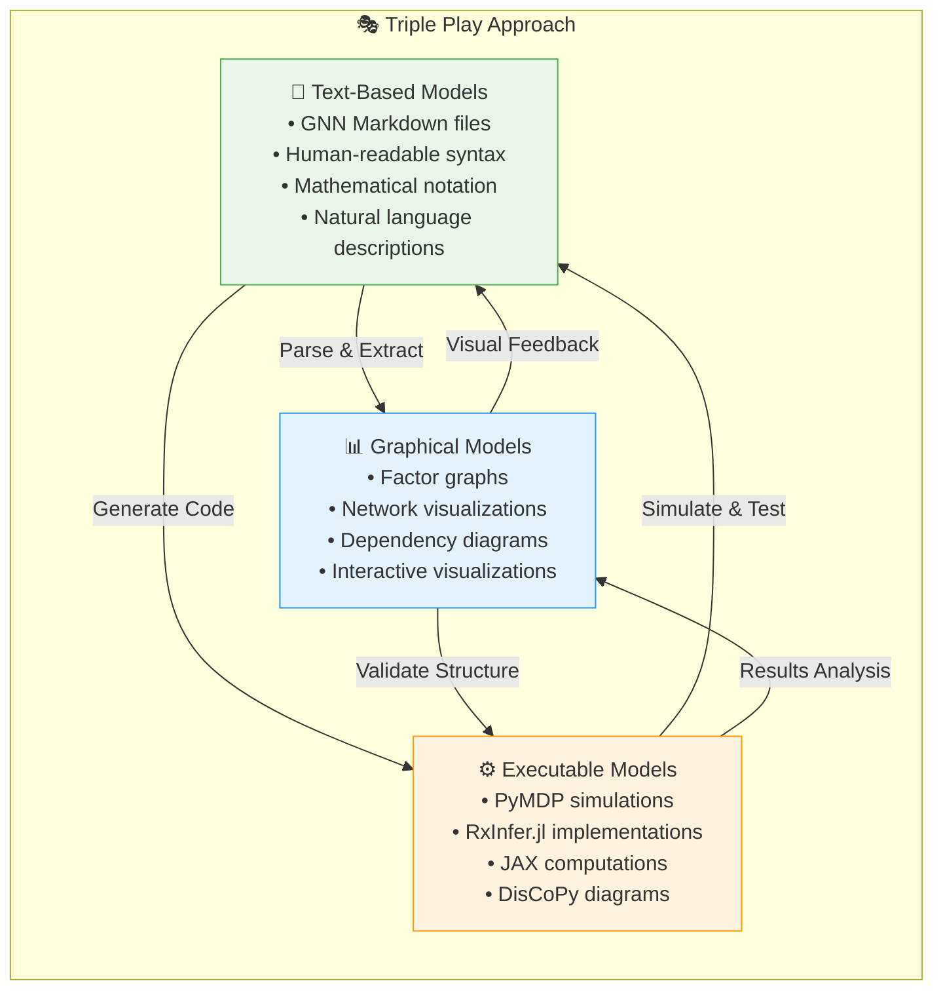
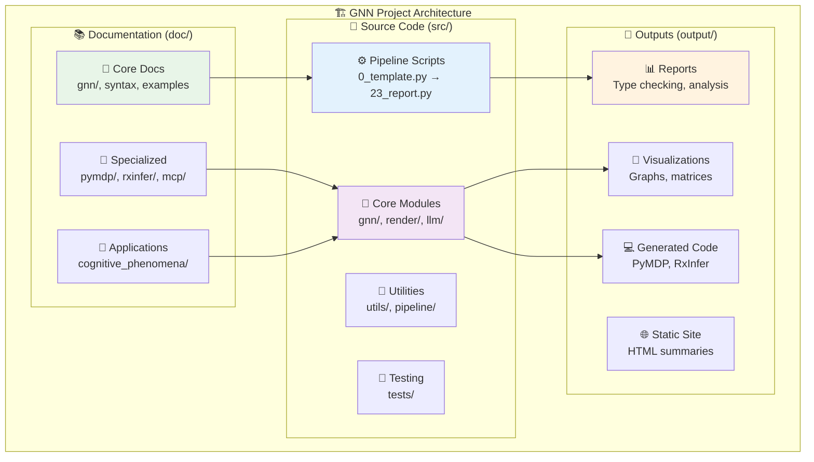
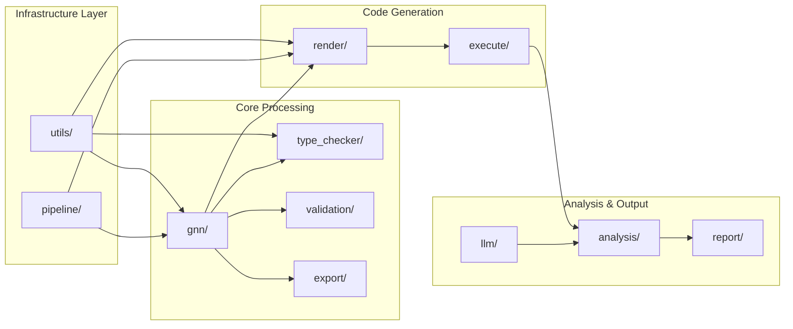
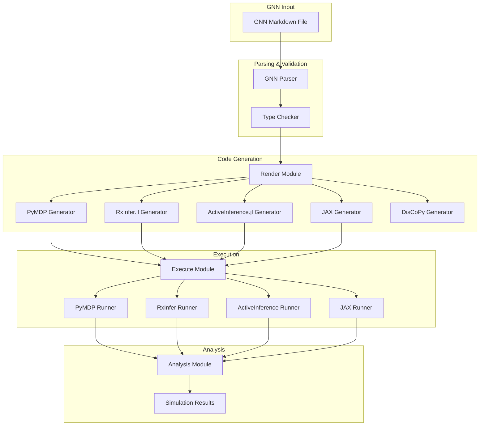
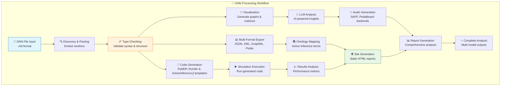
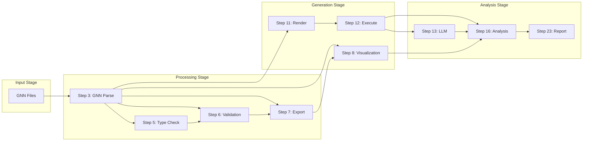
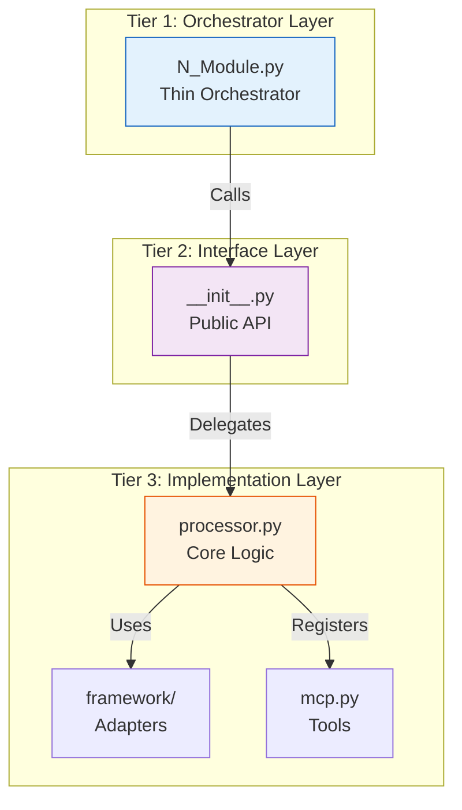

# GeneralizedNotationNotation (GNN)

**Last Updated**: 2026-01-09

<div align="center">

[](./LICENSE.md)
[](https://www.python.org/downloads/)
[](https://activeinference.org/)
[](https://doi.org/10.5281/zenodo.7803328)
[](#%EF%B8%8F-processing-pipeline)
[](#-performance-characteristics)
[](#-repository-health)
[](#-key-features)
[](#-documentation)

**A standardized text-based language for Active Inference generative models**

[🚀 Quick Start](#-quick-start) •
[📖 Documentation](#-documentation) •
[🎯 Examples](#-examples) •
[🛠️ Tools](#%EF%B8%8F-tools-and-utilities) •
[🤝 Contributing](#-contributing)

</div>

---

## 📋 Table of Contents

- [🌟 Overview](#-overview)
- [📁 Key Files](#-key-files)
- [🎯 Motivation and Goals](#-motivation-and-goals)
- [✨ Key Features](#-key-features)
- [🏗️ Project Architecture](#%EF%B8%8F-project-architecture)
- [⚙️ Processing Pipeline](#%EF%B8%8F-processing-pipeline)
- [🛠️ Tools and Utilities](#%EF%B8%8F-tools-and-utilities)
- [🚀 Quick Start](#-quick-start)
- [📖 Documentation](#-documentation)
- [🎯 Examples](#-examples)
- [💚 Repository Health](#-repository-health)
- [🤝 Contributing](#-contributing)
- [📄 License](#-license)

---

## 🌟 Overview

**Generalized Notation Notation (GNN)** is a text-based language designed to standardize the representation and communication of [Active Inference](https://activeinference.org/) generative models. It aims to enhance clarity, reproducibility, and interoperability in the field of Active Inference and cognitive modeling.

### 📚 Initial Publication

**Smékal, J., & Friedman, D. A. (2023)**. *Generalized Notation Notation for Active Inference Models*. Active Inference Journal.  
📖 **DOI:** [10.5281/zenodo.7803328](https://doi.org/10.5281/zenodo.7803328)  
📁 **Archive:** [zenodo.org/records/7803328](https://zenodo.org/records/7803328)

### 🎯 Core Design Principles

GNN provides a structured and standardized way to describe complex cognitive models. It is designed to be:

- **🧑‍💻 Human-readable**: Easy to understand and use for researchers from diverse backgrounds
- **🤖 Machine-parsable**: Can be processed by software tools for analysis, visualization, and code generation
- **🔄 Interoperable**: Facilitates the exchange and reuse of models across different platforms and research groups
- **🔬 Reproducible**: Enables precise replication of model specifications

GNN addresses the challenge of communicating Active Inference models, which are often described using a mix of natural language, mathematical equations, diagrams, and code. By offering a unified notation, GNN aims to streamline collaboration, improve model understanding, and accelerate research.

---

## 📁 Key Files

> **🚀 Start here** to understand the repository structure and find what you need quickly.

| File | Purpose | Start Here If... |
|------|---------|------------------|
| **[README.md](./README.md)** | Main entry point and overview | You're new to GNN |
| **[AGENTS.md](./AGENTS.md)** | Master agent scaffolding - all 24 modules documented | You want to understand the pipeline architecture |
| **[DOCS.md](./DOCS.md)** | Comprehensive documentation with all diagrams | You need the complete system overview |
| **[ARCHITECTURE.md](./ARCHITECTURE.md)** | Implementation patterns and extension guides | You're developing or extending GNN |
| **[doc/quickstart.md](./doc/quickstart.md)** | Step-by-step getting started guide | You want to run your first pipeline |
| **[doc/gnn/gnn_syntax.md](./doc/gnn/gnn_syntax.md)** | Complete GNN syntax specification | You're writing GNN model files |
| **[pyproject.toml](./pyproject.toml)** | Project dependencies and configuration | You're setting up the environment |
| **[SETUP_GUIDE.md](./SETUP_GUIDE.md)** | Detailed installation instructions | You're having setup issues |
| **[SECURITY.md](./SECURITY.md)** | Security policy and vulnerability reporting | You found a security issue |
| **[SUPPORT.md](./SUPPORT.md)** | Getting help and community resources | You need assistance |
| **[CITATION.cff](./CITATION.cff)** | Citation information for academic use | You're citing GNN in research |

### 📂 Directory Overview

```
GeneralizedNotationNotation/
├── 📄 README.md, AGENTS.md, DOCS.md, ARCHITECTURE.md  # Core documentation
├── 📁 src/                    # 24-step pipeline + 28 agent modules
│   ├── main.py               # 🎯 Main orchestrator - run this!
│   ├── 0_template.py → 23_report.py  # Numbered pipeline scripts
│   ├── gnn/, render/, execute/, llm/, ...  # Agent modules
│   └── tests/                # Comprehensive test suite
├── 📁 doc/                    # 580+ documentation files
│   ├── gnn/                  # GNN language specification
│   ├── pymdp/, rxinfer/      # Framework integration guides
│   └── cognitive_phenomena/  # Example cognitive models
├── 📁 input/                  # Input GNN files and configuration
│   └── gnn_files/            # Sample GNN model files
├── 📁 output/                 # Generated outputs (24 step-specific folders)
└── 📄 pyproject.toml, pytest.ini  # Configuration files
```

---

## 🧩 Modules & Agents

The GNN pipeline is composed of **24 specialized modules**, each acting as an agent with specific responsibilities. This "Thin Orchestrator" architecture ensures modularity and testability.

| Step | Agent / Module | Description | Links |
| :--- | :--- | :--- | :--- |
| **0** | **[Template](src/template/)** | Initial project scaffolding and configuration. | [🤖 Agent](src/template/AGENTS.md) • [📝 Code](src/0_template.py) |
| **1** | **[Setup](src/setup/)** | Environment, dependencies, and UV package management. | [🤖 Agent](src/setup/AGENTS.md) • [📝 Code](src/1_setup.py) |
| **2** | **[Tests](src/tests/)** | Comprehensive suite orchestration and coverage analysis. | [🤖 Agent](src/tests/AGENTS.md) • [📝 Code](src/2_tests.py) |
| **3** | **[GNN](src/gnn/)** | Core parsing, discovery, and semantic object model. | [🤖 Agent](src/gnn/AGENTS.md) • [📝 Code](src/3_gnn.py) |
| **4** | **[Registry](src/model_registry/)** | Validation and versioning of model artifacts. | [🤖 Agent](src/model_registry/AGENTS.md) • [📝 Code](src/4_model_registry.py) |
| **5** | **[TypeCheck](src/type_checker/)** | Static analysis, dimension validation, resource estimation. | [🤖 Agent](src/type_checker/AGENTS.md) • [📝 Code](src/5_type_checker.py) |
| **6** | **[Validate](src/validation/)** | Logical consistency and ontology compliance. | [🤖 Agent](src/validation/AGENTS.md) • [📝 Code](src/6_validation.py) |
| **7** | **[Export](src/export/)** | Serialization to JSON, XML, GraphML, etc. | [🤖 Agent](src/export/AGENTS.md) • [📝 Code](src/7_export.py) |
| **8** | **[Viz](src/visualization/)** | Static visualization of matrices and network logic. | [🤖 Agent](src/visualization/AGENTS.md) • [📝 Code](src/8_visualization.py) |
| **9** | **[Adv. Viz](src/advanced_visualization/)** | Interactive diagrams and complex visual analysis. | [🤖 Agent](src/advanced_visualization/AGENTS.md) • [📝 Code](src/advanced_visualization/AGENTS.md) |
| **10** | **[Ontology](src/ontology/)** | Semantic mapping to Active Inference definitions. | [🤖 Agent](src/ontology/AGENTS.md) • [📝 Code](src/10_ontology.py) |
| **11** | **[Render](src/render/)** | Code generation for PyMDP, RxInfer, JAX, etc. | [🤖 Agent](src/render/AGENTS.md) • [📝 Code](src/11_render.py) |
| **12** | **[Execute](src/execute/)** | Simulation runner and runtime management. | [🤖 Agent](src/execute/AGENTS.md) • [📝 Code](src/12_execute.py) |
| **13** | **[LLM](src/llm/)** | Neurosymbolic analysis and text generation. | [🤖 Agent](src/llm/AGENTS.md) • [📝 Code](src/13_llm.py) |
| **14** | **[ML](src/ml_integration/)** | Integration with external ML frameworks. | [🤖 Agent](src/ml_integration/AGENTS.md) • [📝 Code](src/14_ml_integration.py) |
| **15** | **[Audio](src/audio/)** | Sonification of model dynamics. | [🤖 Agent](src/audio/AGENTS.md) • [📝 Code](src/15_audio.py) |
| **16** | **[Analysis](src/analysis/)** | Statistical post-processing of simulation results. | [🤖 Agent](src/analysis/AGENTS.md) • [📝 Code](src/16_analysis.py) |
| **17** | **[Integrate](src/integration/)** | Cross-module synthesis and coordination. | [🤖 Agent](src/integration/AGENTS.md) • [📝 Code](src/17_integration.py) |
| **18** | **[Security](src/security/)** | Safety checks and sandboxing. | [🤖 Agent](src/security/AGENTS.md) • [📝 Code](src/18_security.py) |
| **19** | **[Research](src/research/)** | Experimental features and benchmarking. | [🤖 Agent](src/research/AGENTS.md) • [📝 Code](src/19_research.py) |
| **20** | **[Website](src/website/)** | Static site generation for reports/docs. | [🤖 Agent](src/website/AGENTS.md) • [📝 Code](src/20_website.py) |
| **21** | **[MCP](src/mcp/)** | Model Context Protocol server and tools. | [🤖 Agent](src/mcp/AGENTS.md) • [📝 Code](src/21_mcp.py) |
| **22** | **[GUI](src/gui/)** | Interactive visual editors (Web & Local). | [🤖 Agent](src/gui/AGENTS.md) • [📝 Code](src/22_gui.py) |
| **23** | **[Report](src/report/)** | Final comprehensive report assembly. | [🤖 Agent](src/report/AGENTS.md) • [📝 Code](src/23_report.py) |

---

## 🎯 Motivation and Goals

### 🚫 Current Challenges

The primary motivation behind GNN is to overcome the limitations arising from the lack of a standardized notation for Active Inference models. This fragmentation can lead to difficulties in:

- **💬 Effective Communication**: Making complex models hard to explain and understand
- **🔄 Reproducibility**: Hindering the ability to replicate research findings  
- **⚙️ Consistent Implementation**: Leading to variations when translating models into code
- **📊 Systematic Comparison**: Making it challenging to compare different models

### 🎯 Our Goals

The goals of GNN are to:

- ✅ Facilitate clear communication and understanding of Active Inference models
- ✅ Promote collaboration among researchers
- ✅ Enable the development of tools for model validation, visualization, and automated code generation
- ✅ Support the creation of a shared repository of Active Inference models
- ✅ Bridge the gap between theoretical concepts and practical implementations

---

## ✨ Key Features

### 🎭 The Triple Play Approach

GNN supports three complementary modalities for model representation, known as the **"Triple Play"**:



1. **📝 Text-Based Models**: GNN files are plain text and can be rendered into mathematical notation, pseudocode, or natural language descriptions. This forms the core representation.

2. **📊 Graphical Models**: The structure defined in GNN (variables and their connections) can be visualized as graphical models (e.g., factor graphs), clarifying dependencies and model architecture.

3. **⚙️ Executable Cognitive Models**: GNN specifications can serve as a high-level blueprint or pseudocode for implementing executable simulations in various programming environments. This ensures consistency and aids in the translation from theory to practice.

### 📋 Structured File Format

GNN defines a specific file structure, typically using Markdown, to organize model components. This includes sections for:

- 🏷️ Model metadata (name, version, annotations)
- 🌐 State space (variable definitions)  
- 🔗 Connections (relationships between variables)
- ⚙️ Initial parameterization
- 📐 Equations
- ⏰ Time settings (for dynamic models)
- 🧠 Mapping to Active Inference Ontology terms

### 📝 GNN Syntax Preview

Here's a glimpse of what a GNN model file looks like (from [`input/gnn_files/actinf_pomdp_agent.md`](./input/gnn_files/actinf_pomdp_agent.md)):

<details>
<summary><strong>📄 View GNN File Example</strong></summary>

```markdown
# GNN Example: Active Inference POMDP Agent
# GNN Version: 1.0

## GNNSection
ActInfPOMDP

## ModelName
Active Inference POMDP Agent

## StateSpaceBlock
# Likelihood matrix: A[observation_outcomes, hidden_states]
A[3,3,type=float]   # Likelihood mapping hidden states to observations

# Transition matrix: B[states_next, states_previous, actions]
B[3,3,3,type=float]   # State transitions given previous state and action

# Preference vector: C[observation_outcomes]
C[3,type=float]       # Log-preferences over observations

# Hidden State
s[3,1,type=float]     # Current hidden state distribution

## Connections
D>s
s-A
s>s_prime
A-o
π>u

## InitialParameterization
A={(0.9,0.05,0.05), (0.05,0.9,0.05), (0.05,0.05,0.9)}
C={(0.1, 0.1, 1.0)}
D={(0.33333, 0.33333, 0.33333)}

## ActInfOntologyAnnotation
A=LikelihoodMatrix
B=TransitionMatrix
s=HiddenState
o=Observation
```

</details>

**Connection Syntax:**
- `D>s` — D feeds into s (directed)
- `s-A` — s connects to A (undirected/bidirectional)
- `π>u` — Policy determines action

📖 **Full syntax reference**: [doc/gnn/gnn_syntax.md](./doc/gnn/gnn_syntax.md)

---

## 🏗️ Project Architecture



### Module Dependency Graph



### Framework Integration Architecture



### 📁 Directory Structure

<details>
<summary><strong>📂 src/ Directory Structure</strong></summary>

The `src/` directory contains the 24-step pipeline scripts (`0_template.py` → `23_report.py`), their corresponding modules, and shared infrastructure. See `DOCS.md` and `doc/pipeline/README.md` for the full step-by-step mapping.

```
src/
├── 📜 Pipeline Scripts (0-23)
│   ├── 0_template.py … 23_report.py   # Thin orchestrators (0–23)
├── 🧠 Core Modules
│   ├── gnn/ render/ execute/ llm/ visualization/ export/ type_checker/ ontology/ mcp/
│   ├── setup/ tests/ website/ audio/ analysis/ integration/ security/ research/ report/
├── 🔧 Infrastructure: utils/ pipeline/
└── 🗂️ Orchestrator: main.py
```

</details>

<details>
<summary><strong>📂 doc/ Directory Structure</strong></summary>

The `doc/` directory contains all supplementary documentation, including conceptual explanations, syntax guides, and examples.

```
doc/
├── 📖 Core Documentation
│   ├── gnn/                       # GNN specifications
│   ├── quickstart.md             # Getting started guide
│   ├── SETUP.md                  # Installation instructions
│   └── README.md                 # Documentation overview
├── 🎯 Domain Applications
│   ├── cognitive_phenomena/       # Cognitive modeling examples
│   ├── pymdp/                    # PyMDP integration
│   ├── rxinfer/                  # RxInfer.jl integration
│   └── templates/                # Model templates
├── 🛠️ Technical Integration
│   ├── mcp/                      # Model Context Protocol
│   ├── llm/                      # LLM integration
│   ├── discopy/                  # DisCoPy categorical diagrams
│   └── sympy/                    # SymPy mathematical processing
└── 📚 Resources
    ├── troubleshooting/          # Common issues & solutions
    ├── testing/                  # Testing documentation
    └── security/                 # Security guidelines
```

</details>

---

## ⚙️ Processing Pipeline

The GNN processing pipeline consists of **24 comprehensive steps (0-23)**, each handling a specific aspect of model processing from parsing to final report generation. The pipeline follows a **thin orchestrator pattern** where numbered scripts orchestrate execution while delegating core functionality to modular components.

```mermaid
flowchart TD
    A["🚀 Start Pipeline"] --> B["0️⃣ Template Init<br/>src/template/"]
    B --> C["1️⃣ Setup & Dependencies<br/>src/setup/"]
    C --> D["2️⃣ Tests<br/>src/tests/"]
    D --> E["3️⃣ GNN Discovery & Parsing<br/>src/gnn/"]
    E --> F["4️⃣ Model Registry<br/>src/model_registry/"]
    F --> G["5️⃣ Type Checking<br/>src/type_checker/"]
    G --> H["6️⃣ Validation<br/>src/validation/"]
    H --> I["7️⃣ Export<br/>src/export/"]
    I --> J["8️⃣ Visualization<br/>src/visualization/"]
    J --> K["9️⃣ Advanced Viz<br/>src/advanced_visualization/"]
    K --> L["1️⃣0️⃣ Ontology<br/>src/ontology/"]
    L --> M["1️⃣1️⃣ Rendering<br/>src/render/"]
    M --> N["1️⃣2️⃣ Execution<br/>src/execute/"]
    N --> O["1️⃣3️⃣ LLM Analysis<br/>src/llm/"]
    O --> P["1️⃣4️⃣ ML Integration<br/>src/ml_integration/"]
    P --> Q["1️⃣5️⃣ Audio<br/>src/audio/"]
    Q --> R["1️⃣6️⃣ Analysis<br/>src/analysis/"]
    R --> S["1️⃣7️⃣ Integration<br/>src/integration/"]
    S --> T["1️⃣8️⃣ Security<br/>src/security/"]
    T --> U["1️⃣9️⃣ Research<br/>src/research/"]
    U --> V["2️⃣0️⃣ Website<br/>src/website/"]
    V --> W["2️⃣1️⃣ MCP<br/>src/mcp/"]
    W --> X["2️⃣2️⃣ GUI<br/>src/gui/"]
    X --> Y["2️⃣3️⃣ Report<br/>src/report/"]
    Y --> Z["✅ Complete"]

    style A fill:#e1f5fe
    style G fill:#fff3e0,stroke:#ff9800,stroke-width:2px
    style Y fill:#e8f5e8,stroke:#4caf50
```



### 🎯 GNN Processing Workflow



### Data Flow Between Pipeline Steps



### 🧠 Modules & Agents

The GNN framework is built around a modular architecture, where each pipeline step corresponds to a dedicated module. These modules encapsulate specific functionalities and interact with various "agents" (e.g., LLMs, external APIs) to perform their tasks.

| Module Name | Pipeline Step | Description | Key Agents/Integrations |
| :---------- | :------------ | :---------- | :---------------------- |
| `template` | 0 | Initializes pipeline, sets up environment, and loads configuration. | Configuration Manager, Environment Setup |
| `setup` | 1 | Manages dependencies, virtual environments, and system checks. | `uv`, `pip`, System Utilities |
| `tests` | 2 | Executes unit, integration, and end-to-end tests. | `pytest`, `coverage.py` |
| `gnn` | 3 | Discovers, parses, and validates GNN markdown files. | Markdown Parser, Schema Validator |
| `model_registry` | 4 | Manages a central registry of GNN models and their metadata. | Database (SQLite), Model Metadata |
| `type_checker` | 5 | Performs static analysis, type checking, and resource estimation. | Type Inference Engine, Resource Estimator |
| `validation` | 6 | Validates GNN models against predefined rules and constraints. | Constraint Solver, Logic Validator |
| `export` | 7 | Exports GNN models to various formats (JSON, XML, GraphML). | JSON/XML/GraphML Serializers |
| `visualization` | 8 | Generates graphical representations of GNN models. | `matplotlib`, `plotly`, `graphviz` |
| `advanced_visualization` | 9 | Provides advanced, interactive 3D and dynamic visualizations. | `vedo`, `pyvista`, `dash` |
| `ontology` | 10 | Maps GNN concepts to Active Inference ontology terms. | Ontology Mapper, Knowledge Graph |
| `render` | 11 | Renders GNN models into executable code for various backends. | Code Generators (PyMDP, RxInfer, ActInf.jl) |
| `execute` | 12 | Executes the rendered code using the specified backend. | PyMDP, RxInfer.jl, ActiveInference.jl |
| `llm` | 13 | Integrates Large Language Models for analysis, generation, and insights. | OpenAI GPT, Anthropic Claude, Local LLMs |
| `ml_integration` | 14 | Integrates with machine learning frameworks for advanced analysis. | `scikit-learn`, `tensorflow`, `pytorch` |
| `audio` | 15 | Generates audio representations of GNN model dynamics. | `SAPF`, `Pedalboard`, Audio Synthesis Engines |
| `analysis` | 16 | Performs statistical and qualitative analysis of execution results. | `pandas`, `scipy`, Statistical Models |
| `integration` | 17 | Manages external system integrations and data exchange. | REST APIs, Message Queues |
| `security` | 18 | Implements security checks, vulnerability scanning, and access control. | SAST Tools, Security Scanners |
| `research` | 19 | Supports research-specific tasks like hypothesis testing and data collection. | Experimentation Frameworks |
| `website` | 20 | Generates static websites or documentation portals from GNN outputs. | Static Site Generators (e.g., MkDocs) |
| `mcp` | 21 | Implements the Model Context Protocol for inter-model communication. | Protocol Handlers, Message Brokers |
| `gui` | 22 | Provides interactive graphical user interfaces for model creation and editing. | `gradio`, `streamlit`, `dash` |
| `report` | 23 | Generates comprehensive reports summarizing the pipeline execution. | Report Generators (PDF, HTML) |

### 🏗️ Pipeline Architecture: Three-Tier Pattern

The pipeline follows a **three-tier architectural pattern** (`Script -> Interface -> Processor`) for high maintainability and testability.



#### 🏛️ Architectural Components

1.  **Main Pipeline Orchestrator** (`src/main.py`): Central coordinator that executes numbered scripts in sequence.
2.  **Thin Orchestrators** (`src/0_template.py`, `src/1_setup.py`, etc.): Minimal scripts (<150 lines) that handle CLI args and logging, then delegate immediately.
3.  **Modular Scripts** (`src/template/`, `src/setup/`, etc.): The actual "brains" of the operation, containing `processor.py`, logic, and specialized tests.

#### 📋 Current Status

**✅ Compliant Scripts (7/23):**
- `src/0_template.py` → `src/template/`
- `src/1_setup.py` → `src/setup/`
- `src/6_validation.py` → `src/validation/`
- `src/7_export.py` → `src/export/`
- `src/8_visualization.py` → `src/visualization/`
- `src/10_ontology.py` → `src/ontology/`
- `src/11_render.py` → `src/render/`

**🔄 Pending Refactoring (16/23):**
- `src/2_tests.py` → `src/tests/` (8 functions)
- `src/3_gnn.py` → `src/gnn/` (1 function)
- `src/4_model_registry.py` → `src/model_registry/` (3 functions)
- `src/5_type_checker.py` → `src/type_checker/` (4 functions)
- `src/9_advanced_viz.py` → `src/advanced_visualization/` (10 functions)
- `src/12_execute.py` → `src/execute/` (14 functions)
- And 10 more scripts...

#### 📁 Example Structure

```
src/
├── main.py                          # Main pipeline orchestrator
├── 0_template.py                    # Thin orchestrator - imports from template/
├── template/                        # Modular template implementation
│   ├── __init__.py                 # Module exports and initialization
│   ├── processor.py                # Core template processing logic
│   └── mcp.py                      # Model Context Protocol integration
└── tests/
    └── test_template_integration.py # Tests for template module
```

#### 📚 Documentation

For comprehensive architectural documentation, see:
- `src/template/README.md`: Reference implementation and pattern documentation
- `ARCHITECTURE.md`: Complete architectural guide

### 🚀 Running the Pipeline

Navigate to the project's root directory and execute:

```bash
python src/main.py [options]
```

#### 🛠️ Key Pipeline Options

| Option | Description | Default |
|--------|-------------|---------|
| `--target-dir DIR` | Target directory for GNN files | `input/gnn_files` |
| `--output-dir DIR` | Directory to save outputs | `output/` |
| `--recursive` | Recursively process directories | `True` |
| `--skip-steps LIST` | Skip specific steps (e.g., "1,7") | None |
| `--only-steps LIST` | Run only specific steps | None |
| `--verbose` | Enable detailed logging | `False` |
| `--strict` | Enable strict type checking | `False` |
| `--estimate-resources` | Estimate computational resources | `True` |

<details>
<summary><strong>📋 View All Pipeline Options</strong></summary>

```bash
python src/main.py --help
```

**Additional specialized options:**
- `--ontology-terms-file FILE`: Path to ontology terms file
- `--llm-tasks LIST`: Comma-separated LLM tasks
- `--llm-timeout`: LLM processing timeout
- `--pipeline-summary-file FILE`: Pipeline summary report path
- `--site-html-filename NAME`: Generated HTML site filename
- `--duration`: Audio duration for audio generation (default: 30.0)
- `--audio-backend`: Audio backend to use (auto, sapf, pedalboard, default: auto)
- `--recreate-uv-env`: Recreate UV environment
- `--dev`: Install development dependencies

</details>

---

## 🛠️ Tools and Utilities

The GNN ecosystem includes several sophisticated tools to aid in model development, validation, and understanding. These tools are primarily invoked through the `src/main.py` pipeline script.

### ✅ Type Checker and Resource Estimator

The **GNN Type Checker** (pipeline step 5) helps validate GNN files and estimates computational resources.

#### 🎯 Quick Usage

```bash
# Run only type checker
python src/main.py --only-steps 5 --target-dir path/to/gnn_files

# Include resource estimation
python src/main.py --only-steps 5 --estimate-resources --target-dir path/to/gnn_files

# Run full pipeline
python src/main.py --target-dir path/to/gnn_files
```

#### 📊 Features

- ✅ Validation of required sections and structure
- 🔍 Type checking of variables and dimensions  
- 🔗 Verification of connections and references
- 📋 Detailed error reports with suggestions for fixes
- 💾 Resource usage estimation and optimization recommendations

#### 📁 Output Structure

When executed, the type checker writes to `output/5_type_checker_output/`:

```
output/5_type_checker_output/
├── type_check_results.json
├── type_check_summary.json
└── global_type_analysis.json
```

### 🎨 Visualization

GNN files can be visualized to create comprehensive graphical representations of models (pipeline step 8).

#### 🎯 Usage

```bash
# Generate visualizations
python src/main.py --only-steps 8 --target-dir path/to/gnn_file.md
```

#### 🖼️ Visualization Types

- 📊 **Network Graphs**: Model structure and dependencies
- 🎨 **Matrix Heatmaps**: A, B, C, D matrix visualizations  
- 🧠 **Ontology Diagrams**: Active Inference relationship maps
- 📈 **Performance Plots**: Resource usage and timing analysis

### 🎮 Interactive GUI Interfaces

GNN provides **three distinct interactive GUI interfaces** for visual model construction and editing (pipeline step 22).

#### 🎯 GUI Overview

| **GUI** | **Focus** | **Port** | **Key Features** |
|---------|-----------|----------|------------------|
| **GUI 1** | Form-based Constructor | `:7860` | Step-by-step model building, component management |
| **GUI 2** | Visual Matrix Editor | `:7861` | Real-time heatmaps, interactive matrix editing |
| **GUI 3** | Design Studio | `:7862` | State space design, ontology editing, low-dependency |
| **oxdraw** | Diagram-as-Code | `:5151` | Mermaid-based visual editing, GNN ↔ diagram sync |

#### 🚀 Quick Launch

```bash
# Launch all GUIs (recommended)
python src/22_gui.py --target-dir input/gnn_files --output-dir output --gui-types "gui_1,gui_2,gui_3,oxdraw" --interactive --verbose

# Launch specific GUI
python src/22_gui.py --gui-types "gui_3" --interactive --verbose  # Design Studio only
python src/22_gui.py --gui-types "oxdraw" --interactive --verbose  # oxdraw only

# Launch via main pipeline (headless mode)
python src/main.py --only-steps 22 --verbose
```

#### 🏗️ GUI Details

**🔧 GUI 1: Form-based Constructor** (`http://localhost:7860`)
- Interactive two-pane editor for systematic GNN model construction
- Component management (observation/hidden/action/policy variables)  
- State space entry management with live validation
- Synchronized plaintext GNN markdown editor

**📊 GUI 2: Visual Matrix Editor** (`http://localhost:7861`)
- Real-time matrix heatmap visualizations with Plotly
- Interactive DataFrame editing with +/- dimension controls
- Vector bar chart displays for C & D vectors
- Live matrix statistics (min, max, mean, sum)
- Auto-update functionality and matrix validation

**🎨 GUI 3: State Space Design Studio** (`http://localhost:7862`)
- Visual state space architecture designer with SVG diagrams
- Ontology term editor for Active Inference concept mapping
- Interactive connection graph interface (D>s, s-A, A-o format)
- Parameter tuning controls (states, observations, actions, horizons)
- Real-time GNN export and preview with low-dependency approach

#### 📁 GUI Output Structure

```
output/22_gui_output/
├── gui_1_output/           # Form-based constructor outputs
│   ├── constructed_model_gui_1.md
│   └── gui_status.json
├── gui_2_output/           # Visual matrix editor outputs  
│   ├── visual_model_gui_2.md
│   └── visual_matrices.json
├── gui_3_output/           # Design studio outputs
│   ├── designed_model_gui_3.md
│   └── design_analysis.json
└── gui_processing_summary.json
```

---

## 🚀 Quick Start

**New to GNN?** Choose your learning path:

### 🎯 **Choose Your Journey**

- **⚡ Quick Demo (5 min)**: See GNN in action → [5-Minute Demo](doc/quickstart.md#5-minute-demo)
- **🔬 I'm a Researcher**: Theory-first approach → [Research Path](doc/learning_paths.md#research-focused-path)  
- **💻 I'm a Developer**: Code-first approach → [Developer Path](doc/learning_paths.md#developer-focused-path)
- **🎓 I'm Learning**: Structured curriculum → [Academic Path](doc/learning_paths.md#academic-learning-path)

**📚 Need guidance choosing?** → [Complete Learning Paths Guide](doc/learning_paths.md)

### 🛠️ **Direct Installation** (if you know what you want)

**1️⃣ Prerequisites**

Ensure you have **Python 3.11+** installed:

```bash
python --version  # Should show 3.11 or higher
```

**2️⃣ Clone Repository**

```bash
git clone https://github.com/ActiveInferenceInstitute/GeneralizedNotationNotation.git
cd GeneralizedNotationNotation
```

**3️⃣ Setup Environment**

Run the setup pipeline step to configure dependencies:

```bash
python src/main.py --only-steps 1 --dev
```

This will:
- ✅ Create and configure virtual environment
- 📦 Install all required dependencies
- 🧪 Install development dependencies (with `--dev`)
- ✅ Validate system requirements

**4️⃣ Enhanced Visual Output** *(Optional)*

The pipeline includes enhanced visual logging for better accessibility:

```bash
# Run with visual enhancements (recommended)
python src/main.py --verbose

# Run with compact visual mode for narrow terminals
python src/main.py --verbose --compact

# Run with timestamps for detailed logging
python src/main.py --verbose --timestamps
```

**Visual Features:**
- 🎨 **Color-coded status indicators** (green=success, yellow=warning, red=error)
- 📊 **Progress bars** and completion indicators
- 🔢 **Step-by-step visual progress** with correlation IDs
- 📋 **Structured summary tables** with key metrics
- ♿ **Screen reader friendly** output (emoji can be disabled)
- ⏱️ **Performance timing** and memory usage tracking

**5️⃣ Run Your First Pipeline (using `uv`)**

Use `uv` to run the pipeline inside the managed project environment:

```bash
uv sync                # ensure dependencies from pyproject.toml are installed
uv run python src/main.py -- --target-dir input/gnn_files --verbose
```

You can also run individual commands under `uv` (recommended):

```bash
uv run pytest          # run tests inside uv-managed venv
uv run python -m pytest
```

**5️⃣ Explore Results**

Check the generated outputs in the `output/` directory. The static site is under the numbered website folder:

```bash
ls -la output/
open output/20_website_output/website/index.html  # macOS
# or
xdg-open output/20_website_output/website/index.html  # Linux
```

### 🆘 Need Help?

<details>
<summary><strong>🔍 Common Issues & Solutions</strong></summary>

**🐍 Python Version Issues**
```bash
# Check Python version
python --version
# If < 3.8, install Python 3.8+ from python.org
```

**📦 Dependency Issues**
```bash
# Force reinstall dependencies
uv run python src/main.py --only-steps 2 --recreate-uv-env --dev
```

**🔧 Pipeline Failures**
```bash
# Run with verbose logging
python src/main.py --verbose
# Check specific step
python src/main.py --only-steps 5 --verbose
```

**💾 Disk Space Issues**
```bash
# Check available space
df -h
# Clean output directory
rm -rf output/*
```

</details>

**🔗 Get Support:**
- 📖 **Documentation**: See [Documentation](#-documentation) section below
- 🐛 **Known Issues**: Check [troubleshooting guide](./doc/troubleshooting/)
- 💬 **Community**: Open an issue on [GitHub](https://github.com/ActiveInferenceInstitute/GeneralizedNotationNotation/issues)
- 🚀 **Quick Fix**: Try `python src/main.py --only-steps 2 --dev` first

---

## 📖 Documentation

Comprehensive documentation is organized in the `doc/` directory.

> [!TIP]
> **Start Here for Architecture**:
> *   **[AGENTS.md](./AGENTS.md)**: **Master Agent Scaffolding** - Detailed breakdown of every pipeline module and its agentic responsibilities.
> *   **[DOCS.md](./DOCS.md)**: **Comprehensive Project Docs** - Full architecture, high-level diagrams, and integration points.

### 📚 Core Documentation

| Document | Description |
|----------|-------------|
| [**AGENTS.md**](./AGENTS.md) | **MUST READ**: The master guide to all pipeline agents and modules. |
| [**DOCS.md**](./DOCS.md) | High-level system architecture and comprehensive documentation index. |
| [**GNN Overview**](./doc/gnn/gnn_overview.md) | High-level introduction to the GNN language. |
| [**Syntax Guide**](./doc/gnn/gnn_syntax.md) | Detailed GNN syntax specification. |
| [**File Structure**](./doc/gnn/gnn_file_structure_doc.md) | Guide to GNN file organization. |
| [**Quick Start Tutorial**](./doc/gnn/quickstart_tutorial.md) | Step-by-step beginner guide. |
| [**Architecture Guide**](./ARCHITECTURE.md) | Implementation, extension patterns, and system design. |
| [**Machine-Readable Indices**](./doc/api/README.md) | API index and generator. |

### 🎯 Specialized Guides

| Topic | Documentation |
|-------|---------------|
| **🧠 Active Inference** | [About GNN](./doc/gnn/about_gnn.md) |
| **🤖 LLM Integration** | [LLM & Neurosymbolic AI](./doc/gnn/gnn_llm_neurosymbolic_active_inference.md) |
| **📊 Implementation** | [Implementation Guide](./doc/gnn/gnn_implementation.md) |
| **🛠️ Tools** | [Tools & Resources](./doc/gnn/gnn_tools.md) |
| **📄 Research Paper** | [Academic Paper Details](./doc/gnn/gnn_paper.md) |

### 🎯 Integration Guides

| Platform | Documentation |
|----------|---------------|
| **🐍 PyMDP** | [PyMDP Integration](./doc/pymdp/) |
| **🔬 RxInfer.jl** | [RxInfer Integration](./doc/rxinfer/) |
| **🧠 ActiveInference.jl** | [ActiveInference.jl Integration](./doc/activeinference_jl/) |
| **📡 MCP** | [Model Context Protocol](./doc/mcp/) |
| **🧮 SymPy** | [Mathematical Processing](./doc/sympy/) |
| **🔄 DisCoPy** | [Categorical Diagrams](./doc/discopy/) |

### 🧩 Application Examples

| Domain | Examples |
|--------|----------|
| **🧠 Cognitive Phenomena** | [Cognitive Models](./doc/cognitive_phenomena/) |
| **🎯 Templates** | [Model Templates](./doc/templates/) |
| **📋 Configuration** | [Configuration Examples](./doc/configuration/) |

---

## 🎯 Examples

Explore practical GNN implementations and use cases:

### 📂 Example Files Location

- **📁 Primary Examples**: [`src/gnn/gnn_examples/`](./src/gnn/gnn_examples/)
- **📁 Cognitive Models**: [`doc/cognitive_phenomena/`](./doc/cognitive_phenomena/)
- **📁 Templates**: [`doc/templates/`](./doc/templates/)

### 🔥 Featured Examples

| Example | Description | Location |
|---------|-------------|----------|
| **🎯 PyMDP POMDP Agent** | Complete POMDP implementation | [`src/gnn/gnn_examples/actinf_pomdp_agent.md`](src/gnn/gnn_examples/actinf_pomdp_agent.md) |
| **🔬 RxInfer Hidden Markov Model** | Probabilistic sequence modeling | [`doc/archive/rxinfer_hidden_markov_model.md`](doc/archive/rxinfer_hidden_markov_model.md) |
| **🧠 ActiveInference.jl Examples** | Julia-based Active Inference models | [`doc/activeinference_jl/actinf_jl_src/`](doc/activeinference_jl/actinf_jl_src/) |
| **🤝 Multi-Agent System** | Collaborative agent modeling | [`doc/archive/rxinfer_multiagent_gnn.md`](doc/archive/rxinfer_multiagent_gnn.md) |

### 🧠 Cognitive Phenomena Examples

| Phenomenon | Model | Documentation |
|------------|-------|---------------|
| **🎯 Attention** | Attention mechanisms | [`doc/cognitive_phenomena/attention/`](./doc/cognitive_phenomena/attention/) |
| **🧠 Consciousness** | Global workspace theory | [`doc/cognitive_phenomena/consciousness/`](./doc/cognitive_phenomena/consciousness/) |
| **💪 Cognitive Effort** | Effort and control | [`doc/cognitive_phenomena/effort/`](./doc/cognitive_phenomena/effort/) |
| **❤️ Emotion & Affect** | Interoceptive emotion | [`doc/cognitive_phenomena/emotion_affect/`](./doc/cognitive_phenomena/emotion_affect/) |
| **🎮 Executive Control** | Task switching | [`doc/cognitive_phenomena/executive_control/`](./doc/cognitive_phenomena/executive_control/) |

### 🏃‍♂️ Running Examples

```bash
# Process all examples
python src/main.py --target-dir src/gnn/gnn_examples

# Process specific example
python src/main.py --target-dir src/gnn/gnn_examples/actinf_pomdp_agent.md

# Process with full analysis
python src/main.py --target-dir src/gnn/gnn_examples --estimate-resources --verbose
```

### ⚡ Power User Tips

<details>
<summary><strong>🚀 Advanced Usage Patterns</strong></summary>

**🔥 Quick Commands**
```bash
# Full pipeline with all features
python src/main.py --verbose --estimate-resources --dev

# Type check only (fastest validation)  
python src/main.py --only-steps 5 --strict

# Visualization only (quick preview)
python src/main.py --only-steps 8

# Complete analysis for single file
python src/main.py --target-dir path/to/file.md --verbose
```

**🎯 Pipeline Optimization**
```bash
# Skip time-consuming steps for quick iteration
python src/main.py --skip-steps "11,12,13"

# Focus on core processing
python src/main.py --only-steps "1,4,5,6"

# Development workflow
python src/main.py --only-steps "2,3" --dev
```

**📊 Output Management**
```bash
# Custom output directory
python src/main.py -o /path/to/custom/output

# Timestamped outputs
python src/main.py -o "output/run_$(date +%Y%m%d_%H%M%S)"
```

</details>

---

## 💚 Repository Health

The GNN project maintains high standards for code quality, testing, and documentation.

### 📊 Current Metrics (2026-01-08)

| Metric | Status | Details |
|--------|--------|---------|
| **Pipeline Success** | ✅ 100% | 24/24 steps passing |
| **Tests Passing** | ✅ 579/579 | 3 skipped (service-dependent), 56 skipped (optional deps) |
| **Execution Time** | ⏱️ ~3 min | Full pipeline in under 3 minutes |
| **Memory Usage** | 💾 36 MB peak | Efficient resource consumption |
| **Module Coverage** | 📊 74-95% | Median ~82% test coverage |
| **Documentation** | 📖 100% | All 28 modules have AGENTS.md |

### 🧪 Testing Infrastructure

```bash
# Run comprehensive test suite
python src/2_tests.py --comprehensive

# Run fast pipeline tests (default)
python src/2_tests.py

# Check test coverage
pytest --cov=src --cov-report=term-missing

# Run specific module tests
pytest src/tests/test_[module]*.py -v
```

**Test Configuration:** See [pytest.ini](./pytest.ini) for complete test settings.

### 📋 Configuration Files

| File | Purpose |
|------|---------|
| **[pyproject.toml](./pyproject.toml)** | Project metadata, dependencies, and build configuration |
| **[pytest.ini](./pytest.ini)** | Test suite configuration with markers and coverage settings |
| **[input/config.yaml](./input/config.yaml)** | Pipeline default configuration |
| **[Dockerfile](./Dockerfile)** | Container image definition |

### 🔒 Security & Quality

- **Security Policy**: See [SECURITY.md](./SECURITY.md) for vulnerability reporting
- **Code of Conduct**: See [CODE_OF_CONDUCT.md](./CODE_OF_CONDUCT.md)
- **Contributing Guidelines**: See [CONTRIBUTING.md](./CONTRIBUTING.md)

---

## 🤝 Contributing

GNN is an evolving standard, and **contributions are welcome**! Here's how you can get involved:

### 🎯 Ways to Contribute

- 🐛 **Report Issues**: Found a bug? [Open an issue](https://github.com/ActiveInferenceInstitute/GeneralizedNotationNotation/issues)
- 💡 **Suggest Features**: Have ideas? [Start a discussion](https://github.com/ActiveInferenceInstitute/GeneralizedNotationNotation/discussions)  
- 📝 **Improve Documentation**: Help make our docs better
- 🧪 **Add Examples**: Share your GNN models
- 🔧 **Code Contributions**: Submit pull requests

### 📋 Contribution Guidelines

1. **🍴 Fork** the repository
2. **🌿 Create** a feature branch (`git checkout -b feature/amazing-feature`)
3. **✅ Test** your changes thoroughly
4. **📝 Document** your changes
5. **💾 Commit** with clear messages (`git commit -m 'Add amazing feature'`)
6. **📤 Push** to your branch (`git push origin feature/amazing-feature`)
7. **🔄 Submit** a Pull Request

### 🛡️ Code of Conduct

Please read our [Code of Conduct](./CODE_OF_CONDUCT.md) to understand the standards we maintain for our community.

### 📞 Getting Help

- 📖 **Documentation**: Check the [docs](./doc/) first
- 💬 **Discussions**: Use [GitHub Discussions](https://github.com/ActiveInferenceInstitute/GeneralizedNotationNotation/discussions)
- 🐛 **Issues**: For bugs, use [GitHub Issues](https://github.com/ActiveInferenceInstitute/GeneralizedNotationNotation/issues)
- 📧 **Contact**: Reach out to the maintainers

### 🙌 Recognition

All contributors will be recognized in our [contributors list](https://github.com/ActiveInferenceInstitute/GeneralizedNotationNotation/graphs/contributors) and release notes.

---

## 📄 License

This project is licensed under **Creative Commons Attribution-NonCommercial-ShareAlike 4.0 International (CC BY-NC-SA 4.0)**. See [LICENSE.md](./LICENSE.md) for full terms.

### 📋 License Summary

- ✅ **Attribution** required
- ✅ **Adaptation/Redistribution** permitted under the same license
- ✅ **Private use** permitted
- ❌ **Commercial use** not permitted without explicit permission
- ❗ **Include license and changes notice** in redistributions

---

## 🔗 External Resources & Links

### 🌐 Active Inference Community

- 🏠 **Active Inference Institute**: [activeinference.institute](https://activeinference.institute/)
- 💬 **Community Discussions**: [Active Inference Discord](https://discord.activeinference.institute/)

### 🛠️ Technical Resources

- 🐍 **PyMDP Framework**: [github.com/infer-actively/pymdp](https://github.com/infer-actively/pymdp)
- 🔬 **RxInfer.jl**: [github.com/biaslab/RxInfer.jl](https://github.com/biaslab/RxInfer.jl)
- 🧠 **ActiveInference.jl**: [github.com/ComputationalPsychiatry/ActiveInference.jl](https://github.com/ComputationalPsychiatry/ActiveInference.jl)
- 📊 **DisCoPy**: [github.com/oxford-quantum-group/discopy](https://github.com/oxford-quantum-group/discopy)
- 📚 **Research Papers**: [Active Inference on arXiv](https://arxiv.org/search/?query=active+inference&searchtype=all)

<div align="center">

---

**Built by the Active Inference community**

[⬆️ Back to top](#generalizednotationnotation-gnn)

</div>
