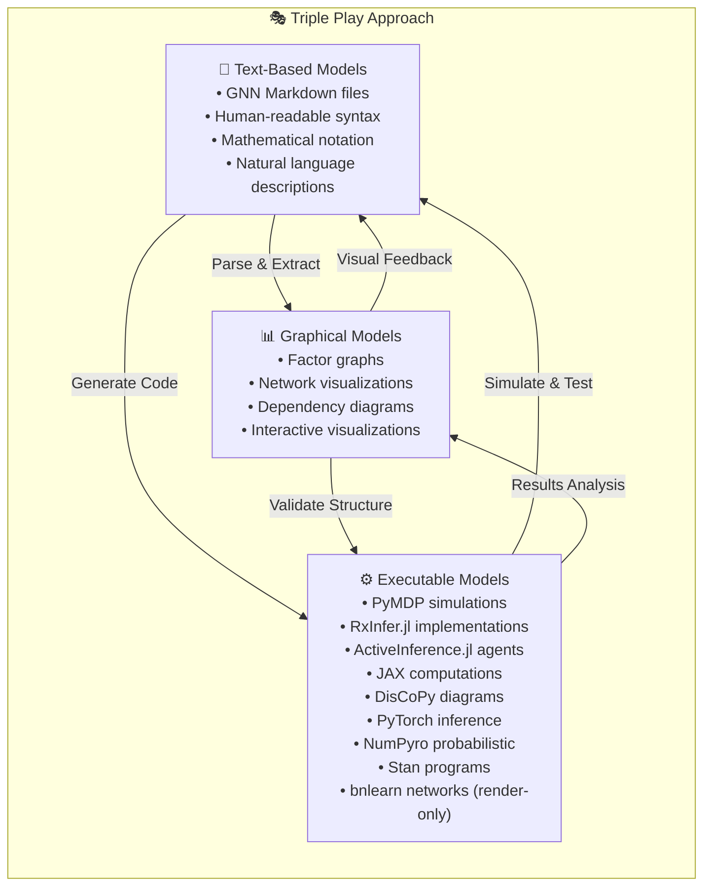
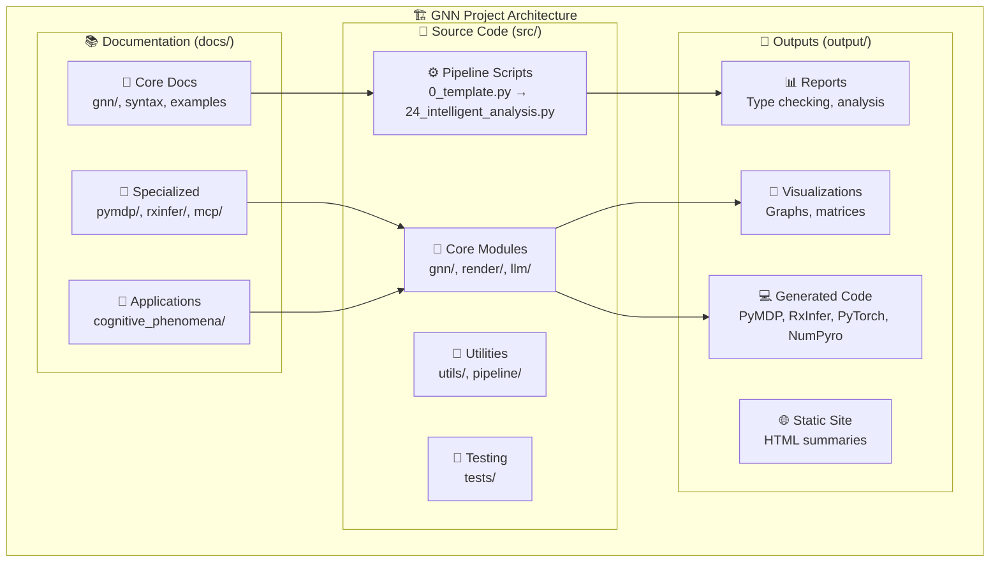
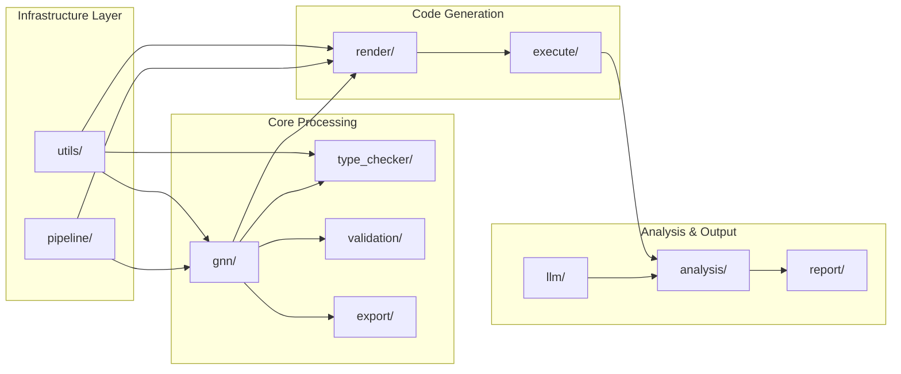
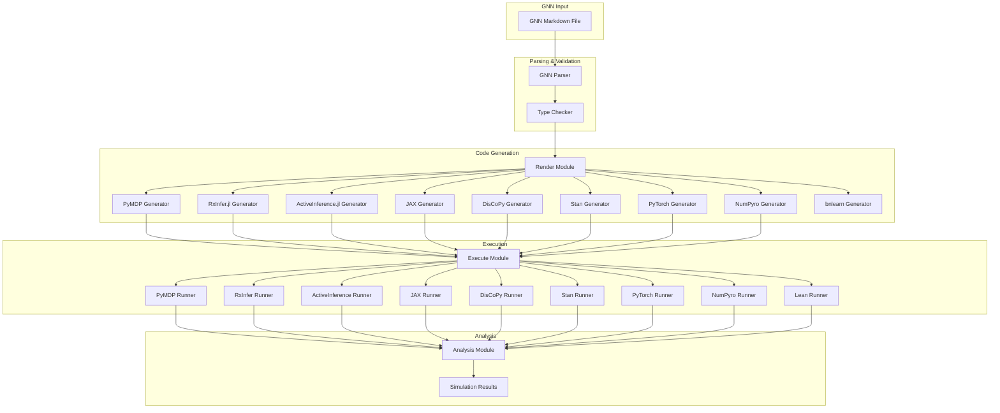
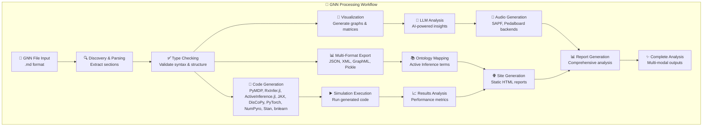
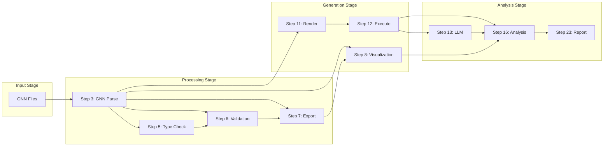
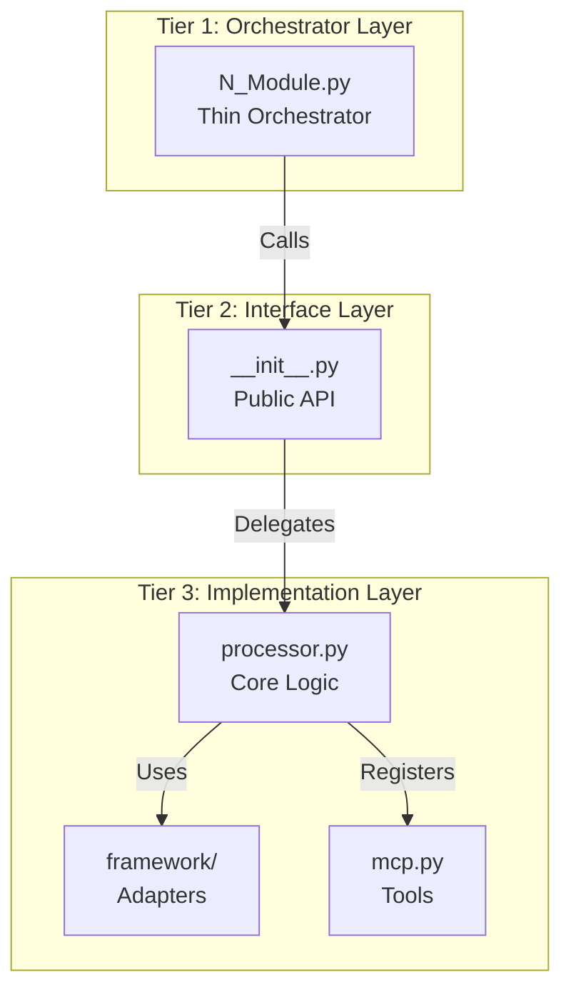

# GeneralizedNotationNotation (GNN)

**Last Updated**: 2026-09-07

<div align="center">

[](./LICENSE.md)
[](https://www.python.org/downloads/)
[](https://activeinference.org/)
[](https://doi.org/10.5281/zenodo.7803328)
[](#%EF%B8%8F-processing-pipeline)
[](#-documentation)

**A standardized text-based language for Active Inference generative models**

[🚀 Quick Start](#-quick-start) •
[📖 Documentation](#-documentation) •
[🎯 Examples](#-examples) •
[🛠️ Tools](#%EF%B8%8F-tools-and-utilities) •
[🤝 Contributing](#-contributing)

</div>

---

## 📋 Table of Contents

- [🌟 Overview](#-overview)
- [📁 Key Files](#-key-files)
- [🎯 Motivation and Goals](#-motivation-and-goals)
- [✨ Key Features](#-key-features)
- [🏗️ Project Architecture](#%EF%B8%8F-project-architecture)
- [⚙️ Processing Pipeline](#%EF%B8%8F-processing-pipeline)
- [🛠️ Tools and Utilities](#%EF%B8%8F-tools-and-utilities)
- [🚀 Quick Start](#-quick-start)
- [📖 Documentation](#-documentation)
- [🎯 Examples](#-examples)
- [💚 Repository Health](#-repository-health)
- [🤝 Contributing](#-contributing)
- [📄 License](#-license)

---

## 🌟 Overview

**Generalized Notation Notation (GNN)** is a text-based language designed to standardize the representation and communication of [Active Inference](https://activeinference.org/) generative models. It aims to enhance clarity, reproducibility, and interoperability in the field of Active Inference and cognitive modeling.

### 📚 Initial Publication

**Smékal, J., & Friedman, D. A. (2023)**. *Generalized Notation Notation for Active Inference Models*. Active Inference Journal.  
**Version**: 3.3.0 ("One Corpus")
**Status**: Beta package with maintained validation gates (Active Inference Institute)

**Toolchain**: The committed `uv.lock` is the dependency source of truth (`uv lock --check` and `uv sync --frozen` must pass); the Dockerfile constraint `uv>=0.7.8` is the minimum bootstrap floor. Ruff lint and MyPy gates are maintained clean on `src/`.

**Test Suite**: The command of record is `uv run --extra dev python -m pytest tests/ -q --tb=no -m "not ollama"`. Run it in the current environment for pass/skip totals; Julia RxInfer execution uses the committed `Project.toml` under `src/gnn/execute/rxinfer/`, and ActiveInference.jl uses the committed environment under `src/gnn/execute/activeinference_jl/` (`julia --startup-file=no --project=<env> <script>`). Ollama tests are opt-in when a local daemon and configured test model are available.
**Published Output Evidence (verified 2026-06-18)**: root `output/` is a POMDP GridWorld full-pipeline publication generated from `input/gnn_files/pomdp_gridworld` with `--frameworks all` and validated by `uv run --extra dev python scripts/check_pomdp_gridworld_outputs.py output`.
**Features**: semantic fidelity ledgers across all maintained model families, strict JSON parse/serialize/parse preservation for variables, edges, dimensions, parameter shapes, equations, time, and ontology mappings; cross-framework reliability ledgers with explicit compatible/unsupported backend statuses; GridWorld comparison across PyMDP, RxInfer, and ActiveInference.jl; model-family acceptance and interpretability ledgers; maintained template CLI (`gnn templates list`, `gnn templates show`, `gnn pull`); authenticated local MCP HTTP orchestration; structured PyMDP 1.0 POMDP execution; static/headless GUI publication; PyMDP Scaling Study; and MCP Full Module Exposure.
**New in v3.0.0 ("Long-Running Orchestration")**: three safe-by-design `src/gnn/pipeline/` contracts — durable observation streams, resumable run sessions, and auditable container plans — plus additive live wiring, a strict acceptance gate (`scripts/run_v3_orchestration_acceptance.py`), and 3 new MCP tools. No live infrastructure mutation; every module generates, validates, replays, or plans data only. See [docs/pipeline/v3_orchestration.md](./docs/pipeline/v3_orchestration.md); run identity, reproduction, and manifest-verification rules: [docs/development/durable-runs.md](./docs/development/durable-runs.md).
**New in v3.2.0 ("Exemplar Gold Standard")**: the `input/gnn_files/continuous/` exemplars are pure linear-Gaussian state-space models (`F/H/Q/R`, `prior_mean/prior_cov`, optional `goal_mean/control_gain`) with native JAX, NumPyro, PyTorch, Stan and RxInfer.jl backends; `unsupported` is a first-class render status for categorical backends (PyMDP, ActiveInference.jl, DisCoPy, bnlearn) on continuous models and is never handed to Step 12; the Stan renderer emits runnable HMM (forward algorithm) and LGSSM (Kalman marginal likelihood) programs plus a `<stem>_stan.py` cmdstanpy driver executed by `src/gnn/execute/stan/`; Step 12 merges `execution_summary.json` across input folders; the Julia pre-exec gate degrades to an advisory sweep instead of blocking scripts on a toolchain-less launcher. See [CHANGELOG.md](./CHANGELOG.md) §3.2.0 and [Model Kinds and Framework Support](#-model-kinds-and-framework-support).
**New in v3.3.0 ("One Corpus")**: every model file under `input/` now lives inside `input/gnn_files` (the two former top-level fixture directories are folded in), `gnn.*` is the single canonical import surface from an installed wheel, and the POMDP extractor is headless-consumable via `gnn extract FILE` / `python -m gnn.extract` with structured extraction errors (`GNN-E002` shape mismatch, `GNN-E006` parameter parse), canonical `(next_state, previous_state, action)` B-orientation enforcement plus `canonicalize_pomdp()`, factor counts and dimension provenance in `to_dict()`, a `torch>=2.13.0` optional extra for the Step 11 render + Step 12 execute PyTorch backend, and durable `gnn-run-v2` run identity with verified `gnn reproduce`. See [CHANGELOG.md](./CHANGELOG.md) §3.3.0.
📖 **DOI:** [10.5281/zenodo.7803328](https://doi.org/10.5281/zenodo.7803328)  
📁 **Archive:** [zenodo.org/records/7803328](https://zenodo.org/records/7803328)

### 🎯 Core Design Principles

GNN provides a structured and standardized way to describe complex cognitive models. It is designed to be:

- **🧑‍💻 Human-readable**: Easy to understand and use for researchers from diverse backgrounds
- **🤖 Machine-parsable**: Can be processed by software tools for analysis, visualization, and code generation
- **🔄 Interoperable**: Facilitates the exchange and reuse of models across different platforms and research groups
- **🔬 Reproducible**: Enables precise replication of model specifications

GNN addresses the challenge of communicating Active Inference models, which are often described using a mix of natural language, mathematical equations, diagrams, and code. By offering a unified notation, GNN aims to streamline collaboration, improve model understanding, and accelerate research.

---

## 📁 Key Files

> **🚀 Start here** to understand the repository structure and find what you need quickly.

| File | Purpose | Start Here If... |
|------|---------|------------------|
| **[README.md](./README.md)** | Main entry point and overview | You're new to GNN |
| **[AGENTS.md](./AGENTS.md)** | Master agent scaffolding - all 25 pipeline steps and 46 module directories documented | You want to understand the pipeline architecture |
| **[DOCS.md](./DOCS.md)** | Comprehensive documentation with all diagrams | You need the complete system overview |
| **[ARCHITECTURE.md](./ARCHITECTURE.md)** | Implementation patterns and extension guides | You're developing or extending GNN |
| **[docs/quickstart.md](./docs/quickstart.md)** | Step-by-step getting started guide | You want to run your first pipeline |
| **[docs/gnn/reference/gnn_syntax.md](./docs/gnn/reference/gnn_syntax.md)** | Complete GNN syntax specification | You're writing GNN model files |
| **[pyproject.toml](./pyproject.toml)** | Project dependencies and configuration | You're setting up the environment |
| **[SETUP_GUIDE.md](./SETUP_GUIDE.md)** | Detailed installation instructions | You're having setup issues |
| **[SECURITY.md](./SECURITY.md)** | Security policy and vulnerability reporting | You found a security issue |
| **[SUPPORT.md](./SUPPORT.md)** | Getting help and community resources | You need assistance |
| **[CITATION.cff](./CITATION.cff)** | Citation information for academic use | You're citing GNN in research |
| **[CHANGELOG.md](./CHANGELOG.md)** | Release history and version changes | You want to see what changed |
| **[.github/README.md](./.github/README.md)** | GitHub-facing hub: deep links, repo map, CI, Dependabot | You want navigation from GitHub UI or you're changing automation |

### 📂 Directory Overview

```text
GeneralizedNotationNotation/
├── 📄 README.md, AGENTS.md, DOCS.md, ARCHITECTURE.md  # Core documentation
├── 📁 src/                    # 25-step pipeline + 46 module directories (count via `ls -d src/gnn/*/ | wc -l`)
│   ├── main.py               # 🎯 Main orchestrator - run this!
│   ├── 0_template.py → 24_intelligent_analysis.py  # Numbered pipeline scripts
│   ├── gnn/, render/, execute/, llm/, ...  # Agent modules
│   └── tests/                # Comprehensive test suite
├── 📁 docs/                    # Maintained Markdown documentation and assets (see docs/README.md)
│   ├── gnn/                  # GNN language specification
│   ├── pymdp/, rxinfer/      # Framework notes and experiment results
│   └── cognitive_phenomena/  # Example cognitive models
├── 📁 input/                  # Input GNN files and configuration
│   └── gnn_files/            # Sample GNN model files
├── 📁 output/                 # Pipeline outputs (tracked per repo policy)
└── 📄 pyproject.toml, pytest.ini  # Configuration files
```

Generated run artifacts belong under `output/` or a step-specific output directory.
Those files are intentionally not maintained source; regenerate them with `src/gnn/main.py`
or the individual numbered step commands when you need fresh evidence.

---

## 🧩 Modules & Agents

The GNN pipeline is composed of **25 specialized modules**, each acting as an agent with specific responsibilities. This "Thin Orchestrator" architecture ensures modularity and testability.

| Step | Agent / Module | Description | Links |
| :--- | :--- | :--- | :--- |
| **0** | **[Template](src/gnn/template/)** | Initial project scaffolding and configuration. | [🤖 Agent](src/gnn/template/AGENTS.md) • [📝 Code](src/gnn/0_template.py) |
| **1** | **[Setup](src/gnn/setup/)** | Environment, dependencies, and UV package management. | [🤖 Agent](src/gnn/setup/AGENTS.md) • [📝 Code](src/gnn/1_setup.py) |
| **2** | **[Tests](tests/)** | Comprehensive suite orchestration and coverage analysis. | [🤖 Agent](tests/AGENTS.md) • [📝 Code](src/gnn/2_tests.py) |
| **3** | **[GNN](src/gnn/)** | Core parsing, discovery, and semantic object model. | [🤖 Agent](src/gnn/AGENTS.md) • [📝 Code](src/gnn/3_gnn.py) |
| **4** | **[Registry](src/gnn/model_registry/)** | Validation and versioning of model artifacts. | [🤖 Agent](src/gnn/model_registry/AGENTS.md) • [📝 Code](src/gnn/4_model_registry.py) |
| **5** | **[TypeCheck](src/gnn/type_checker/)** | Static analysis, dimension validation, resource estimation. | [🤖 Agent](src/gnn/type_checker/AGENTS.md) • [📝 Code](src/gnn/5_type_checker.py) |
| **6** | **[Validate](src/gnn/validation/)** | Logical consistency and ontology compliance. | [🤖 Agent](src/gnn/validation/AGENTS.md) • [📝 Code](src/gnn/6_validation.py) |
| **7** | **[Export](src/gnn/export/)** | Serialization to JSON, XML, GraphML, etc. | [🤖 Agent](src/gnn/export/AGENTS.md) • [📝 Code](src/gnn/7_export.py) |
| **8** | **[Viz](src/gnn/visualization/)** | Static visualization of matrices and network logic. | [🤖 Agent](src/gnn/visualization/AGENTS.md) • [📝 Code](src/gnn/8_visualization.py) |
| **9** | **[Adv. Viz](src/gnn/advanced_visualization/)** | Interactive diagrams and complex visual analysis. | [🤖 Agent](src/gnn/advanced_visualization/AGENTS.md) • [📝 Code](src/gnn/9_advanced_viz.py) |
| **10** | **[Ontology](src/gnn/ontology/)** | Semantic mapping to Active Inference definitions. | [🤖 Agent](src/gnn/ontology/AGENTS.md) • [📝 Code](src/gnn/10_ontology.py) |
| **11** | **[Render](src/gnn/render/)** | Code generation for PyMDP, RxInfer.jl, ActiveInference.jl, JAX, DisCoPy, PyTorch, NumPyro, Stan, bnlearn (`render/framework_registry.py`) | [🤖 Agent](src/gnn/render/AGENTS.md) • [📝 Code](src/gnn/11_render.py) |
| **12** | **[Execute](src/gnn/execute/)** | Simulation runner and runtime management. | [🤖 Agent](src/gnn/execute/AGENTS.md) • [📝 Code](src/gnn/12_execute.py) |
| **13** | **[LLM](src/gnn/llm/)** | Neurosymbolic analysis and text generation. | [🤖 Agent](src/gnn/llm/AGENTS.md) • [📝 Code](src/gnn/13_llm.py) |
| **14** | **[ML](src/gnn/ml_integration/)** | Integration with external ML frameworks. | [🤖 Agent](src/gnn/ml_integration/AGENTS.md) • [📝 Code](src/gnn/14_ml_integration.py) |
| **15** | **[Audio](src/gnn/audio/)** | Sonification of model dynamics. | [🤖 Agent](src/gnn/audio/AGENTS.md) • [📝 Code](src/gnn/15_audio.py) |
| **16** | **[Analysis](src/gnn/analysis/)** | Statistical post-processing of simulation results. | [🤖 Agent](src/gnn/analysis/AGENTS.md) • [📝 Code](src/gnn/16_analysis.py) |
| **17** | **[Integrate](src/gnn/integration/)** | Cross-module synthesis and coordination. | [🤖 Agent](src/gnn/integration/AGENTS.md) • [📝 Code](src/gnn/17_integration.py) |
| **18** | **[Security](src/gnn/security/)** | Safety checks and sandboxing. | [🤖 Agent](src/gnn/security/AGENTS.md) • [📝 Code](src/gnn/18_security.py) |
| **19** | **[Research](src/gnn/research/)** | Experimental features and benchmarking. | [🤖 Agent](src/gnn/research/AGENTS.md) • [📝 Code](src/gnn/19_research.py) |
| **20** | **[Website](src/gnn/website/)** | Static site generation for reports/docs. | [🤖 Agent](src/gnn/website/AGENTS.md) • [📝 Code](src/gnn/20_website.py) |
| **21** | **[MCP](src/gnn/mcp/)** | Model Context Protocol server and tools. | [🤖 Agent](src/gnn/mcp/AGENTS.md) • [📝 Code](src/gnn/21_mcp.py) |
| **22** | **[GUI](src/gnn/gui/)** | Interactive visual editors (Web & Local). | [🤖 Agent](src/gnn/gui/AGENTS.md) • [📝 Code](src/gnn/22_gui.py) |
| **23** | **[Report](src/gnn/report/)** | Final comprehensive report assembly. | [🤖 Agent](src/gnn/report/AGENTS.md) • [📝 Code](src/gnn/23_report.py) |
| **24** | **[Intelligent Analysis](src/gnn/intelligent_analysis/)** | AI-powered pipeline analysis and executive reports. | [🤖 Agent](src/gnn/intelligent_analysis/AGENTS.md) • [📝 Code](src/gnn/24_intelligent_analysis.py) |

---

## 🎯 Motivation and Goals

### 🚫 Current Challenges

The primary motivation behind GNN is to overcome the limitations arising from the lack of a standardized notation for Active Inference models. This fragmentation can lead to difficulties in:

- **💬 Effective Communication**: Making complex models hard to explain and understand
- **🔄 Reproducibility**: Hindering the ability to replicate research findings  
- **⚙️ Consistent Implementation**: Leading to variations when translating models into code
- **📊 Systematic Comparison**: Making it challenging to compare different models

### 🎯 Our Goals

The goals of GNN are to:

- ✅ Facilitate clear communication and understanding of Active Inference models
- ✅ Promote collaboration among researchers
- ✅ Enable the development of tools for model validation, visualization, and automated code generation
- ✅ Support the creation of a shared repository of Active Inference models
- ✅ Bridge the gap between theoretical concepts and practical implementations

---

## ✨ Key Features

### 🎭 The Triple Play Approach

GNN supports three complementary modalities for model representation, known as the **"Triple Play"**:


```mermaid
graph LR
    subgraph "🎭 Triple Play Approach"
        A["📝 Text-Based Models<br/>• GNN Markdown files<br/>• Human-readable syntax<br/>• Mathematical notation<br/>• Natural language descriptions"]
        
        B["📊 Graphical Models<br/>• Factor graphs<br/>• Network visualizations<br/>• Dependency diagrams<br/>• Interactive visualizations"]
        
        C["⚙️ Executable Models<br/>• PyMDP simulations<br/>• RxInfer.jl implementations<br/>• ActiveInference.jl agents<br/>• JAX computations<br/>• DisCoPy diagrams<br/>• PyTorch inference<br/>• NumPyro probabilistic<br/>• Stan programs<br/>• bnlearn networks (render-only)"]
    end
    
    A -->|Parse & Extract| B
    A -->|Generate Code| C
    B -->|Validate Structure| C
    C -->|Simulate & Test| A
    B -->|Visual Feedback| A
    C -->|Results Analysis| B
    
    %% styling intentionally omitted (theme-controlled)
```

1. **📝 Text-Based Models**: GNN files are plain text and can be rendered into mathematical notation, pseudocode, or natural language descriptions. This forms the core representation.

2. **📊 Graphical Models**: The structure defined in GNN (variables and their connections) can be visualized as graphical models (e.g., factor graphs), clarifying dependencies and model architecture.

3. **⚙️ Executable Cognitive Models**: GNN specifications can serve as a high-level blueprint or pseudocode for implementing executable simulations in various programming environments. This ensures consistency and aids in the translation from theory to practice.

### ⏱️ Long-Running Orchestration (v3.0.0)

GNN v3.0.0 adds **safe-by-design** orchestration so extended model-family acceptance runs can be observed, resumed, and planned **without any live infrastructure mutation** — each contract generates, validates, replays, or plans data only:

- **Durable observation streams** (`pipeline.durable_streams`): file- and array-backed stream manifests with content checksums plus replayable, integrity-checked execution traces — tampering and reordering are detected, and replays are deterministically verifiable.
- **Resumable run sessions** (`pipeline.run_session`): immutable-style run manifests with atomic checkpoints, status reports, resume plans, and path-escape-safe cancellation cleanup, so an interrupted run never corrupts its prior checkpoint.
- **Auditable container plans** (`pipeline.container_plan`): declarative, deterministically hashed container/run plans that describe what *would* execute — no container is ever started.

These ship with additive live wiring (`session_acceptance.py`, `run_manifest.py`, `pipeline_container_plan.py`), a strict end-to-end acceptance gate (`scripts/run_v3_orchestration_acceptance.py`), and 3 new MCP tools. Full API reference: [docs/pipeline/v3_orchestration.md](./docs/pipeline/v3_orchestration.md). Run identity (`gnn-run-v2`), reproduction preflight validation, run-manifest verification (index schema 3.1), and session-reuse rules are specified in [docs/development/durable-runs.md](./docs/development/durable-runs.md).

### 📋 Structured File Format

GNN defines a specific file structure, typically using Markdown, to organize model components. This includes sections for:

- 🏷️ Model metadata (name, version, annotations)
- 🌐 State space (variable definitions)  
- 🔗 Connections (relationships between variables)
- ⚙️ Initial parameterization
- 📐 Equations
- ⏰ Time settings (for dynamic models)
- 🧠 Mapping to Active Inference Ontology terms

### 📝 GNN Syntax Preview

Here's a glimpse of what a GNN model file looks like (from [`input/gnn_files/discrete/actinf_pomdp_agent.md`](./input/gnn_files/discrete/actinf_pomdp_agent.md)):

<details>
<summary><strong>📄 View GNN File Example</strong></summary>

```markdown
# GNN Example: Active Inference POMDP Agent
# GNN Version: 1.0

## GNNSection
ActInfPOMDP

## GNNVersionAndFlags
GNN v1

## ModelName
Active Inference POMDP Agent

## StateSpaceBlock
# Likelihood matrix: A[observation_outcomes, hidden_states]
A[3,3,type=float]   # Likelihood mapping hidden states to observations

# Transition matrix: B[states_next, states_previous, actions]
B[3,3,3,type=float]   # State transitions given previous state and action

# Preference vector: C[observation_outcomes]
C[3,type=float]       # Log-preferences over observations

# Hidden State
s[3,1,type=float]     # Current hidden state distribution

## Connections
D>s
s-A
s>s_prime
A-o
π>u

## InitialParameterization
A={(0.9,0.05,0.05), (0.05,0.9,0.05), (0.05,0.05,0.9)}
C={(0.1, 0.1, 1.0)}
D={(0.33333, 0.33333, 0.33333)}

## ActInfOntologyAnnotation
A=LikelihoodMatrix
B=TransitionMatrix
s=HiddenState
o=Observation
```

</details>

**Connection Syntax:**

- `D>s` — D feeds into s (directed)
- `s-A` — s connects to A (undirected/bidirectional)
- `π>u` — Policy determines action

📖 **Full syntax reference**: [docs/gnn/reference/gnn_syntax.md](./docs/gnn/reference/gnn_syntax.md)

---

## 🏗️ Project Architecture


```mermaid
graph TB
    subgraph "🏗️ GNN Project Architecture"
        subgraph "📁 Source Code (src/)"
            A[⚙️ Pipeline Scripts<br/>0_template.py → 24_intelligent_analysis.py]
            B[🧠 Core Modules<br/>gnn/, render/, llm/]
            C[🔧 Utilities<br/>utils/, pipeline/]
            D[🧪 Testing<br/>tests/]
        end
        
        subgraph "📚 Documentation (docs/)"
            E[📖 Core Docs<br/>gnn/, syntax, examples]
            F[🎯 Specialized<br/>pymdp/, rxinfer/, mcp/]
            G[🧩 Applications<br/>cognitive_phenomena/]
        end
        
        subgraph "🎯 Outputs (output/)"
            H[📊 Reports<br/>Type checking, analysis]
            I[🎨 Visualizations<br/>Graphs, matrices]
            J[💻 Generated Code<br/>PyMDP, RxInfer, PyTorch, NumPyro]
            K[🌐 Static Site<br/>HTML summaries]
        end
    end
    
    A --> H
    B --> I
    B --> J
    E --> A
    F --> B
    G --> B
    
    %% styling intentionally omitted (theme-controlled)
```

### Module Dependency Graph


```mermaid
graph LR
    subgraph "Infrastructure Layer"
        Utils[utils/]
        Pipeline[pipeline/]
    end
    
    subgraph "Core Processing"
        GNN[gnn/]
        TypeChecker[type_checker/]
        Validation[validation/]
        Export[export/]
    end
    
    subgraph "Code Generation"
        Render[render/]
        Execute[execute/]
    end
    
    subgraph "Analysis & Output"
        LLM[llm/]
        Analysis[analysis/]
        Report[report/]
    end
    
    Utils --> GNN
    Utils --> TypeChecker
    Utils --> Render
    Pipeline --> GNN
    Pipeline --> Render
    
    GNN --> TypeChecker
    GNN --> Validation
    GNN --> Export
    GNN --> Render
    
    Render --> Execute
    Execute --> Analysis
    LLM --> Analysis
    Analysis --> Report
```

### Framework Integration Architecture


```mermaid
graph TB
    subgraph "GNN Input"
        GNNFile[GNN Markdown File]
    end
    
    subgraph "Parsing & Validation"
        Parser[GNN Parser]
        Validator[Type Checker]
    end
    
    subgraph "Code Generation"
        Renderer[Render Module]
        PyMDP[PyMDP Generator]
        RxInfer[RxInfer.jl Generator]
        ActInf[ActiveInference.jl Generator]
        JAX[JAX Generator]
        DisCoPy[DisCoPy Generator]
        Stan[Stan Generator]
        PyTorch[PyTorch Generator]
        NumPyro[NumPyro Generator]
        Bnlearn[bnlearn Generator]
    end
    
    subgraph "Execution"
        Executor[Execute Module]
        PyMDPExec[PyMDP Runner]
        RxInferExec[RxInfer Runner]
        ActInfExec[ActiveInference Runner]
        JAXExec[JAX Runner]
        DisCoPyExec[DisCoPy Runner]
        StanExec[Stan Runner]
        PyTorchExec[PyTorch Runner]
        NumPyroExec[NumPyro Runner]
        LeanExec[Lean Runner]
    end
    
    subgraph "Analysis"
        Analyzer[Analysis Module]
        Results[Simulation Results]
    end
    
    GNNFile --> Parser
    Parser --> Validator
    Validator --> Renderer
    
    Renderer --> PyMDP
    Renderer --> RxInfer
    Renderer --> ActInf
    Renderer --> JAX
    Renderer --> DisCoPy
    Renderer --> Stan
    Renderer --> PyTorch
    Renderer --> NumPyro
    Renderer --> Bnlearn
    
    PyMDP --> Executor
    RxInfer --> Executor
    ActInf --> Executor
    JAX --> Executor
    DisCoPy --> Executor
    Stan --> Executor
    PyTorch --> Executor
    NumPyro --> Executor
    
    Executor --> PyMDPExec
    Executor --> RxInferExec
    Executor --> ActInfExec
    Executor --> JAXExec
    Executor --> DisCoPyExec
    Executor --> StanExec
    Executor --> PyTorchExec
    Executor --> NumPyroExec
    Executor --> LeanExec
    
    PyMDPExec --> Analyzer
    RxInferExec --> Analyzer
    ActInfExec --> Analyzer
    JAXExec --> Analyzer
    DisCoPyExec --> Analyzer
    StanExec --> Analyzer
    PyTorchExec --> Analyzer
    NumPyroExec --> Analyzer
    LeanExec --> Analyzer
    
    Analyzer --> Results
```

### 🧭 Model Kinds and Framework Support

Every exemplar under `input/gnn_files/` renders **and executes** on every
framework that can represent it, and is explicitly flagged on the ones that
cannot. `render.pomdp_contract.detect_model_kind` classifies each file;
`render/framework_registry.py` declares per-framework capabilities.

| Model kind | Exemplar folders | Renders + executes on | Render status `unsupported` on |
|---|---|---|---|
| Discrete-state POMDP / HMM (categorical `A/B/C/D[/E]`; flat, factored, hierarchical, multi-agent, learning) | `basics/`, `discrete/`, `hierarchical/`, `learning/`, `multiagent/`, `pomdp_gridworld/`, `precision/`, `pymdp_scaling_study/`, `structured/` | PyMDP, RxInfer.jl, ActiveInference.jl, JAX, DisCoPy, PyTorch, NumPyro, Stan (bnlearn is render-only; no Step 12 executor) | — |
| Continuous-state linear-Gaussian (`F/H/Q/R`, `prior_mean/prior_cov`, optional closed-loop `goal_mean/control_gain`) | `continuous/` | JAX, NumPyro (+NUTS), PyTorch, Stan (Kalman marginal likelihood), RxInfer.jl (native LGSSM) — all via a Kalman filter with closed-loop control when declared | PyMDP, ActiveInference.jl, DisCoPy, bnlearn (categorical backends) |

`unsupported` is a first-class render status: it is excluded from success rates,
listed under `unsupported_framework_renderings` in `render_processing_summary.json`,
and Step 12 never executes those frameworks for that model. A Step 12 `skipped`
means a *toolchain* is missing on the machine (Julia, `torch`, `cmdstanpy`/CmdStan),
not that the model is unrepresentable. Live counts always come from the two summary
files; the prose above does not carry numbers.

**Reference environment (all toolchains installed, 2026-09-07).** The maintained
development environment provisions every Step 12 backend, so no compatible model
is ever `skipped` for a missing toolchain: Python backends via
`uv sync --extra dev --extra torch --extra ml-ai --extra geo-infer --extra bnlearn`
(torch ≥ 2.13.0, NumPyro, DisCoPy, pymdp, bnlearn + pgmpy for the render-only
categorical exports), Julia 1.12+ via juliaup/brew with the two pinned project
environments instantiated from `src/gnn/execute/rxinfer/Project.toml`
(RxInfer 5.5.0) and `src/gnn/execute/activeinference_jl/`, and CmdStan 2.39 via
the release tarball (`~/.cmdstan`) with `cmdstanpy` from the dev extra.
bnlearn renders for every categorical exemplar and its generated artifacts run
against the installed package; it remains without a Step 12 executor by design.

### 📁 Directory Structure

<details>
<summary><strong>📂 src/ Directory Structure</strong></summary>

The `src/` directory contains the 25-step pipeline scripts (`0_template.py` → `24_intelligent_analysis.py`), their corresponding modules, and shared infrastructure. See `DOCS.md` and `docs/pipeline/README.md` for the full step-by-step mapping.

```text
src/
├── 📜 Pipeline Scripts (0-24)
│   ├── 0_template.py … 24_intelligent_analysis.py   # Thin orchestrators (0–24)
├── 🧠 Core Modules
│   ├── gnn/ render/ execute/ llm/ visualization/ export/ type_checker/ ontology/ mcp/
│   ├── setup/ tests/ website/ audio/ analysis/ integration/ security/ research/ report/
├── 🔧 Infrastructure: utils/ pipeline/
└── 🗂️ Orchestrator: main.py
```

</details>

<details>
<summary><strong>📂 docs/ Directory Structure</strong></summary>

The `docs/` directory contains all supplementary documentation, including conceptual explanations, syntax guides, and examples.

```text
docs/
├── 📖 Core Documentation
│   ├── gnn/                       # GNN specifications
│   ├── quickstart.md             # Getting started guide
│   ├── SETUP.md                  # Installation instructions
│   └── README.md                 # Documentation overview
├── 🎯 Domain Applications
│   ├── cognitive_phenomena/       # Cognitive modeling examples
│   ├── pymdp/                    # PyMDP integration
│   ├── rxinfer/                  # RxInfer.jl integration
│   └── templates/                # Model templates
├── 🛠️ Technical Integration
│   ├── mcp/                      # Model Context Protocol
│   ├── llm/                      # LLM integration
│   ├── discopy/                  # DisCoPy categorical diagrams
│   ├── sympy/                    # SymPy mathematical processing
└── 📚 Resources
    ├── troubleshooting/          # Common issues & solutions
    ├── testing/                  # Testing documentation
    └── security/                 # Security guidelines
```

</details>

---

## ⚙️ Processing Pipeline

The GNN processing pipeline consists of **25 comprehensive steps (0-24)**, each handling a specific aspect of model processing from parsing to final report generation. The pipeline follows a **thin orchestrator pattern** where numbered scripts orchestrate execution while delegating core functionality to modular components.


```mermaid
flowchart TD
    A["🚀 Start Pipeline"] --> B["0️⃣ Template Init<br/>src/gnn/template/"]
    B --> C["1️⃣ Setup & Dependencies<br/>src/gnn/setup/"]
    C --> D["2️⃣ Tests<br/>tests/"]
    D --> E["3️⃣ GNN Discovery & Parsing<br/>src/gnn/"]
    E --> F["4️⃣ Model Registry<br/>src/gnn/model_registry/"]
    F --> G["5️⃣ Type Checking<br/>src/gnn/type_checker/"]
    G --> H["6️⃣ Validation<br/>src/gnn/validation/"]
    H --> I["7️⃣ Export<br/>src/gnn/export/"]
    I --> J["8️⃣ Visualization<br/>src/gnn/visualization/"]
    J --> K["9️⃣ Advanced Viz<br/>src/gnn/advanced_visualization/"]
    K --> L["1️⃣0️⃣ Ontology<br/>src/gnn/ontology/"]
    L --> M["1️⃣1️⃣ Rendering<br/>src/gnn/render/"]
    M --> N["1️⃣2️⃣ Execution<br/>src/gnn/execute/"]
    N --> O["1️⃣3️⃣ LLM Analysis<br/>src/gnn/llm/"]
    O --> P["1️⃣4️⃣ ML Integration<br/>src/gnn/ml_integration/"]
    P --> Q["1️⃣5️⃣ Audio<br/>src/gnn/audio/"]
    Q --> R["1️⃣6️⃣ Analysis<br/>src/gnn/analysis/"]
    R --> S["1️⃣7️⃣ Integration<br/>src/gnn/integration/"]
    S --> T["1️⃣8️⃣ Security<br/>src/gnn/security/"]
    T --> U["1️⃣9️⃣ Research<br/>src/gnn/research/"]
    U --> V["2️⃣0️⃣ Website<br/>src/gnn/website/"]
    V --> W["2️⃣1️⃣ MCP<br/>src/gnn/mcp/"]
    W --> X["2️⃣2️⃣ GUI<br/>src/gnn/gui/"]
    X --> Y["2️⃣3️⃣ Report<br/>src/gnn/report/"]
    Y --> Y2["2️⃣4️⃣ Intelligent Analysis<br/>src/gnn/intelligent_analysis/"]
    Y2 --> Z["✅ Complete"]

    %% styling intentionally omitted (theme-controlled)
```

### 🎯 GNN Processing Workflow


```mermaid
flowchart TD
    subgraph "🧠 GNN Processing Workflow"
        A["📄 GNN File Input<br/>.md format"] --> B["🔍 Discovery & Parsing<br/>Extract sections"]
        B --> C["✅ Type Checking<br/>Validate syntax & structure"]
        C --> D["📊 Multi-Format Export<br/>JSON, XML, GraphML, Pickle"]
        
        C --> E["🎨 Visualization<br/>Generate graphs & matrices"]
        C --> F["🔄 Code Generation<br/>PyMDP, RxInfer.jl, ActiveInference.jl, JAX, DisCoPy, PyTorch, NumPyro, Stan, bnlearn"]
        
        F --> G["▶️ Simulation Execution<br/>Run generated code"]
        E --> H["🧠 LLM Analysis<br/>AI-powered insights"]
        
        D --> I["📚 Ontology Mapping<br/>Active Inference terms"]
        G --> J["📈 Results Analysis<br/>Performance metrics"]
        H --> K["🎵 Audio Generation<br/>SAPF, Pedalboard backends"]
        
        I --> L["🌐 Site Generation<br/>Static HTML reports"]
        J --> L
        K --> M["📊 Report Generation<br/>Comprehensive analysis"]
        
        L --> M
        M --> N["✨ Complete Analysis<br/>Multi-modal outputs"]
    end
    
    %% styling intentionally omitted (theme-controlled)
```

### Data Flow Between Pipeline Steps


```mermaid
flowchart LR
    subgraph "Input Stage"
        Input[GNN Files]
    end
    
    subgraph "Processing Stage"
        Step3[Step 3: GNN Parse]
        Step5[Step 5: Type Check]
        Step6[Step 6: Validation]
        Step7[Step 7: Export]
    end
    
    subgraph "Generation Stage"
        Step8[Step 8: Visualization]
        Step11[Step 11: Render]
        Step12[Step 12: Execute]
    end
    
    subgraph "Analysis Stage"
        Step13[Step 13: LLM]
        Step16[Step 16: Analysis]
        Step23[Step 23: Report]
    end
    
    Input --> Step3
    Step3 --> Step5
    Step3 --> Step6
    Step3 --> Step7
    Step3 --> Step8
    Step3 --> Step11
    
    Step5 --> Step6
    Step6 --> Step7
    Step7 --> Step8
    
    Step11 --> Step12
    Step12 --> Step13
    Step12 --> Step16
    
    Step13 --> Step16
    Step8 --> Step16
    Step16 --> Step23
```

### 🧠 Modules & Agents

The GNN framework is built around a modular architecture, where each pipeline step corresponds to a dedicated module. These modules encapsulate specific functionalities and interact with various "agents" (e.g., LLMs, external APIs) to perform their tasks.

| Module Name | Pipeline Step | Description | Key Agents/Integrations |
| :---------- | :------------ | :---------- | :---------------------- |
| `template` | 0 | Initializes pipeline, sets up environment, and loads configuration. | Configuration Manager, Environment Setup |
| `setup` | 1 | Manages dependencies, virtual environments, and system checks. | `uv`, `pip`, System Utilities |
| `tests` | 2 | Executes unit, integration, and end-to-end tests. | `pytest`, `coverage.py` |
| `gnn` | 3 | Discovers, parses, and validates GNN markdown files. | Markdown Parser, Schema Validator |
| `model_registry` | 4 | Manages a central registry of GNN models and their metadata. | JSON registry (`model_registry.json`), Model Metadata |
| `type_checker` | 5 | Performs static analysis, type checking, and resource estimation. | Type Inference Engine, Resource Estimator |
| `validation` | 6 | Validates GNN models against predefined rules and constraints. | Constraint Solver, Logic Validator |
| `export` | 7 | Exports GNN models to various formats (JSON, XML, GraphML). | JSON/XML/GraphML Serializers |
| `visualization` | 8 | Generates graphical representations of GNN models. | `matplotlib`, `plotly`, `graphviz` |
| `advanced_visualization` | 9 | Provides advanced, interactive and dashboard visualizations. | `plotly`, D3/HTML output, `matplotlib`, `networkx` |
| `ontology` | 10 | Maps GNN concepts to Active Inference ontology terms. | Ontology Mapper, Knowledge Graph |
| `render` | 11 | Renders GNN models into executable code for various backends. | Code Generators (PyMDP, RxInfer, JAX, ActInf.jl, PyTorch, NumPyro, Stan, DisCoPy, bnlearn) |
| `execute` | 12 | Executes the rendered code using the specified backend. | PyMDP, RxInfer.jl, ActiveInference.jl, JAX, DisCoPy, PyTorch, NumPyro, Stan (cmdstanpy), and fep_lean (Lean 4) document verification via `src/gnn/execute/lean/` — bnlearn is render-only and has no executor |
| `llm` | 13 | Integrates Large Language Models for analysis, generation, and insights. | Ollama (local default), OpenAI, OpenRouter, Perplexity |
| `ml_integration` | 14 | Integrates with machine learning frameworks for advanced analysis. | `scikit-learn`, `tensorflow`, `pytorch` |
| `audio` | 15 | Generates audio representations of GNN model dynamics. | `SAPF`, `Pedalboard`, Audio Synthesis Engines |
| `integration` | 17 | Performs system-level consistency checks, dependency-graph construction, and circular-dependency detection. | Internal pipeline consistency tooling |
| `security` | 18 | Implements security checks, vulnerability scanning, and access control. | SAST Tools, Security Scanners |
| `research` | 19 | Supports research-specific tasks like hypothesis testing and data collection. | Experimentation Frameworks |
| `website` | 20 | Generates the static HTML report site from pipeline outputs. | Custom HTML renderer |
| `mcp` | 21 | Implements the Model Context Protocol for inter-model communication. | Protocol Handlers, Message Brokers |
| `gui` | 22 | Provides interactive graphical user interfaces for model creation and editing. | Gradio (GUI 1–3), oxdraw (diagram-as-code) |
| `report` | 23 | Generates comprehensive reports summarizing the pipeline execution. | Report Generators (PDF, HTML) |
| `intelligent_analysis` | 24 | AI-powered pipeline analysis and executive reports. | LLM analysis, remediation, pipeline summaries |

### 🏗️ Pipeline Architecture: Three-Tier Pattern

The pipeline follows a **three-tier architectural pattern** (`Script -> Interface -> Processor`) for high maintainability and testability.


```mermaid
graph TB
    subgraph "Tier 1: Orchestrator Layer"
        Script[N_Module.py<br/>Thin Orchestrator]
    end
    
    subgraph "Tier 2: Interface Layer"
        Init[__init__.py<br/>Public API]
    end
    
    subgraph "Tier 3: Implementation Layer"
        Processor[processor.py<br/>Core Logic]
        Framework[framework/<br/>Adapters]
        MCP[mcp.py<br/>Tools]
    end
    
    Script -->|Calls| Init
    Init -->|Delegates| Processor
    Processor -->|Uses| Framework
    Processor -->|Registers| MCP
    
    %% styling intentionally omitted (theme-controlled)
```

#### 🏛️ Architectural Components

1. **Main Pipeline Orchestrator** (`src/gnn/main.py`): Central coordinator that executes numbered scripts in sequence.
2. **Thin Orchestrators** (`src/gnn/0_template.py`, `src/gnn/1_setup.py`, etc.): Minimal scripts (<150 lines) that handle CLI args and logging, then delegate immediately.
3. **Modular Scripts** (`src/gnn/template/`, `src/gnn/setup/`, etc.): The actual "brains" of the operation, containing `processor.py`, logic, and specialized tests.

#### 📋 Current Status

**✅ All Scripts Compliant (25/25):**

All 25 pipeline scripts now follow the thin orchestrator pattern with complete delegation to their respective modules. Each script handles argument parsing, logging setup, and output directory management, then delegates all domain logic to the module implementation.

#### 📁 Example Structure

```text
src/
├── main.py                          # Main pipeline orchestrator
├── 0_template.py                    # Thin orchestrator - imports from template/
├── template/                        # Modular template implementation
│   ├── __init__.py                 # Module exports and initialization
│   ├── processor.py                # Core template processing logic
│   └── mcp.py                      # Model Context Protocol integration
└── tests/
    └── test_template_integration.py # Tests for template module
```

#### 📚 Documentation

For comprehensive architectural documentation, see:

- `src/gnn/template/README.md`: Reference implementation and pattern documentation
- `ARCHITECTURE.md`: Complete architectural guide

### 🚀 Running the Pipeline

Navigate to the project's root directory and execute:

```bash
python src/gnn/main.py [options]
```

#### 🛠️ Key Pipeline Options

| Option | Description | Default |
|--------|-------------|---------|
| `--target-dir DIR` | Target directory for GNN files | `input/gnn_files` |
| `--output-dir DIR` | Directory to save outputs | `output/` |
| `--recursive` | Recursively process directories | `True` |
| `--skip-steps LIST` | Skip specific steps (e.g., "1,7") | None |
| `--only-steps LIST` | Run only specific steps | None |
| `--verbose` | Enable detailed logging | `False` |
| `--strict` | Enable strict type checking | `False` |
| `--estimate-resources` | Estimate computational resources | `False` |

<details>
<summary><strong>📋 View All Pipeline Options</strong></summary>

```bash
python src/gnn/main.py --help
```

**Additional specialized options:**

- `--ontology-terms-file FILE`: Path to ontology terms file
- `--llm-tasks LIST`: Comma-separated LLM tasks
- `--llm-timeout`: LLM processing timeout
- `--pipeline-summary-file FILE`: Pipeline summary report path
- `--website-html-filename NAME`: Generated HTML website filename
- `--duration`: Audio duration for audio generation (default: 30.0)
- `--audio-backend`: Audio backend to use (auto, sapf, pedalboard, default: auto)
- `--recreate-uv-env`: Recreate UV environment
- `--dev`: Install development dependencies

</details>

---

## 🛠️ Tools and Utilities

The GNN ecosystem includes tools for model development, validation, rendering, and analysis. They are primarily invoked through the `src/gnn/main.py` pipeline script. The project also provides a **CLI** (`gnn`), **LSP** support, a local **REST API**, and MCP tools for model-context integration. Use the live registry and [AGENTS.md](./AGENTS.md) for current module and tool details; this page intentionally avoids embedding volatile counts.

### ⚡ Headless extraction

Extract a structured POMDP summary from a GNN file as JSON without running the
full pipeline — useful in scripts, tests, and CI:

```bash
# Via the gnn CLI
gnn extract input/gnn_files/discrete/actinf_pomdp_agent.md

# Or as a module
python -m gnn.extract input/gnn_files/discrete/actinf_pomdp_agent.md
```

Both print the POMDP extractor's payload as JSON, stamped with
`extraction_schema_version` (currently `1.0.0`). The stability promise: within
an `extraction_schema_version`, existing payload keys are not removed or
renamed — new keys may appear, so consumers can parse the output without
re-reading the source.

### ✅ Type Checker and Resource Estimator

The **GNN Type Checker** (pipeline step 5) helps validate GNN files and estimates computational resources.

#### 🎯 Quick Usage

```bash
# Run only type checker
python src/gnn/main.py --only-steps 5 --target-dir path/to/gnn_files

# Include resource estimation
python src/gnn/main.py --only-steps 5 --estimate-resources --target-dir path/to/gnn_files

# Run full pipeline
python src/gnn/main.py --target-dir path/to/gnn_files
```

#### 📊 Features

- ✅ Validation of required sections and structure
- 🔍 Type checking of variables and dimensions  
- 🔗 Verification of connections and references
- 📋 Detailed error reports with suggestions for fixes
- 💾 Resource usage estimation and optimization recommendations

#### 📁 Output Structure

When executed, the type checker writes to `output/5_type_checker_output/`:

```text
output/5_type_checker_output/
├── type_check_results.json       # Per-model validation + resource estimates
├── type_check_summary.md         # Markdown dashboard with embedded visuals
└── visualizations/
    ├── type_validity_mosaic.png   # Pass/fail heatmap grid
    ├── type_issue_distribution.png
    ├── dimension_compatibility_abstract.png
    ├── type_category_distribution.png
    └── cards/                    # Per-model "baseball card" PNGs
```

### 🎨 Visualization

GNN files can be visualized to create comprehensive graphical representations of models (pipeline step 8).

#### 🎯 Usage

```bash
# Generate visualizations (target-dir is a folder of GNN files)
python src/gnn/main.py --only-steps 8 --target-dir path/to/gnn_models/
```

#### 🖼️ Visualization Types

- 📊 **Network Graphs**: Model structure and dependencies
- 🎨 **Matrix Heatmaps**: A, B, C, D matrix visualizations  
- 🧠 **Ontology Diagrams**: Active Inference relationship maps
- 📈 **Performance Plots**: Resource usage and timing analysis

### 🎮 Interactive GUI Interfaces

GNN provides **three distinct interactive GUI interfaces** for visual model construction and editing (pipeline step 22).

#### 🎯 GUI Overview

| **GUI** | **Focus** | **Port** | **Key Features** |
|---------|-----------|----------|------------------|
| **GUI 1** | Form-based Constructor | `:7860` | Step-by-step model building, component management |
| **GUI 2** | Visual Matrix Editor | `:7861` | Real-time heatmaps, interactive matrix editing |
| **GUI 3** | Design Studio | `:7862` | State space design, ontology editing, low-dependency |
| **oxdraw** | Diagram-as-Code | `:5151` | Mermaid-based visual editing, GNN ↔ diagram sync |

#### 🚀 Quick Launch

```bash
# Launch all GUIs (recommended)
python src/gnn/22_gui.py --target-dir input/gnn_files --output-dir output --gui-types "gui_1,gui_2,gui_3,oxdraw" --interactive --verbose

# Launch specific GUI
python src/gnn/22_gui.py --gui-types "gui_3" --interactive --verbose  # Design Studio only
python src/gnn/22_gui.py --gui-types "oxdraw" --interactive --verbose  # oxdraw only

# Launch via main pipeline (headless mode)
python src/gnn/main.py --only-steps 22 --verbose
```

Headless pipeline mode is a first-class success path: it writes static GUI
navigation/status artifacts under `output/22_gui_output/` without requiring live
Gradio servers. Use `--interactive` only when browser-served GUI sessions are
intended.

#### 🏗️ GUI Details

**🔧 GUI 1: Form-based Constructor** (`http://localhost:7860`)

- Interactive two-pane editor for systematic GNN model construction
- Component management (observation/hidden/action/policy variables)  
- State space entry management with live validation
- Synchronized plaintext GNN markdown editor

**📊 GUI 2: Visual Matrix Editor** (`http://localhost:7861`)

- Real-time matrix heatmap visualizations with Plotly
- Interactive DataFrame editing with +/- dimension controls
- Vector bar chart displays for C & D vectors
- Live matrix statistics (min, max, mean, sum)
- Auto-update functionality and matrix validation

**🎨 GUI 3: State Space Design Studio** (`http://localhost:7862`)

- Visual state space architecture designer with SVG diagrams
- Ontology term editor for Active Inference concept mapping
- Interactive connection graph interface (D>s, s-A, A-o format)
- Parameter tuning controls (states, observations, actions, horizons)
- Real-time GNN export and preview with low-dependency approach

#### 📁 GUI Output Structure

```text
output/22_gui_output/               # all GUI backends write to this one folder
├── constructed_model_gui1.md       # GUI 1: form-based constructor export
├── visual_model_gui2.md            # GUI 2: visual matrix editor export
├── visual_matrices.json            # GUI 2: matrix payloads
├── designed_model_gui_3.md         # GUI 3: design studio export
├── design_analysis.json            # GUI 3: design analysis
├── gui_status.json
├── navigation.html
└── gui_processing_summary.json
```

---

## 🚀 Quick Start

If you use [uv](https://github.com/astral-sh/uv) (`uv sync` / `uv run`), prefer **`uv run python src/...`** instead of **`python src/...`** for pipeline commands so they run in the project environment. Many examples below use bare `python` for a minimal local setup; substitute `uv run python` when you work with uv (see [CONTRIBUTING.md](CONTRIBUTING.md)).

**New to GNN?** Choose your learning path:

### 🎯 **Choose Your Journey**

- **⚡ Quick Start**: Validate and run a maintained model → [Quick Start Guide](docs/quickstart.md#gnn-quick-start-guide)
- **🔬 I'm a Researcher**: Theory-first approach → [Research Path](docs/learning_paths.md#research-focused-path)  
- **💻 I'm a Developer**: Code-first approach → [Developer Path](docs/learning_paths.md#developer-focused-path)
- **🎓 I'm Learning**: Structured curriculum → [Academic Path](docs/learning_paths.md#academic-learning-path)

**📚 Need guidance choosing?** → [Complete Learning Paths Guide](docs/learning_paths.md)

### 🛠️ **Direct Installation** (if you know what you want)

**1️⃣ Prerequisites**

GNN requires **Python >= 3.11, < 3.15** (`requires-python = ">=3.11,<3.15"`); Python 3.14 is supported:

```bash
python --version  # Must be >= 3.11 and < 3.15
```

**2️⃣ Clone Repository**

```bash
git clone https://github.com/ActiveInferenceInstitute/GeneralizedNotationNotation.git
cd GeneralizedNotationNotation
```

**3️⃣ Setup Environment**

Run the setup pipeline step to configure dependencies:

```bash
python src/gnn/main.py --only-steps 1 --dev
```

This will:

- ✅ Create and configure virtual environment
- 📦 Install all required dependencies
- 🧪 Install development dependencies (with `--dev`)
- ✅ Validate system requirements

**4️⃣ Enhanced Visual Output** *(Optional)*

The pipeline includes enhanced visual logging for better accessibility:

```bash
# Run with visual enhancements (recommended)
python src/gnn/main.py --verbose

# Emit structured JSON log lines instead of the human-readable format
python src/gnn/main.py --verbose --log-format json
```

**Visual Features:**

- 🎨 **Color-coded status indicators** (green=success, yellow=warning, red=error)
- 📊 **Progress bars** and completion indicators
- 🔢 **Step-by-step visual progress** with correlation IDs
- 📋 **Structured summary tables** with key metrics
- ♿ **Screen reader friendly** output (emoji can be disabled)
- ⏱️ **Performance timing** and memory usage tracking

**5️⃣ Run Your First Pipeline (using `uv`)**

Use `uv` to run the pipeline inside the managed project environment:

```bash
uv sync                # ensure dependencies from pyproject.toml are installed
uv run python src/gnn/main.py --target-dir input/gnn_files --verbose
```

You can also run individual commands under `uv` (recommended):

```bash
uv run --extra dev python -m pytest          # run tests inside uv-managed venv
```

**6️⃣ Explore Results**

Check the generated outputs in the `output/` directory. The static site is under the numbered website folder:

```bash
ls -la output/
open output/20_website_output/index.html  # macOS
# or
xdg-open output/20_website_output/index.html  # Linux
```

### 🆘 Need Help?

<details>
<summary><strong>🔍 Common Issues & Solutions</strong></summary>

**🐍 Python Version Issues**

```bash
# Check Python version
python --version
# Supported: Python >= 3.11, < 3.15 (3.14 included) — install from python.org if out of range
```

**📦 Dependency Issues**

```bash
# Force reinstall dependencies
uv run python src/gnn/main.py --only-steps 1 --recreate-uv-env --dev
```

**🔧 Pipeline Failures**

```bash
# Run with verbose logging
python src/gnn/main.py --verbose
# Check specific step
python src/gnn/main.py --only-steps 5 --verbose
```

**💾 Disk Space Issues**

```bash
# Check available space
df -h
# Clean output directory
rm -rf output/*
```

</details>

**🔗 Get Support:**

- 📖 **Documentation**: See [Documentation](#-documentation) section below
- 🐛 **Known Issues**: Check [troubleshooting guide](./docs/troubleshooting/)
- 💬 **Community**: Open an issue on [GitHub](https://github.com/ActiveInferenceInstitute/GeneralizedNotationNotation/issues)
- 🚀 **Quick Fix**: Try `python src/gnn/main.py --only-steps 2 --dev` first

---

## 📖 Documentation

Comprehensive documentation is organized in the `docs/` directory.

> [!TIP]
> **Start Here for Architecture**:
>
> - **[AGENTS.md](./AGENTS.md)**: **Master Agent Scaffolding** - Detailed breakdown of every pipeline module and its agentic responsibilities.
> - **[DOCS.md](./DOCS.md)**: **Comprehensive Project Docs** - Full architecture, high-level diagrams, and integration points.

### 📚 Core Documentation

| Document | Description |
|----------|-------------|
| [**AGENTS.md**](./AGENTS.md) | **MUST READ**: The master guide to all pipeline agents and modules. |
| [**DOCS.md**](./DOCS.md) | High-level system architecture and comprehensive documentation index. |
| [**GNN Overview**](./docs/gnn/gnn_overview.md) | High-level introduction to the GNN language. |
| [**Syntax Guide**](./docs/gnn/reference/gnn_syntax.md) | Detailed GNN syntax specification. |
| [**File Structure**](./docs/gnn/reference/gnn_file_structure_doc.md) | Guide to GNN file organization. |
| [**Quick Start Tutorial**](./docs/gnn/tutorials/quickstart_tutorial.md) | Step-by-step beginner guide. |
| [**Architecture Guide**](./ARCHITECTURE.md) | Implementation, extension patterns, and system design. |
| [**Machine-Readable Indices**](./docs/api/README.md) | API index and generator. |

### 🎯 Specialized Guides

| Topic | Documentation |
|-------|---------------|
| **🧠 Active Inference** | [About GNN](./docs/gnn/about_gnn.md) |
| **🤖 LLM Integration** | [LLM & Neurosymbolic AI](./docs/gnn/advanced/gnn_llm_neurosymbolic_active_inference.md) |
| **📊 Implementation** | [Implementation Guide](./docs/gnn/integration/gnn_implementation.md) |
| **🛠️ Tools** | [Tools & Resources](./docs/gnn/operations/gnn_tools.md) |
| **📄 Research Paper** | [Academic Paper Details](./docs/gnn/gnn_paper.md) |

### 🎯 Integration Guides

| Platform | Documentation |
|----------|---------------|
| **🐍 PyMDP** | [PyMDP Integration](./docs/pymdp/) |
| **🔬 RxInfer.jl** | [RxInfer Integration](./docs/rxinfer/) |
| **🧠 ActiveInference.jl** | [ActiveInference.jl Integration](./docs/activeinference_jl/) |
| **📡 MCP** | [Model Context Protocol](./docs/mcp/) |
| **🧮 SymPy** | [Mathematical Processing](./docs/sympy/) |
| **🔄 DisCoPy** | [Categorical Diagrams](./docs/discopy/) |
| **🔬 fep_lean (Lean 4)** | [fep_lean collaboration program](./docs/other/fep_lean/README.md) — bridge contract mirror; canonical bridge docs live in the sibling checkout at `../fep_lean/docs/design/gnn-bridge/` |
| **🌍 GEO-INFER (spatial)** | [GEO-INFER interchange](./docs/other/geo_infer/README.md) — categorical, Gaussian, and factored artifact contracts; canonical interchange docs live in the sibling checkout at `../GEO-INFER/GEO-INFER-ACT/docs/gnn_interchange.md` |

### 🧩 Application Examples

| Domain | Examples |
|--------|----------|
| **🧠 Cognitive Phenomena** | [Cognitive Models](./docs/cognitive_phenomena/) |
| **🎯 Templates** | [Model Templates](./docs/templates/) |
| **📋 Configuration** | [Configuration Examples](./docs/configuration/) |

---

## 🎯 Examples

Explore practical GNN implementations and use cases:

### 📂 Example Files Location

- **📁 Primary Examples**: [`input/gnn_files/`](./input/gnn_files/) — the maintained exemplar corpus (discrete and continuous model kinds across task folders); start from its [`INDEX.md`](./input/gnn_files/INDEX.md)
- **📁 Single Packaged Example**: [`src/gnn/gnn_examples/`](./src/gnn/gnn_examples/) — one POMDP agent shipped with the `gnn` package
- **📁 Cognitive Models**: [`docs/cognitive_phenomena/`](./docs/cognitive_phenomena/)
- **📁 Templates**: [`docs/templates/`](./docs/templates/)

### 🔥 Featured Examples

| Example | Description | Location |
|---------|-------------|----------|
| **🎯 PyMDP POMDP Agent** | Complete POMDP implementation | [`src/gnn/gnn_examples/actinf_pomdp_agent.md`](src/gnn/gnn_examples/actinf_pomdp_agent.md) |
| **🧭 Continuous Navigation** | Continuous-state linear-Gaussian model with closed-loop control (`F/H/Q/R`, `goal_mean/control_gain`); runs on JAX, NumPyro, PyTorch, Stan and RxInfer.jl | [`input/gnn_files/continuous/continuous_navigation.md`](input/gnn_files/continuous/continuous_navigation.md) |
| **🔬 RxInfer Hidden Markov Model** | Probabilistic sequence modeling | [`docs/other/rxinfer_hidden_markov_model.md`](docs/other/rxinfer_hidden_markov_model.md) |
| **🧠 ActiveInference.jl Examples** | Julia-based Active Inference models | [`docs/activeinference_jl/actinf_jl_src/`](docs/activeinference_jl/actinf_jl_src/) |
| **🤝 Multi-Agent System** | Collaborative agent modeling | [`docs/other/rxinfer_multiagent_gnn.md`](docs/other/rxinfer_multiagent_gnn.md) |

### 🧠 Cognitive Phenomena Examples

| Phenomenon | Model | Documentation |
|------------|-------|---------------|
| **🎯 Attention** | Attention mechanisms | [`docs/cognitive_phenomena/attention/`](./docs/cognitive_phenomena/attention/) |
| **🧠 Consciousness** | Global workspace theory | [`docs/cognitive_phenomena/consciousness/`](./docs/cognitive_phenomena/consciousness/) |
| **💪 Cognitive Effort** | Effort and control | [`docs/cognitive_phenomena/effort/`](./docs/cognitive_phenomena/effort/) |
| **❤️ Emotion & Affect** | Interoceptive emotion | [`docs/cognitive_phenomena/emotion_affect/`](./docs/cognitive_phenomena/emotion_affect/) |
| **🎮 Executive Control** | Task switching | [`docs/cognitive_phenomena/executive_control/`](./docs/cognitive_phenomena/executive_control/) |

### 🏃‍♂️ Running Examples

```bash
# Process the maintained exemplar corpus (--target-dir is always a directory)
python src/gnn/main.py --target-dir input/gnn_files

# Process one task folder, e.g. the continuous-state exemplars
python src/gnn/main.py --target-dir input/gnn_files/continuous

# Process the single packaged example shipped with the gnn package
python src/gnn/main.py --target-dir src/gnn/gnn_examples

# Process with full analysis
python src/gnn/main.py --target-dir src/gnn/gnn_examples --estimate-resources --verbose
```

### ⚡ Power User Tips

<details>
<summary><strong>🚀 Advanced Usage Patterns</strong></summary>

**🔥 Quick Commands**

```bash
# Full pipeline with all features
python src/gnn/main.py --verbose --estimate-resources --dev

# Type check only (fastest validation)  
python src/gnn/main.py --only-steps 5 --strict

# Visualization only (quick preview)
python src/gnn/main.py --only-steps 8

# Complete analysis for a directory of models
python src/gnn/main.py --target-dir path/to/gnn_models/ --verbose
```

**🎯 Pipeline Optimization**

```bash
# Skip time-consuming steps for quick iteration
python src/gnn/main.py --skip-steps "11,12,13"

# Focus on core processing
python src/gnn/main.py --only-steps "1,4,5,6"

# Development workflow
python src/gnn/main.py --only-steps "2,3" --dev
```

**📊 Output Management**

```bash
# Custom output directory
python src/gnn/main.py --output-dir /path/to/custom/output

# Timestamped outputs
python src/gnn/main.py --output-dir "output/run_$(date +%Y%m%d_%H%M%S)"
```

</details>

---

## 💚 Repository Health

The GNN project maintains high standards for code quality, testing, and documentation.

### Repository Health

- Pipeline orchestration, module docs, and tests are maintained together.
- Use current test and pipeline runs as the source of truth for operational status.
- See `tests/` and step-specific outputs in `output/` for current validation artifacts.
- See [Validation Evidence Guide](docs/pipeline/validation_evidence_guide.md) for the commands that certify examples, templates, docs, health checks, and cross-framework proof paths.

### 🧪 Testing Infrastructure

```bash
# Run comprehensive test suite
python src/gnn/2_tests.py --comprehensive

# Run fast pipeline tests (default)
python src/gnn/2_tests.py

# Check test coverage
pytest --cov=src --cov-report=term-missing

# Run specific module tests
uv run --extra dev python -m pytest tests/test_[module]*.py -v
```

**Test Configuration:** See [pytest.ini](./pytest.ini) for complete test settings.

### 📋 Configuration Files

| File | Purpose |
|------|---------|
| **[pyproject.toml](./pyproject.toml)** | Project metadata, dependencies, and build configuration |
| **[pytest.ini](./pytest.ini)** | Test suite configuration with markers and coverage settings |
| **[input/config.yaml](./input/config.yaml)** | Pipeline default configuration |
| **[Dockerfile](./Dockerfile)** | Container image definition |

### 🔒 Security & Quality

- **Security Policy**: See [SECURITY.md](./SECURITY.md) for vulnerability reporting
- **Code of Conduct**: See [CODE_OF_CONDUCT.md](./CODE_OF_CONDUCT.md)
- **Contributing Guidelines**: See [CONTRIBUTING.md](./CONTRIBUTING.md)
- **GitHub automation** (CI, Dependabot, workflows): See [.github/README.md](./.github/README.md)

---

## 🤝 Contributing

GNN is an evolving standard, and **contributions are welcome**! Here's how you can get involved:

### 🎯 Ways to Contribute

- 🐛 **Report Issues**: Found a bug? [Open an issue](https://github.com/ActiveInferenceInstitute/GeneralizedNotationNotation/issues)
- 💡 **Suggest Features**: Have ideas? [Start a discussion](https://github.com/ActiveInferenceInstitute/GeneralizedNotationNotation/discussions)  
- 📝 **Improve Documentation**: Help make our docs better
- 🧪 **Add Examples**: Share your GNN models
- 🔧 **Code Contributions**: Submit pull requests

### 📋 Contribution Guidelines

1. **🍴 Fork** the repository
2. **🌿 Create** a feature branch (`git checkout -b feature/amazing-feature`)
3. **✅ Test** your changes thoroughly
4. **📝 Document** your changes
5. **💾 Commit** with clear messages (`git commit -m 'Add amazing feature'`)
6. **📤 Push** to your branch (`git push origin feature/amazing-feature`)
7. **🔄 Submit** a Pull Request

### 🛡️ Code of Conduct

Please read our [Code of Conduct](./CODE_OF_CONDUCT.md) to understand the standards we maintain for our community.

### 📞 Getting Help

- 📖 **Documentation**: Check the [docs](./docs/) first
- 💬 **Discussions**: Use [GitHub Discussions](https://github.com/ActiveInferenceInstitute/GeneralizedNotationNotation/discussions)
- 🐛 **Issues**: For bugs, use [GitHub Issues](https://github.com/ActiveInferenceInstitute/GeneralizedNotationNotation/issues)
- 📧 **Contact**: Reach out to the maintainers

### 🙌 Recognition

All contributors will be recognized in our [contributors list](https://github.com/ActiveInferenceInstitute/GeneralizedNotationNotation/graphs/contributors) and release notes.

---

## 📄 License

This project is licensed under **Creative Commons Attribution-NonCommercial-ShareAlike 4.0 International (CC BY-NC-SA 4.0)**. See [LICENSE.md](./LICENSE.md) for full terms.

### 📋 License Summary

- ✅ **Attribution** required
- ✅ **Adaptation/Redistribution** permitted under the same license
- ✅ **Private use** permitted
- ❌ **Commercial use** not permitted without explicit permission
- ❗ **Include license and changes notice** in redistributions

---

## 🔗 External Resources & Links

### 🌐 Active Inference Community

- 🏠 **Active Inference Institute**: [activeinference.institute](https://activeinference.institute/)
- 💬 **Community Discussions**: [Active Inference Discord](https://discord.activeinference.institute/)

### 🛠️ Technical Resources

- 🐍 **PyMDP Framework**: [github.com/infer-actively/pymdp](https://github.com/infer-actively/pymdp)
- 🔬 **RxInfer.jl**: [github.com/biaslab/RxInfer.jl](https://github.com/biaslab/RxInfer.jl)
- 🧠 **ActiveInference.jl**: [github.com/ComputationalPsychiatry/ActiveInference.jl](https://github.com/ComputationalPsychiatry/ActiveInference.jl)
- 📊 **DisCoPy**: [github.com/oxford-quantum-group/discopy](https://github.com/oxford-quantum-group/discopy)
- 📚 **Research Papers**: [Active Inference on arXiv](https://arxiv.org/search/?query=active+inference&searchtype=all)

<div align="center">

---

**Built by the Active Inference community**

[⬆️ Back to top](#generalizednotationnotation-gnn)

</div>
