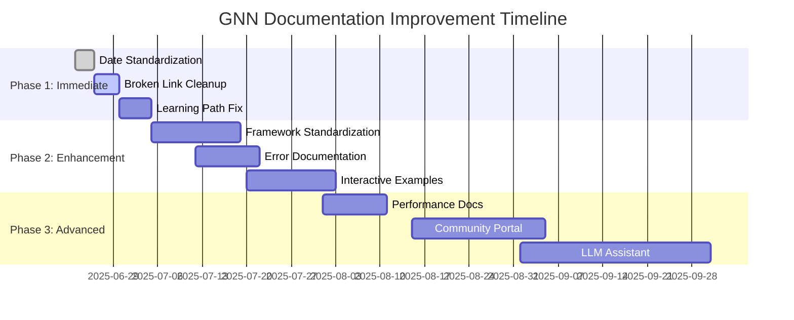

# GNN Documentation Improvement Roadmap

> **📋 Document Metadata**  
> **Type**: Strategy Document | **Audience**: Documentation Team | **Complexity**: Planning  
> **Last Updated**: June 2025 | **Status**: Active Development  
> **Cross-References**: [Style Guide](style_guide.md) | [Contributing](../CONTRIBUTING.md)

## Executive Summary

Based on comprehensive documentation assessment (June 2025), the GNN project demonstrates **gold standard documentation practices** with 65+ documents, 1.2MB+ content, and sophisticated cross-reference systems. However, strategic improvements in consistency, user experience, and technical depth will enhance accessibility and usability.

## Assessment Results

### ✅ **Strengths**
- **Comprehensive Coverage**: 14-step pipeline fully documented
- **Framework Integration**: Excellent PyMDP, good RxInfer coverage  
- **Template System**: 4 production-ready templates (49KB)
- **API Documentation**: 457 functions with examples
- **Cross-Reference Network**: 1200+ internal links

### 🎯 **Strategic Opportunities**
- **Learning Path Optimization**: Streamline user onboarding
- **Framework Consistency**: Standardize integration depth
- **Error Handling Enhancement**: Expand troubleshooting coverage
- **Date Standardization**: Implement unified versioning

---

## Phase 1: Immediate Fixes (1-2 weeks)

### 1.1 Date and Version Standardization ✅ STARTED
**Priority**: Critical | **Effort**: Low | **Impact**: High

**Actions Completed**:
- ✅ Removed references to non-existent DOCUMENTATION_STATUS.md
- ✅ Updated doc/README.md metadata to June 2025
- ✅ Updated doc/CROSS_REFERENCE_INDEX.md to June 2025
- ✅ Fixed broken cross-references in templates/README.md

**Remaining Actions**:
```bash
# Standardize all document dates
find doc/ -name "*.md" -exec grep -l "Last Updated" {} \; | while read file; do
    sed -i 's/Last Updated.*$/Last Updated: June 2025/' "$file"
done

# Add consistent metadata blocks where missing
# Priority files: pipeline/README.md, troubleshooting/*.md, cognitive_phenomena/*.md
```

### 1.2 Broken Link Cleanup
**Priority**: High | **Effort**: Medium | **Impact**: High

**Detection Script**:
```bash
# Find broken internal links
grep -r "DOCUMENTATION_STATUS\|DOCUMENTATION_MAINTENANCE_PLAN" doc/ --include="*.md"

# Find missing cross-references  
python scripts/validate_cross_references.py
```

**Targets**:
- Remove all references to deleted documentation files
- Fix circular or dead-end reference chains
- Standardize cross-reference formatting

### 1.3 Learning Path Disambiguation  
**Priority**: High | **Effort**: Medium | **Impact**: High

**Current Issue**: 5 different entry points cause user confusion

**Solution**: Create clear navigation hierarchy
```markdown
# Main README.md - Update to single entry point
Quick Start → Choose Your Path:
├── "Try GNN Now" → doc/quickstart.md (10 min)
├── "Learn GNN" → doc/gnn/about_gnn.md (concepts)  
└── "Browse Docs" → doc/README.md (comprehensive)
```

---

## Phase 2: User Experience Enhancement (2-4 weeks)

### 2.1 Framework Integration Standardization
**Priority**: High | **Effort**: High | **Impact**: High

**Standardization Template**:
```markdown
# Each framework guide should include:
1. Overview & Concepts (What/Why)
2. Installation & Setup (How to install)
3. Basic Example (Hello World)
4. GNN Translation Process (Mapping)
5. Advanced Examples (Real-world usage)
6. Troubleshooting (Common issues)
7. API Reference (Technical details)
```

**Specific Improvements Needed**:

#### DisCoPy Integration (doc/discopy/gnn_discopy.md)
- **Add**: Step-by-step workflow examples
- **Add**: Practical categorical modeling tutorial
- **Add**: JAX backend usage examples
- **Expand**: From 3.5KB to target 15KB

#### DSPy Integration (doc/dspy/gnn_dspy.md)  
- **Add**: GNN pipeline integration examples
- **Add**: Prompt programming with GNN models
- **Add**: LLM-enhanced model generation
- **Expand**: From basic overview to comprehensive guide

#### PoE-World Integration (doc/poe-world/poe-world_gnn.md)
- **Add**: Implementation examples beyond theory
- **Add**: Step-by-step integration tutorial
- **Add**: Performance benchmarking examples

### 2.2 Error Handling & Debugging Enhancement
**Priority**: Medium | **Effort**: Medium | **Impact**: High

**Current Gap**: Limited systematic error handling guidance

**Proposed Structure**:
```markdown
doc/troubleshooting/
├── error_taxonomy.md          # NEW: Systematic error classification
├── debugging_workflows.md     # NEW: Step-by-step debugging
├── performance_debugging.md   # NEW: Performance troubleshooting  
├── common_errors.md          # ENHANCE: Expand with more examples
└── api_error_reference.md    # NEW: API error scenarios
```

**Error Taxonomy Categories**:
1. **Syntax Errors**: GNN file parsing issues
2. **Validation Errors**: Type checking failures  
3. **Runtime Errors**: Pipeline execution issues
4. **Integration Errors**: Framework-specific problems
5. **Performance Issues**: Resource and timing problems

### 2.3 Interactive Examples System
**Priority**: Medium | **Effort**: High | **Impact**: Medium

**Vision**: Transform static examples into interactive learning

**Components**:
```markdown
doc/interactive/
├── guided_tutorials/          # Step-by-step interactive guides
├── example_browser/          # Searchable example database
├── model_builder/            # Template-based model creation
└── validation_playground/    # Real-time syntax checking
```

---

## Phase 3: Advanced Features (1-2 months)

### 3.1 Intelligent Documentation Assistant
**Priority**: Low | **Effort**: High | **Impact**: Medium

**Concept**: LLM-powered documentation assistant

**Features**:
- Context-aware help based on user location in docs
- Automated example generation for new concepts
- Real-time cross-reference suggestions
- Consistency checking across documents

### 3.2 Performance Documentation
**Priority**: Medium | **Effort**: Medium | **Impact**: Medium

**Current Gap**: Limited performance guidance

**Proposed Additions**:
```markdown
doc/performance/
├── benchmarking_guide.md     # Performance measurement
├── optimization_patterns.md  # Best practices  
├── resource_planning.md      # Capacity planning
└── scaling_strategies.md     # Large model handling
```

### 3.3 Community Contribution Portal
**Priority**: Low | **Effort**: High | **Impact**: Low

**Vision**: Streamlined community contribution workflow

**Features**:
- Documentation contribution templates
- Automated quality checking
- Community review workflow
- Recognition and attribution system

---

## Success Metrics

### Quantitative Metrics
```yaml
documentation_quality:
  broken_links: "< 5 total"
  date_consistency: "100% standardized" 
  cross_reference_coverage: "> 95%"
  framework_coverage_equality: "± 20% between frameworks"

user_experience:
  new_user_completion_rate: "> 80% complete quickstart"
  documentation_feedback_score: "> 4.5/5"
  support_ticket_reduction: "30% fewer doc-related issues"

technical_completeness:
  error_scenario_coverage: "> 90% common errors documented"
  api_documentation_coverage: "100% public APIs"
  example_code_execution_success: "> 95% examples work"
```

### Qualitative Metrics
- **User Feedback**: Regular surveys on documentation usefulness
- **Community Adoption**: Increased external contributions
- **Framework Maintainer Satisfaction**: Feedback from PyMDP, RxInfer teams

---

## Implementation Strategy

### Team Responsibilities
```yaml
documentation_lead:
  - Overall roadmap coordination
  - Quality assurance oversight
  - Cross-reference validation

technical_writers:
  - Framework integration standardization
  - Error handling documentation
  - Interactive example creation

framework_experts:
  - Domain-specific technical review
  - Example validation and testing
  - Integration troubleshooting

community_coordinators:
  - User feedback collection
  - Contribution workflow management
  - Recognition program administration
```

### Timeline


---

## Risk Assessment & Mitigation

### High Risk: Framework Expert Availability
**Risk**: Limited availability of framework experts for detailed reviews
**Mitigation**: 
- Prioritize PyMDP (strongest current coverage)
- Engage framework communities early
- Create review bounty program

### Medium Risk: Community Adoption Resistance  
**Risk**: Users resistant to documentation changes
**Mitigation**:
- Gradual rollout with feedback cycles
- Maintain backward compatibility
- Clear migration guides

### Low Risk: Tool Integration Complexity
**Risk**: Interactive features may complicate maintenance
**Mitigation**:
- Start with static improvements
- Incremental interactive feature addition
- Robust fallback to static documentation

---

## Long-term Vision (6+ months)

### Documentation as a Platform
Transform GNN documentation from static content to an **intelligent learning platform**:

1. **Adaptive Learning Paths**: AI-powered personalization based on user background
2. **Real-time Validation**: Live syntax checking and example testing
3. **Community Knowledge Base**: User-contributed examples and solutions  
4. **Cross-Framework Intelligence**: Automated translation examples between frameworks
5. **Research Integration**: Seamless connection to latest Active Inference research

### Ecosystem Integration
- **IDE Integration**: Direct documentation access from development environments
- **Framework Embedding**: Documentation snippets in PyMDP, RxInfer error messages
- **Academic Integration**: Direct links from research papers to implementation guides

---

**Next Steps**: Begin Phase 1 implementation with date standardization and broken link cleanup, targeting completion by July 2025.

**Review Schedule**: Monthly progress reviews with quarterly comprehensive assessments.

**Contact**: GNN Documentation Team | **Last Updated**: June 23, 2025 