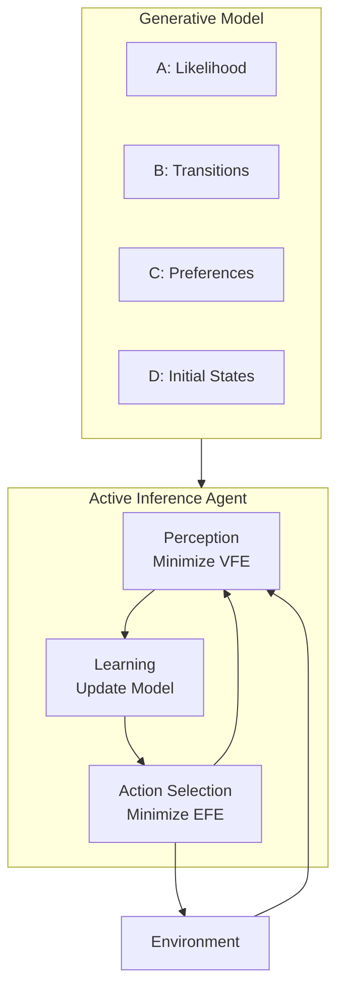

# Active Inference and Free Energy Principle

> **📋 Document Metadata**  
> **Type**: Comprehensive Reference | **Audience**: Researchers, Developers | **Complexity**: Beginner to Advanced  
> **Cross-References**: [GNN Documentation](../gnn/README.md) | [PyMDP](../pymdp/README.md) | [RxInfer](../rxinfer/README.md) | [ActiveInference.jl](../activeinference_jl/README.md)

## Overview

This directory contains comprehensive documentation on **Active Inference** and the **Free Energy Principle (FEP)** as implemented within the GNN (Generalized Notation Notation) framework. It serves as a central hub for theoretical foundations, computational methods, and implementation references.

**Status**: ✅ Production Ready  
**Version**: 1.0  
**Last Updated**: January 2026

---

## What is Active Inference?

Active Inference is a unified theory of brain function derived from the **Free Energy Principle**. It proposes that all adaptive systems—biological or artificial—minimize a quantity called **variational free energy** to maintain their existence and achieve goals.

### Core Concepts

| Concept | Description | Documentation |
|---------|-------------|---------------|
| **Free Energy Principle** | Systems resist disorder by minimizing free energy | [fep_foundations.md](fep_foundations.md) |
| **Variational Free Energy** | Upper bound on surprise; drives perception | [variational_inference.md](variational_inference.md) |
| **Expected Free Energy** | Guides action selection; balances exploration/exploitation | [expected_free_energy.md](expected_free_energy.md) |
| **Generative Models** | Internal world models specified by A, B, C, D matrices | [generative_models.md](generative_models.md) |

---

## Quick Navigation

### Theory & Foundations

| Document | Description |
|----------|-------------|
| **[fep_foundations.md](fep_foundations.md)** | Free Energy Principle theoretical foundations |
| **[active_inference_theory.md](active_inference_theory.md)** | Core Active Inference theory |
| **[variational_inference.md](variational_inference.md)** | VFE and Bayesian inference |
| **[expected_free_energy.md](expected_free_energy.md)** | EFE and policy selection |
| **[generative_models.md](generative_models.md)** | A, B, C, D matrices and model specification |
| **[pomdp_foundations.md](pomdp_foundations.md)** | POMDP formalism for Active Inference |

### Implementation References

| Document | Description |
|----------|-------------|
| **[implementation_pymdp.md](implementation_pymdp.md)** | PyMDP Python implementation |
| **[implementation_rxinfer.md](implementation_rxinfer.md)** | RxInfer.jl message passing |
| **[implementation_activeinference_jl.md](implementation_activeinference_jl.md)** | ActiveInference.jl framework |
| **[computational_patterns.md](computational_patterns.md)** | Common algorithmic patterns |

### Integration & Applications

| Document | Description |
|----------|-------------|
| **[gnn_integration.md](gnn_integration.md)** | GNN syntax for Active Inference |
| **[applications_examples.md](applications_examples.md)** | Use cases and examples |
| **[glossary.md](glossary.md)** | Terminology reference |

---

## Learning Paths

### 🟢 Beginner Path
1. Start with this README
2. Read [fep_foundations.md](fep_foundations.md) for theoretical background
3. Explore [active_inference_theory.md](active_inference_theory.md)
4. Review the [glossary.md](glossary.md)

### 🟡 Intermediate Path
1. Complete beginner path
2. Study [variational_inference.md](variational_inference.md)
3. Master [expected_free_energy.md](expected_free_energy.md)
4. Explore [generative_models.md](generative_models.md)

### 🔴 Advanced Path
1. Complete intermediate path
2. Dive into implementation guides
3. Study [computational_patterns.md](computational_patterns.md)
4. Explore [gnn_integration.md](gnn_integration.md)

---

## Mathematical Foundation

Active Inference is built on rigorous mathematical foundations:

### Variational Free Energy (VFE)

$$F = \underbrace{D_{KL}(Q(s) \| P(s))}_{\text{Complexity}} + \underbrace{\mathbb{E}_{Q(s)}[-\ln P(o|s)]}_{\text{Inaccuracy}}$$

**Minimizing F** leads to:
- Accurate perception (beliefs match reality)
- Efficient representations (Occam's razor)

### Expected Free Energy (EFE)

$$G(\pi) = \underbrace{-\mathbb{E}[D_{KL}(Q(o|s,\pi) \| P(o))]}_{\text{Pragmatic Value}} + \underbrace{\mathbb{E}[H(Q(s|o,\pi))]}_{\text{Epistemic Value}}$$

**Minimizing G** leads to:
- Goal-directed behavior (pragmatic)
- Curiosity and exploration (epistemic)

---

## Source Code Integration

This documentation connects to the GNN source code:

### Execution Engines

| Engine | Path | Language |
|--------|------|----------|
| PyMDP | [`src/execute/pymdp/`](../../src/execute/pymdp/) | Python |
| RxInfer | [`src/execute/rxinfer/`](../../src/execute/rxinfer/) | Julia |
| ActiveInference.jl | [`src/execute/activeinference_jl/`](../../src/execute/activeinference_jl/) | Julia |

### Analysis Tools

| Tool | Path | Purpose |
|------|------|---------|
| PyMDP Analyzer | [`src/analysis/pymdp/analyzer.py`](../../src/analysis/pymdp/analyzer.py) | Post-simulation analysis |
| PyMDP Visualizer | [`src/analysis/pymdp/visualizer.py`](../../src/analysis/pymdp/visualizer.py) | Visualization |
| Post-Simulation | [`src/analysis/post_simulation.py`](../../src/analysis/post_simulation.py) | Comprehensive analysis |

### GNN Core

| Component | Path |
|-----------|------|
| GNN Parser | [`src/gnn/`](../../src/gnn/) |
| Type Checker | [`src/type_checker/`](../../src/type_checker/) |
| Validation | [`src/validation/`](../../src/validation/) |

---

## Related Documentation

### Within GNN Project

| Resource | Description |
|----------|-------------|
| **[GNN Overview](../gnn/gnn_overview.md)** | Core GNN concepts |
| **[GNN-LLM Neurosymbolic](../gnn/gnn_llm_neurosymbolic_active_inference.md)** | LLM integration with Active Inference |
| **[PyMDP Documentation](../pymdp/README.md)** | PyMDP integration guide |
| **[RxInfer Documentation](../rxinfer/README.md)** | RxInfer.jl documentation |
| **[POMDP Documentation](../pomdp/README.md)** | POMDP theoretical foundations |
| **[DSPy Documentation](../dspy/README.md)** | LLM programming for Active Inference |

### Pipeline Integration

This documentation integrates with the 25-step GNN processing pipeline:

| Step | Relevance |
|------|-----------|
| **Step 12: Execute** | Active Inference model execution |
| **Step 13: LLM** | LLM-enhanced analysis |
| **Step 16: Analysis** | Post-simulation analysis |

See [Pipeline Documentation](../gnn/gnn_tools.md) for details.

---

## Quick Reference: The Active Inference Loop



---

## File Structure

```
doc/active_inference/
├── README.md                             # This overview
├── AGENTS.md                             # Technical scaffolding
│
├── Theory & Foundations
│   ├── fep_foundations.md                # FEP theory
│   ├── active_inference_theory.md        # Core theory
│   ├── variational_inference.md          # VFE
│   ├── expected_free_energy.md           # EFE
│   ├── generative_models.md              # Model specification
│   └── pomdp_foundations.md              # POMDP
│
├── Implementation References
│   ├── implementation_pymdp.md           # PyMDP
│   ├── implementation_rxinfer.md         # RxInfer.jl
│   ├── implementation_activeinference_jl.md # ActiveInference.jl
│   └── computational_patterns.md         # Patterns
│
└── Integration & Applications
    ├── gnn_integration.md                # GNN
    ├── applications_examples.md          # Examples
    └── glossary.md                       # Terminology
```

**Total Files**: 15

---

## See Also

- **[Main Documentation Index](../README.md)**: Return to main documentation
- **[Cross-Reference Index](../CROSS_REFERENCE_INDEX.md)**: Complete cross-reference
- **[Pipeline Documentation](../gnn/gnn_tools.md)**: 25-step pipeline

---

**Status**: ✅ Production Ready  
**Compliance**: GNN documentation standards  
**Maintenance**: Regular updates with new research and implementations
