# Active Inference: Core Theory

> **📋 Document Metadata**  
> **Type**: Theoretical Reference | **Audience**: Researchers, Developers | **Complexity**: Intermediate  
> **Cross-References**: [FEP Foundations](fep_foundations.md) | [Expected Free Energy](expected_free_energy.md) | [Generative Models](generative_models.md)

## Overview

**Active Inference** is a process theory derived from the Free Energy Principle that explains how agents perceive, learn, and act in the world. This document covers the core theoretical concepts underlying all Active Inference implementations in GNN.

**Status**: ✅ Production Ready  
**Version**: 1.0

---

## What is Active Inference?

Active Inference proposes that agents:

1. **Maintain a generative model** of how sensory data is caused
2. **Minimize variational free energy** through perception (updating beliefs)
3. **Minimize expected free energy** through action (changing the world)
4. **Learn by optimizing** the generative model parameters

### Key Insight

> Both perception and action serve the same goal: minimizing free energy.
> - **Perception**: Change beliefs to match the world
> - **Action**: Change the world to match beliefs

---

## The Perception-Action Loop

```mermaid
graph LR
    subgraph Agent
        Q[Beliefs Q(s)]
        GM[Generative Model P(o,s)]
        Policy[Policy π]
    end
    
    subgraph World
        Hidden[Hidden States s]
        Observations[Observations o]
    end
    
    Hidden -->|Generates| Observations
    Observations -->|Perception:<br/>Minimize VFE| Q
    Q -->|Informs| Policy
    Policy -->|Action:<br/>Minimize EFE| Hidden
    GM -.->|Specifies| Q
    GM -.->|Specifies| Policy
    
    classDef agent fill:#e6ffe6,stroke:#339933;
    classDef world fill:#ffe6e6,stroke:#993333;
    class Q,GM,Policy agent;
    class Hidden,Observations world;
```

### Continuous Cycle

1. **Observe**: Receive sensory observations $o_t$
2. **Infer**: Update beliefs $Q(s_t)$ to minimize VFE
3. **Plan**: Evaluate policies by their expected free energy
4. **Act**: Execute action from best policy
5. **Learn**: Update model parameters based on prediction errors
6. **Repeat**

---

## Perception: State Inference

Perception is the process of inferring hidden states from observations.

### Mathematical Formulation

Given observations $o$ and model $m$, find beliefs $Q(s)$ that minimize:

$$F = D_{KL}(Q(s) \| P(s|m)) - \mathbb{E}_{Q(s)}[\ln P(o|s,m)]$$

### Optimal Solution

$$Q^*(s) = P(s|o,m) = \frac{P(o|s,m)P(s|m)}{P(o|m)}$$

In practice, we use variational approximations or message passing.

### Discrete State Spaces

For discrete states with likelihood matrix **A** and prior **D**:

$$Q(s) \propto A(:,o) \odot D$$

Where:
- $A(:,o)$ = column of A corresponding to observation o
- $\odot$ = element-wise multiplication
- Result is normalized to sum to 1

### Temporal Inference

Over time, beliefs are updated using:

$$Q(s_t) \propto A(:,o_t) \odot \sum_{s_{t-1}} B(:,s_{t-1},a_{t-1}) \cdot Q(s_{t-1})$$

---

## Action: Policy Selection

Action selection is cast as inference over policies.

### Expected Free Energy (EFE)

Policies are evaluated by their expected free energy:

$$G(\pi) = \sum_{\tau} G(\pi, \tau)$$

Where $\tau$ indexes future time steps.

### Policy Prior

The probability of selecting policy $\pi$ is:

$$P(\pi) = \sigma(-\gamma \cdot G(\pi))$$

Where:
- $\sigma$ = softmax function
- $\gamma$ = precision (inverse temperature)
- Lower $G(\pi)$ → higher probability

### Action Selection

The selected action is sampled from:

$$a \sim P(\pi) \cdot P(a|\pi)$$

Or deterministically: choose action from policy with lowest EFE.

**See also**: [Expected Free Energy](expected_free_energy.md) for detailed EFE computation.

---

## Learning: Model Optimization

Learning optimizes the generative model parameters.

### What is Learned

| Parameter | Description | Update Rule |
|-----------|-------------|-------------|
| **A** (Likelihood) | Observation model | Dirichlet accumulation |
| **B** (Transition) | State dynamics | Dirichlet accumulation |
| **C** (Preferences) | Goal states | External specification |
| **D** (Prior) | Initial beliefs | Dirichlet accumulation |

### Dirichlet Concentration Updates

For likelihood matrix A:

$$a_{ij}^{new} = a_{ij}^{old} + Q(s=i) \cdot \mathbb{I}(o=j)$$

Where:
- $a_{ij}$ = concentration parameter for state i, observation j
- $Q(s=i)$ = posterior probability of state i
- $\mathbb{I}(o=j)$ = indicator that observation j occurred

The A matrix is then:

$$A_{ij} = \frac{a_{ij}}{\sum_j a_{ij}}$$

### Precision Learning

Precision $\gamma$ can also be learned:

$$\gamma^{new} = \gamma^{old} + \eta \cdot (G(\pi^*) - \mathbb{E}[G])$$

---

## Comparison with Other Frameworks

### Active Inference vs. Reinforcement Learning

| Aspect | Active Inference | Reinforcement Learning |
|--------|------------------|----------------------|
| **Objective** | Minimize free energy | Maximize reward |
| **Exploration** | Emergent (epistemic) | Designed (ε-greedy, etc.) |
| **Model** | Required (generative) | Optional (model-free) |
| **Perception** | Integrated | Separate |
| **Goals** | Preferences over observations | Reward function |

### Active Inference vs. Optimal Control

| Aspect | Active Inference | Optimal Control |
|--------|------------------|-----------------|
| **Uncertainty** | First-class citizen | Often added post-hoc |
| **Inference** | Beliefs over states | Point estimates |
| **Objective** | Free energy | Cost function |
| **Learning** | Integrated | Separate |

### Active Inference vs. Bayesian Filtering

| Aspect | Active Inference | Bayesian Filtering |
|--------|------------------|-------------------|
| **Action** | Integrated | Separate |
| **Goals** | Preferences shape inference | Pure state estimation |
| **Planning** | Via EFE | External planner |

---

## The Discrete POMDP Formulation

Active Inference is commonly implemented as a discrete POMDP.

### Components

```python
# GNN specification structure
model = {
    'A': [[...], [...]],     # Likelihood: P(o|s)
    'B': [[[...]], [[...]]],  # Transitions: P(s'|s,a) per action
    'C': [...],              # Preferences: ln P(o)
    'D': [...],              # Prior: P(s_0)
    'E': [...],              # Habits: P(π)
    'T': 10,                 # Time horizon
}
```

### Algorithm Outline

```
for t = 1 to T:
    # Perception
    o_t = observe()
    Q(s_t) = update_beliefs(Q(s_{t-1}), o_t, A, B)
    
    # Policy Selection
    for each policy π:
        G(π) = compute_efe(π, Q, A, B, C)
    P(π) = softmax(-γ * G)
    π* = sample(P(π))
    
    # Action
    a_t = π*[current_step]
    execute(a_t)
    
    # Learning
    update_parameters(A, B, D, Q, o_t, a_t)
```

**See also**: [POMDP Foundations](pomdp_foundations.md) for POMDP details.

---

## Hierarchical Active Inference

Active Inference naturally extends to hierarchies:

```mermaid
graph TB
    subgraph Level2[Higher Level: Slower Dynamics]
        S2[States s²]
        P2[Policies π²]
    end
    
    subgraph Level1[Lower Level: Faster Dynamics]
        S1[States s¹]
        P1[Policies π¹]
    end
    
    subgraph Level0[Sensorimotor]
        O[Observations o]
        A[Actions a]
    end
    
    S2 -->|Context| S1
    P2 -->|Goals| P1
    S1 -->|Predictions| O
    P1 -->|Commands| A
    O -->|Prediction Errors| S1
    S1 -->|Prediction Errors| S2
```



### Benefits of Hierarchy

1. **Temporal Abstraction**: Different timescales at each level
2. **Goal Decomposition**: High-level goals → sub-goals → actions
3. **Efficient Inference**: Local updates propagate globally
4. **Compositional**: Modules can be reused

---

## Source Code Implementation

### Execution Engines

| Engine | Source | Language |
|--------|--------|----------|
| PyMDP | [`src/execute/pymdp/`](../../src/execute/pymdp/) | Python |
| RxInfer | [`src/execute/rxinfer/`](../../src/execute/rxinfer/) | Julia |
| ActiveInference.jl | [`src/execute/activeinference_jl/`](../../src/execute/activeinference_jl/) | Julia |

### Analysis Tools

| Tool | Source |
|------|--------|
| Analyzer | [`src/analysis/analyzer.py`](../../src/analysis/analyzer.py) |
| Post-Simulation | [`src/analysis/post_simulation.py`](../../src/analysis/post_simulation.py) |

### GNN Specification

| Component | Source |
|-----------|--------|
| Parser | [`src/gnn/`](../../src/gnn/) |
| Examples | [`examples/`](../../examples/) |

---

## Related Documentation

### Theory
- **[FEP Foundations](fep_foundations.md)**: Underlying principle
- **[Variational Inference](variational_inference.md)**: VFE details
- **[Expected Free Energy](expected_free_energy.md)**: EFE and planning
- **[Generative Models](generative_models.md)**: Model specification

### Implementation
- **[PyMDP Implementation](implementation_pymdp.md)**: Python guide
- **[RxInfer Implementation](implementation_rxinfer.md)**: Julia guide
- **[Computational Patterns](computational_patterns.md)**: Common patterns

### GNN
- **[GNN Integration](gnn_integration.md)**: Specification syntax
- **[Applications](applications_examples.md)**: Use cases

---

## Key Equations Summary

| Process | Equation |
|---------|----------|
| **Free Energy** | $F = D_{KL}(Q(s) \| P(s)) + \mathbb{E}_Q[-\ln P(o|s)]$ |
| **Perception** | $Q(s) \propto P(o|s)P(s)$ |
| **Policy Prior** | $P(\pi) = \sigma(-\gamma G(\pi))$ |
| **EFE** | $G(\pi) = \mathbb{E}[D_{KL} + H]$ |
| **Learning** | $a_{ij} \leftarrow a_{ij} + Q(s_i)\mathbb{I}(o_j)$ |

---

**Status**: ✅ Production Ready  
**Compliance**: GNN documentation standards  
**Maintenance**: Regular updates with new developments
