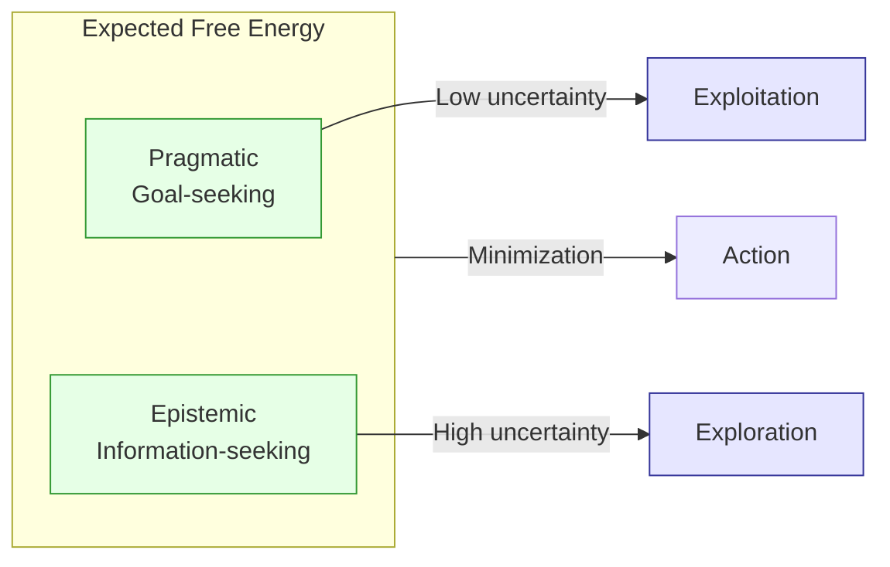

# Expected Free Energy: Policy Selection and Exploration

> **📋 Document Metadata**  
> **Type**: Technical Reference | **Audience**: Researchers, Developers | **Complexity**: Advanced  
> **Cross-References**: [Active Inference Theory](active_inference_theory.md) | [Variational Inference](variational_inference.md) | [Computational Patterns](computational_patterns.md)

## Overview

**Expected Free Energy (EFE)** is the quantity that guides action selection in Active Inference. It provides a principled way to balance goal-seeking behavior (exploitation) with information-gathering behavior (exploration). This document details the mathematical foundations and computational implementation of EFE.

**Status**: ✅ Production Ready  
**Version**: 1.0

---

## Core Concept

Expected Free Energy answers: *"Which policy should I follow to minimize future surprise?"*

### Intuition

Policies are evaluated on two criteria:
1. **Pragmatic Value**: Will this policy get me to preferred states?
2. **Epistemic Value**: Will this policy reduce my uncertainty?

Good policies achieve both—reaching goals while gathering useful information.

---

## Mathematical Definition

### Full Form

$$G(\pi) = \sum_{\tau=t}^{T} \mathbb{E}_{Q(o_\tau, s_\tau | \pi)} \left[ \ln Q(s_\tau | \pi) - \ln P(o_\tau, s_\tau | \pi) \right]$$

Where:
- $\pi$ = policy (sequence of actions)
- $\tau$ = future time index
- $Q(o_\tau, s_\tau | \pi)$ = predicted joint distribution under policy

### Decomposition

EFE can be decomposed into two interpretable components:

$$G(\pi) = \underbrace{-\mathbb{E}_{Q(s_\tau|\pi)}[D_{KL}(Q(o_\tau|s_\tau) \| P(o_\tau))]}_{\text{Pragmatic Value (negative)}} + \underbrace{\mathbb{E}_{Q(o_\tau|\pi)}[H(Q(s_\tau|o_\tau, \pi))]}_{\text{Epistemic Value (negative)}}$$

### Alternative Formulation

Often written as:

$$G(\pi) = \sum_\tau G(\pi, \tau)$$

$$G(\pi, \tau) = \underbrace{\mathbb{E}_{Q(o_\tau|\pi)}[D_{KL}(Q(s_\tau|o_\tau, \pi) \| Q(s_\tau|\pi))]}_{\text{Information Gain (epistemic)}} + \underbrace{D_{KL}(Q(o_\tau|\pi) \| P(o_\tau))}_{\text{Risk (pragmatic)}}$$

---

## Pragmatic Value

### Definition

Pragmatic value measures how well predicted observations match preferences:

$$\text{Pragmatic} = -D_{KL}(Q(o_\tau|\pi) \| P(o_\tau)) = -\mathbb{E}_{Q(o_\tau|\pi)}[\ln Q(o_\tau|\pi) - \ln P(o_\tau)]$$

### Interpretation

- **High pragmatic value** → Policy leads to preferred observations
- **Low pragmatic value** → Policy leads to unpreferred observations

### In GNN

The preference distribution $P(o)$ is specified by the **C matrix**:

$$\ln P(o) = C$$

So pragmatic value becomes:

$$\text{Pragmatic} = \mathbb{E}_{Q(o|\pi)}[C]$$

High C values for desired observations drive goal-seeking behavior.

---

## Epistemic Value

### Definition

Epistemic value measures expected information gain about hidden states:

$$\text{Epistemic} = \mathbb{E}_{Q(o_\tau|\pi)}[D_{KL}(Q(s_\tau|o_\tau, \pi) \| Q(s_\tau|\pi))]$$

$$= I(s_\tau; o_\tau | \pi)$$

This is the **mutual information** between future states and observations.

### Interpretation

- **High epistemic value** → Policy resolves uncertainty
- **Low epistemic value** → Policy provides little new information

### Computational Form

For discrete states:

$$\text{Epistemic} = H(Q(s_\tau|\pi)) - \mathbb{E}_{Q(o_\tau|\pi)}[H(Q(s_\tau|o_\tau, \pi))]$$

Where $H$ is Shannon entropy.

---

## Computing EFE in Practice

### Algorithm

```python
def compute_efe(policy, Q_s, A, B, C, T):
    """Compute Expected Free Energy for a policy.
    
    Args:
        policy: Sequence of actions
        Q_s: Current belief over states
        A: Likelihood matrix P(o|s)
        B: Transition matrices P(s'|s,a) per action
        C: Log preferences ln P(o)
        T: Time horizon
    
    Returns:
        G: Expected Free Energy (scalar)
    """
    G = 0.0
    Q_current = Q_s
    
    for t, action in enumerate(policy):
        # Predict next state
        B_a = B[action]  # Transition matrix for this action
        Q_next = B_a @ Q_current  # P(s_t+1|s_t, a)
        
        # Predict observations
        Q_o = A @ Q_next  # P(o|π)
        
        # Pragmatic term: -E[C]
        pragmatic = -np.dot(Q_o, C)
        
        # Epistemic term: Expected state entropy after observation
        # H(s|o) averaged over o
        epistemic = 0.0
        for o in range(len(Q_o)):
            if Q_o[o] > 1e-10:
                # Posterior over states given this observation
                Q_s_given_o = A[o, :] * Q_next
                Q_s_given_o = Q_s_given_o / (Q_s_given_o.sum() + 1e-10)
                
                # Entropy of this posterior
                H_s_o = -np.sum(Q_s_given_o * np.log(Q_s_given_o + 1e-10))
                epistemic += Q_o[o] * H_s_o
        
        G += pragmatic + epistemic
        Q_current = Q_next
    
    return G
```

### Efficiency Considerations

For large state/action spaces:
- **Pruning**: Only evaluate promising policies
- **Sampling**: Monte Carlo estimation of expectations
- **Amortization**: Learn a policy network

---

## Policy Selection

### Softmax Selection

Policies are selected according to:

$$P(\pi) = \sigma(-\gamma \cdot G(\pi)) = \frac{\exp(-\gamma G(\pi))}{\sum_{\pi'} \exp(-\gamma G(\pi'))}$$

Where:
- $\gamma$ = **precision** (inverse temperature)
- Higher $\gamma$ → more deterministic selection (exploit)
- Lower $\gamma$ → more stochastic selection (explore)

### Precision

Precision $\gamma$ controls the exploration-exploitation trade-off:

| $\gamma$ | Behavior |
|----------|----------|
| $\gamma \to 0$ | Random policy selection |
| $\gamma = 1$ | Standard softmax |
| $\gamma \to \infty$ | Greedy (always best policy) |

### Action Selection

Given selected policy $\pi^*$, the action is:

$$a_t = \pi^*[t]$$

Or marginalized over policies:

$$P(a_t) = \sum_\pi P(\pi) \cdot \mathbb{I}(\pi[t] = a_t)$$

---

## Exploration-Exploitation Balance

### Natural Emergence

Unlike RL approaches that add exploration (ε-greedy, UCB, etc.), Active Inference naturally balances:



### Information-Seeking Behavior

When uncertain, the agent naturally seeks information because:
- High uncertainty → High (negative) epistemic value
- Information-gathering actions → Lower EFE
- Agent prefers informative actions

### Goal-Directed Behavior

When certain about the world:
- Low epistemic value (beliefs already confident)
- Pragmatic value dominates
- Agent seeks preferred observations

---

## Advanced Topics

### Temporal Discounting

Future EFE contributions can be discounted:

$$G(\pi) = \sum_\tau \gamma_\tau \cdot G(\pi, \tau)$$

Where $\gamma_\tau$ decreases for distant futures.

### Hierarchical EFE

In hierarchical models, EFE is computed at each level:

$$G^{(l)}(\pi^{(l)}) = \text{EFE at level } l$$

Higher levels set context for lower levels.

### Risk-Sensitive Variants

The pragmatic term can be modified for risk sensitivity:

$$\text{Pragmatic}_{\text{risk}} = \mathbb{E}[C] + \beta \cdot \text{Var}[C]$$

Where $\beta$ controls risk aversion.

### Ambiguity Bonus

Explicit ambiguity can be added:

$$G(\pi) = \text{Pragmatic} + \text{Epistemic} - \alpha \cdot \text{Ambiguity}$$

Where ambiguity measures uncertainty in the A matrix.

---

## Source Code References

### PyMDP Implementation

```python
# In src/execute/pymdp/
from pymdp import control

# Compute EFE for all policies
G = control.expected_free_energy(A, B, C, qs_current, policies)

# Select policy
Q_pi = control.softmax(-G * gamma)
action = control.sample_action(Q_pi, policies)
```

**Source**: [`src/execute/pymdp/`](../../src/execute/pymdp/)

### RxInfer Implementation

```julia
# In src/execute/rxinfer/
# EFE is computed via message passing on factor graph

@model function active_inference_model(...)
    # EFE emerges from inference on policy node
    π ~ Categorical(softmax(-γ * G))
end
```

**Source**: [`src/execute/rxinfer/`](../../src/execute/rxinfer/)

### Analysis

**Source**: [`src/analysis/`](../../src/analysis/)

---

## Related Documentation

- **[Active Inference Theory](active_inference_theory.md)**: Core theory
- **[Variational Inference](variational_inference.md)**: VFE details
- **[Generative Models](generative_models.md)**: Model specification
- **[Computational Patterns](computational_patterns.md)**: Implementation patterns
- **[PyMDP Implementation](implementation_pymdp.md)**: Python reference

---

## Key Equations Summary

| Component | Equation |
|-----------|----------|
| **Total EFE** | $G(\pi) = \sum_\tau G(\pi, \tau)$ |
| **Pragmatic** | $-D_{KL}(Q(o|\pi) \| P(o)) \approx \mathbb{E}_{Q(o)}[C]$ |
| **Epistemic** | $I(s; o | \pi) = H(s|\pi) - H(s|o,\pi)$ |
| **Policy Prior** | $P(\pi) = \sigma(-\gamma G(\pi))$ |

---

**Status**: ✅ Production Ready  
**Compliance**: GNN documentation standards  
**Maintenance**: Regular updates with new EFE variants
