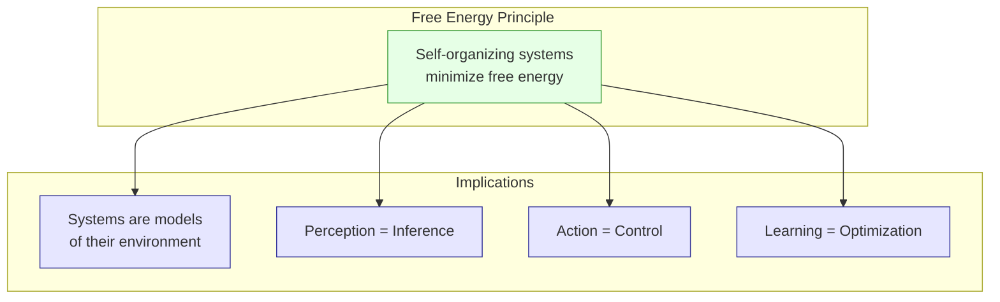
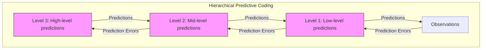

# Free Energy Principle: Theoretical Foundations

> **📋 Document Metadata**  
> **Type**: Theoretical Reference | **Audience**: Researchers, Advanced Developers | **Complexity**: Advanced  
> **Cross-References**: [Active Inference Theory](active_inference_theory.md) | [Variational Inference](variational_inference.md) | [Glossary](glossary.md)

## Overview

The **Free Energy Principle (FEP)** is a unifying theory proposing that all self-organizing systems—from cells to brains to social systems—resist the natural tendency towards disorder by minimizing a quantity called **variational free energy**. This document provides the theoretical foundations necessary for understanding Active Inference implementations in GNN.

**Status**: ✅ Production Ready  
**Version**: 1.0

---

## Historical Context

### Origins

The Free Energy Principle was developed primarily by **Karl Friston** at University College London, building on:

- **Helmholtz's Unconscious Inference** (1867): Perception as hypothesis testing
- **Bayesian Brain Hypothesis**: The brain as a Bayesian inference machine
- **Predictive Coding** (Rao & Ballard, 1999): Hierarchical prediction error minimization
- **Thermodynamics**: Connections to statistical mechanics and entropy

### Key Publications

1. **Friston (2006)**: "A Free Energy Principle for Biological Systems"
2. **Friston (2009)**: "The Free-Energy Principle: A Rough Guide to the Brain"
3. **Friston (2010)**: "The Free-Energy Principle: A Unified Brain Theory?"

---

## The Core Principle

### Statement

> Any self-organizing system that is at equilibrium with its environment must minimize its variational free energy.

This seemingly simple statement has profound implications:

1. **Systems have models**: To minimize free energy, systems must embody a generative model of their environment
2. **Perception is inference**: Updating beliefs to minimize surprise
3. **Action is control**: Changing the world to match predictions
4. **Learning is model optimization**: Improving the generative model over time

### Why "Free Energy"?

The term comes from physics and information theory:

- In thermodynamics: Free energy measures useful work available from a system
- In information theory: Variational free energy bounds the negative log evidence (surprise)



---

## Mathematical Formulation

### Surprise and Free Energy

The core quantity is **surprise** (or **surprisal**), defined as:

$$\text{Surprise}(o) = -\ln P(o|m)$$

Where:
- $o$ = sensory observations
- $m$ = the generative model
- $P(o|m)$ = model evidence (marginal likelihood)

**Problem**: Computing $P(o|m)$ requires integrating over all hidden states—often intractable.

**Solution**: Use **variational free energy** as a tractable upper bound.

### Variational Free Energy (F)

$$F = \mathbb{E}_{Q(s)}[\ln Q(s) - \ln P(o, s|m)]$$

This can be rewritten in multiple equivalent forms:

#### Form 1: Divergence + Surprise

$$F = \underbrace{D_{KL}(Q(s) \| P(s|o,m))}_{\text{Divergence from true posterior}} + \underbrace{(-\ln P(o|m))}_{\text{Surprise}}$$

Since $D_{KL} \geq 0$, we have $F \geq -\ln P(o|m)$, making F an upper bound on surprise.

#### Form 2: Complexity + Inaccuracy

$$F = \underbrace{D_{KL}(Q(s) \| P(s|m))}_{\text{Complexity}} - \underbrace{\mathbb{E}_{Q(s)}[\ln P(o|s,m)]}_{\text{Accuracy}}$$

This form reveals the trade-off:
- **Complexity**: Cost of updating beliefs from prior
- **Accuracy**: How well beliefs explain observations

#### Form 3: Energy - Entropy

$$F = \underbrace{\mathbb{E}_{Q(s)}[-\ln P(o,s|m)]}_{\text{Energy}} - \underbrace{H(Q(s))}_{\text{Entropy}}$$

This form connects to statistical physics.

### Minimizing Free Energy

Minimizing F with respect to $Q(s)$ yields approximate Bayesian inference:

$$Q^*(s) = \arg\min_Q F = P(s|o,m)$$

When $Q^* = P(s|o,m)$, the divergence term vanishes, and $F = -\ln P(o|m)$.

---

## The Generative Model

### Structure

Active Inference agents maintain a **generative model** that specifies how observations are generated from hidden states:

$$P(o, s|m) = P(o|s,m) \cdot P(s|m)$$

For temporal models:

$$P(o_{1:T}, s_{1:T}|m) = P(s_1|m) \prod_{t=2}^{T} P(s_t|s_{t-1},m) \prod_{t=1}^{T} P(o_t|s_t,m)$$

### GNN Representation

In GNN, the generative model is specified through matrices:

| Matrix | Name | Probability | Description |
|--------|------|-------------|-------------|
| **A** | Likelihood | $P(o|s)$ | Observation model |
| **B** | Transition | $P(s'|s,a)$ | State dynamics |
| **C** | Preference | $\ln P(o)$ | Preferred observations |
| **D** | Prior | $P(s_0)$ | Initial state belief |
| **E** | Habit | $P(\pi)$ | Prior over policies |

**See also**: [generative_models.md](generative_models.md) for detailed specification.

---

## Connections to Other Theories

### Bayesian Brain Hypothesis

The FEP provides a unifying framework for the Bayesian brain:

- **Perception** = Bayesian inference over hidden states
- **Attention** = Precision weighting in inference
- **Learning** = Bayesian model selection and parameter estimation

### Predictive Coding

Predictive coding is a process theory that can implement FEP:



### Information Theory

FEP connects to information-theoretic quantities:

- **Mutual Information**: Between hidden states and observations
- **Entropy**: Uncertainty in beliefs
- **KL Divergence**: Difference between distributions

### Control Theory

Active Inference relates to optimal control:

- **State Estimation**: Kalman filtering as free energy minimization
- **Control**: Actions that minimize expected free energy

---

## Philosophical Implications

### The Markov Blanket

Systems that minimize free energy must have a **Markov blanket**—a statistical boundary separating internal from external states:

```
External States ←→ Sensory States ←→ Internal States ←→ Active States ←→ External States
                   |_______________________Markov Blanket_______________________|
```

### Enactivism and Embodiment

FEP supports enactivist views:
- Cognition is embodied and situated
- Mind and world co-constitute each other
- Action and perception are inseparable

### Self-Organization

FEP provides a formal account of:
- How systems maintain their organization
- Why living systems resist entropy
- What distinguishes living from non-living matter

---

## Mathematical Details

### Gradient Descent on Free Energy

Belief updating follows gradient descent on F:

$$\dot{Q}(s) = -\frac{\partial F}{\partial Q(s)}$$

For Gaussian beliefs $Q(s) = \mathcal{N}(\mu, \Sigma)$:

$$\dot{\mu} = -\frac{\partial F}{\partial \mu}$$

### Laplace Approximation

A common approximation assumes:

$$Q(s) = \delta(s - \hat{s})$$

Where $\hat{s}$ is the mode of the posterior. Then:

$$F \approx -\ln P(o, \hat{s}|m)$$

And minimizing F becomes finding:

$$\hat{s} = \arg\max_s P(o, s|m)$$

### Precision Weighting

Precision ($\pi$) is the inverse variance:

$$\pi = \Sigma^{-1}$$

High precision → confident beliefs, strong influence
Low precision → uncertain beliefs, weak influence

Precision weighting determines relative influence of prior vs. likelihood.

---

## Source Code References

### GNN Implementation

The generative model specification in GNN:

| Component | Source |
|-----------|--------|
| GNN Parser | [`src/gnn/`](../../src/gnn/) |
| Model Registry | [`src/model_registry/`](../../src/model_registry/) |
| Validation | [`src/validation/`](../../src/validation/) |

### Execution Engines

Free energy minimization is implemented in:

| Engine | Approach |
|--------|----------|
| [PyMDP](implementation_pymdp.md) | Variational message passing |
| [RxInfer](implementation_rxinfer.md) | Reactive message passing |
| [ActiveInference.jl](implementation_activeinference_jl.md) | Factor graph inference |

---

## Related Documentation

- **[Active Inference Theory](active_inference_theory.md)**: Process theory built on FEP
- **[Variational Inference](variational_inference.md)**: Detailed VFE mechanics
- **[Generative Models](generative_models.md)**: Model specification
- **[Glossary](glossary.md)**: Terminology reference

### External Resources

- **[Active Inference Institute](https://activeinference.org)**: Community resources
- **[Friston Lab](https://www.fil.ion.ucl.ac.uk/~karl/)**: Original research

---

## Key Takeaways

1. **FEP is universal**: Applies to any self-organizing system
2. **Free energy bounds surprise**: Tractable proxy for intractable quantity
3. **Minimization drives behavior**: Perception, action, and learning unified
4. **Models are essential**: Systems must embody generative models
5. **Precision matters**: Confidence weighting shapes inference

---

**Status**: ✅ Production Ready  
**Compliance**: GNN documentation standards  
**Maintenance**: Regular updates with new theoretical developments
