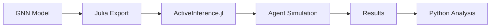

# ActiveInference.jl Implementation Reference

> **📋 Document Metadata**  
> **Type**: Implementation Reference | **Audience**: Developers | **Complexity**: Intermediate  
> **Cross-References**: [ActiveInference.jl Documentation](../activeinference_jl/README.md) | [Active Inference Theory](active_inference_theory.md)

## Overview

**ActiveInference.jl** is a Julia package for Active Inference. This document provides signposting to GNN source code and documentation.

**Status**: ✅ Production Ready  
**Version**: 1.0

---

## Source Code Signposting

### Execution Engine

| Component | Path | Description |
|-----------|------|-------------|
| **Runner** | [`src/execute/activeinference_jl/activeinference_runner.jl`](../../src/execute/activeinference_jl/activeinference_runner.jl) | Main runner |
| **Julia Interface** | [`src/execute/activeinference_jl/`](../../src/execute/activeinference_jl/) | Full interface |

### Analysis Tools

| Component | Path | Description |
|-----------|------|-------------|
| **Analyzer** | [`src/analysis/activeinference_jl/analyzer.py`](../../src/analysis/activeinference_jl/analyzer.py) | Python analysis |
| **Julia Analysis** | [`src/analysis/activeinference_jl/`](../../src/analysis/activeinference_jl/) | Julia analysis scripts |

---

## Documentation Signposting

### ActiveInference.jl Documentation

| Document | Path | Description |
|----------|------|-------------|
| **README** | [`doc/activeinference_jl/README.md`](../activeinference_jl/README.md) | Overview |
| **Integration Guide** | [`doc/activeinference_jl/activeinference-jl.md`](../activeinference_jl/activeinference-jl.md) | Main guide |
| **Source Code Doc** | [`doc/activeinference_jl/activeinference-jl_source_code.md`](../activeinference_jl/activeinference-jl_source_code.md) | Source reference |
| **Analysis Doc** | [`doc/activeinference_jl/analysis_documentation.md`](../activeinference_jl/analysis_documentation.md) | Analysis guide |

---

## Quick Reference

### Basic Usage

```julia
using ActiveInference

# Define model
A = [...]  # Likelihood
B = [...]  # Transitions
C = [...]  # Preferences
D = [...]  # Initial prior

# Create agent
agent = init_agent(A, B, C, D)

# Run simulation
for t in 1:T
    obs = get_observation(env)
    infer_states!(agent, obs)
    action = infer_action(agent)
    step!(env, action)
end
```

---

## GNN Integration

### Execution Flow



---

## Related Resources

### Theory
- **[Active Inference Theory](active_inference_theory.md)**
- **[Generative Models](generative_models.md)**

### Implementation
- **[PyMDP Implementation](implementation_pymdp.md)**
- **[RxInfer Implementation](implementation_rxinfer.md)**
- **[Computational Patterns](computational_patterns.md)**

### External
- **[ActiveInference.jl GitHub](https://github.com/ActiveInference/ActiveInference.jl)**

---

**Status**: ✅ Production Ready  
**Compliance**: GNN documentation standards
