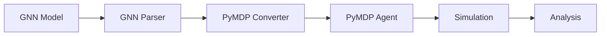

# PyMDP Implementation Reference

> **📋 Document Metadata**  
> **Type**: Implementation Reference | **Audience**: Developers | **Complexity**: Intermediate  
> **Cross-References**: [PyMDP Documentation](../pymdp/README.md) | [Generative Models](generative_models.md) | [Computational Patterns](computational_patterns.md)

## Overview

**PyMDP** is a Python library for discrete-state-space Active Inference. This document provides a reference guide linking to GNN source code and documentation.

**Status**: ✅ Production Ready  
**Version**: 1.0

---

## Source Code Signposting

### Execution Engine

| Component | Path | Description |
|-----------|------|-------------|
| **PyMDP Runner** | [`src/execute/pymdp/pymdp_runner.py`](../../src/execute/pymdp/pymdp_runner.py) | Main execution script |
| **Model Builder** | [`src/execute/pymdp/`](../../src/execute/pymdp/) | GNN to PyMDP conversion |

### Analysis Tools

| Component | Path | Description |
|-----------|------|-------------|
| **PyMDP Analyzer** | [`src/analysis/pymdp_analyzer.py`](../../src/analysis/pymdp_analyzer.py) | Post-simulation analysis |
| **PyMDP Visualizer** | [`src/analysis/pymdp_visualizer.py`](../../src/analysis/pymdp_visualizer.py) | Visualization generation |
| **Post-Simulation** | [`src/analysis/post_simulation.py`](../../src/analysis/post_simulation.py) | Comprehensive analysis |

---

## Documentation Signposting

### PyMDP Documentation

| Document | Path | Description |
|----------|------|-------------|
| **README** | [`doc/pymdp/README.md`](../pymdp/README.md) | Overview |
| **GNN PyMDP Guide** | [`doc/pymdp/gnn_pymdp.md`](../pymdp/gnn_pymdp.md) | Complete integration guide |
| **Advanced Tutorials** | [`doc/pymdp/pymdp_advanced_tutorials.md`](../pymdp/pymdp_advanced_tutorials.md) | Advanced usage |
| **Performance Guide** | [`doc/pymdp/pymdp_performance_guide.md`](../pymdp/pymdp_performance_guide.md) | Optimization |
| **POMDP Examples** | [`doc/pymdp/pymdp_pomdp/`](../pymdp/pymdp_pomdp/) | POMDP implementations |

---

## Quick Reference

### Installation

```bash
pip install pymdp
```

### Basic Usage

```python
import numpy as np
from pymdp.agent import Agent
from pymdp import utils

# Define generative model
A = [np.array([...])]  # Likelihood matrices
B = [np.array([...])]  # Transition matrices
C = [np.array([...])]  # Preference vectors
D = [np.array([...])]  # Initial state priors

# Create agent
agent = Agent(A=A, B=B, C=C, D=D)

# Run simulation
for t in range(T):
    obs = environment.get_observation()
    agent.infer_states(obs)
    action = agent.infer_policies()
    environment.step(action)
```

### Key Functions

| Function | Description |
|----------|-------------|
| `Agent()` | Create Active Inference agent |
| `agent.infer_states()` | Update beliefs given observation |
| `agent.infer_policies()` | Select action via EFE |
| `agent.update_D()` | Learn initial state prior |
| `utils.obj_array()` | Create object arrays |
| `utils.norm_dist()` | Normalize distributions |

---

## GNN Integration

### Model Specification

GNN models are converted to PyMDP format:

```
GNN Syntax          →    PyMDP Format
───────────────────────────────────────
A[obs, states]      →    A = [np.array([...])]
B[states, states, actions] → B = [np.array([...])]
C[obs]              →    C = [np.array([...])]
D[states]           →    D = [np.array([...])]
```

### Execution Flow



---

## Key Concepts

### Multi-Factor Models

PyMDP supports factorized state spaces:

```python
num_states = [4, 2]  # Factor 1: 4 states, Factor 2: 2 states
num_obs = [3, 2]     # Modality 1: 3 obs, Modality 2: 2 obs

A = utils.obj_array(len(num_obs))
A[0] = np.zeros((num_obs[0], *num_states))
A[1] = np.zeros((num_obs[1], *num_states))
```

### Learning

Enable parameter learning:

```python
agent = Agent(
    A=A, B=B, C=C, D=D,
    pA=pA,  # Dirichlet priors for A learning
    pB=pB,  # Dirichlet priors for B learning
    pD=pD,  # Dirichlet priors for D learning
)

# Update after episode
agent.update_A(obs_history)
agent.update_B(action_history, state_history)
agent.update_D()
```

### Policy Inference

Configure policy selection:

```python
agent = Agent(
    A=A, B=B, C=C, D=D,
    policies=policies,  # Custom policy set
    gamma=16.0,         # Policy precision
    use_utility=True,   # Include pragmatic value
    use_states_info_gain=True,  # Include epistemic value
)
```

---

## Related Resources

### Theory
- **[Active Inference Theory](active_inference_theory.md)**
- **[Generative Models](generative_models.md)**
- **[Expected Free Energy](expected_free_energy.md)**

### Implementation
- **[RxInfer Implementation](implementation_rxinfer.md)**
- **[Computational Patterns](computational_patterns.md)**

### External
- **[PyMDP GitHub](https://github.com/infer-actively/pymdp)**
- **[PyMDP Documentation](https://pymdp-rtd.readthedocs.io/)**

---

**Status**: ✅ Production Ready  
**Compliance**: GNN documentation standards
