# Variational Inference in Active Inference

> **📋 Document Metadata**  
> **Type**: Technical Reference | **Audience**: Researchers, Advanced Developers | **Complexity**: Advanced  
> **Cross-References**: [FEP Foundations](fep_foundations.md) | [Expected Free Energy](expected_free_energy.md) | [Computational Patterns](computational_patterns.md)

## Overview

**Variational Inference** is the computational engine behind Active Inference. This document covers the mathematical details of Variational Free Energy (VFE) and the algorithms used to minimize it.

**Status**: ✅ Production Ready  
**Version**: 1.0

---

## The Inference Problem

### Goal

Given observations $o$ and model $m$, find the posterior over hidden states:

$$P(s|o, m) = \frac{P(o|s, m) P(s|m)}{P(o|m)}$$

### Challenge

The denominator $P(o|m) = \sum_s P(o|s)P(s)$ requires summing over all states—often intractable for large state spaces.

### Solution: Variational Inference

Approximate the true posterior $P(s|o)$ with a tractable distribution $Q(s)$ by minimizing their divergence.

---

## Variational Free Energy

### Definition

$$F = \mathbb{E}_{Q(s)}[\ln Q(s) - \ln P(o, s|m)]$$

### Key Property

$$F = D_{KL}(Q(s) \| P(s|o,m)) - \ln P(o|m)$$

Since $D_{KL} \geq 0$:
$$F \geq -\ln P(o|m)$$

**Free energy is an upper bound on surprise.**

### Decomposition 1: Complexity + Inaccuracy

$$F = \underbrace{D_{KL}(Q(s) \| P(s|m))}_{\text{Complexity}} - \underbrace{\mathbb{E}_{Q(s)}[\ln P(o|s,m)]}_{\text{Accuracy}}$$

- **Complexity**: Divergence from prior beliefs
- **Accuracy**: Expected log-likelihood of observations

### Decomposition 2: Energy - Entropy

$$F = \underbrace{\mathbb{E}_{Q(s)}[-\ln P(o,s|m)]}_{\text{Energy}} - \underbrace{H(Q(s))}_{\text{Entropy}}$$

- **Energy**: Expected negative log joint probability
- **Entropy**: Uncertainty in beliefs

---

## Minimizing Free Energy

### Gradient Descent

For continuous beliefs:

$$\frac{dQ}{dt} = -\frac{\partial F}{\partial Q}$$

### Optimal Solution

Setting $\frac{\partial F}{\partial Q} = 0$:

$$Q^*(s) = P(s|o, m)$$

The optimal variational distribution is the true posterior.

### Discrete States

For discrete states with categorical distributions:

$$Q(s) = \text{softmax}(\ln P(o|s) + \ln P(s))$$

---

## Message Passing Algorithms

### Belief Propagation

For factor graphs, VFE minimization becomes message passing:

```mermaid
graph LR
    subgraph FactorGraph
        s1((s₁)) --- f1[A₁]
        s1 --- f2[B₁₂]
        s2((s₂)) --- f2
        s2 --- f3[A₂]
        o1[o₁] --- f1
        o2[o₂] --- f3
    end
    
    classDef variable fill:#e6e6ff,stroke:#333399;
    classDef factor fill:#ffe6e6,stroke:#993333;
    classDef obs fill:#e6ffe6,stroke:#339933;
    class s1,s2 variable;
    class f1,f2,f3 factor;
    class o1,o2 obs;
```



### Message Equations

**Variable to Factor**:
$$\mu_{s \to f}(s) = \prod_{f' \in \text{nb}(s) \setminus f} \mu_{f' \to s}(s)$$

**Factor to Variable**:
$$\mu_{f \to s}(s) = \sum_{s' \in \text{nb}(f) \setminus s} f(s, s') \prod_{s'' \in \text{nb}(f) \setminus s} \mu_{s'' \to f}(s'')$$

### Belief Update

$$Q(s) \propto \prod_{f \in \text{nb}(s)} \mu_{f \to s}(s)$$

---

## Temporal Inference

### Hidden Markov Model Structure

$$P(o_{1:T}, s_{1:T}) = P(s_1) \prod_{t=2}^T P(s_t|s_{t-1}) \prod_{t=1}^T P(o_t|s_t)$$

### Forward Pass (Filtering)

Compute $Q(s_t | o_{1:t})$:

$$Q(s_t) \propto P(o_t|s_t) \sum_{s_{t-1}} P(s_t|s_{t-1}) Q(s_{t-1})$$

In matrix form (with A, B, D):

```python
def forward_pass(A, B, D, observations):
    """Compute filtered beliefs over time."""
    T = len(observations)
    Q = [None] * T
    
    # Initial belief
    o_0 = observations[0]
    Q[0] = A[o_0, :] * D
    Q[0] = Q[0] / Q[0].sum()
    
    for t in range(1, T):
        # Predict
        Q_pred = B @ Q[t-1]
        
        # Update with observation
        o_t = observations[t]
        Q[t] = A[o_t, :] * Q_pred
        Q[t] = Q[t] / Q[t].sum()
    
    return Q
```

### Backward Pass (Smoothing)

Compute $Q(s_t | o_{1:T})$:

$$Q(s_t | o_{1:T}) \propto Q(s_t | o_{1:t}) \sum_{s_{t+1}} \frac{P(s_{t+1}|s_t) Q(s_{t+1}|o_{1:T})}{\sum_{s_t'} P(s_{t+1}|s_t') Q(s_t'|o_{1:t})}$$

```python
def backward_pass(A, B, Q_forward, observations):
    """Compute smoothed beliefs."""
    T = len(observations)
    Q = Q_forward.copy()
    
    for t in range(T-2, -1, -1):
        # Backward message
        Q_pred = B @ Q_forward[t]
        backward_msg = B.T @ (Q[t+1] / (Q_pred + 1e-10))
        
        # Smooth
        Q[t] = Q_forward[t] * backward_msg
        Q[t] = Q[t] / Q[t].sum()
    
    return Q
```

---

## Variational Message Passing

### Algorithm

Variational Message Passing (VMP) iteratively updates beliefs:

```python
def vmp_iteration(A, B, Q_s, Q_s_prev, o, num_iters=16):
    """One VMP iteration for belief update."""
    for i in range(num_iters):
        # Message from likelihood
        ln_A = np.log(A[o, :] + 1e-10)
        
        # Message from transition
        ln_B_msg = np.log(B @ Q_s_prev + 1e-10)
        
        # Combine messages
        ln_Q = ln_A + ln_B_msg
        
        # Normalize
        Q_s = softmax(ln_Q)
    
    return Q_s
```

### Convergence

VMP converges when:
$$\|Q^{(n+1)} - Q^{(n)}\| < \epsilon$$

---

## Precision and Attention

### Precision Weighting

Precision $\pi$ weights the influence of different information sources:

$$F = \pi_o \cdot \text{Inaccuracy} + \pi_s \cdot \text{Complexity}$$

High sensory precision → observations dominate
High prior precision → priors dominate

### Attention as Precision

Attention can be modeled as precision optimization:

$$\pi^* = \arg\min_\pi F(Q, \pi)$$

Attending to something = increasing its precision.

---

## Free Energy and Bayes

### Connection to Bayes' Rule

Minimizing free energy implements Bayes' rule:

| VFE Term | Bayesian Term |
|----------|---------------|
| $\ln P(o|s)$ | Likelihood |
| $\ln P(s)$ | Prior |
| $\ln Q(s)$ | (Log) Posterior |
| $F$ | -ELBO |

### Evidence Lower Bound (ELBO)

$$\text{ELBO} = -F = \mathbb{E}_{Q}[\ln P(o,s)] - \mathbb{E}_{Q}[\ln Q(s)]$$

Maximizing ELBO = Minimizing Free Energy.

---

## Source Code Implementation

### Core Inference

| Component | Path | Description |
|-----------|------|-------------|
| PyMDP Inference | [`src/execute/pymdp/`](../../src/execute/pymdp/) | Belief updating |
| RxInfer | [`src/execute/rxinfer/`](../../src/execute/rxinfer/) | Message passing |
| Analysis | [`src/analysis/`](../../src/analysis/) | Post-hoc analysis |

### Algorithm Reference

**PyMDP**: Uses iterative VMP with configurable iterations
**RxInfer**: Uses reactive message passing on factor graphs
**ActiveInference.jl**: Uses sum-product algorithm

---

## Related Documentation

- **[FEP Foundations](fep_foundations.md)**: Theoretical basis
- **[Active Inference Theory](active_inference_theory.md)**: Core theory
- **[Expected Free Energy](expected_free_energy.md)**: Action selection
- **[Computational Patterns](computational_patterns.md)**: Implementation patterns
- **[Implementation RxInfer](implementation_rxinfer.md)**: Factor graph inference

---

## Key Equations Summary

| Quantity | Equation |
|----------|----------|
| **VFE** | $F = D_{KL}(Q \| P(s)) - \mathbb{E}_Q[\ln P(o|s)]$ |
| **Optimal Q** | $Q^*(s) \propto P(o|s) P(s)$ |
| **Forward** | $Q(s_t) \propto A_{o_t} \odot (B Q(s_{t-1}))$ |
| **Backward** | $Q(s_t) \propto Q_{\text{fwd}}(s_t) \odot B^T (Q(s_{t+1}) / B Q_{\text{fwd}}(s_t))$ |

---

**Status**: ✅ Production Ready  
**Compliance**: GNN documentation standards  
**Maintenance**: Regular updates with new inference algorithms
