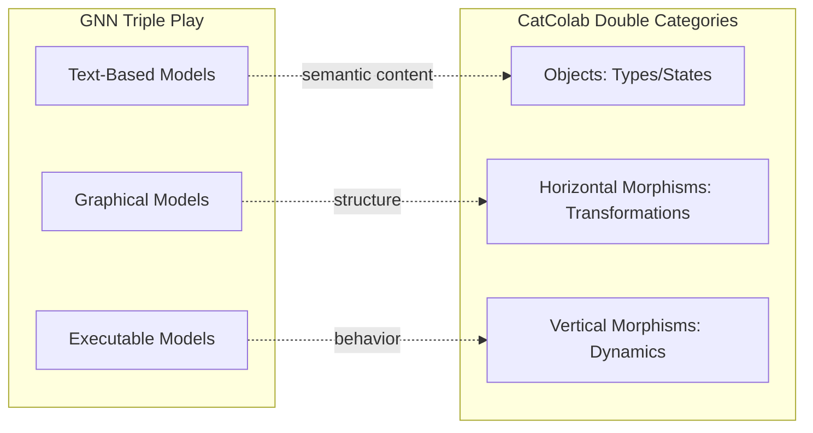
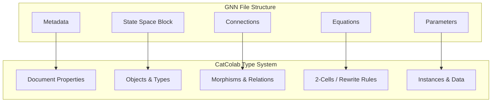
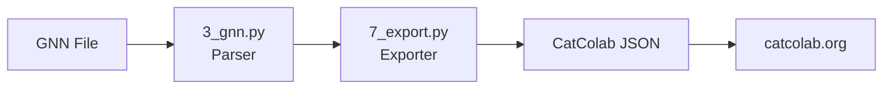
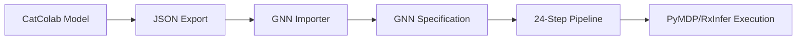
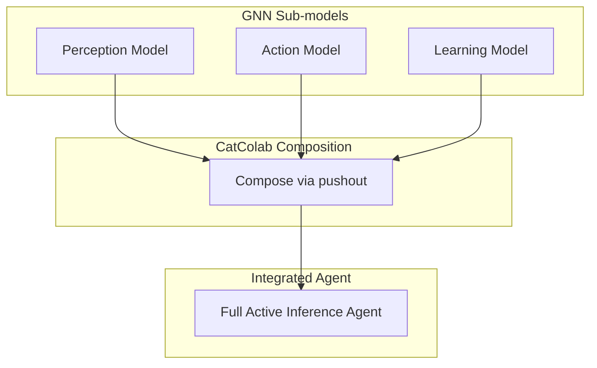
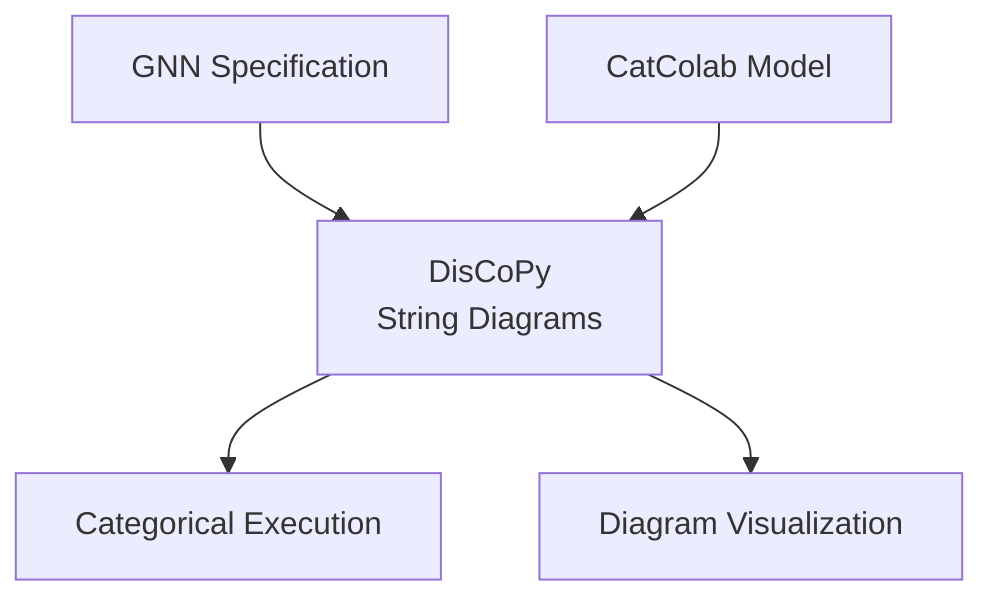

# CatColab-GNN Integration: Categorical Foundations for Active Inference

This document establishes the theoretical and practical connections between [Generalized Notation Notation (GNN)](../gnn/gnn_overview.md) and [CatColab](catcolab.md), bridging Active Inference model specification with category-theoretic compositional modeling.

---

## Executive Summary

GNN (Generalized Notation Notation) and CatColab represent complementary approaches to formal scientific modeling:

| Aspect | GNN | CatColab |
|--------|-----|----------|
| **Focus** | Active Inference generative models | Category-theoretic compositional models |
| **Representation** | Text-based structured notation | Structure editor with domain-specific logics |
| **Execution** | 25-step pipeline (PyMDP, RxInfer, JAX) | Simulation via AlgebraicJulia backend |
| **Composition** | Module-based pipeline | Functorial composition of models |
| **Export** | JSON, XML, GraphML, executable code | JSON, collaborative documents |

**Integration thesis**: GNN's matrix-centric Active Inference specifications can be interpreted as categorical objects within CatColab's logic framework, enabling bidirectional translation, formal verification, and compositional model construction.

---

## Conceptual Bridges

### 1. Triple Play ↔ Double Category Theory

GNN's **Triple Play** approach (text, graph, executable) corresponds structurally to CatColab's **double category** framework:



| GNN Component | CatColab Equivalent | Mathematical Role |
|---------------|---------------------|-------------------|
| State variables (s, o, π) | Objects in double category | Types/carriers |
| Connections (A>B, A-B) | Horizontal morphisms | Static relationships |
| Temporal dynamics (t, τ) | Vertical morphisms | Dynamic evolution |
| Equations | 2-cells | Coherence conditions |

### 2. Active Inference Matrices ↔ CatColab Logics

GNN's core matrices map directly to CatColab's domain-specific logics:

| GNN Matrix | Description | CatColab Logic | Categorical Interpretation |
|------------|-------------|----------------|---------------------------|
| **A** (Likelihood) | P(observation \| state) | Schema | Profunctor from states to observations |
| **B** (Transition) | P(state' \| state, action) | Stock-and-Flow | Controlled dynamical system |
| **C** (Preference) | Log-preferences over observations | Regulatory Network | Signed evaluation functor |
| **D** (Prior) | Initial state distribution | Olog | Probabilistic initialization |
| **E** (Habit) | Policy prior | Petri Net | Stochastic action selection |

### 3. GNN Sections as Categorical Structures

GNN file sections correspond to categorical constructs in CatColab's type theory:



---

## Structural Correspondences

### GNN State Space → CatColab Schemas

A GNN State Space block defines typed variables with dimensions:

```gnn
## State space block
s[4, type=hidden]        # Hidden state (4 dimensions)
o[3, type=observed]      # Observation (3 dimensions)  
π[2, type=policy]        # Policy (2 actions)
```

This translates to a CatColab **Schema** with:
- **Objects**: `HiddenState`, `Observation`, `Policy`
- **Attributes**: Dimension specifications as column types
- **Morphisms**: Functional dependencies between types

```
Schema: ActiveInferenceAgent
├── Table: HiddenState [dim: 4]
├── Table: Observation [dim: 3]
├── Table: Policy [dim: 2]
└── ForeignKey: Observation.state → HiddenState
```

### GNN Connections → CatColab Morphisms

GNN connection syntax maps to CatColab's typed morphisms:

| GNN Syntax | CatColab Equivalent | Semantics |
|------------|---------------------|-----------|
| `A>B` | Directed morphism `A → B` | Causal influence |
| `A-B` | Undirected edge `A — B` | Correlation/dependency |
| `A>B[weight=0.5]` | Weighted morphism | Parameterized transformation |
| `A>B>C` | Composed morphism `A → B → C` | Sequential transformation |

### GNN Equations → CatColab 2-Cells

GNN equations specify computational relationships that correspond to CatColab's 2-cells (morphisms between morphisms):

```gnn
## Equations
s_posterior = softmax(ln(D) + ln(A^T * o))
π_selected = argmin(G)
```

In CatColab's double-categorical framework:
- The equation `s_posterior = softmax(...)` is a 2-cell witnessing the coherence between prior beliefs and posterior inference
- Policy selection `π_selected = argmin(G)` is a 2-cell implementing the action functor

---

## Practical Integration Pathways

### Pathway 1: GNN → CatColab Export

The GNN pipeline (Step 7: Export) can generate CatColab-compatible representations:



**Implementation via GNN Pipeline:**
```bash
# Export GNN model to CatColab-compatible format
python src/main.py --only-steps "3,7" --export-format catcolab --verbose
```

**Target CatColab Logic Selection:**
| GNN Model Type | Recommended CatColab Logic |
|----------------|---------------------------|
| Perception-only | Schema (for structure) |
| POMDP with dynamics | Stock-and-Flow Diagram |
| Multi-agent | Regulatory Network |
| Discrete actions | Petri Net |

### Pathway 2: CatColab → GNN Import

CatColab models can be imported into GNN for execution:



**Mapping CatColab Logics to GNN:**
| CatColab Logic | GNN Target Structure |
|----------------|---------------------|
| Olog | Ontology annotations (Step 10) |
| Schema | State space + type system |
| Regulatory Network | Signed connection matrix (C) |
| Causal Loop Diagram | Factor graph connections |
| Stock-and-Flow | Full POMDP specification |
| Petri Net | Transition dynamics (B matrix) |

### Pathway 3: Compositional Model Construction

CatColab's compositional features enable modular GNN model construction:



---

## Framework Integration Matrix

### GNN Execution Frameworks ↔ CatColab Backends

| GNN Framework | CatColab Equivalent | Shared Capability |
|---------------|---------------------|-------------------|
| **PyMDP** | AlgebraicJulia (acsets) | Discrete POMDP simulation |
| **RxInfer.jl** | Julia backend | Bayesian inference |
| **JAX** | — | GPU-accelerated numerics |
| **DisCoPy** | Core categorical logic | String diagrams, monoidal categories |
| **ActiveInference.jl** | AlgebraicJulia integration | Julia ecosystem compatibility |

### DisCoPy as Bridge Technology

DisCoPy (implemented in `src/render/discopy/` and `src/execute/discopy/`) provides the categorical semantics shared by both systems:



---

## GNN Ontology System ↔ CatColab Ologs

GNN's ontology system (Step 10: `src/ontology/`) aligns with CatColab's **Olog** logic:

| GNN Ontology Concept | CatColab Olog Element |
|----------------------|----------------------|
| `act:HiddenState` | Object: "a hidden state" |
| `act:Observation` | Object: "an observation" |
| `act:generates` | Morphism: "generates" |
| `act:updates` | Morphism: "updates" |

**GNN Ontology Annotation Example:**
```gnn
## Annotations
s: act:HiddenState
o: act:Observation  
A: act:LikelihoodMapping
s > o: act:generates
```

**Equivalent CatColab Olog:**
```
Object: "a hidden state" (s)
Object: "an observation" (o)
Morphism: "generates" : s → o
Aspect: "via likelihood mapping A"
```

---

## Implementation Roadmap

### Phase 1: Export Infrastructure (Ready)
- [x] GNN JSON export (Step 7)
- [x] DisCoPy integration (Steps 11-12)
- [ ] CatColab JSON schema alignment

### Phase 2: Bidirectional Translation
- [ ] CatColab → GNN importer module
- [ ] GNN → Stock-and-Flow converter
- [ ] Schema validation for both formats

### Phase 3: Unified Workflow
- [ ] CatColab model editing with GNN execution backend
- [ ] Real-time collaboration on Active Inference models
- [ ] Compositional construction of hierarchical agents

---

## Use Cases

### 1. Epidemiological Modeling
- **Model in CatColab**: Stock-and-Flow diagram for disease dynamics
- **Execute via GNN**: PyMDP simulation with learning
- **Iterate**: Collaborative refinement in CatColab

### 2. Multi-Agent Systems
- **Compose in CatColab**: Regulatory network of agent interactions
- **Translate to GNN**: Multi-agent GNN specification ([gnn_multiagent.md](../gnn/gnn_multiagent.md))
- **Simulate**: Distributed Active Inference execution

### 3. Cognitive Architecture
- **Ontology in CatColab**: Olog for cognitive concepts
- **Structure in GNN**: Hierarchical POMDP ([advanced_modeling_patterns.md](../gnn/advanced_modeling_patterns.md))
- **Analyze**: LLM-enhanced interpretation (Step 13)

---

## References

### GNN Documentation
- [GNN Overview](../gnn/gnn_overview.md)
- [GNN Syntax](../gnn/gnn_syntax.md)
- [Framework Integration Guide](../gnn/framework_integration_guide.md)
- [DisCoPy Integration](../discopy/gnn_discopy.md)
- [Ontology System](../gnn/ontology_system.md)
- [Multi-Agent Systems](../gnn/gnn_multiagent.md)
- [Advanced Modeling Patterns](../gnn/advanced_modeling_patterns.md)
- [Pipeline Documentation](../../src/AGENTS.md)

### CatColab Resources
- [CatColab Overview](catcolab.md)
- [CatColab Application](https://catcolab.org)
- [ToposInstitute/CatColab GitHub](https://github.com/ToposInstitute/CatColab)
- [AlgebraicJulia Ecosystem](https://www.algebraicjulia.org/)

### Foundational Theory
- Smékal & Friedman (2023). *Generalized Notation Notation for Active Inference Models*. Active Inference Institute.
- Baez et al. *Compositional Modeling with Stock-and-Flow Diagrams*. arXiv:2205.08373.
- Spivak & Kent (2011). *Ologs: A Categorical Framework for Knowledge Representation*.

---

**Document Version**: 1.0  
**Last Updated**: 2026-01-20  
**Status**: Active Development
