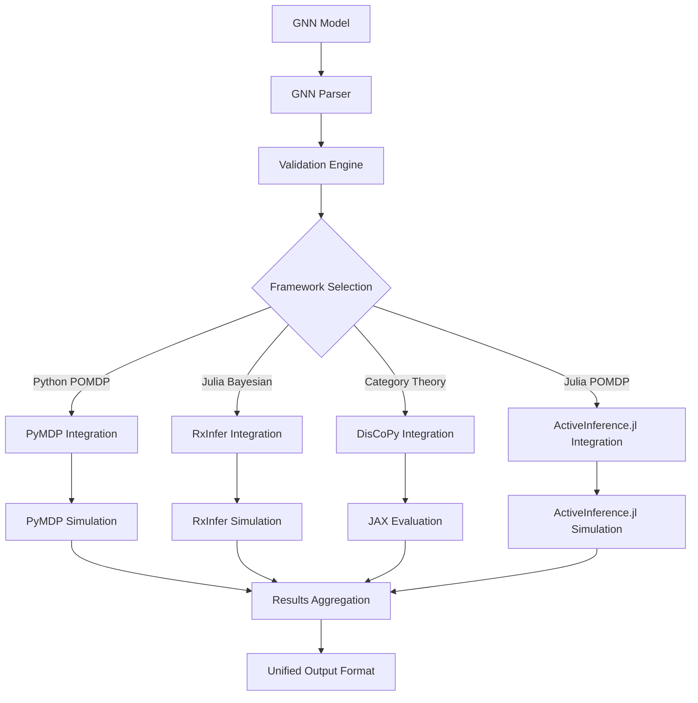

# GNN Framework Integration Guide

**Version**: v1.1.0  
**Last Updated**: February 9, 2026  
**Status**: ✅ Production Ready  
**Test Count**: 1,127 Tests Passing  

## Pipeline Integration

GNN framework integration is handled by **Steps 11 and 12** of the processing pipeline:

- **`src/11_render.py`** → Code generation for PyMDP, RxInfer, ActiveInference.jl, DisCoPy, JAX
  - See: **[src/render/AGENTS.md](../../src/render/AGENTS.md)** for rendering module details
- **`src/12_execute.py`** → Execution of rendered simulation scripts
  - See: **[src/execute/AGENTS.md](../../src/execute/AGENTS.md)** for execution module details

**Quick Start:**

```bash
# Generate and execute code for all frameworks
python src/main.py --only-steps "11,12" --target-dir input/gnn_files --verbose

# Execute specific frameworks only
python src/12_execute.py --frameworks "pymdp,jax" --verbose
```

For complete pipeline documentation, see **[src/AGENTS.md](../../src/AGENTS.md)**.

## Overview

This guide provides standardized patterns for integrating GNN (Generalized Notation Notation) models with different Active Inference frameworks. It ensures consistent interfaces, error handling, and feature parity across all supported frameworks.

## Integration Architecture



## Common Integration Patterns

### 1. **Standardized Model Representation**

All frameworks receive models in a consistent intermediate representation:

```python
@dataclass
class GNNModelIR:
    """Intermediate Representation for GNN models"""
    model_name: str
    state_variables: Dict[str, StateVariable]
    observation_variables: Dict[str, ObservationVariable]
    action_variables: Dict[str, ActionVariable]
    connections: List[Connection]
    matrices: Dict[str, np.ndarray]
    parameters: Dict[str, Any]
    metadata: Dict[str, Any]
    
    def to_framework(self, framework: str) -> Any:
        """Convert to framework-specific representation"""
        converters = {
            'pymdp': self._to_pymdp,
            'rxinfer': self._to_rxinfer,
            'discopy': self._to_discopy,
            'activeinference_jl': self._to_activeinference_jl
        }
        return converters[framework]()
```

### 2. **Common Configuration Interface**

```python
@dataclass
class FrameworkConfig:
    """Standardized configuration across frameworks"""
    framework_name: str
    backend: str = "cpu"  # cpu, gpu, tpu
    precision: str = "float32"  # float32, float64
    optimization_level: int = 1  # 0-3
    parallel_execution: bool = False
    memory_limit_mb: Optional[int] = None
    timeout_seconds: Optional[int] = None
    debug_mode: bool = False
    output_format: str = "json"  # json, hdf5, pickle
    
    # Framework-specific extensions
    framework_specific: Dict[str, Any] = field(default_factory=dict)
```

### 3. **Unified Result Format**

```python
@dataclass
class SimulationResult:
    """Standardized simulation result format"""
    framework: str
    model_name: str
    execution_time: float
    success: bool
    error_message: Optional[str] = None
    
    # Core results
    beliefs: Optional[np.ndarray] = None
    actions: Optional[np.ndarray] = None
    observations: Optional[np.ndarray] = None
    free_energy: Optional[np.ndarray] = None
    
    # Framework-specific results
    framework_results: Dict[str, Any] = field(default_factory=dict)
    
    # Metadata
    simulation_metadata: Dict[str, Any] = field(default_factory=dict)
    performance_metrics: Dict[str, float] = field(default_factory=dict)
```

## PyMDP Integration

### **Enhanced PyMDP Renderer**

```python
class EnhancedPyMDPRenderer:
    """Production-ready PyMDP code generation with error handling"""
    
    def __init__(self, config: FrameworkConfig):
        self.config = config
        self.template_engine = PyMDPTemplateEngine()
        self.validator = PyMDPValidator()
    
    def render_model(self, model: GNNModelIR) -> str:
        """Generate complete PyMDP simulation code"""
        
        # Validate model compatibility
        validation_result = self.validator.validate_model(model)
        if not validation_result.is_valid:
            raise PyMDPIntegrationError(
                operation="model_validation",
                details=f"Validation failed: {validation_result.errors}"
            )
        
        # Generate matrices
        matrices = self._generate_matrices(model)
        
        # Generate agent configuration
        agent_config = self._generate_agent_config(model, matrices)
        
        # Generate simulation loop
        simulation_code = self._generate_simulation_loop(model, agent_config)
        
        # Combine into complete script
        return self.template_engine.render_complete_script(
            model=model,
            matrices=matrices,
            agent_config=agent_config,
            simulation_code=simulation_code,
            config=self.config
        )
    
    def _generate_matrices(self, model: GNNModelIR) -> Dict[str, np.ndarray]:
        """Generate A, B, C, D matrices from GNN model"""
        
        matrices = {}
        
        # A matrices (observation model)
        for obs_var in model.observation_variables.values():
            A_key = f"A_{obs_var.name}"
            matrices[A_key] = self._compute_A_matrix(model, obs_var)
        
        # B matrices (transition model)
        for state_var in model.state_variables.values():
            B_key = f"B_{state_var.name}"
            matrices[B_key] = self._compute_B_matrix(model, state_var)
        
        # C matrices (preferences)
        for obs_var in model.observation_variables.values():
            C_key = f"C_{obs_var.name}"
            matrices[C_key] = self._compute_C_matrix(model, obs_var)
        
        # D matrices (priors)
        for state_var in model.state_variables.values():
            D_key = f"D_{state_var.name}"
            matrices[D_key] = self._compute_D_matrix(model, state_var)
        
        return matrices
    
    def _compute_A_matrix(self, model: GNNModelIR, obs_var: ObservationVariable) -> np.ndarray:
        """Compute observation matrix for given observation variable"""
        
        # Find state variables that influence this observation
        influencing_states = []
        for conn in model.connections:
            if (conn.target == obs_var.name and 
                conn.source in model.state_variables):
                influencing_states.append(model.state_variables[conn.source])
        
        if not influencing_states:
            raise ValueError(f"No state variables influence observation {obs_var.name}")
        
        # Compute matrix dimensions
        num_obs = obs_var.dimensions[0]
        num_states = sum(var.dimensions[0] for var in influencing_states)
        
        # Initialize matrix
        A = np.zeros((num_obs, num_states))
        
        # Fill matrix based on model parameters or use default values
        if f"A_{obs_var.name}" in model.matrices:
            A = model.matrices[f"A_{obs_var.name}"]
        else:
            # Use identity mapping as default
            min_dim = min(num_obs, num_states)
            A[:min_dim, :min_dim] = np.eye(min_dim)
        
        # Ensure stochasticity
        A = A / A.sum(axis=0, keepdims=True)
        
        return A
```

### **PyMDP Template System**

```python
class PyMDPTemplateEngine:
    """Jinja2-based template engine for PyMDP code generation"""
    
    def __init__(self):
        self.env = Environment(
            loader=FileSystemLoader('src/render/pymdp/templates'),
            autoescape=False
        )
        
    def render_complete_script(self, **kwargs) -> str:
        """Render complete PyMDP simulation script"""
        
        template = self.env.get_template('complete_simulation.py.j2')
        return template.render(**kwargs)
```

**Template: `complete_simulation.py.j2`**

```python
#!/usr/bin/env python3
"""
Generated PyMDP simulation for: {{ model.model_name }}
Generated on: {{ generation_timestamp }}
Framework: PyMDP {{ pymdp_version }}
"""

import numpy as np
from pymdp import Agent, utils
from pymdp.maths import softmax
import matplotlib.pyplot as plt
import json
import time

# Model Configuration
MODEL_NAME = "{{ model.model_name }}"
NUM_TIMESTEPS = {{ config.framework_specific.get('num_timesteps', 10) }}
DEBUG_MODE = {{ config.debug_mode | lower }}

def setup_matrices():
    """Setup A, B, C, D matrices for the model"""
    
    
    {{ matrix_name }} = np.array({{ matrix.tolist() }})
    
    
    return {
        
        '{{ matrix_name }}': {{ matrix_name }},
        
    }

def create_agent(matrices):
    """Create PyMDP agent with generated matrices"""
    
    # Organize matrices by type
    A_matrices = [v for k, v in matrices.items() if k.startswith('A_')]
    B_matrices = [v for k, v in matrices.items() if k.startswith('B_')]
    C_vectors = [v for k, v in matrices.items() if k.startswith('C_')]
    D_vectors = [v for k, v in matrices.items() if k.startswith('D_')]
    
    # Create agent
    agent = Agent(
        A=A_matrices,
        B=B_matrices,
        C=C_vectors,
        D=D_vectors,
        
        use_utility=True,
        
        
        action_precision={{ config.framework_specific.action_precision }},
        
    )
    
    return agent

def run_simulation(agent):
    """Run complete simulation and collect results"""
    
    results = {
        'beliefs': [],
        'actions': [],
        'free_energy': [],
        'observations': []
    }
    
    for t in range(NUM_TIMESTEPS):
        # Get observation (placeholder - would be environment-specific)
        obs = generate_observation(t)
        
        # Update beliefs
        qs = agent.infer_states(obs)
        
        # Select action
        action = agent.sample_action()
        
        # Store results
        results['beliefs'].append(qs)
        results['actions'].append(action)
        results['observations'].append(obs)
        
        if hasattr(agent, 'F'):
            results['free_energy'].append(agent.F)
        
        if DEBUG_MODE:
            print(f"t={t}: obs={obs}, action={action}, beliefs={qs}")
    
    return results

def generate_observation(timestep):
    """Generate observation for timestep (model-specific)"""
    # {{ observation_generation_logic }}
    
    
    # Placeholder observation for {{ first_obs.name }}
    return np.random.randint(0, {{ first_obs.dimensions[0] }})
    
    return 0
    

def save_results(results, filename=None):
    """Save simulation results to file"""
    
    if filename is None:
        filename = f"{{ model.model_name }}_results_{int(time.time())}.json"
    
    # Convert numpy arrays to lists for JSON serialization
    serializable_results = {}
    for key, value in results.items():
        if isinstance(value, list) and value and isinstance(value[0], np.ndarray):
            serializable_results[key] = [v.tolist() for v in value]
        else:
            serializable_results[key] = value
    
    with open(filename, 'w') as f:
        json.dump(serializable_results, f, indent=2)
    
    print(f"Results saved to {filename}")

def plot_results(results):
    """Generate visualization of simulation results"""
    
    fig, axes = plt.subplots(2, 2, figsize=(12, 8))
    
    # Plot beliefs over time
    if results['beliefs']:
        beliefs_array = np.array([b.flatten() for b in results['beliefs']])
        axes[0, 0].plot(beliefs_array)
        axes[0, 0].set_title('Beliefs over Time')
        axes[0, 0].set_xlabel('Timestep')
        axes[0, 0].set_ylabel('Belief')
    
    # Plot actions over time
    if results['actions']:
        axes[0, 1].plot(results['actions'])
        axes[0, 1].set_title('Actions over Time')
        axes[0, 1].set_xlabel('Timestep')
        axes[0, 1].set_ylabel('Action')
    
    # Plot free energy over time
    if results['free_energy']:
        axes[1, 0].plot(results['free_energy'])
        axes[1, 0].set_title('Free Energy over Time')
        axes[1, 0].set_xlabel('Timestep')
        axes[1, 0].set_ylabel('Free Energy')
    
    # Plot observations over time
    if results['observations']:
        axes[1, 1].plot(results['observations'])
        axes[1, 1].set_title('Observations over Time')
        axes[1, 1].set_xlabel('Timestep')
        axes[1, 1].set_ylabel('Observation')
    
    plt.tight_layout()
    plt.savefig(f"{{ model.model_name }}_simulation_plots.png")
    plt.show()

if __name__ == "__main__":
    print(f"Starting simulation for {MODEL_NAME}")
    
    # Setup
    matrices = setup_matrices()
    agent = create_agent(matrices)
    
    # Run simulation
    start_time = time.time()
    results = run_simulation(agent)
    end_time = time.time()
    
    print(f"Simulation completed in {end_time - start_time:.2f} seconds")
    
    # Save and visualize results
    save_results(results)
    plot_results(results)
    
    print("Simulation complete!")
```

## RxInfer Integration

### **Enhanced RxInfer Integration**

```python
class EnhancedRxInferRenderer:
    """Production-ready RxInfer.jl integration"""
    
    def __init__(self, config: FrameworkConfig):
        self.config = config
        self.julia_interface = JuliaInterface()
        self.validator = RxInferValidator()
    
    def render_model(self, model: GNNModelIR) -> Tuple[str, str]:
        """Generate RxInfer model and configuration"""
        
        # Validate Julia environment
        self._validate_julia_environment()
        
        # Generate Julia model definition
        julia_model = self._generate_julia_model(model)
        
        # Generate TOML configuration
        toml_config = self._generate_toml_config(model)
        
        return julia_model, toml_config
    
    def _generate_julia_model(self, model: GNNModelIR) -> str:
        """Generate complete Julia model file"""
        
        template = f'''
using RxInfer, Random, Distributions
using TOML, JSON, Plots

# Model: {model.model_name}
# Generated on: {datetime.now().isoformat()}

@model function {model.model_name.lower().replace(" ", "_")}_model(num_timesteps::Int)
    
    # State variables
    {self._generate_state_variables(model)}
    
    # Observation variables  
    {self._generate_observation_variables(model)}
    
    # Model dynamics
    {self._generate_model_dynamics(model)}
    
    # Observations
    {self._generate_observations(model)}
    
end

function run_inference(config_path::String)
    # Load configuration
    config = TOML.parsefile(config_path)
    
    # Setup model
    num_timesteps = config["simulation"]["num_timesteps"]
    model = {model.model_name.lower().replace(" ", "_")}_model(num_timesteps)
    
    # Generate synthetic observations
    observations = generate_observations(num_timesteps, config)
    
    # Run inference
    result = infer(
        model = model,
        data = (observations = observations,),
        options = (
            iterations = config["inference"]["iterations"],
            seed = config["inference"]["seed"]
        )
    )
    
    return result
end

function generate_observations(num_timesteps::Int, config::Dict)
    # {model.model_name} observation generation
    {self._generate_observation_generation(model)}
end

function save_results(result, filename::String)
    # Extract and save inference results
    beliefs = result.posteriors
    
    # Convert to serializable format
    results_dict = Dict(
        "model_name" => "{model.model_name}",
        "framework" => "RxInfer",
        "beliefs" => beliefs,
        "timestamp" => string(now())
    )
    
    open(filename, "w") do f
        JSON.print(f, results_dict, 2)
    end
    
    println("Results saved to ", filename)
end

# Main execution
if abspath(PROGRAM_FILE) == @__FILE__
    config_path = length(ARGS) > 0 ? ARGS[1] : "config.toml"
    
    println("Running inference for {model.model_name}")
    result = run_inference(config_path)
    
    save_results(result, "{model.model_name}_rxinfer_results.json")
    println("Inference complete!")
end
'''
        
        return template
```

## DisCoPy Integration

### **Enhanced DisCoPy Integration**

```python
class EnhancedDisCoPyRenderer:
    """Production-ready DisCoPy categorical diagram generation"""
    
    def __init__(self, config: FrameworkConfig):
        self.config = config
        self.validator = DisCoPyValidator()
        
    def render_diagram(self, model: GNNModelIR) -> Tuple[Any, str]:
        """Generate DisCoPy diagram and JAX evaluation code"""
        
        from discopy import grammar, rigid, tensor
        
        # Build categorical diagram
        diagram = self._build_diagram(model)
        
        # Generate JAX evaluation code
        jax_code = self._generate_jax_evaluation(model, diagram)
        
        return diagram, jax_code
    
    def _build_diagram(self, model: GNNModelIR):
        """Build categorical diagram from GNN model"""
        
        from discopy import grammar, rigid
        
        # Create types for variables
        types = {}
        for var_name, var in model.state_variables.items():
            types[var_name] = rigid.Ty(var_name)
        
        for var_name, var in model.observation_variables.items():
            types[var_name] = rigid.Ty(var_name)
        
        # Create morphisms for connections
        morphisms = []
        for conn in model.connections:
            if conn.source in types and conn.target in types:
                morphism = rigid.Box(
                    f"{conn.source}_to_{conn.target}",
                    types[conn.source],
                    types[conn.target]
                )
                morphisms.append(morphism)
        
        # Compose diagram
        if morphisms:
            diagram = morphisms[0]
            for morphism in morphisms[1:]:
                try:
                    diagram = diagram >> morphism
                except:
                    # If composition fails, use tensor product
                    diagram = diagram @ morphism
        else:
            # Create identity diagram
            first_type = list(types.values())[0] if types else rigid.Ty('empty')
            diagram = rigid.Id(first_type)
        
        return diagram
```

## Performance Benchmarking

### **Cross-Framework Performance Comparison**

```python
class FrameworkBenchmark:
    """Benchmark GNN model performance across frameworks"""
    
    def __init__(self):
        self.frameworks = ['pymdp', 'rxinfer', 'discopy']
        self.metrics = ['execution_time', 'memory_usage', 'accuracy']
        
    def benchmark_model(self, model: GNNModelIR, 
                       configs: Dict[str, FrameworkConfig]) -> Dict[str, Any]:
        """Run comprehensive benchmark across all frameworks"""
        
        results = {}
        
        for framework in self.frameworks:
            if framework in configs:
                print(f"Benchmarking {framework}...")
                results[framework] = self._benchmark_framework(
                    model, framework, configs[framework]
                )
        
        # Generate comparison report
        comparison = self._generate_comparison_report(results)
        
        return {
            'individual_results': results,
            'comparison': comparison,
            'recommendations': self._generate_recommendations(comparison)
        }
    
    def _benchmark_framework(self, model: GNNModelIR, 
                           framework: str, config: FrameworkConfig) -> Dict[str, float]:
        """Benchmark specific framework"""
        
        import time
        import psutil
        
        # Setup
        start_memory = psutil.Process().memory_info().rss / 1024 / 1024
        start_time = time.time()
        
        try:
            # Framework-specific execution
            if framework == 'pymdp':
                result = self._run_pymdp_benchmark(model, config)
            elif framework == 'rxinfer':
                result = self._run_rxinfer_benchmark(model, config)
            elif framework == 'discopy':
                result = self._run_discopy_benchmark(model, config)
            
            success = True
            error_message = None
            
        except Exception as e:
            success = False
            error_message = str(e)
            result = None
        
        # Measurements
        end_time = time.time()
        end_memory = psutil.Process().memory_info().rss / 1024 / 1024
        
        return {
            'execution_time': end_time - start_time,
            'memory_usage': end_memory - start_memory,
            'success': success,
            'error_message': error_message,
            'result': result
        }
```

## Quality Assurance

### **Integration Testing Framework**

```python
class IntegrationTestSuite:
    """Comprehensive testing for framework integrations"""
    
    def __init__(self):
        self.test_models = self._load_test_models()
        
    def run_full_test_suite(self) -> Dict[str, Any]:
        """Run complete integration test suite"""
        
        results = {
            'syntax_tests': self._test_syntax_handling(),
            'validation_tests': self._test_validation(),
            'integration_tests': self._test_framework_integration(),
            'performance_tests': self._test_performance(),
            'compatibility_tests': self._test_cross_framework_compatibility()
        }
        
        return results
```

---

## Related Documentation

- **[PyMDP Integration Guide](../pymdp/gnn_pymdp.md)**: Detailed PyMDP-specific documentation
- **[RxInfer Integration Guide](../rxinfer/gnn_rxinfer.md)**: Complete RxInfer.jl integration
- **[DisCoPy Integration Guide](../discopy/gnn_discopy.md)**: Categorical diagram processing
- **[Performance Guide](../performance/README.md)**: Performance optimization strategies
- **[Error Handling Guide](../troubleshooting/error_taxonomy.md)**: Comprehensive error management

---

**Integration Guide Version**: v1.1.0  
**Framework Coverage**: PyMDP, RxInfer, DisCoPy  
**Status**: Production-Ready
