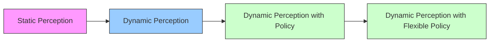
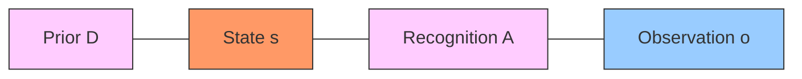
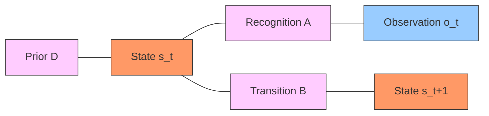
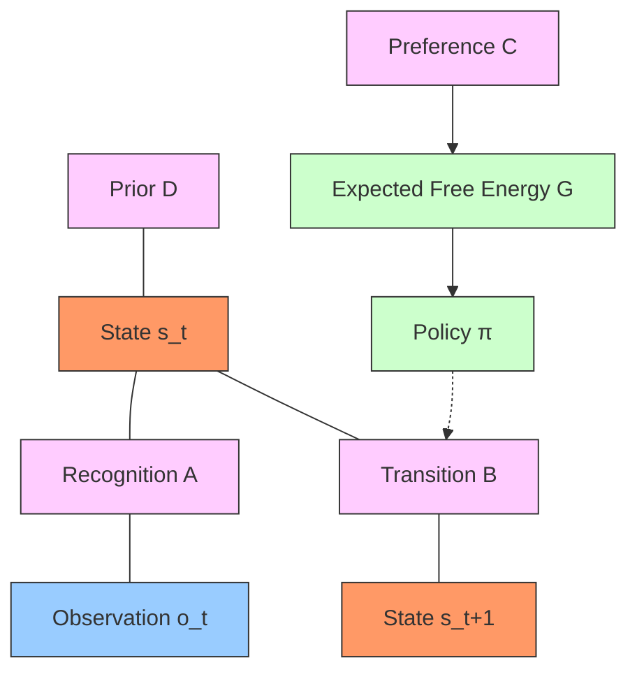
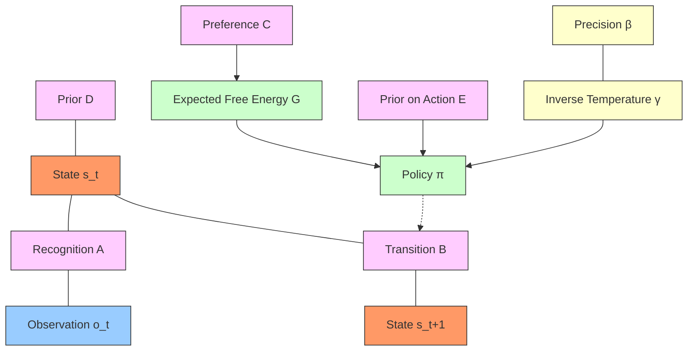
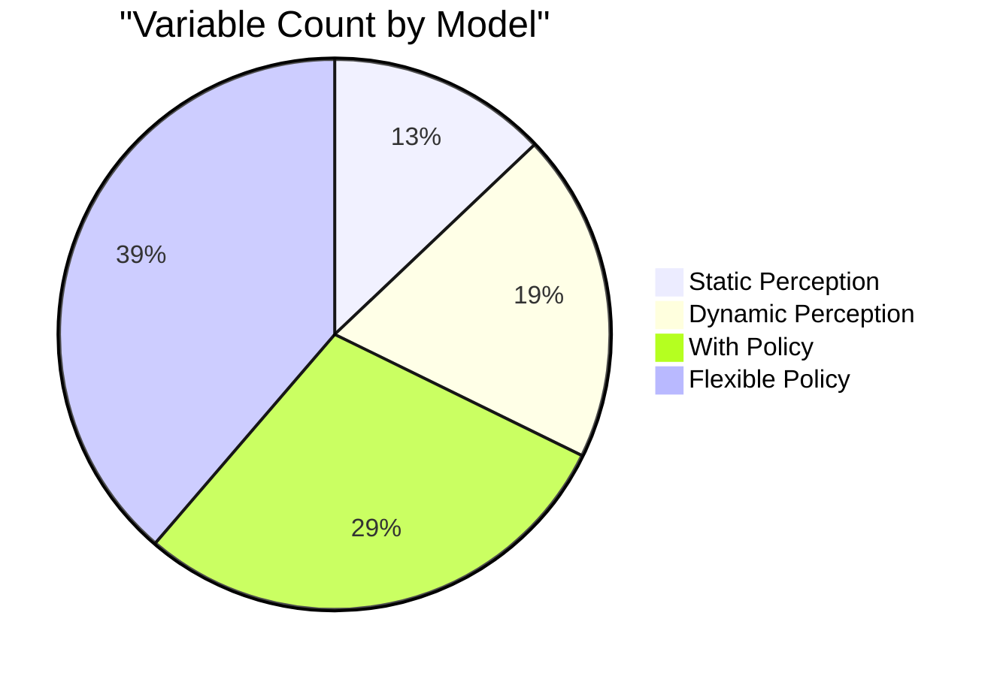
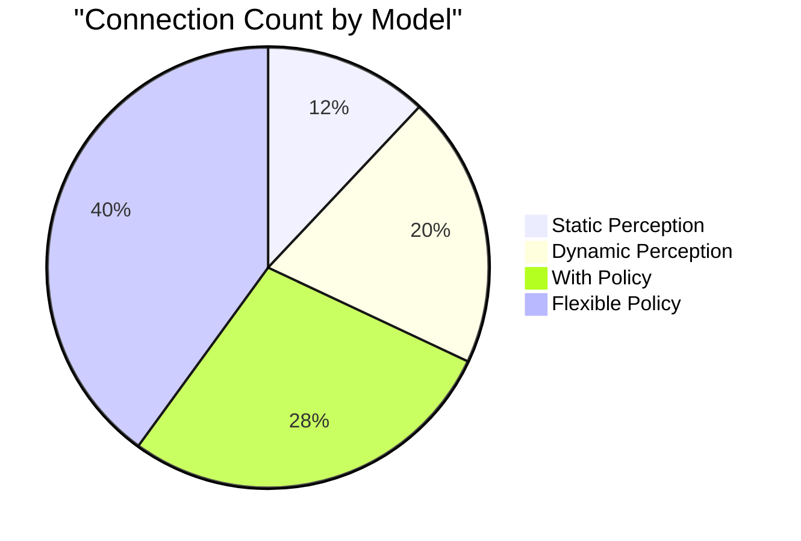

# GNN Examples and Model Progression

This document provides practical examples of GNN models, demonstrating how models can be developed with increasing complexity.

## Processing Examples with Pipeline

All examples can be processed through the GNN pipeline for parsing, validation, visualization, and code generation:

```bash
# Process all examples
python src/main.py --target-dir doc/gnn/examples/ --verbose

# Run specific processing steps
python src/main.py --only-steps "3,5,8,11,12" --target-dir doc/gnn/examples/
```

For module-specific documentation:
- **[src/gnn/AGENTS.md](../../src/gnn/AGENTS.md)**: GNN parsing module
- **[src/render/AGENTS.md](../../src/render/AGENTS.md)**: Code generation module
- **[src/AGENTS.md](../../src/AGENTS.md)**: Complete pipeline registry

---

## Model Progression Overview

GNN supports an incremental approach to model development, allowing you to start with simple models and progressively add complexity. The examples in this document follow a natural progression from basic to advanced models:



## Example 1: Static Perception Model

The simplest GNN model is a static perception model, which relates hidden states to observations without temporal dynamics.



### GNN Specification

```
## GNN v1

# Static Perception Model

## Model annotations
This model relates a single hidden state to a single observable modality.
It is a static model showing basic perception without time dynamics.

## State space block
D[2,1,type=float]  # Prior (2-dimensional column vector)
s[2,1,type=float]  # Hidden state (2-dimensional column vector)
A[2,2,type=float]  # Recognition matrix (2x2 matrix)
o[2,1,type=float]  # Observation (2-dimensional column vector)

## Connections
D-s
s-A
A-o

## Initial Parameterization
D={0.5,0.5}
o={1,0}
A={(.9,.1),(.2,.8)}

## Equations
\text{softmax}(\ln(D)+\ln(\mathbf{A}^\top o))

## Time
Static

## Active Inference Ontology
A=RecognitionMatrix
D=Prior
s=HiddenState
o=Observation

# Static Perception Model
```

### Key Features

- **Variables**: States, observations, recognition matrix, and prior
- **Connections**: Undirected edges showing relationships between variables
- **Equations**: Simple softmax equation for perception
- **Time**: Static model (no temporal dynamics)

## Example 2: Dynamic Perception Model

Building on the static model, a dynamic perception model adds time dependency and state transitions.



### GNN Specification

```
## GNN v1

# Dynamic Perception Model

## Model annotations
This model relates a single hidden state to a single observable modality.
It is a dynamic model because it tracks changes in the hidden state through time.

## State space block
D[2,1,type=float]    # Prior
B[2,1,type=float]    # Transition matrix
s_t[2,1,type=float]  # Hidden state at time t
A[2,2,type=float]    # Recognition matrix
o_t[2,1,type=float]  # Observation at time t
t[1,type=int]        # Time index

## Connections
D-s_t
s_t-A
A-o
s_t-B
B-s_t+1

## Initial Parameterization

## Equations
s_{tau=1}=softmax((1/2)(ln(D)+ln(B^dagger_tau*s_{tau+1})+ln(trans(A)o_tau))
s_{tau>1}=softmax((1/2)(ln(D)+ln(B^dagger_tau*s_{tau+1})+ln(trans(A)o_tau))

## Time
Dynamic
DiscreteTime=s_t
ModelTimeHorizon=Unbounded

## Active Inference Ontology
A=RecognitionMatrix
B=TransitionMatrix
D=Prior
s=HiddenState
o=Observation
t=Time

# Dynamic Perception Model
```

### Key Features

- **New Variables**: Transition matrix B and time index t
- **New Connections**: Relationship between current state and future state
- **Enhanced Equations**: Inference equations that account for temporal dynamics
- **Time**: Dynamic model with discrete time steps

## Example 3: Dynamic Perception with Policy Selection

This model extends the dynamic perception model to include action through policy selection.



### GNN Specification

```
## GNN v1

# Dynamic Perception with Policy Selection Model

## Model annotations
This model relates a single hidden state to a single observable modality.
It is a dynamic model because it tracks changes in the hidden state through time.
There is Action applied via policy selection (π).

## State space block
A[2,2,type=float]       # Recognition matrix
D[2,1,type=float]       # Prior
B[2,len(π),1,type=float] # Transition matrix (policy-dependent)
π=[2]                   # Policy vector (2 possible policies)
C=[2,1]                 # Preference vector
G=len(π)                # Expected free energy (one per policy)
s_t[2,1,type=float]     # Hidden state at time t
o_t[2,1,type=float]     # Observation at time t
t[1,type=int]           # Time index

## Connections
D-s_t
s_t-A
A-o
s_t-B
B-s_t+1
C>G
G>π

## Initial Parameterization

## Equations
s_{pi,tau=1}=sigma((1/2)(lnD+ln(B^dagger_{pi,tau}s_{pi,tau+1}))+lnA^T*o_tau)
s_{pi,tau>1}=sigma((1/2)(ln(B_{pi,tau-1}s_{pi,tau-1})+ln(B^dagger_{pi,tau}s_{pi,tau+1}))+lnA^T*o_tau)
G_pi=sum_tau(As_{pi,tau}(ln(A*s_{pi,tau})-lnC_tau)-diag(A^TlnA)*s_{pi,tau})
pi=sigma(-G)

## Time
Dynamic
DiscreteTime=s_t
ModelTimeHorizon=Unbounded

## Active Inference Ontology
A=RecognitionMatrix
B=TransitionMatrix
C=Preference
D=Prior
G=ExpectedFreeEnergy
s=HiddenState
o=Observation
π=PolicyVector
t=Time

# Dynamic Perception with Policy Selection Model
```

### Key Features

- **New Variables**: Policy (π), preference (C), and expected free energy (G)
- **New Connections**: Directed edges showing how preferences influence policy selection
- **Enhanced Equations**: Additional equations for computing expected free energy and policy selection
- **Ontology**: New mappings for policy-related variables

## Example 4: Dynamic Perception with Flexible Policy Selection

The most advanced model adds uncertainty over policies and adaptive behavior.



### GNN Specification

```
## GNN v1

# Dynamic Perception with Flexible Policy Selection Model

## Model annotations
This model relates a single hidden state to a single observable modality.
It is a dynamic model because it tracks changes in the hidden state through time.
There is Action applied via policy selection (π), and uncertainty about action
via the beta parameter.

## State space block
A[2,2,type=float]       # Recognition matrix
D[2,1,type=float]       # Prior
B[2,len(π),1,type=float] # Transition matrix (policy-dependent)
π=[2]                   # Policy vector
C=[2,1]                 # Preference vector
G=len(π)                # Expected free energy
E=[2,1]                 # Prior on action
β=[1,type=float]        # Precision parameter (beta)
γ=[1,type=float]        # Inverse temperature (gamma)
s_t[2,1,type=float]     # Hidden state at time t
o_t[2,1,type=float]     # Observation at time t
t[1,type=int]           # Time index

## Connections
D-s_t
s_t-A
A-o
s_t-B
B-s_t+1
C>G
G>π
E>π
β-γ
γ>π

## Initial Parameterization

## Equations
F_pi=sum_tau(s_{pi,tau}*(ln(s_{pi,tau})-(1/2)(ln(B_{pi,tau-1}s_{pi,tau-1})+ln(B^dagger_{pi,tau}s_{pi,tau+1}))-A^To_tau))
pi_0=sigma(lnE-gamma*G)
pi=sigma(lnE-F-gamma*G)
p(gamma)=Gamma(1,beta)
E[gamma]=gamma=1/beta
beta=beta-beta_{update}/psi
beta_{update}=beta-beta_0+(pi-pi_0)*(-G)

## Time
Dynamic
DiscreteTime=s_t
ModelTimeHorizon=Unbounded

## Active Inference Ontology
A=RecognitionMatrix
B=TransitionMatrix
C=Preference
D=Prior
E=PriorOnAction
G=ExpectedFreeEnergy
s=HiddenState
o=Observation
π=PolicyVector
t=Time

# Dynamic Perception with Flexible Policy Selection Model
```

### Key Features

- **New Variables**: Prior on action (E), precision parameter (β), inverse temperature (γ)
- **New Connections**: Relationships between precision, inverse temperature, and policy
- **Enhanced Equations**: More complex equations for adaptive policy selection with precision weighting
- **Advanced Dynamics**: Model can adapt its policy selection strategy based on performance

## Comparative Analysis

The progression from simple to complex models demonstrates key principles of Active Inference modeling:

```mermaid
graph TD
    subgraph "Model Properties"
        P1[Perception]
        P2[Temporal Dynamics]
        P3[Action Selection]
        P4[Adaptive Behavior]
    end
    
    subgraph "Model 1: Static Perception"
        M1P1[Perception: Yes]
        M1P2[Temporal Dynamics: No]
        M1P3[Action Selection: No]
        M1P4[Adaptive Behavior: No]
    end
    
    subgraph "Model 2: Dynamic Perception"
        M2P1[Perception: Yes]
        M2P2[Temporal Dynamics: Yes]
        M2P3[Action Selection: No]
        M2P4[Adaptive Behavior: No]
    end
    
    subgraph "Model 3: With Policy"
        M3P1[Perception: Yes]
        M3P2[Temporal Dynamics: Yes]
        M3P3[Action Selection: Yes]
        M3P4[Adaptive Behavior: No]
    end
    
    subgraph "Model 4: Flexible Policy"
        M4P1[Perception: Yes]
        M4P2[Temporal Dynamics: Yes]
        M4P3[Action Selection: Yes]
        M4P4[Adaptive Behavior: Yes]
    end
    
    P1 --> M1P1
    P1 --> M2P1
    P1 --> M3P1
    P1 --> M4P1
    
    P2 --> M1P2
    P2 --> M2P2
    P2 --> M3P2
    P2 --> M4P2
    
    P3 --> M1P3
    P3 --> M2P3
    P3 --> M3P3
    P3 --> M4P3
    
    P4 --> M1P4
    P4 --> M2P4
    P4 --> M3P4
    P4 --> M4P4
    
    classDef yes fill:#cfc,stroke:#333,stroke-width:1px;
    classDef no fill:#fcf,stroke:#333,stroke-width:1px;
    
    class M1P1,M2P1,M3P1,M4P1,M2P2,M3P2,M4P2,M3P3,M4P3,M4P4 yes;
    class M1P2,M1P3,M1P4,M2P3,M2P4,M3P4 no;
```



### Variable Growth

As models become more complex, the number and types of variables increase:



### Connection Growth

The connectivity structure also becomes more complex:



## Implementation Tips

When implementing these models:

1. **Start simple**: Begin with the static model and verify it works correctly
2. **Add incrementally**: Add temporal dynamics before adding policy selection
3. **Test thoroughly**: Validate each model before adding complexity
4. **Use ontology mappings**: Ensure variables are properly mapped to standard terms
5. **Document equations**: Provide clear explanations for complex equations

## References

1. Smith, R., Friston, K.J., & Whyte, C.J. (2022). A step-by-step tutorial on active inference and its application to empirical data. Journal of Mathematical Psychology, 107, 102632.
2. Smékal, J., & Friedman, D. A. (2023). Generalized Notation Notation for Active Inference Models. Active Inference Institute. https://doi.org/10.5281/zenodo.7803328
3. Machine-readable examples: [GNN Examples](../../src/gnn/examples/) 