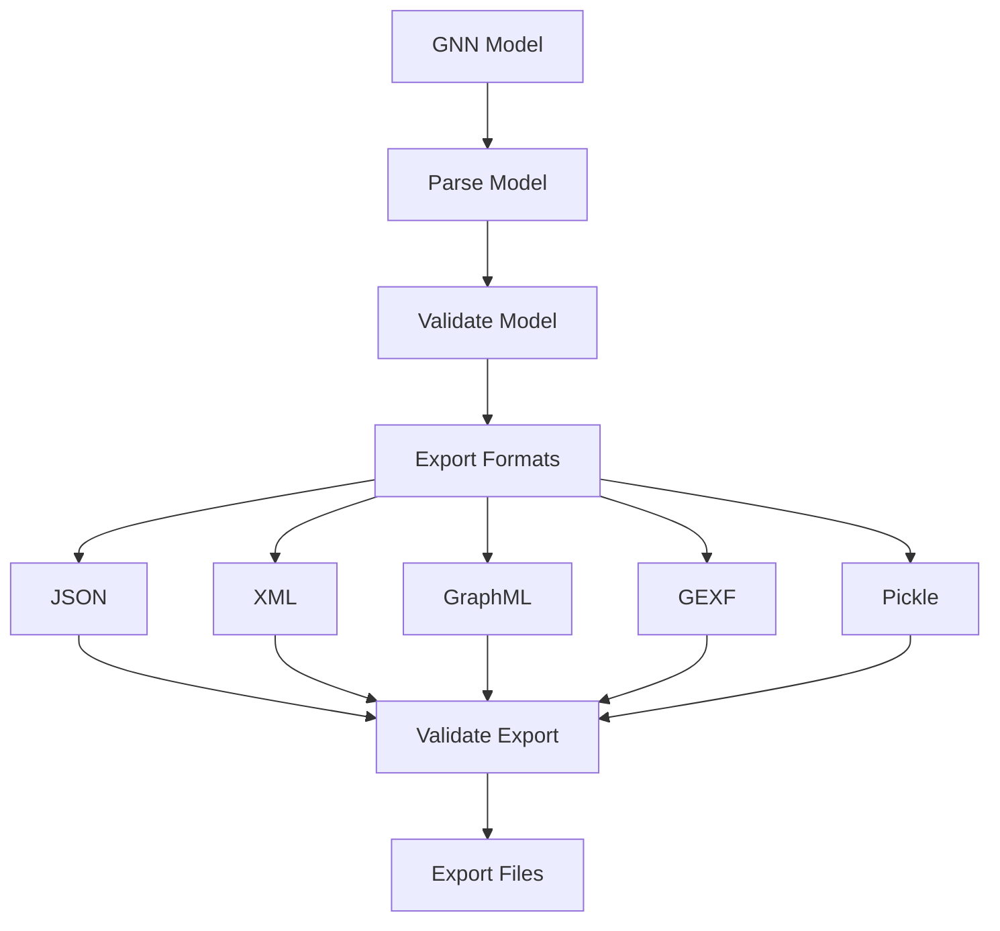

# GNN Export Guide

**Version**: v1.1.0  
**Last Updated**: February 9, 2026  
**Status**: ✅ Production Ready  
**Test Count**: 1,083 Tests Passing  

This document provides comprehensive guidance on multi-format export capabilities for Generalized Notation Notation (GNN) models, including export formats, validation, and semantic preservation.

## Overview

GNN export enables conversion of GNN models to multiple formats with semantic preservation and cross-format compatibility. Export supports standard formats (JSON, XML), graph formats (GraphML, GEXF), and binary formats (Pickle) for various use cases.

The GNN export system provides:

- **Multi-Format Export**: Export to multiple formats simultaneously
- **Semantic Preservation**: Maintaining model semantics across formats
- **Validation**: Export integrity validation
- **Cross-Format Compatibility**: Ensuring compatibility between formats

## Export Pipeline Integration

GNN export is integrated into the 25-step processing pipeline:

**Step 7: Export** (`7_export.py`)

- Multi-format export generation
- Export validation
- See: [src/export/AGENTS.md](../../src/export/AGENTS.md)

**Quick Start:**

```bash
# Generate exports
python src/main.py --only-steps "3,7" --target-dir input/gnn_files --verbose

# Export specific formats
python src/7_export.py --target-dir input/gnn_files --output-dir output --formats "json,xml,graphml"
```

## Supported Export Formats

### Standard Formats

#### JSON Export

- Human-readable format
- Widely compatible
- Schema validation support
- Use case: Data exchange, API integration

#### XML Export

- Industry standard format
- DTD/XSD validation
- Structured representation
- Use case: Enterprise integration, validation

#### YAML Export

- Configuration-friendly format
- Human-readable
- Hierarchical structure
- Use case: Configuration management

### Graph Formats

#### GraphML Export

- Standard graph format
- Network analysis tools (Cytoscape, yEd)
- Node and edge attributes
- Use case: Network analysis, visualization

#### GEXF Export

- Gephi visualization format
- Interactive visualization
- Dynamic attributes
- Use case: Network visualization, analysis

### Binary Formats

#### Pickle Export

- Fast Python serialization
- Python-specific format
- Complete object preservation
- Use case: Python persistence, caching

## Export Workflow

The export workflow:



## Export Processing

### Basic Export

```python
from export.format_exporters import _gnn_model_to_dict, export_to_json_gnn

# Parse a GNN markdown file into a structured dictionary
gnn_model = _gnn_model_to_dict("input/gnn_files/model.md")
# Returns: {ModelName, StateSpaceBlock, Connections, InitialParameterization, ...}

# Export to JSON
export_to_json_gnn(gnn_model, "output/7_export_output/model.json")
```

### Format-Specific Export

```python
from export.format_exporters import (
    _gnn_model_to_dict,
    export_to_json_gnn,
    export_to_xml_gnn,
    export_to_python_pickle,
    export_to_gexf,
    export_to_graphml,
    export_to_json_adjacency_list,
    export_to_plaintext_summary,
    export_to_plaintext_dsl
)

gnn_model = _gnn_model_to_dict("input/gnn_files/model.md")

# Export to multiple formats
export_to_xml_gnn(gnn_model, "output/exports/model.xml")
export_to_gexf(gnn_model, "output/exports/model.gexf")
export_to_graphml(gnn_model, "output/exports/model.graphml")
export_to_python_pickle(gnn_model, "output/exports/model.pkl")
export_to_plaintext_summary(gnn_model, "output/exports/model_summary.txt")
```

## Semantic Preservation

Export maintains model semantics across formats:

### Preservation Features

- **Structure Preservation**: Model structure maintained
- **Metadata Preservation**: Model metadata preserved
- **Relationship Preservation**: Relationships maintained
- **Type Information**: Type information preserved

### Cross-Format Compatibility

Export ensures compatibility between formats:

- **Round-Trip Conversion**: Models can be converted between formats
- **Semantic Equivalence**: Formats maintain semantic equivalence
- **Validation**: Cross-format validation
- **Consistency**: Consistent representation across formats

## Export Validation

Export validation ensures export integrity:

### Validation Features

- **Schema Validation**: Format schema validation
- **Integrity Checking**: Export integrity verification
- **Semantic Validation**: Semantic consistency validation
- **Error Reporting**: Detailed validation error reporting

## Best Practices

### Export Usage

- **Format Selection**: Choose appropriate formats for use case
- **Validation**: Validate exports after generation
- **Metadata**: Preserve metadata across formats
- **Documentation**: Document export format usage

### Model Development

- **Early Export**: Export models early for validation
- **Multiple Formats**: Export to multiple formats for compatibility
- **Version Control**: Track export format versions
- **Testing**: Test exports with target applications

## Integration with Pipeline

Export integrates throughout the pipeline:

1. **Core Processing** (Steps 0-9): Export generation during processing
2. **Simulation** (Steps 10-16): Export of execution results
3. **Integration** (Steps 17-24): Export results in comprehensive outputs

## Related Documentation

- **[Export Module](../../src/export/AGENTS.md)**: Implementation details
- **[Export Documentation](../export/README.md)**: Export documentation overview
- **[Pkl Integration](../pkl/pkl_gnn.md)**: Configuration-as-code export
- **[GNN Tools](gnn_tools.md)**: Complete GNN tools reference

## See Also

- **[Pipeline Documentation](../gnn/gnn_tools.md)**: Complete pipeline guide
- **[GNN Overview](gnn_overview.md)**: Core GNN concepts
- **[GNN Implementation Guide](gnn_implementation.md)**: Implementation guidance

---

**Status**: ✅ Production Ready  
**Last Updated**: February 9, 2026  
**Version**: v1.1.0
