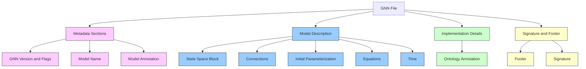
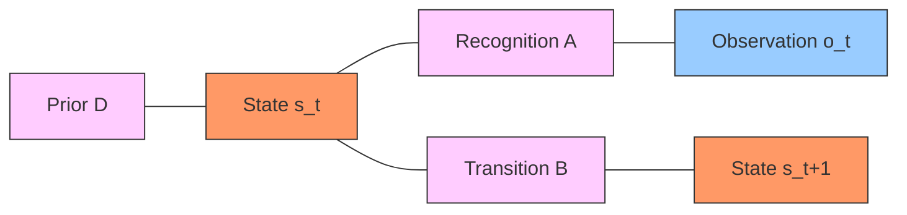
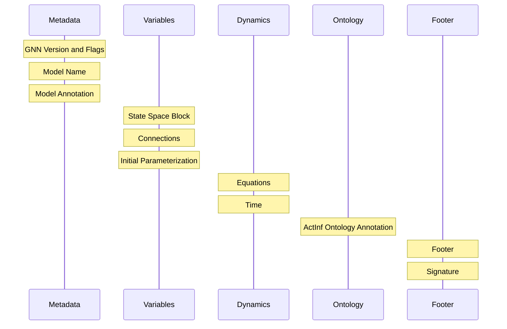
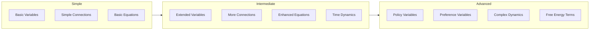

# GNN File Structure

**Version**: v1.1.0  
**Last Updated**: February 9, 2026  
**Status**: ✅ Production Ready  
**Test Count**: 1,127 Tests Passing  

This document provides a comprehensive guide to the structure and organization of GNN files.

## Pipeline Processing

GNN files are processed and validated through the GNN processing pipeline:

**Parsing and Validation (Steps 3, 5, 6)**

- **`src/3_gnn.py`** → GNN file discovery and multi-format parsing
  - See: **[src/gnn/AGENTS.md](../../src/gnn/AGENTS.md)** for parser implementation
- **`src/5_type_checker.py`** → Type checking and dimensional validation
  - See: **[src/type_checker/AGENTS.md](../../src/type_checker/AGENTS.md)** for type validation
- **`src/6_validation.py`** → Advanced consistency checking

**Quick Start:**

```bash
# Parse and validate GNN files
python src/main.py --only-steps "3,5,6" --target-dir input/gnn_files --verbose
```

For complete pipeline documentation, see **[src/AGENTS.md](../../src/AGENTS.md)**.

---

## Overview

A GNN file is structured as a Markdown document with specific sections that describe different aspects of an Active Inference model. The file follows a standardized format that enables both human readability and machine processing.



## Required Sections

A complete GNN file includes the following sections in this order:

### 1. GNN Version and Flags

Specifies the version of GNN being used and any optional flags or settings that affect interpretation.

```
## GNN v1
flags=latex_rendering,graphviz_compatible
```

This section indicates compatibility with specific tools or specifications.

### 2. Model Name

Provides a unique identifier for the model, typically as a top-level header.

```
# Dynamic Perception Model v2.1
```

The model name should be concise but descriptive, often including version information.

### 3. Model Annotation

A free-text description of the model, its purpose, context, and key features.

```
## Model annotations
This model implements a dynamic perception process with hidden states 
and observations evolving over time. It demonstrates basic perceptual 
inference without action selection.
```

This section helps users understand the model's purpose and scope.

### 4. State Space Block

Defines all variables in the model, including their dimensions and types.

```
## State space block
s_t[2,1,type=float]  # Hidden state (2-dimensional column vector)
o_t[2,1,type=float]  # Observation (2-dimensional column vector)
A[2,2,type=float]    # Recognition matrix (2x2 matrix)
B[2,2,type=float]    # Transition matrix (2x2 matrix)
D[2,1,type=float]    # Prior (2-dimensional column vector)
t[1,type=int]        # Time index (scalar)
```

This section is crucial for understanding the model's structure and computational requirements.

### 5. Connections

Describes the causal relationships between variables using directed and undirected edges.

```
## Connections
D-s_t    # Prior constrains hidden state
s_t-A    # Hidden state relates to recognition matrix
A-o_t    # Recognition matrix relates to observation
s_t-B    # Hidden state relates to transition matrix
B-s_t+1  # Transition matrix determines next state
```

The connections section defines the graphical structure of the model.



### 6. Initial Parameterization

Sets the starting values for parameters and variables in the model.

```
## Initial Parameterization
D={0.5,0.5}
A={(.9,.1),(.2,.8)}
B={(.7,.3),(.3,.7)}
```

This section provides the concrete values needed to initialize the model.

### 7. Equations

Contains the mathematical formulas that define the model's dynamics, typically expressed in LaTeX.

```
## Equations
s_{tau=1}=softmax((1/2)(ln(D)+ln(B^dagger_tau*s_{tau+1})+ln(trans(A)o_tau))
s_{tau>1}=softmax((1/2)(ln(D)+ln(B^dagger_tau*s_{tau+1})+ln(trans(A)o_tau))
```

The equations specify how variables evolve and interact over time.

### 8. Time

Describes how the model handles time, including whether it's static or dynamic, discrete or continuous.

```
## Time
Dynamic
DiscreteTime=s_t
ModelTimeHorizon=10
```

This section is crucial for understanding the model's temporal characteristics.

### 9. ActInf Ontology Annotation

Maps variables to standardized terms in the Active Inference Ontology for consistent interpretation.

```
## Active Inference Ontology
A=RecognitionMatrix
B=TransitionMatrix
D=Prior
s_t=HiddenState
o_t=Observation
t=Time
```

This mapping enables interoperability with other Active Inference models and tools.

### 10. Footer

A closing section that marks the end of the model definition, typically repeating the model name.

```
# Dynamic Perception Model v2.1
```

### 11. Signature

Optional cryptographic or authorship information validating the file's provenance.

```
## Signature
Author: Jane Smith
Date: 2023-06-15
Hash: a1b2c3d4e5f6g7h8i9j0
```

## Example of a Complete GNN File

Below is an example of a complete GNN file for a simple dynamic perception model:

```
## GNN v1

# Simple Dynamic Perception Model

## Model annotations
This model demonstrates perceptual inference with a 
two-dimensional hidden state and observation space.
The model updates beliefs over discrete time steps.

## State space block
s_t[2,1,type=float]  # Hidden state
o_t[2,1,type=float]  # Observation
A[2,2,type=float]    # Recognition matrix
B[2,2,type=float]    # Transition matrix
D[2,1,type=float]    # Prior
t[1,type=int]        # Time index

## Connections
D-s_t
s_t-A
A-o_t
s_t-B
B-s_t+1

## Initial Parameterization
D={0.5,0.5}
A={(.9,.1),(.2,.8)}
B={(.7,.3),(.3,.7)}

## Equations
s_{tau=1}=softmax((1/2)(ln(D)+ln(B^dagger_tau*s_{tau+1})+ln(trans(A)o_tau))
s_{tau>1}=softmax((1/2)(ln(D)+ln(B^dagger_tau*s_{tau+1})+ln(trans(A)o_tau))

## Time
Dynamic
DiscreteTime=s_t
ModelTimeHorizon=10

## Active Inference Ontology
A=RecognitionMatrix
B=TransitionMatrix
D=Prior
s_t=HiddenState
o_t=Observation
t=Time

# Simple Dynamic Perception Model

## Signature
Author: Active Inference Institute
Date: 2023-04-01
```

## File Structure Visualization

The overall structure of a GNN file follows this pattern:



## Progressive Model Development

GNN files support incremental model development by allowing sections to be extended or refined:



A model can start as a simple perceptual model and progressively add features:

1. Start with basic perception (states, observations)
2. Add temporal dynamics (transitions over time)
3. Incorporate action selection (policies)
4. Include preferences and expected free energy

## Best Practices for GNN Files

When creating GNN files:

1. **Follow the section order** presented above for consistency
2. **Use clear variable names** that reflect their role in the model
3. **Include detailed annotations** to explain model purpose and components
4. **Be precise with dimensionality** specifications for all variables
5. **Match ontology terms** to standardized Active Inference concepts
6. **Validate equations** for mathematical correctness
7. **Use consistent formatting** throughout the document
8. **Include version information** for both GNN and your model

## Machine-Readable Format

For automated processing, GNN file structures are available in a machine-readable format at `src/gnn/documentation/file_structure.md`, which defines each section and its expected content.

## References

1. Smékal, J., & Friedman, D. A. (2023). Generalized Notation Notation for Active Inference Models. Active Inference Institute. <https://doi.org/10.5281/zenodo.7803328>
2. Active Inference Institute: [Generalized Notation Notation (GNN) GitHub Repository](https://github.com/ActiveInferenceInstitute/GeneralizedNotationNotation)
3. Machine-readable specification: [GNN File Structure Specification](../../src/gnn/processor.py)
