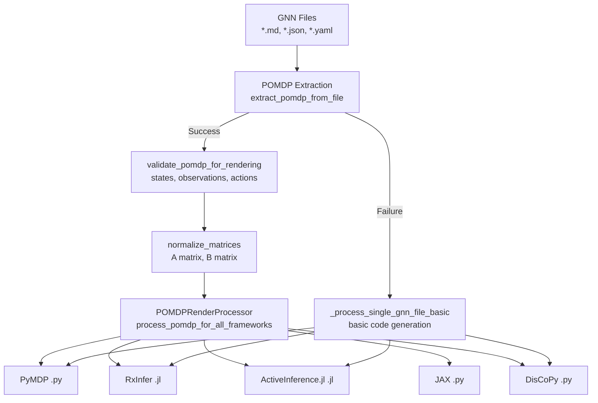
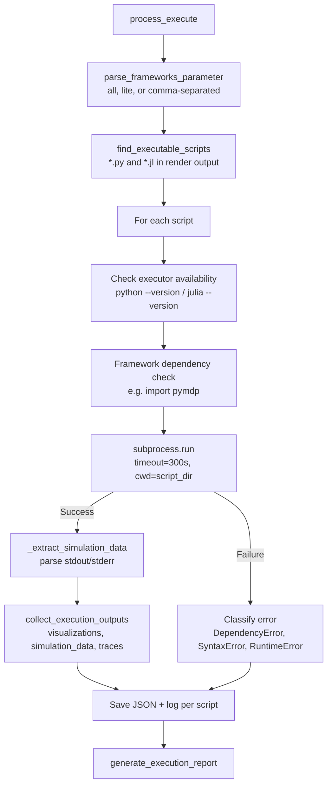
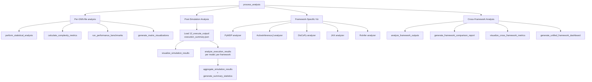
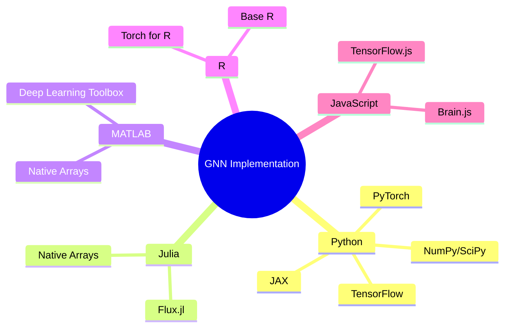
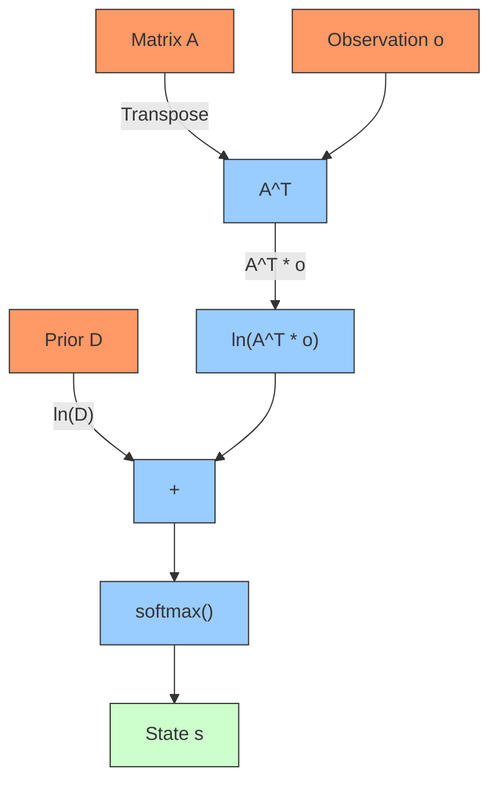
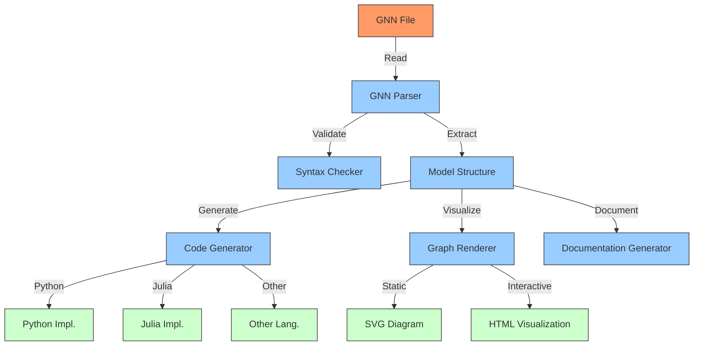
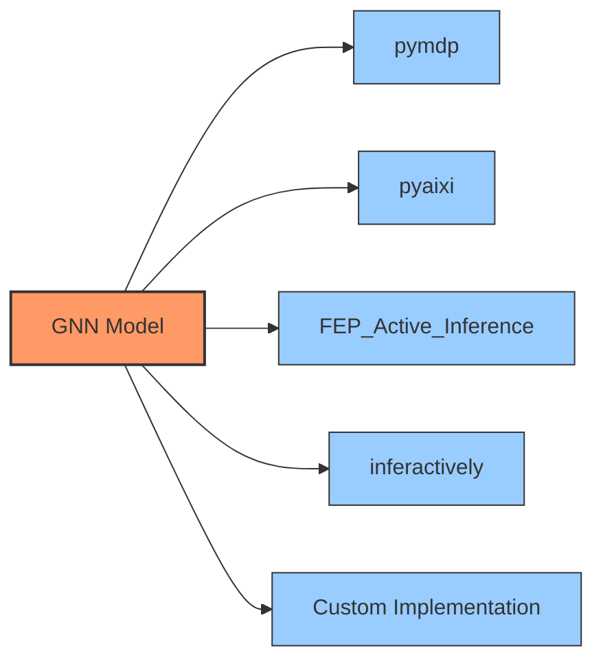

# GNN Implementation Guide

**Version**: v1.1.0  
**Last Updated**: February 9, 2026  
**Status**: ✅ Production Ready  
**Test Count**: 1,127 Tests Passing  

This document provides guidance on how to implement GNN models in computational environments, with practical code examples and workflows.

## Pipeline-Based Implementation

GNN models are implemented through the processing pipeline's code generation and execution steps:

**Code Generation (Step 11)**

- **`src/11_render.py`** → Generate executable code for multiple frameworks
  - See: **[src/render/AGENTS.md](../../src/render/AGENTS.md)** for rendering details
  - Supports: PyMDP, RxInfer, ActiveInference.jl, DisCoPy, JAX

**Execution (Step 12)**

- **`src/12_execute.py`** → Execute rendered simulation scripts
  - See: **[src/execute/AGENTS.md](../../src/execute/AGENTS.md)** for execution details

**Quick Start:**

```bash
# Generate and execute implementations
python src/main.py --only-steps "3,11,12" --target-dir input/gnn_files --verbose

# Execute specific frameworks
python src/12_execute.py --frameworks "pymdp,jax" --verbose
```

For complete pipeline documentation, see **[src/AGENTS.md](../../src/AGENTS.md)**.

---

## Step 11 — Render Module Deep Dive

The render module (`src/render/`) transforms GNN specifications into executable code for five Active Inference frameworks. It follows a POMDP-aware processing pipeline.

### Processing Pipeline



### POMDP-Aware Processing

The core function `process_render()` in `src/render/processor.py` implements:

1. **POMDP Extraction** — Extracts state space dimensions (`num_states`, `num_observations`, `num_actions`) and matrices (A, B, C, D) from GNN files via `gnn.pomdp_extractor.extract_pomdp_from_file()`
2. **Validation** — `validate_pomdp_for_rendering()` checks that all required dimensions are positive and present
3. **Matrix Normalization** — `normalize_matrices()` ensures:
   - **A matrix** (observation model): columns sum to 1 over the observation dimension
   - **B matrix** (transition model): columns sum to 1 over the next-state dimension, per action
   - Handles 2D arrays, 3D arrays, and list-of-arrays (factorial) structures
   - Zero-sum columns are replaced with uniform distributions

### `render_gnn_spec()` API

```python
from render.processor import render_gnn_spec

success, message, warnings = render_gnn_spec(
    gnn_spec={"model_name": "my_model", ...},
    target="pymdp",           # pymdp | rxinfer | rxinfer_toml | activeinference_jl | discopy | discopy_combined | jax | jax_pomdp
    output_directory="output/",
    options={}                # Optional additional options
)
```

### Available Renderers

| Renderer | Language | Extension | Supported Features |
|----------|----------|-----------|--------------------|
| **PyMDP** | Python | `.py` | POMDP, MDP, Belief State Updates, Active Inference |
| **RxInfer.jl** | Julia | `.jl` | Message Passing, Probabilistic Programming, Bayesian Inference |
| **ActiveInference.jl** | Julia | `.jl` | Free Energy Minimization, Active Inference, POMDP |
| **JAX** | Python | `.py` | GPU Acceleration, Automatic Differentiation, JIT Compilation |
| **DisCoPy** | Python | `.py` | Categorical Diagrams, String Diagrams, Compositional Models |

### Output Structure

```
output/11_render_output/
├── {model_name}/
│   ├── pymdp/                  # PyMDP Python simulations
│   ├── rxinfer/                # RxInfer.jl Julia simulations
│   ├── activeinference_jl/     # ActiveInference.jl Julia simulations
│   ├── jax/                    # JAX Python simulations
│   └── discopy/                # DisCoPy categorical diagrams
├── render_processing_summary.json
└── README.md                   # Auto-generated overview
```

---

## Step 12 — Execute Module Deep Dive

The execute module (`src/execute/`) runs the scripts generated by the render step, collecting their outputs and extracting simulation data.

### Execution Flow



### Framework Filtering

The `--frameworks` flag supports:

| Value | Frameworks Included |
|-------|---------------------|
| `all` (default) | pymdp, jax, discopy, rxinfer, activeinference_jl |
| `lite` | pymdp, jax, discopy |
| Custom | Comma-separated, e.g. `"pymdp,jax"` |

### Script Discovery

`find_executable_scripts()` searches `output/11_render_output/` recursively for `.py` and `.jl` files, skipping test files, `__init__.py`, and README files. Each script is tagged with its framework based on its parent directory path.

### Subprocess Execution

`execute_single_script()` runs each script:

- **Working directory**: set to the script's parent directory
- **Timeout**: 300 seconds (5 minutes) per script
- **Environment**: `PYTHONPATH` is extended for PyMDP scripts
- **Julia**: dependency check for RxInfer, ActiveInference, GraphPPL packages

### Data Collection

After successful execution, `collect_execution_outputs()` gathers framework-specific artifacts:

- **PyMDP**: `output/pymdp_simulations/` — `.png`, `.svg`, `.json`, `.pkl`
- **DisCoPy**: `discopy_diagrams/` — `.png`, `.svg`, `.json`
- **ActiveInference.jl**: `activeinference_outputs_*/visualizations/` and `simulation_data/`
- **RxInfer**: `rxinfer_outputs_*/` — `.json`, `.csv`, `.png`
- **JAX**: `jax_outputs_*/` — `.json`, `.npy`, `.png`

### Output Structure

```
output/12_execute_output/
├── {model_name}/
│   └── {framework}/
│       └── execution_logs/
│           ├── {script}_results.json    # Structured results
│           └── {script}_execution.log   # Human-readable log
├── individual_outputs/
│   └── {framework}/
│       └── {script}_output.txt
├── execution_summary.json               # Overall results
└── execution_report.md                  # Human-readable report
```

---

## Step 16 — Analysis Module Deep Dive

The analysis module (`src/analysis/`) provides statistical analysis, post-simulation analysis with Active Inference metrics, cross-framework comparison, and visualization generation.

### Analysis Pipeline



### Post-Simulation Analysis

The `post_simulation.py` module (2,147 lines) provides framework-agnostic analysis of simulation results:

| Function | Purpose |
|----------|---------|
| `analyze_simulation_traces()` | Analyze state/observation/action trajectories |
| `analyze_free_energy()` | Free energy dynamics, convergence rate, final value |
| `analyze_policy_convergence()` | Policy evolution and convergence detection |
| `analyze_state_distributions()` | Belief state distribution analysis over time |
| `compare_framework_results()` | Cross-framework comparison of identical models |

### Active Inference Metrics

The module computes the following Active Inference-specific statistical measures:

| Metric | Function | Description |
|--------|----------|-------------|
| **Shannon Entropy** | `compute_shannon_entropy(distribution)` | Entropy of a probability distribution (nats) |
| **KL Divergence** | `compute_kl_divergence(p, q)` | D_KL(P \|\| Q) between two distributions |
| **Variational Free Energy** | `compute_variational_free_energy(obs, beliefs, A, prior)` | F = E_q[ln q(s)] − E_q[ln p(o,s)] |
| **Expected Free Energy** | `compute_expected_free_energy(beliefs, A, B, C, policy, horizon)` | G = epistemic value + pragmatic value |
| **Information Gain** | `compute_information_gain(prior, posterior)` | D_KL(posterior \|\| prior) |

These are assembled by `analyze_active_inference_metrics()` which takes complete simulation trajectories (beliefs, free energy, actions) and returns a comprehensive metrics dictionary.

### Framework-Specific Data Extraction

Each framework has a dedicated extraction function in `post_simulation.py`:

- `extract_pymdp_data()` — beliefs, actions, free energy, observations from PyMDP output
- `extract_rxinfer_data()` — posterior distributions from RxInfer JSON/CSV output  
- `extract_activeinference_jl_data()` — full Active Inference fields from `simulation_results.csv`
- `extract_jax_data()` — JAX simulation output extraction
- `extract_discopy_data()` — diagram execution counts and categorical outputs

### Output Structure

```
output/16_analysis_output/
├── analysis_results.json               # Complete analysis results
├── analysis_summary.md                 # Human-readable summary
├── {model}_post_simulation_analysis.json
├── pymdp/                              # PyMDP-specific visualizations
├── activeinference_jl/                 # ActiveInference.jl visualizations
├── discopy/                            # DisCoPy visualizations
├── jax/                                # JAX visualizations
├── rxinfer/                            # RxInfer visualizations
└── cross_framework/                    # Cross-framework comparisons
    └── unified_dashboard/              # Multi-panel comparison dashboard
```

---

## Implementation Workflow

The process of implementing a GNN model follows these general steps:

```mermaid
graph TD
    GNN[GNN Specification] --> PARSE[Parse GNN File]
    PARSE --> VARS[Initialize Variables]
    VARS --> STRUCT[Set Up Model Structure]
    STRUCT --> IMPL[Implement Equations]
    IMPL --> TEST[Test and Validate]
    TEST --> REFINE[Refine Model]
    
    classDef start fill:#f96,stroke:#333,stroke-width:2px;
    classDef process fill:#9cf,stroke:#333,stroke-width:1px;
    classDef end fill:#cfc,stroke:#333,stroke-width:1px;
    
    class GNN start;
    class PARSE,VARS,STRUCT,IMPL process;
    class TEST,REFINE end;
```

## Prerequisites

Before implementing a GNN model, you should have:

1. A complete GNN specification file
2. Understanding of the model's purpose and functionality
3. Programming environment with appropriate libraries
4. Testing data or simulation environment

## Implementation Approaches

GNN models can be implemented in various programming environments:



## Step 1: Parsing GNN Files

The first step is to parse the GNN file to extract model structure and parameters.

### Python Example

```python
import re

def parse_gnn_file(file_path):
    """Parse a GNN file and extract sections."""
    with open(file_path, 'r') as f:
        content = f.read()
    
    # Regular expressions to extract sections
    version_match = re.search(r'## GNN (v\d+(?:\.\d+)*)', content)
    model_name_match = re.search(r'# ([^\n]+)', content)
    
    # Extract state space block
    state_space_block = re.search(r'## State space block\n(.*?)(?=##)', 
                                  content, re.DOTALL)
    
    # Extract connections
    connections_block = re.search(r'## Connections\n(.*?)(?=##)', 
                                 content, re.DOTALL)
    
    # Extract equations
    equations_block = re.search(r'## Equations\n(.*?)(?=##)', 
                               content, re.DOTALL)
    
    # Return structured data
    return {
        'version': version_match.group(1) if version_match else None,
        'model_name': model_name_match.group(1) if model_name_match else None,
        'state_space': state_space_block.group(1).strip() if state_space_block else None,
        'connections': connections_block.group(1).strip() if connections_block else None,
        'equations': equations_block.group(1).strip() if equations_block else None,
        # Add other sections as needed
    }

# Usage example
model_data = parse_gnn_file('path/to/model.gnn')
print(f"Model: {model_data['model_name']}")
print(f"Version: {model_data['version']}")
```

## Step 2: Setting Up Variables

After parsing, you need to initialize the variables with appropriate dimensions.

### Python with NumPy Example

```python
import numpy as np
import re

def initialize_variables(state_space_text):
    """Initialize variables based on the state space block."""
    variables = {}
    
    # Split into lines and process each variable definition
    for line in state_space_text.split('\n'):
        if not line.strip() or line.strip().startswith('#'):
            continue
            
        # Match variable name and dimensions
        var_match = re.match(r'(\w+)(?:_\w+)?\s*\[([^\]]+)\]', line)
        if var_match:
            var_name = var_match.group(1)
            dimensions = var_match.group(2)
            
            # Parse dimensions (handling both numeric and symbolic dimensions)
            dims = []
            for dim in dimensions.split(','):
                dim = dim.strip()
                if re.match(r'^\d+$', dim):  # Numeric dimension
                    dims.append(int(dim))
                elif 'type=' in dim:  # Type specification, ignore for now
                    continue
                else:  # Symbolic dimension (e.g., len(π))
                    # For now, we'll use a placeholder value
                    dims.append(2)  # Default to 2 for symbolic dimensions
            
            # Create the variable with zeros
            if len(dims) == 1:
                variables[var_name] = np.zeros(dims[0])
            elif len(dims) == 2:
                variables[var_name] = np.zeros((dims[0], dims[1]))
            else:
                variables[var_name] = np.zeros(tuple(dims))
    
    return variables

# Usage example
variables = initialize_variables(model_data['state_space'])
print("Initialized variables:")
for name, var in variables.items():
    print(f"{name}: shape {var.shape}")
```

## Step 3: Setting Up Model Structure

Next, establish the connections between variables based on the model's graphical structure.

### Python Structure Example

```python
def parse_connections(connections_text):
    """Parse connections between variables."""
    connections = {'directed': [], 'undirected': []}
    
    for line in connections_text.split('\n'):
        line = line.strip()
        if not line or line.startswith('#'):
            continue
        
        # Check for directed connections (A>B)
        if '>' in line:
            source, target = line.split('>')
            connections['directed'].append((source.strip(), target.strip()))
        # Check for undirected connections (A-B)
        elif '-' in line:
            var1, var2 = line.split('-')
            connections['undirected'].append((var1.strip(), var2.strip()))
    
    return connections

# Usage example
connections = parse_connections(model_data['connections'])
print("Directed connections:", connections['directed'])
print("Undirected connections:", connections['undirected'])
```

## Step 4: Implementing Equations

The most challenging part is translating GNN equations into code. Here's a template for implementing some common equations.

### PyTorch Implementation Example

```python
import torch
import torch.nn.functional as F

class GNNModel:
    def __init__(self, variables, connections):
        """Initialize the model with variables and connections."""
        self.variables = variables
        self.connections = connections
        
        # Convert NumPy arrays to PyTorch tensors
        for key, value in self.variables.items():
            if isinstance(value, np.ndarray):
                self.variables[key] = torch.tensor(value, dtype=torch.float32)
    
    def softmax(self, x):
        """Softmax function."""
        return F.softmax(x, dim=0)
    
    def static_perception_step(self):
        """Implement a simple static perception step."""
        # Example equation: s = softmax(ln(D) + ln(A^T * o))
        D = self.variables.get('D', torch.ones(1))
        A = self.variables.get('A', torch.eye(2))
        o = self.variables.get('o', torch.ones(2, 1))
        
        # Compute the equation
        log_D = torch.log(D + 1e-10)  # Add small value to avoid log(0)
        A_transpose = torch.transpose(A, 0, 1)
        A_transpose_o = torch.matmul(A_transpose, o)
        log_A_transpose_o = torch.log(A_transpose_o + 1e-10)
        
        # Apply softmax
        s = self.softmax(log_D + log_A_transpose_o)
        
        # Update the state variable
        self.variables['s'] = s
        return s
    
    def dynamic_perception_step(self, time_step):
        """Implement a dynamic perception step."""
        # Simplified implementation - would need to be expanded for full model
        pass

# Usage example
model = GNNModel(variables, connections)
state = model.static_perception_step()
print("Updated state:", state)
```

## Step 5: Testing and Validation

Thoroughly test your GNN implementation with known inputs and expected outputs.

- **Unit tests**: Test individual functions and components.
- **Integration tests**: Test the entire model workflow.
- **Validation against theory**: Ensure model behavior aligns with Active Inference principles.

## Step 6: Model Refinement

Iteratively refine the model based on test results and further analysis.

- **Parameter tuning**: Adjust model parameters for desired behavior.
- **Structural changes**: Modify connections or equations if needed.
- **Optimization**: Improve computational efficiency.

## Organizing GNN Processing Tools: A Practical Approach

When developing a comprehensive environment for working with GNN, it's beneficial to structure your tools and processing steps in a modular and manageable way. The GNN project itself (which this documentation is part of) provides a practical example of such an organization within its `src/` directory.

**Key Principles Demonstrated:**

1. **Central Orchestrator (`src/main.py`):**
    - A main script (e.g., `src/main.py`) acts as the primary entry point for all GNN processing tasks.
    - It handles common functionalities like command-line argument parsing (for selecting GNN files, output directories, specific tasks to run, verbosity, etc.), loading configurations, and initializing shared resources.
    - This central script then calls individual modules or sub-scripts that perform specific stages of the processing.

2. **Modular, Numbered Scripts for Pipeline Stages:**
    - Specific tasks (e.g., core GNN parsing, setup, testing, type checking, export, visualization, ontology mapping) are implemented in separate Python scripts.
    - These scripts are often numbered (e.g., `1_setup.py`, `3_gnn.py`, `5_type_checker.py`) to indicate a logical sequence of execution or dependency.
    - Each script typically focuses on one primary function and can be developed and tested independently.
    - The orchestrator (`main.py`) dynamically discovers these numbered scripts and executes them in order, passing necessary arguments and context.

3. **Dedicated Subdirectories for Modules:**
    - Larger, more complex processing stages (like type checking or visualization) can have their own subdirectories (e.g., `src/type_checker/`, `src/visualization/`) containing their specific logic, helper files, and potentially their own internal main scripts if they can also be run standalone for debugging or specific use cases.

**Benefits of this Approach:**

- **Clarity and Organization:** The processing pipeline is clearly defined, and each step has a dedicated module.
- **Modularity:** Individual components can be updated or replaced without affecting the entire system.
- **Scalability:** New processing steps can be easily added by creating a new numbered script.
- **Flexibility:** The orchestrator can allow users to run the full pipeline, skip steps, or run only specific steps, as demonstrated by the `src/main.py` script's `--skip-steps` and `--only-steps` options.
- **Reusability:** Core logic within each module can potentially be reused in other contexts.

This structured approach, as seen in the GNN project's `src/` directory and `main.py`, is a recommended pattern for implementing a robust and maintainable GNN processing workflow.

## Advanced Topics

## Implementation Examples for Different Models

Let's look at implementations for the different complexity levels.

### 1. Static Perception Model



Python implementation for a static perception model:

```python
def static_perception(D, A, o):
    """
    Implements static perception: s = softmax(ln(D) + ln(A^T * o))
    
    Args:
        D: Prior (numpy array, shape [n, 1])
        A: Recognition matrix (numpy array, shape [m, n])
        o: Observation (numpy array, shape [m, 1])
    
    Returns:
        s: Inferred state (numpy array, shape [n, 1])
    """
    # Ensure numerical stability
    epsilon = 1e-10
    
    # Calculate A^T * o
    A_transpose = A.T
    A_transpose_o = np.dot(A_transpose, o)
    
    # Calculate ln(D) + ln(A^T * o)
    log_D = np.log(D + epsilon)
    log_A_transpose_o = np.log(A_transpose_o + epsilon)
    
    # Apply softmax
    input_to_softmax = log_D + log_A_transpose_o
    exp_input = np.exp(input_to_softmax - np.max(input_to_softmax))
    s = exp_input / np.sum(exp_input)
    
    return s
```

### 2. Dynamic Perception Model

For dynamic models, we need to track state over time.

```python
def dynamic_perception(D, A, B, o_sequence, num_timesteps):
    """
    Implements dynamic perception model.
    
    Args:
        D: Prior (numpy array, shape [n, 1])
        A: Recognition matrix (numpy array, shape [m, n])
        B: Transition matrix (numpy array, shape [n, n])
        o_sequence: Sequence of observations (numpy array, shape [m, T])
        num_timesteps: Number of time steps to simulate
    
    Returns:
        s_sequence: Sequence of inferred states (numpy array, shape [n, T])
    """
    n = D.shape[0]
    T = o_sequence.shape[1]
    s_sequence = np.zeros((n, T))
    
    # Initialize with static perception for the first step
    s_sequence[:, 0:1] = static_perception(D, A, o_sequence[:, 0:1])
    
    # Process remaining time steps
    for t in range(1, T):
        # Prediction step (forward message passing)
        s_predicted = np.dot(B, s_sequence[:, t-1:t])
        
        # Update step (backward message passing)
        o_t = o_sequence[:, t:t+1]
        A_transpose = A.T
        A_transpose_o = np.dot(A_transpose, o_t)
        
        # Combine prediction and likelihood
        epsilon = 1e-10
        log_prediction = np.log(s_predicted + epsilon)
        log_likelihood = np.log(A_transpose_o + epsilon)
        
        # Apply softmax
        input_to_softmax = log_prediction + log_likelihood
        exp_input = np.exp(input_to_softmax - np.max(input_to_softmax))
        s_sequence[:, t:t+1] = exp_input / np.sum(exp_input)
    
    return s_sequence
```

## Implementation with Different Frameworks

Implementations will vary based on the framework used. Here are examples for different platforms:

### PyTorch Implementation

```python
import torch
import torch.nn as nn
import torch.nn.functional as F

class ActiveInferenceModel(nn.Module):
    def __init__(self, state_dim, obs_dim):
        super().__init__()
        self.state_dim = state_dim
        self.obs_dim = obs_dim
        
        # Initialize learnable parameters
        self.A = nn.Parameter(torch.randn(obs_dim, state_dim))
        self.B = nn.Parameter(torch.randn(state_dim, state_dim))
        self.D = nn.Parameter(torch.ones(state_dim, 1))
        
        # Normalize parameters
        self._normalize_parameters()
    
    def _normalize_parameters(self):
        """Ensure matrices are proper probability distributions."""
        # A: columns sum to 1
        self.A.data = F.softmax(self.A.data, dim=0)
        # B: columns sum to 1
        self.B.data = F.softmax(self.B.data, dim=0)
        # D: sums to 1
        self.D.data = F.softmax(self.D.data, dim=0)
    
    def forward(self, o_sequence):
        """Forward pass through the model."""
        batch_size, seq_len, _ = o_sequence.shape
        s_sequence = torch.zeros(batch_size, seq_len, self.state_dim, 
                                device=o_sequence.device)
        
        # Process each time step
        for t in range(seq_len):
            if t == 0:
                # Initial state from prior
                s_t = self.D.expand(batch_size, -1, -1)
            else:
                # Predict from previous state
                s_prev = s_sequence[:, t-1].unsqueeze(-1)
                s_predicted = torch.bmm(self.B.expand(batch_size, -1, -1), s_prev)
                
                # Update with new observation
                o_t = o_sequence[:, t].unsqueeze(-1)
                A_transpose = self.A.transpose(0, 1).expand(batch_size, -1, -1)
                likelihood = torch.bmm(A_transpose, o_t)
                
                # Combine prediction and likelihood
                s_t = F.softmax(torch.log(s_predicted + 1e-10) + 
                                torch.log(likelihood + 1e-10), dim=1)
            
            # Store state
            s_sequence[:, t] = s_t.squeeze(-1)
        
        return s_sequence
```

### Julia Implementation

```julia
using Flux

struct ActiveInferenceModel
    A::Matrix{Float32}  # Recognition matrix
    B::Matrix{Float32}  # Transition matrix
    D::Vector{Float32}  # Prior
end

function ActiveInferenceModel(state_dim::Int, obs_dim::Int)
    A = softmax(randn(Float32, obs_dim, state_dim), dims=1)
    B = softmax(randn(Float32, state_dim, state_dim), dims=1)
    D = softmax(ones(Float32, state_dim))
    return ActiveInferenceModel(A, B, D)
end

function (m::ActiveInferenceModel)(o_sequence::Array{Float32, 3})
    batch_size, seq_len, obs_dim = size(o_sequence)
    state_dim = size(m.D, 1)
    s_sequence = zeros(Float32, batch_size, seq_len, state_dim)
    
    for t in 1:seq_len
        if t == 1
            # Initial state from prior
            s_t = repeat(m.D, 1, batch_size)
        else
            # Predict from previous state
            s_prev = reshape(s_sequence[:, t-1, :], state_dim, batch_size)
            s_predicted = m.B * s_prev
            
            # Update with new observation
            o_t = reshape(o_sequence[:, t, :], obs_dim, batch_size)
            likelihood = m.A' * o_t
            
            # Combine prediction and likelihood
            s_t = softmax(log.(s_predicted .+ 1f-10) .+ log.(likelihood .+ 1f-10), dims=1)
        end
        
        # Store state
        s_sequence[:, t, :] = s_t'
    end
    
    return s_sequence
end
```

## Visualizing Model Behavior

It's often useful to visualize your model's behavior:

```python
import matplotlib.pyplot as plt

def plot_state_evolution(s_sequence, true_states=None):
    """Plot the evolution of state beliefs over time."""
    time_steps = s_sequence.shape[1]
    state_dim = s_sequence.shape[0]
    
    plt.figure(figsize=(12, 6))
    
    # Plot each state dimension
    for i in range(state_dim):
        plt.plot(range(time_steps), s_sequence[i, :], 
                 label=f'State {i+1}', linewidth=2)
    
    # If true states are provided, plot them as dashed lines
    if true_states is not None:
        for i in range(state_dim):
            plt.plot(range(time_steps), true_states[i, :], '--', 
                     label=f'True State {i+1}', linewidth=1)
    
    plt.xlabel('Time Step')
    plt.ylabel('State Belief / Value')
    plt.title('Evolution of State Beliefs Over Time')
    plt.legend()
    plt.grid(True, alpha=0.3)
    plt.show()

# Example usage
plot_state_evolution(s_sequence, true_states)
```

## Building a GNN Parser and Renderer

A complete GNN system might include components for parsing, validation, and rendering:



## Best Practices

When implementing GNN models:

1. **Start with simplified models** - Begin with static models before moving to dynamic ones
2. **Test each component separately** - Verify matrix operations, probability calculations, etc.
3. **Monitor numerical stability** - Use small epsilon values to avoid log(0) errors
4. **Validate against analytic solutions** - When possible, compare with known results
5. **Use vectorized operations** - For efficiency, especially with larger models
6. **Document assumptions** - Be clear about interpretations of the model's variables
7. **Implement gradual complexity** - Add features one at a time
8. **Version control your code** - Track changes as you implement and refine

## Common Challenges and Solutions

| Challenge | Solution |
|-----------|----------|
| Numerical instability | Add small epsilon to logarithms, use log-sum-exp trick for softmax |
| Dimensionality mismatches | Carefully track dimensions of all variables, use assertions |
| Performance bottlenecks | Use vectorized operations, consider GPU acceleration |
| Convergence issues | Implement gradient clipping, adjust learning rates |
| Memory limitations | Use mini-batches, reconsider model size |
| Debugging equations | Break complex formulas into small, testable components |

## Integration with Active Inference Frameworks

Several existing frameworks can be used with GNN models:



## References

1. Smith, R., Friston, K.J., & Whyte, C.J. (2022). A step-by-step tutorial on active inference and its application to empirical data. Journal of Mathematical Psychology, 107, 102632.
2. Smékal, J., & Friedman, D. A. (2023). Generalized Notation Notation for Active Inference Models. Active Inference Institute. <https://doi.org/10.5281/zenodo.7803328>
3. Hesp, C., Tschantz, A., Millidge, B., Ramstead, M., Friston, K., & Smith, R. (2021). Sophisticated Inference. Neural Computation, 33(3), 713-762.
4. PyTorch Documentation: <https://pytorch.org/docs/stable/index.html>
5. NumPy Documentation: <https://numpy.org/doc/stable/>
