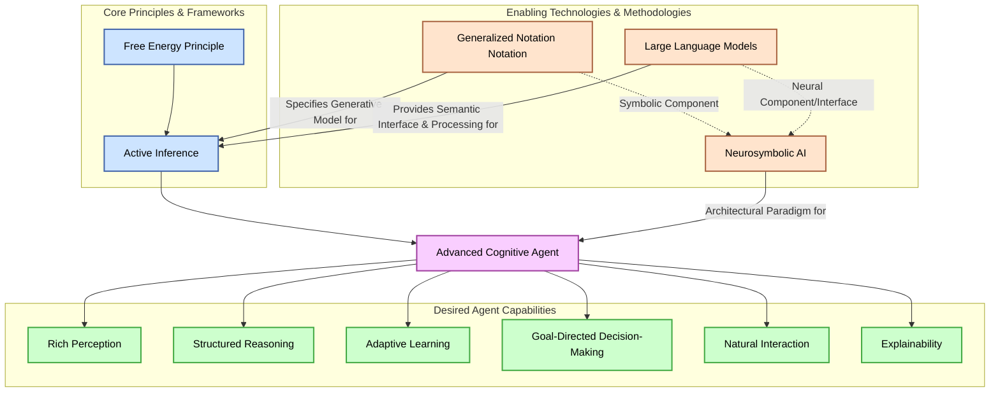

# GNN, LLMs, and Advanced Agents

**Version**: v1.1.0  
**Last Updated**: February 9, 2026  
**Status**: ✅ Production Ready  
**Test Count**: 1,083 Tests Passing  

## 1. Introduction: Bridging Paradigms for Intelligent Systems

The pursuit of artificial general intelligence (AGI) and the development of more sophisticated, autonomous AI agents necessitate the integration of diverse computational paradigms. This document explores the synergistic potential of combining:

* **Generalized Notation Notation (GNN)**: A standardized, text-based language for specifying the formal structure of generative models, particularly within the Active Inference framework. It allows for precise definition of state spaces, probabilistic relationships, and the dynamics of inference and learning.
* **Large Language Models (LLMs)**: Advanced AI models, typically deep learning architectures like Transformers, pre-trained on vast corpora of text and code. LLMs excel at natural language understanding (NLU), generation (NLG), few-shot learning, and forms of common-sense reasoning, providing a rich semantic interface to the world.
* **Neurosymbolic AI**: A research field aiming to fuse the strengths of connectionist approaches (neural networks for learning, pattern recognition, and perceptual grounding) with symbolic AI (logic, explicit knowledge representation, reasoning, and interpretability). This fusion seeks to create systems that are both robust and transparent.
* **The Free Energy Principle (FEP) and Active Inference**:
  * The **Free Energy Principle** is a fundamental theory from neuroscience asserting that any self-organizing system that remains in equilibrium with its environment must minimize its (variational) free energy. Free energy is an information-theoretic quantity that bounds the surprise (or negative log evidence) of sensory inputs given a model of the world.
  * **Active Inference** operationalizes the FEP for sentient systems. It posits that agents build and maintain a generative model of their world. Perception involves inferring the hidden causes of sensations by minimizing free energy (approximating Bayesian inference). Action selection involves choosing actions that are expected to minimize future free energy, effectively seeking out preferred or unsurprising states while also reducing uncertainty about the world.

By integrating these components, we can envision advanced AI agents capable of rich understanding, structured reasoning, and adaptive behavior, all grounded in the principled framework of Active Inference. Such agents would leverage GNN for precise model definition, LLMs for nuanced semantic processing and interaction, and the FEP/Active Inference for a principled approach to perception, learning, and decision-making.



## 2. GNN as the Symbolic Backbone for Generative Models in Active Inference

In a neurosymbolic Active Inference agent, GNN serves as the symbolic "backbone" or formal specification of the agent's **generative model**. This model is not just a passive representation but an active, dynamic construct that underpins perception, learning, and decision-making. It embodies the agent's beliefs about how its sensory data are generated by hidden states in the world, and how these states evolve over time.

**Key roles of GNN in specifying the generative model:**

* **Formal Model Specification**: GNN provides a human-readable and machine-parsable language to explicitly define the probabilistic relationships that constitute the generative model. In Active Inference, this typically includes:
  * **Likelihood Mapping (P(o|s))**: Defines the probability of observing sensory outcomes (o) given hidden states (s). This is often represented by the 'A' matrix (or a more complex function for continuous states).
  * **State Transitions (P(s_t|s_{t-1}, π))**: Defines the probability of transitioning from a hidden state at time t-1 to a state at time t, potentially conditioned on an action or policy (π). This is often represented by the 'B' matrix for each action.
  * **Prior Beliefs about Initial States (P(s_0))**: Defines the agent's initial beliefs about the hidden states of the world, often represented by the 'D' vector.
  * **Prior Preferences (P(o))**: Defines the agent's preferred or expected sensory outcomes. These are not part of the generative process of the world itself, but are crucial for guiding action selection by contributing to the expected free energy. GNN can specify these as target distributions over outcomes.
  * **Policies (π)**: Sequences of actions the agent can take. GNN can define the space of available policies.
  * The GNN syntax allows these components to be detailed with specific dimensions, variable types, and mathematical forms (e.g., categorical distributions, Gaussian distributions).

```mermaid
graph LR
    subgraph GenerativeModel [Agent's Generative Model (Specified by GNN)]
        direction LR
        S_t_minus_1["Hidden State (s_t-1)"] --"P(s_t | s_t-1, π)
        [GNN: Transitions, B-matrix]"--> S_t["Hidden State (s_t)"]
        S_t --"P(o_t | s_t)
        [GNN: Likelihood, A-matrix]"--> O_t["Observation (o_t)"]
        S_0["Initial State (s_0)"] --"P(s_0)
        [GNN: Priors, D-vector]"--> S_t_minus_1
        
        Policy["Policy (π)"] -.-> S_t_minus_1
        Preferences[Prior Preferences P(o)] -.-> O_t
    end

    ExternalWorld[External World Environment]
    ExternalWorld --"Generates True States & Observations"--> AgentInterface[Agent's Sensory Interface]
    AgentInterface --"Provides o_t"--> GenerativeModel
    GenerativeModel --"Infers s_t, Selects π"--> AgentInterface
    AgentInterface --"Executes Action from π"--> ExternalWorld

    classDef gnnSpec fill:#e6ffe6,stroke:#339933,color:black;
    classDef world fill:#ffe6e6,stroke:#993333,color:black;
    classDef agentio fill:#e6e6ff,stroke:#333399,color:black;
    class S_t_minus_1,S_t,O_t,S_0,Policy,Preferences gnnSpec;
    class ExternalWorld world;
    class AgentInterface agentio;
```

* **Interpretability and Explainability**: Because the GNN specification is explicit and details the assumed causal structure of the world, it offers a significant degree of transparency into the agent's "mental model." This facilitates debugging, validation, formal analysis, and understanding of agent behavior based on its internal model.
* **Modularity and Reusability**: GNN models can be developed modularly, representing different aspects of the world (e.g., spatial navigation, social interaction) or different cognitive functions. These modules can potentially be reused across different agents or tasks, promoting a compositional approach to building complex cognitive architectures.
* **Interface for LLMs and Learning Mechanisms**: A GNN-defined generative model serves as a structured "API" for other AI components like LLMs or deep learning modules. An LLM can query the model's beliefs, understand its predictive mechanisms, or even propose modifications to its structure or parameters in a controlled, symbolic manner. Learning mechanisms can be tasked with optimizing the parameters (A, B, D matrices, etc.) of the GNN model based on experience.

## 3. LLMs for Semantic Richness, Flexible Processing, and Knowledge Grounding

LLMs bring complementary capabilities to the GNN-defined symbolic structure, primarily through their vast world knowledge and sophisticated natural language processing abilities.

**Key roles of LLMs:**

* **Natural Language Interface**:
  * **Understanding Instructions**: LLMs can parse complex, nuanced instructions given in natural language and translate them into goals or constraints for the GNN-based model.
  * **Generating Explanations**: LLMs can take the symbolic state or inference trace from a GNN model and generate human-understandable explanations of the agent's beliefs, decisions, or predictions.
  * **Dialog and Interaction**: Facilitate more natural and flexible dialog between the agent and human users or other agents.
* **Knowledge Grounding and Enrichment**:
  * **Semantic Interpretation**: LLMs can help ground the symbolic variables and states in a GNN model to richer, real-world semantic concepts. For example, an observation `o1` in GNN could be linked by an LLM to the concept of "seeing a red apple."
  * **Common-Sense Reasoning**: LLMs can provide common-sense knowledge that might not be explicitly encoded in the GNN model, helping to disambiguate observations or infer implicit context.
* **Parameterization and Initialization**:
  * LLMs could suggest or help set initial parameters (e.g., priors, likelihoods) for a GNN model based on a textual description of a scenario or task.
* **Hypothesis Generation and Model Adaptation**:
  * Based on ongoing interaction or new information, an LLM could propose structural changes, new states, or new relationships to be incorporated into the GNN model. This is a more advanced capability requiring careful management.
* **Processing Unstructured Data**: LLMs can process unstructured sensory inputs (e.g., text, transcribed speech, or even image captions) and extract relevant information to update the GNN model's beliefs.

## 4. Neurosymbolic Active Inference: The Cognitive Architecture

Combining GNN for formal model specification and LLMs for semantic processing within the Active Inference framework allows for a powerful and principled neurosymbolic cognitive architecture. At its heart, this architecture is driven by the **Free Energy Principle (FEP)**, which mandates that the agent must act to minimize its variational free energy.

### 4.1 The Free Energy Principle and Variational Free Energy (VFE)

The FEP proposes that all biological systems, including brains, resist the natural tendency towards disorder by maintaining themselves in a limited repertoire of states, i.e., by remaining in equilibrium with their environment. They achieve this by minimizing a quantity called **Variational Free Energy (F)**. This F is an information-theoretic construct that serves as an upper bound on "surprise" (or negative log model evidence, `-ln P(o|m)`), where `o` are sensory observations and `m` is the agent's generative model of the world. Minimizing free energy is thus equivalent to minimizing surprise, which, under certain assumptions, is tantamount to maximizing the evidence for the agent's model of the world (i.e., making the agent a good model of its niche).

Mathematically, Variational Free Energy (F) can be expressed in several forms. A common formulation, particularly for discrete models, is:

\[ F(Q(s), o; m) = E_{Q(s)}[\ln Q(s) - \ln P(s, o; m)] \\]
\[ F = \underbrace{D_{KL}(Q(s) || P(s;m))}_{\text{Complexity}} + \underbrace{E_{Q(s)}[-\ln P(o|s;m)]}_{\text{Inaccuracy (Negative Expected Log Likelihood)}} \\]

Where:

* `Q(s)`: The agent's **approximate posterior probability distribution** over hidden states `s` (i.e., the agent's current beliefs about the state of the world).
* `P(s, o; m)`: The **joint probability** of hidden states and observations, according to the agent's generative model `m`.
* `P(s;m)`: The **prior probability** of hidden states `s` according to model `m`.
* `P(o|s;m)`: The **likelihood** of observations `o` given hidden states `s`, according to model `m`.
* `D_{KL}(Q(s) || P(s;m))`: The Kullback-Leibler (KL) divergence between the agent's beliefs `Q(s)` and its prior beliefs `P(s;m)`. This term represents **complexity**, penalizing beliefs that deviate significantly from priors.
* `E_{Q(s)}[-\ln P(o|s;m)]`: The expected negative log likelihood of the observations, averaged over the agent's beliefs. This term represents **inaccuracy**, penalizing beliefs that do_not accurately predict the sensory data.

Minimizing `F` therefore involves a trade-off:

1. **Maximizing Accuracy**: Adjusting beliefs `Q(s)` to make the current observations `o` as likely as possible.
2. **Minimizing Complexity**: Keeping beliefs `Q(s)` as close as possible to prior beliefs `P(s;m)`, favoring simpler explanations that align with prior knowledge.

This process makes `Q(s)` an approximation to the true posterior `P(s|o;m)`, effectively allowing the agent to infer the hidden causes of its sensations.

```mermaid
graph TD
    subgraph VFE_Definition [Variational Free Energy (F)]
        direction TB
        F_Components["F = Complexity + Inaccuracy"]
        Complexity["Complexity <br/> D<sub>KL</sub>(Q(s) || P(s)) <br/> <i>Keep beliefs close to priors</i>"]
        Inaccuracy["Inaccuracy <br/> E<sub>Q</sub>[-ln P(o|s)] <br/> <i>Ensure beliefs explain data</i>"]
    end

    subgraph FEP_Goal [Goal: Minimize F]
        Minimize_F[Minimize F]
    end
    
    F_Components --> Minimize_F

    subgraph Outcomes_of_Minimizing_F [Consequences of Minimizing F]
        ApproximateBayes["Q(s) ≈ P(s|o) <br/> (Approximate Bayesian Inference)"]
        MinimizeSurprise["Minimize Surprise <br/> (-ln P(o|m))"]
        MaximizeModelEvidence["Maximize Model Evidence <br/> (ln P(o|m))"]
    end

    Minimize_F --> ApproximateBayes
    Minimize_F --> MinimizeSurprise
    Minimize_F ==> MaximizeModelEvidence
    
    GenerativeModel_m["Agent's Generative Model (m)<br/>[GNN: P(s), P(o|s)]"]
    SensoryObs_o["Sensory Observations (o)"]
    Beliefs_Qs["Agent's Beliefs Q(s)"]

    GenerativeModel_m --> Complexity
    GenerativeModel_m --> Inaccuracy
    SensoryObs_o --> Inaccuracy
    Beliefs_Qs --> Complexity
    Beliefs_Qs --> Inaccuracy

    classDef principle fill:#cde4ff,stroke:#4466aa,color:black,font-weight:bold;
    classDef component fill:#e6ffe6,stroke:#339933,color:black;
    classDef math fill:#fff0b3,stroke:#cca300,color:black,font-style:italic;
    classDef outcome fill:#e6e6ff,stroke:#333399,color:black;
    classDef input fill:#fafad2,stroke:#b8860b,color:black;

    class VFE_Definition principle;
    class Complexity,Inaccuracy component;
    class F_Components math;
    class FEP_Goal outcome;
    class Outcomes_of_Minimizing_F outcome;
    class GenerativeModel_m,SensoryObs_o,Beliefs_Qs input;
```

### 4.2 The Active Inference Loop: Perception, Learning, and Action

Active Inference describes a continuous cycle through which an agent interacts with its environment. This cycle involves three core processes: perception (inferring the causes of sensations), learning (updating the generative model), and action selection (choosing actions to minimize expected future surprise). All these processes are unified by the objective of minimizing variational free energy.

**A. Perception (Inferring Hidden States via VFE Minimization)**:
   Perception is the process of forming beliefs about the hidden states (`s`) of the world that are causing the current sensory observations (`o`). This is achieved by adjusting the agent's approximate posterior beliefs `Q(s)` to minimize the variational free energy `F`, given the current sensory data and the current generative model `m`.

* **GNN Role**: The GNN specification provides the critical components of the generative model: the likelihood `P(o|s;m)` (e.g., A-matrix) and the prior over states `P(s;m)` (e.g., D-vector or transitions from previous states). These are essential for calculating `F` and its gradients for belief updating.
* **LLM Role**: LLMs can pre-process raw, complex, or natural language observations into a structured format that aligns with the observation space `o` defined in the GNN. For example, an LLM might convert a user's spoken request into a symbolic goal representation, or extract key entities and relations from a textual description of a scene, which then become the `o` for the GNN model.

**B. Learning (Optimizing the Generative Model via VFE Minimization)**:
   Learning involves adapting the parameters of the agent's generative model `m` (e.g., the A, B, D matrices, or other parameters like precision) to better account for sensory observations over longer timescales. This, too, is a free-energy minimizing process, but here, `F` is minimized with respect to the model parameters.

* **GNN Role**: GNN defines the structure and the specific parameters of the model that are subject to learning. The mathematical form of `F` allows for deriving learning rules (often gradient-based) for these parameters.
* **LLM Role**: LLMs can support learning by:
  * Providing high-level contextual information or priors that can guide the parameter updates (e.g., "in this kind of situation, X is usually more likely than Y").
  * Identifying anomalies or systematic prediction errors from a semantic perspective, potentially highlighting which parts of the GNN model (e.g., a specific likelihood or transition probability) require adjustment.
  * In more advanced scenarios (structural learning), an LLM might even propose modifications to the GNN structure itself if the current model consistently fails to explain observations.

**C. Action Selection (Inferring Optimal Policies via Expected Free Energy Minimization)**:
   In Active Inference, action selection is also cast as an inference problem. The agent infers the optimal policy (`π`, a sequence of actions) by selecting the policy that is expected to minimize future free energy. This **Expected Free Energy (G(π))** looks into the future and evaluates policies based on two main components:

   \[ G(\\pi) = E_{Q(o_\\tau, s_\\tau | \\pi)} [ \\ln Q(s_\\tau | \\pi) - \\ln P(o_\\tau, s_\\tau | \\pi) ] \\]
   This can be decomposed into:
   \[ G(\\pi) = \\underbrace{E_{Q(s_\\tau|\\pi)} [D_{KL}(Q(o_\\tau|s_\\tau, \\pi) || P(o_\\tau|m_{pref}))]}_{\\text{Pragmatic Value (Negative)}} + \\underbrace{E_{Q(o_\\tau|\\pi)} [H(Q(s_\\tau|o_\\tau, \\pi))]}_{\\text{Epistemic Value (Negative)}} \\]
   (Note: Formulations and sign conventions for G can vary. Often, G is defined such that it is _maximized_ when pragmatic and epistemic values are positive. Here, we assume G is to be minimized, aligning with F.)

* **Pragmatic Value (or Instrumental Value)**: Reflects how much a policy is expected to lead to preferred sensory outcomes (`o_τ`) according to the agent's prior preferences (often denoted as `P(o_τ|m_{pref})` or a target distribution `C`). It drives the agent to achieve its goals.
        _Simplified view: policies are preferred if they lead to states that are highly probable under the agent's preferences._
* **Epistemic Value (or Information Gain)**: Reflects how much a policy is expected to reduce uncertainty about the hidden states of the world upon observing future outcomes. It encourages exploration, information seeking, and resolving ambiguity.
        _Simplified view: policies are preferred if they lead to observations that are maximally informative about hidden states._

   The agent selects the policy `π` that minimizes `G(π)` (or maximizes its negation).

* **GNN Role**: The GNN specification is crucial here. It defines:
  * The space of possible policies (`π`).
  * The forward model: `P(s_\\tau | s_t, π)` (transitions, B-matrices) and `P(o_\\tau | s_\\tau)` (likelihoods, A-matrix), which allow the agent to simulate or predict future states and observations under each candidate policy.
  * The prior preferences over outcomes `P(o_τ|m_{pref})` (e.g., C-vector) that define what is desirable.
* **LLM Role**: LLMs can significantly augment action selection by:
  * **Policy Generation**: Proposing a set of candidate policies, especially in complex or open-ended environments where enumerating all policies is intractable. For example, an LLM could generate a sequence of actions based on a high-level natural language goal.
  * **Evaluating EFE Components**:
    * Assisting in the semantic evaluation of _pragmatic value_: Does the state predicted under a policy truly satisfy a complex, linguistically defined goal (e.g., "make the user happy")?
    * Assisting in the evaluation of _epistemic value_: Which actions would be most informative for resolving ambiguities that the LLM has identified in its understanding of the situation or that are critical for a broader, semantically understood task?
  * **Translating Abstract Goals**: Converting high-level goals (perhaps derived from LLM understanding of user intent) into concrete policy parameters or preference distributions within the GNN framework.

```mermaid
%% Active Inference Loop Diagram
graph TD
    subgraph Agent [Neurosymbolic Active Inference Agent]
        direction TB
        Perception[\"<p><b>Perception (State Inference)</b></p><p><i>Minimize F(Q(s), o; m) w.r.t Q(s)</i></p><p>LLM: Processes o<sub>raw</sub> → o<sub>sym</sub></p><p>GNN: Provides P(o|s), P(s)</p>\" ]
        Learning[\"<p><b>Learning (Model Optimization)</b></p><p><i>Minimize F(Q(s), o; m) w.r.t m</i></p><p>LLM: Contextual guidance, anomaly detection</p><p>GNN: Provides model parameters (A,B,D) for update</p>\" ]
        ActionSelection[\"<p><b>Action Selection (Policy Inference)</b></p><p><i>Minimize G(π) w.r.t π</i></p><p>LLM: Policy generation, semantic EFE evaluation</p><p>GNN: P(s'|s,π), P(o|s'), Preferences P(o)</p>\" ]
        
        Beliefs_Qs[\"Beliefs Q(s)\"]
        Model_m[\"Generative Model m (GNN)\"]
        Policy_pi[\"Selected Policy π*\"]

        Perception --> Beliefs_Qs
        Beliefs_Qs --> Learning
        Learning --> Model_m
        Model_m --> Perception
        Model_m --> ActionSelection
        Beliefs_Qs --> ActionSelection
        ActionSelection --> Policy_pi
    end

    subgraph EnvironmentInteraction [Interaction with Environment]
        direction TB
        World[\"External World\"]
        Sensation[\"Sensory Input o<sub>raw</sub>\"]
        Action[\"Action a (from π*)\"]
        World -- Generates --> Sensation
        Action -- Affects --> World
    end

    Policy_pi -- Executes --> Action
    Sensation -- Input --> Perception

    %% Annotations & LLM/GNN Roles
    note right of Perception : LLM processes raw observations (text, speech, image captions) into symbolic GNN-compatible format `o_sym`.
    note right of Learning : GNN parameters (A,B,D matrices, precisions) are updated. LLM may suggest structural changes.
    note right of ActionSelection : EFE = - (Pragmatic Value + Epistemic Value). GNN models outcomes, LLM helps generate/evaluate policies semantically.

    classDef agent_block fill:#e6ffe6,stroke:#339933,color:black,rx:5,ry:5;
    classDef agent_internal fill:#f0fff0,stroke:#50c878,color:black,rx:5,ry:5;
    classDef env_block fill:#ffe6e6,stroke:#993333,color:black,rx:5,ry:5;
    classDef process_title font-weight:bold,font-size:14px;

    class Perception,Learning,ActionSelection agent_block;
    class Beliefs_Qs,Model_m,Policy_pi agent_internal;
    class World,Sensation,Action env_block;
```

### 4.3 Neurosymbolic Integration: GNN and LLM Roles in the Detailed Loop

The true power of this neurosymbolic architecture emerges from the tightly coupled interplay between GNN-specified formal models and LLM-driven semantic processing at each stage of the Active Inference cycle:

1. **Observation Pre-processing and Semantic Grounding (LLM Primary, GNN Schema)**:
    * **LLM**: Receives raw sensory data, which can be diverse: natural language from a user, text from documents, transcribed speech, or even symbolic descriptions derived from non-linguistic sensors (e.g., categories from an image classifier).
    * **LLM**: Parses, interprets, and translates this raw input into a structured, symbolic format that is compatible with the observation space (`o`) defined in the GNN generative model. This involves entity recognition, relation extraction, intent detection, and grounding to a shared vocabulary or ontology that the GNN understands.
    * **GNN**: The GNN schema for observations dictates the target format for the LLM. For example, if GNN expects observations like `Observation(ObjectID, Property, Value)`, the LLM must extract or infer these components.
    * _Example_: User says, "Is the big red container near the window?" The LLM processes this into symbolic queries like `Exists(X, Type:Container, Color:Red, Size:Big)` and `Relation(X, Near, Y, Type:Window)`. These symbolic terms become the `o` for the GNN.

2. **Perception - State Estimation and Belief Update (GNN Core, LLM for Disambiguation)**:
    * **GNN**: Using the (LLM-processed) symbolic observations `o`, the GNN-defined inference machinery (e.g., message passing algorithms that minimize VFE) updates the agent's beliefs `Q(s)` over its hidden states. This involves applying Bayes' rule implicitly by leveraging the likelihood `P(o|s)` and transition dynamics `P(s_t|s_{t-1})` specified in GNN.
    * **LLM**: Can be invoked if the GNN-based inference results in high ambiguity (e.g., multiple states explaining `o` almost equally well) or if common-sense reasoning is needed to constrain the belief state. The LLM can use broader contextual knowledge (e.g., from dialogue history, general world knowledge) to provide additional evidence or priors that help the GNN disambiguate or refine `Q(s)`.
    * _Example_: If the GNN infers that `ObjectID_123` (a red container) could be in `Location_A` or `Location_B` with similar probability, the LLM might recall a previous statement like "I put the important items in Location_A" to bias the belief towards `Location_A`.

3. **Model Learning - Parameter and Structure Adaptation (GNN Parameters, LLM for Guidance & Hypothesis)**:
    * **GNN**: The parameters of the GNN model (A, B, D matrices, precision terms for continuous variables, etc.) are updated over time based on prediction errors (specifically, free energy gradients with respect to model parameters). This is how the agent fine-tunes its understanding of environmental statistics and dynamics.
    * **LLM**: Can play several roles in guiding and enriching this learning process:
        * _Semantic Anomaly Detection_: If the LLM, in trying to explain the GNN's predictions or states, finds them semantically implausible or inconsistent with its world knowledge (e.g., "The GNN model predicts the cat will fly"), it can flag these as significant prediction errors, potentially increasing the learning rate for relevant GNN parameters.
        * _Hypothesis Generation for Structural Learning_: If persistent, semantically meaningful errors occur, the LLM could propose hypotheses about missing states, incorrect relationships, or inappropriate model structures in the GNN. For example, "Perhaps we need to consider 'State_Blocked' if the robot often gets stuck here."
        * _Transfer Learning/Prior Setting_: For new tasks or environments, an LLM could translate a high-level description into initial GNN parameter settings or priors, bootstrapping the learning process.

4. **Action Selection - Policy Generation, EFE Evaluation, and Decision (GNN Core, LLM for Augmentation & Refinement)**:
    * **GNN**: Defines the fundamental components for EFE calculation: the action space (available policies `π`), the forward model for predicting future states and outcomes `P(s_τ, o_τ | s_t, π)`, and the prior preferences over outcomes `P(o_τ|m_{pref})` (e.g., the C-vector encoding desired sensations).
    * **LLM**: Augments this process in several ways:
        * _Goal Interpretation & Preference Setting_: Translates abstract, natural language goals from a user (e.g., "Make this room tidier") into concrete preference distributions `P(o_τ|m_{pref})` for the GNN.
        * _Policy Generation/Proposal_: In complex scenarios, the LLM can generate a candidate set of high-level or composite policies (e.g., a sequence of sub-goals or abstract actions like "Search_Area_X then Grasp_Object_Y"). These abstract policies might then be refined by GNN into concrete motor commands.
        * _Semantic Evaluation of EFE Components_:
            * **Pragmatic Value**: The LLM can assess whether the states predicted by GNN under a policy truly align with the _semantic meaning_ of a complex or nuanced goal beyond simple matching of `P(o_τ|m_{pref})`.
            * **Epistemic Value**: The LLM can identify which policies are most likely to resolve semantic ambiguities or provide information relevant to achieving a broader, linguistically specified objective. For instance, if the LLM doesn't know what a particular object is for, it might guide exploration towards interacting with that object.
        * _Risk/Safety Assessment_: The LLM can provide a qualitative assessment of the risks or side effects associated with policies considered by the GNN, adding another layer to policy evaluation.

5. **Action Execution and Outcome Interpretation/Explanation (GNN Action Output, LLM Narrative Generation)**:
    * **GNN**: Outputs the selected action (or sequence of actions from the chosen policy `π*`) that minimizes EFE.
    * **LLM**: Can translate the GNN's chosen action, its predicted consequences, the actual observed outcomes, and the subsequent updated beliefs `Q(s)` into a coherent natural language narrative. This is crucial for explainability, user interaction, and debugging.
    * _Example_: GNN selects `Action_MoveForward`. LLM explains: "I am moving forward to get a better view of the object on the table, as I expect this will help me determine if it's the tool we need."

This tightly integrated, iterative neurosymbolic loop enables the agent to leverage the formal precision and inferential power of GNN-based Active Inference while benefiting from the contextual understanding, flexible reasoning, and rich semantic capabilities of LLMs. The system can thereby ground its symbolic reasoning in perceptually rich, linguistically-mediated interactions with the world.

```mermaid
graph TB
    subgraph OverallNeurosymbolicAgent [Neurosymbolic Cognitive Architecture Cycle]
        direction LR

        subgraph LLM_Frontend [LLM: Semantic Interface & Reasoning]
            direction TB
            RawInput[\"(1) Raw Sensory Input / User Query (text, speech, etc.)\"]
            LLM_ProcessInput[\"(2) LLM: Input Parsing, Semantic Interpretation, Goal Clarification\"]
            LLM_ToActionSel[\"(6) LLM: Policy Augmentation, Semantic EFE Evaluation, Risk Assessment\"]
            LLM_ToExplanation[\"(9) LLM: Explanation Generation, Dialogue Management\"]
            RefinedOutput[\"(10) Natural Language Output / Clarification\"]
        end

        subgraph GNN_ActiveInferenceCore [GNN: Active Inference Core]
            direction TB
            SymbolicObs[\"(3) Symbolic Observations (o)\"]
            PerceptionLearning[\"(4) GNN-ActInf: Perception (Update Q(s)) & Model Learning (Update m)\"]
            ActionSelection[\"(5) GNN-ActInf: EFE Calculation & Policy Selection (π*)\"]
            SymbolicAction[\"(7) Symbolic Action (a)\"]
            BeliefsModelState[\"(8) Updated Beliefs Q(s\') & Model m\'\"]
        end
        
        RawInput --> LLM_ProcessInput
        LLM_ProcessInput --> SymbolicObs
        SymbolicObs --> PerceptionLearning
        PerceptionLearning --> ActionSelection
        PerceptionLearning --> BeliefsModelState
        ActionSelection --> LLM_ToActionSel
        LLM_ToActionSel --> ActionSelection
        ActionSelection --> SymbolicAction
        BeliefsModelState --> LLM_ToExplanation
        SymbolicAction --> LLM_ToExplanation
        LLM_ToExplanation --> RefinedOutput
    end

    ExternalEnvironment[\"External Environment / User\"]
    RefinedOutput -->|Agent Response / Action Effect| ExternalEnvironment
    ExternalEnvironment -->|New Sensory Input / Query| RawInput
    SymbolicAction -.->|Physical Action Execution| ExternalEnvironment

    classDef llm_module fill:#fff0b3,stroke:#cca300,color:black,rx:3,ry:3;
    classDef gnn_module fill:#e6ffe6,stroke:#339933,color:black,rx:3,ry:3;
    classDef io fill:#e6e6ff,stroke:#333399,color:black,rx:3,ry:3;
    classDef agent_boundary stroke:#555,stroke-width:2px,fill:#f8f8f8,rx:5,ry:5;

    class LLM_Frontend llm_module;
    class LLM_ProcessInput,LLM_ToActionSel,LLM_ToExplanation llm_module;
    class GNN_ActiveInferenceCore gnn_module;
    class PerceptionLearning,ActionSelection,BeliefsModelState gnn_module;
    class SymbolicObs,SymbolicAction,RawInput,RefinedOutput io;
    class OverallNeurosymbolicAgent agent_boundary;
    class ExternalEnvironment io;

    %% Notes on flow:
    %% LLM_ToActionSel provides semantic context to GNN for EFE, GNN makes final selection.
    %% BeliefsModelState provides symbolic data for LLM to explain.
```

## 5. Illustrative Use Cases: Neurosymbolic Active Inference in Action

The integrated GNN-LLM architecture operating under Active Inference principles can be applied to a variety of complex scenarios. These examples illustrate how the different components would contribute to sophisticated agent behavior:

* **Advanced Robotics with Semantic Understanding**:
  * **Scenario**: A household assistant robot tasked with "Prepare a light snack and bring it to the living room."
  * **GNN**: Models the robot's kinematics (P(s_t|s_{t-1},π)), its own internal states (battery, gripper status), the spatial layout of the kitchen and living room, object properties (e.g., `is_food_item`, `is_fragile`), and the generative model of how actions (e.g., `MoveTo(Location)`, `Grasp(Object)`) lead to new states and observations (P(o|s)). Its prior preferences P(o) would encode successful task completion (e.g., snack delivered, no mess).
  * **LLM**:
        1. Parses the ambiguous command "light snack" into concrete options (e.g., fruit, yogurt, crackers) and perhaps queries the user for clarification or uses knowledge of user preferences.
        2. Helps set GNN preferences P(o) based on the chosen snack.
        3. During execution, if the robot observes an unexpected obstacle (e.g., a closed door not in its GNN model), the LLM helps interpret the GNN's resulting high surprise/free energy and might suggest policies like "try opening the door" or "find another route," which are then evaluated via EFE by the GNN.
        4. Explains its actions: "I've chosen an apple as a light snack. I am now navigating to the living room."
  * **Active Inference**: The robot continually updates its beliefs about its location and the state of objects (perception). It plans sequences of actions (e.g., navigate to fridge, open fridge, grasp apple, navigate to living room) by selecting policies that minimize EFE (balancing getting the snack to the living room efficiently – pragmatic value – with potentially needing to re-scan an area if uncertain about an object's location – epistemic value).

* **Complex Decision Support with Dynamic Information Fusion**:
  * **Scenario**: An AI assisting a financial analyst in assessing investment risks based on news, reports, and market data.
  * **GNN**: Models causal relationships between economic factors (e.g., inflation, interest rates, company performance indicators specified as `P(s_t|s_{t-1})`), how these factors generate observable market data and report summaries (`P(o|s)`), and how different investment strategies (`π`) might influence future portfolio states. Preferences `P(o)` reflect desired risk/return profiles.
  * **LLM**:
        1. Processes incoming streams of unstructured data (news articles, social media sentiment, company announcements), extracting key events and sentiments, and translating them into symbolic observations or evidence that updates the GNN model's beliefs about hidden economic states.
        2. Helps generate hypotheses about novel market events or black swan occurrences that are not yet part of the GNN's learned structure, potentially suggesting structural modifications to the GNN model.
        3. Generates natural language summaries of the GNN's risk assessments and the rationale behind its EFE-based policy (investment strategy) recommendations.
  * **Active Inference**: The system continuously updates its beliefs about underlying market conditions based on LLM-processed information. It evaluates different investment policies by simulating their expected outcomes (EFE), considering both expected returns (pragmatic) and the value of information that might reduce uncertainty about future market movements (epistemic).

* **Interactive Educational Systems with Personalized Tutoring**:
  * **Scenario**: An AI tutor helping a student learn calculus.
  * **GNN**: Models the student's current knowledge state across various calculus concepts (e.g., limits, derivatives, integrals) and their dependencies (`P(s_t|s_{t-1}, π)` where `π` could be teaching actions like `ExplainConcept(X)` or `GiveExercise(Y)`). `P(o|s)` models how student understanding `s` generates answers `o` to questions. Preferences `P(o)` encode correct understanding and problem-solving.
  * **LLM**:
        1. Engages in natural language dialogue, understanding student questions and explanations.
        2. Generates diverse teaching materials (explanations, examples, new problems) tailored to the GNN's estimate of the student's current knowledge state `Q(s)`.
        3. Interprets student's free-form answers, identifying specific misconceptions, and translates this into evidence for the GNN to update `Q(s)`.
  * **Active Inference**: The tutor infers the student's understanding (perception). It selects teaching actions (policies) that are expected to best improve the student's knowledge towards the learning objectives (pragmatic value, e.g., mastering a concept) and/or best resolve uncertainty about the student's true understanding of specific sub-topics (epistemic value, e.g., asking a targeted question).

These use cases highlight the versatility of the neurosymbolic Active Inference approach, where GNN provides the formal scaffolding for principled reasoning and LLMs offer the semantic richness and interactive capabilities necessary for real-world complexity.

## 6. Advantages of the Integrated GNN-LLM Neurosymbolic Active Inference Approach

The synergy between GNN, LLMs, and Active Inference offers several compelling advantages for developing advanced cognitive agents:

* **Principled Integration of Perception, Action, and Learning**: Active Inference, grounded in the Free Energy Principle, provides a unifying Bayesian framework that naturally integrates these fundamental cognitive functions. GNN allows the formal specification of the generative models required, while LLMs facilitate the interface with complex, real-world data and goals.
* **Enhanced Interpretability and Explainability (XAI)**:
  * GNN provides a "glass box" component through its explicit, symbolic representation of the agent's generative model. Beliefs, transition dynamics, and likelihoods are inspectable.
  * LLMs can translate the symbolic states, inference traces, and policy evaluations from the GNN/Active Inference core into human-understandable natural language explanations, making the agent's reasoning more transparent.
* **Improved Robustness and Adaptability**:
  * LLMs' ability to handle novelty, ambiguity, and diverse phrasings in natural language provides a robust front-end to the more structured GNN model.
  * The learning mechanisms inherent in Active Inference (parameter and potential structural updates to the GNN model) allow the agent to adapt to changing environments and refine its world model over time, guided by the imperative to minimize free energy.
* **Sophisticated and Grounded Reasoning**:
  * Combines the deductive, causal reasoning capabilities afforded by the GNN's structured probabilistic model with the inductive, associative, and common-sense reasoning capabilities of LLMs.
  * LLMs can help ground the abstract symbols in the GNN model to rich semantic concepts and real-world knowledge, preventing symbolic detachment.
* **Data Efficiency and Sample-Efficient Learning**:
  * The explicit structure of the GNN generative model can provide strong priors for learning, potentially reducing the amount of data needed to learn model parameters compared to purely end-to-end neural approaches.
  * LLMs, pre-trained on vast datasets, bring a wealth of knowledge that can bootstrap learning and inference in new GNN models or new domains.
* **Goal-Directedness and Proactive Behavior**:
  * The EFE minimization in Active Inference naturally leads to goal-directed behavior (via pragmatic value) and curiosity-driven exploration (via epistemic value).
  * LLMs can help define complex, hierarchically structured, or semantically rich goals and preferences that are then pursued by the Active Inference machinery.
* **Facilitation of Human-Agent Collaboration**:
  * The natural language capabilities of LLMs create a more intuitive interface for humans to interact with, instruct, and query the agent.
  * The explainability offered by the combined system can build trust and improve the quality of collaboration.
* **Formal Verifiability (Potential)**: The GNN component, being a formal specification, opens avenues for model checking and formal verification of certain aspects of the agent's behavior or knowledge, which is typically very challenging with purely neural systems.

## 7. Challenges and Future Research Directions

Despite the significant promise, developing robust and scalable neurosymbolic Active Inference agents with GNN and LLMs faces several challenges and offers rich avenues for future research:

* **Interface Design and Bandwidth**:
  * Creating seamless, efficient, and semantically coherent bidirectional interfaces between GNN-defined symbolic models and continuous, high-dimensional LLM representations remains a core challenge. How can an LLM's distributed knowledge reliably inform or be constrained by discrete GNN structures without information loss or misinterpretation?
  * Managing the "impedance mismatch" between symbolic updates in GNN and gradient-based learning in LLMs.
* **Alignment, Grounding, and Consistency Maintenance**:
  * Ensuring that the semantic interpretations generated or used by the LLM truly align with the formal semantics and variables within the GNN model is critical. Misalignment can lead to catastrophic errors.
  * Continuously maintaining consistency between the rapidly evolving knowledge within an LLM (if it undergoes further fine-tuning) and the more structured, deliberately updated GNN model.
* **Scalability and Computational Complexity**:
  * Active Inference, especially with complex generative models and policy spaces, can be computationally intensive. Full Bayesian inference is often intractable.
  * LLMs are already resource-intensive. Combining them with GNN-based inference and learning loops requires careful optimization and potentially new hardware/software co-design.
* **Learning Hybrid Architectures**:
  * Developing effective and stable end-to-end or jointly optimized learning algorithms for these hybrid systems is an open research area. How should credit or blame be assigned across both symbolic (GNN parameter/structure) and sub-symbolic (LLM weights) components when the agent succeeds or fails?
  * Balancing explicit model learning in GNN with implicit knowledge acquisition in LLMs.
* **Knowledge Integration and Lifelong Learning**:
  * How can new knowledge acquired by the LLM (e.g., from reading new documents) be reliably and safely integrated into the GNN generative model without catastrophic forgetting or destabilizing existing knowledge?
  * Enabling true lifelong learning where both components co-evolve and refine each other based on continuous experience.
* **Handling Uncertainty and Ambiguity**:
  * While Active Inference is inherently probabilistic, representing and reasoning about higher-order uncertainty (e.g., uncertainty about the GNN model structure itself, or uncertainty in LLM-generated interpretations) is complex.
* **Ethical Considerations and Trustworthiness**:
  * As these agents become more autonomous and capable, ensuring their behavior is aligned with human values, is explainable, and does not perpetuate biases from LLM training data is paramount.
* **Developing Standardized Benchmarks and Evaluation Metrics**: Creating appropriate task environments and metrics to systematically evaluate the capabilities and progress of such integrated neurosymbolic Active Inference agents.

Addressing these challenges will require interdisciplinary collaboration across machine learning, symbolic AI, cognitive science, neuroscience, and robotics.

## 8. Conclusion: Towards Principled and Semantic Artificial Cognitive Systems

The integration of Generalized Notation Notation (GNN) for formal generative model specification, Large Language Models (LLMs) for rich semantic processing and interaction, and the Active Inference framework, grounded in the Free Energy Principle, offers a compelling and principled pathway towards a new generation of artificial cognitive systems. This neurosymbolic approach allows for the construction of agents that are not only capable of sophisticated perception, learning, and goal-directed action but can also operate with a degree of interpretability and adaptability that has been elusive for purely connectionist or purely symbolic paradigms.

GNN provides the crucial symbolic scaffolding, enabling the precise definition of an agent's internal model of the world—its beliefs, predictions, and understanding of causal dynamics. This formal structure is essential for robust inference, systematic learning, and verifiable behavior. LLMs complement this by endowing the agent with a nuanced understanding of natural language, common-sense knowledge, and the ability to engage in flexible dialogue, effectively bridging the gap between the agent's formal model and the messy, ambiguous richness of the real world.

Active Inference, by mandating the minimization of variational and expected free energy, serves as the unifying optimization principle that drives all aspects of agent behavior. It ensures that perception is geared towards accurate state estimation, learning towards model refinement, and action towards the fulfillment of preferences and the reduction of uncertainty. The synergy arises when GNN defines _what_ to infer and learn (the structure of the generative model and policies), LLMs help interpret _how_ these relate to complex inputs and semantic goals, and Active Inference provides the _why_ and the _mechanism_ for the ongoing cycle of belief and model updating.

While significant research challenges remain in areas such as seamless GNN-LLM interfacing, scalable learning algorithms for hybrid architectures, and robust long-term knowledge integration, the potential benefits are immense. These include AI systems that are more explainable, adaptable, data-efficient, and capable of deeper understanding and more meaningful collaboration with humans.

Ultimately, the GNN-LLM-Active Inference triad represents a sophisticated approach to cognitive modeling, moving beyond task-specific AI towards agents that can build, maintain, and act upon a coherent, generative understanding of themselves and their world. This path holds significant promise for advancing artificial intelligence in a manner that is both powerful in its capabilities and principled in its foundations.
