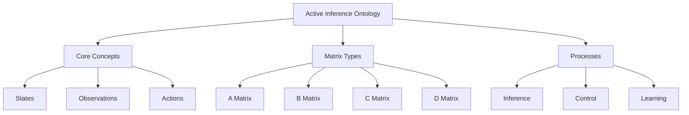
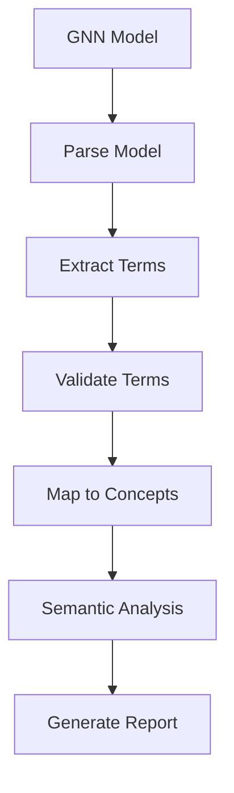

# GNN Ontology Guide

**Version**: v1.1.0  
**Last Updated**: February 9, 2026  
**Status**: ✅ Production Ready  
**Test Count**: 1,127 Tests Passing  

This document provides comprehensive guidance on ontology processing for Generalized Notation Notation (GNN) models, including Active Inference ontology integration, term mapping, and semantic validation.

> [!TIP]
> For concrete JSON examples, file paths, and quick-start commands, see [Ontology System Documentation](ontology_system.md). This guide focuses on the programmatic API and processing workflow.

## Overview

Ontology processing enables semantic validation and term mapping for GNN models against the Active Inference Ontology. This ensures models use standardized terminology and maintain semantic consistency with Active Inference theory.

The GNN ontology system provides:

- **Term Extraction**: Automatic extraction of ontology terms from GNN models
- **Ontology Validation**: Validation against Active Inference Ontology
- **Term Mapping**: Mapping GNN components to ontological concepts
- **Semantic Analysis**: Semantic relationship analysis and validation

## Ontology Pipeline Integration

GNN ontology processing is integrated into the 25-step processing pipeline:

**Step 10: Ontology** (`10_ontology.py`)

- Ontology term extraction and validation
- Semantic mapping and analysis
- See: [src/ontology/AGENTS.md](../../src/ontology/AGENTS.md)

**Quick Start:**

```bash
# Process ontology validation
python src/main.py --only-steps "3,10" --target-dir input/gnn_files --verbose

# Strict ontology validation
python src/10_ontology.py --target-dir input/gnn_files --output-dir output --strict-validation
```

## Active Inference Ontology

The Active Inference Ontology provides standardized terminology for Active Inference concepts:

### Core Concepts

- **States**: Hidden states, observations, actions
- **Matrices**: A, B, C, D matrices and their meanings
- **Inference**: Variational inference, belief updating
- **Control**: Policy selection, action selection
- **Learning**: Parameter learning, model adaptation

### Ontology Structure

The ontology is organized hierarchically:



## Ontology Processing

### Term Extraction

The ontology system automatically extracts terms from GNN models:

```python
from ontology.processor import parse_gnn_ontology_section

# Parse ontology annotations from GNN file content
with open("input/gnn_files/model.md") as f:
    content = f.read()
result = parse_gnn_ontology_section(content)

# Returns dict with:
# - annotations: ["A=LikelihoodMatrix", "B=TransitionMatrix", ...]
# - raw_section: the raw ActInfOntologyAnnotation text
```

### Ontology Validation

Validate extracted terms against the Active Inference Ontology:

```python
from ontology.processor import validate_annotations, load_defined_ontology_terms

# Load the Active Inference Ontology terms
ontology_terms = load_defined_ontology_terms()
# Returns: {"HiddenState": {"description": "...", "uri": "obo:ACTO_000001"}, ...}

# Validate annotations against the ontology
result = validate_annotations(
    annotations=["A=LikelihoodMatrix", "s=HiddenState", "x=InvalidTerm"],
    ontology_terms=ontology_terms
)
# result includes:
# - valid: [{term, description, uri}]
# - invalid: [{term, suggestions: [closest_matches]}]
# - stats: {total, passed, failed}
```

### Term Mapping

Generate mapping between GNN model components and ontology concepts:

```python
from ontology.processor import process_gnn_ontology

# Process ontology for a single GNN file (parse + validate + report)
result = process_gnn_ontology("input/gnn_files/model.md")
# Returns:
# - annotations: parsed KEY=VALUE mappings
# - validation: per-annotation valid/invalid results
# - stats: {total_annotations, passed, failed}
```

## Ontology Processing Workflow

The ontology processing workflow:



## Semantic Validation

Semantic validation ensures GNN models maintain semantic consistency:

### Validation Levels

- **Strict Validation**: All terms must be in ontology
- **Relaxed Validation**: Suggestions for invalid terms
- **Semantic Analysis**: Deep semantic relationship analysis

### Validation Features

- **Term Recognition**: Automatic term recognition
- **Concept Mapping**: Mapping to ontological concepts
- **Relationship Validation**: Validation of semantic relationships
- **Consistency Checking**: Cross-reference consistency validation

## Ontology Enhancement

The ontology system provides enhancement suggestions:

### Enhancement Types

- **Term Suggestions**: Suggested ontology terms for invalid terms
- **Concept Refinement**: Refinement suggestions for concepts
- **Relationship Suggestions**: Suggested semantic relationships
- **Structure Improvements**: Model structure improvement suggestions

## Integration with Pipeline

Ontology processing integrates throughout the pipeline:

1. **Core Processing** (Steps 0-9): Ontology term extraction during parsing
2. **Simulation** (Steps 10-16): Ontology validation during execution
3. **Integration** (Steps 17-24): Ontology results in comprehensive outputs

## Best Practices

### Ontology Usage

- **Standard Terminology**: Use standardized Active Inference terminology
- **Term Consistency**: Maintain consistent term usage across models
- **Semantic Validation**: Validate models against ontology
- **Enhancement Application**: Apply ontology enhancement suggestions

### Model Development

- **Early Validation**: Validate ontology early in model development
- **Strict Mode**: Use strict validation for production models
- **Documentation**: Document ontology term usage
- **Consistency**: Maintain consistency with Active Inference theory

## Related Documentation

- **[Ontology Module](../../src/ontology/AGENTS.md)**: Implementation details
- **[Active Inference Ontology](https://activeinference.org/ontology)**: Official ontology documentation
- **[GNN Tools](gnn_tools.md)**: Complete GNN tools reference
- **[GNN Standards](gnn_standards.md)**: GNN domain knowledge and standards

## See Also

- **[Pipeline Documentation](../gnn/gnn_tools.md)**: Complete pipeline guide
- **[GNN Overview](gnn_overview.md)**: Core GNN concepts
- **[Advanced Modeling Patterns](advanced_modeling_patterns.md)**: Advanced modeling techniques

---

**Status**: ✅ Production Ready  
**Last Updated**: February 9, 2026  
**Version**: v1.1.0
