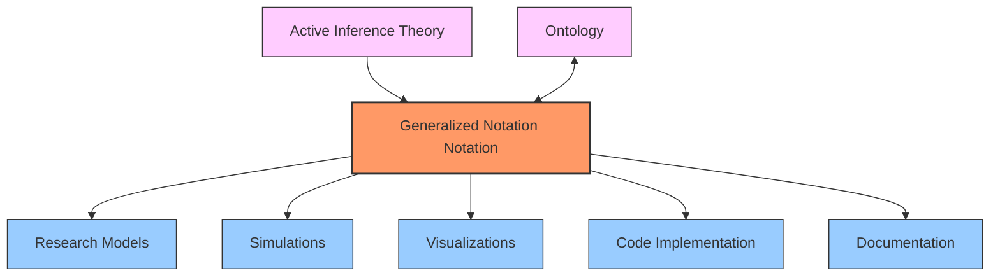
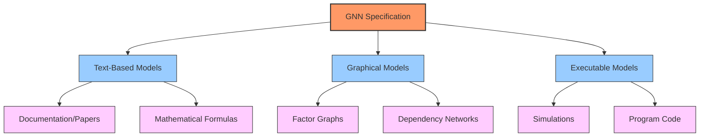
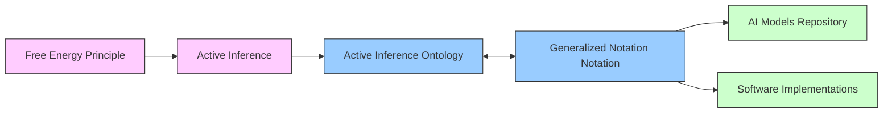

# Generalized Notation Notation (GNN): Overview

## What is GNN?

Generalized Notation Notation (GNN) is a standardized text-based language designed to express Active Inference generative models with precision and clarity. It provides a structured framework for representing cognitive models in a way that is:

- **Human-readable**: Easy to understand and communicate
- **Machine-parsable**: Can be processed by software tools
- **Interoperable**: Works across different platforms and frameworks
- **Reproducible**: Enables exact replication of model specifications

GNN bridges the gap between theoretical models and their implementation by defining a consistent syntax and file structure for representing Active Inference models.



## Motivation and Goals

Active Inference research has historically been challenged by the lack of a unified notation system. Models are often described through a mixture of:

- Natural language explanations
- Mathematical formulas
- Diagrams and schematics 
- Programming code
- Pseudocode implementations

This fragmentation leads to difficulties in:
- **Communication**: Complex models become hard to explain
- **Replication**: Research findings are difficult to reproduce
- **Implementation**: Translating models to code introduces inconsistencies
- **Comparison**: Different models are hard to contrast systematically

GNN addresses these challenges by providing a standardized, structured approach to cognitive model representation.

```mermaid
flowchart LR
    subgraph Problems
        P1[Communication Barriers]
        P2[Implementation Inconsistencies]
        P3[Replication Challenges]
        P4[Limited Interoperability]
    end
    
    subgraph GNN
        S1[Standardized Syntax]
        S2[Structured File Format]
        S3[Triple Play Approach]
        S4[Machine Readability]
    end
    
    subgraph Benefits
        B1[Clearer Communication]
        B2[Consistent Implementation]
        B3[Improved Reproducibility]
        B4[Enhanced Collaboration]
    end
    
    Problems --> GNN
    GNN --> Benefits
```



## Core Objectives

GNN aims to:

1. **Streamline collaboration** across research groups by providing a common language
2. **Enable automated rendering** of models into mathematical notation, figures, and code
3. **Bridge disciplinary gaps** between theoretical, computational, and experimental approaches
4. **Ensure reproducibility** of computational cognitive models
5. **Standardize documentation** for model implementations
6. **Facilitate knowledge transfer** between researchers at different expertise levels

## The Triple Play Approach

A key feature of GNN is its support for three complementary modalities of representation:



1. **Text-Based Models**: Plain-text GNN files render directly into formulas, pseudocode, or prose, making them ideal for documentation, papers, and educational materials.

2. **Graphical Models**: GNN specifies nodes and edges that visualize as factor graphs, clarifying model architecture and causal relationships between variables.

3. **Executable Models**: GNN serves as pseudocode for generating simulations in any programming environment, ensuring consistent implementation across platforms.

This three-fold approach enables GNN to serve diverse needs within the scientific community while maintaining consistency and interoperability.

## GNN in the Active Inference Ecosystem

GNN is part of a broader ecosystem of tools and concepts in Active Inference research:



- **Active Inference Theory**: Provides the theoretical foundation for GNN models
- **Active Inference Ontology**: Defines standardized terms that GNN variables map to
- **Model Repositories**: Collections of GNN models for reference and reuse
- **Software Tools**: Implementations that can parse, visualize, and execute GNN models. The main tools are accessed through the **`src/main.py`** orchestrator and individual numbered pipeline scripts (0-23). See **[src/AGENTS.md](../../src/AGENTS.md)** for complete module documentation.

## GNN Processing Pipeline

The GNN project includes a comprehensive 24-step processing pipeline that transforms GNN specifications into executable simulations, visualizations, and analysis outputs. The pipeline is orchestrated by **`src/main.py`**.

### Quick Start

```bash
# Run the full pipeline
python src/main.py --target-dir input/gnn_files --verbose

# Run specific processing steps
python src/main.py --only-steps "3,5,8,11,12" --verbose

# Skip certain steps
python src/main.py --skip-steps "15,16" --verbose
```

### Complete 24-Step Pipeline

The pipeline consists of the following steps (0-23):

**Core Processing (Steps 0-9)**
- **Step 0**: Template initialization
- **Step 1**: Environment setup and dependency management
- **Step 2**: Comprehensive test suite execution
- **Step 3**: GNN file discovery and multi-format parsing
- **Step 4**: Model registry management
- **Step 5**: Type checking and validation
- **Step 6**: Advanced validation and consistency checking
- **Step 7**: Multi-format export (JSON, XML, GraphML, GEXF, Pickle)
- **Step 8**: Graph and matrix visualization generation
- **Step 9**: Advanced visualization and interactive plots

**Simulation & Analysis (Steps 10-16)**
- **Step 10**: Active Inference ontology processing
- **Step 11**: Code rendering for PyMDP, RxInfer, ActiveInference.jl, DisCoPy, JAX
- **Step 12**: Execution of rendered simulation scripts
- **Step 13**: LLM-enhanced analysis and interpretation
- **Step 14**: Machine learning integration
- **Step 15**: Audio generation and sonification
- **Step 16**: Advanced statistical analysis

**Integration & Output (Steps 17-23)**
- **Step 17**: System integration and coordination
- **Step 18**: Security validation and access control
- **Step 19**: Research tools and experimental features
- **Step 20**: Static HTML website generation
- **Step 21**: Model Context Protocol processing
- **Step 22**: Interactive GUI for model construction
- **Step 23**: Comprehensive report generation

### Pipeline Documentation

For complete information about the pipeline architecture and individual modules:

- **[src/AGENTS.md](../../src/AGENTS.md)**: Master agent scaffolding and module registry
- **[src/README.md](../../src/README.md)**: Pipeline safety and reliability documentation
- **[GNN Tools and Resources](gnn_tools.md)**: Detailed pipeline usage and examples
- **[Quickstart Tutorial](quickstart_tutorial.md)**: Step-by-step guide for beginners

## Related Documentation

For more detailed information about specific aspects of GNN, refer to:

**GNN Language Specification**
- [GNN Syntax and Punctuation](gnn_syntax.md): Detailed specification of the notation symbols
- [GNN File Structure](gnn_file_structure_doc.md): Comprehensive guide to GNN file organization
- [GNN DSL Manual](gnn_dsl_manual.md): Complete Domain-Specific Language reference

**Modeling and Examples**
- [GNN Examples](gnn_examples_doc.md): Step-by-step examples and use cases
- [Advanced Modeling Patterns](advanced_modeling_patterns.md): Sophisticated modeling techniques
- [Multi-Agent Systems](gnn_multiagent.md): Multi-agent modeling specifications

**Implementation and Tools**
- [GNN Implementation Guide](gnn_implementation.md): Guidelines for implementing GNN in practice
- [GNN Tools and Resources](gnn_tools.md): Available tools and resources for working with GNN
- [Framework Integration Guide](framework_integration_guide.md): Integration with PyMDP, RxInfer, etc.
- [Technical Reference](technical_reference.md): Detailed technical specifications

**Advanced Topics**
- [Architecture Reference](architecture_reference.md): Thin orchestrator pattern and data flow
- [LLM and Neurosymbolic Active Inference](gnn_llm_neurosymbolic_active_inference.md): LLM integration
- [Ontology System](ontology_system.md): Active Inference ontology annotations

## See Also

### Core Documentation
- **[About GNN](about_gnn.md)**: Detailed GNN specification and motivation
- **[GNN Syntax](gnn_syntax.md)**: Complete syntax reference
- **[GNN Examples](gnn_examples_doc.md)**: Example models from simple to complex
- **[Quickstart Tutorial](quickstart_tutorial.md)**: Step-by-step getting started guide

### Advanced Topics
- **[Advanced Modeling Patterns](advanced_modeling_patterns.md)**: Hierarchical and sophisticated techniques
- **[Multi-agent Systems](gnn_multiagent.md)**: Multi-agent modeling specification
- **[LLM Integration](gnn_llm_neurosymbolic_active_inference.md)**: AI-assisted modeling

### Framework Integration
- **[PyMDP Integration](../pymdp/gnn_pymdp.md)**: Python Active Inference framework
- **[RxInfer Integration](../rxinfer/gnn_rxinfer.md)**: Julia Bayesian inference
- **[DisCoPy Integration](../discopy/gnn_discopy.md)**: Category theory integration

### Pipeline and Tools
- **[Pipeline Documentation](../pipeline/README.md)**: Complete 24-step pipeline guide
- **[GNN Tools](gnn_tools.md)**: Available software and utilities
- **[Implementation Guide](gnn_implementation.md)**: Guidelines for implementing GNN in practice

### Navigation
- **[Main Documentation Index](../README.md)**: Return to main documentation hub
- **[Cross-Reference Index](../CROSS_REFERENCE_INDEX.md)**: Complete cross-reference system
- **[Learning Paths](../learning_paths.md)**: Structured learning pathways

## References

1. Smékal, J., & Friedman, D. A. (2023). Generalized Notation Notation for Active Inference Models. Active Inference Institute. https://doi.org/10.5281/zenodo.7803328
2. Active Inference Institute: Generalized Notation Notation (GNN) Github repo: https://github.com/ActiveInferenceInstitute/GeneralizedNotationNotation
3. Friston, K. J., Parr, T., & de Vries, B. (2017). The graphical brain: belief propagation and active inference. Network Neuroscience, 1(4), 381-414. 