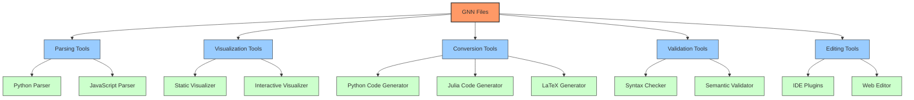
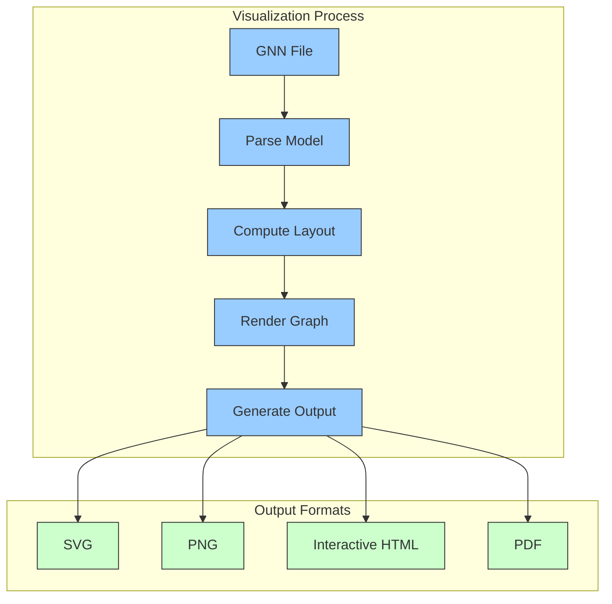
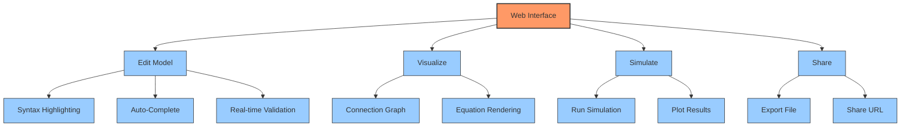
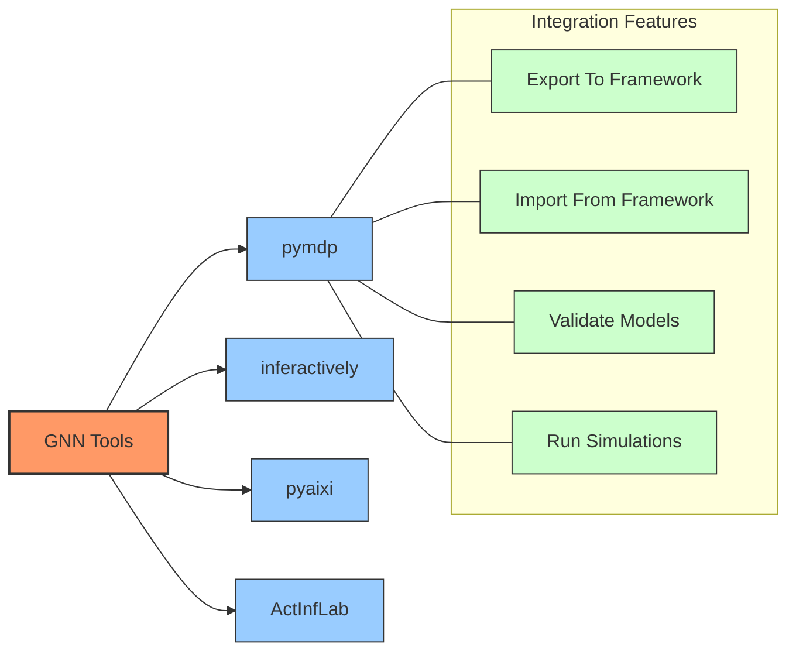
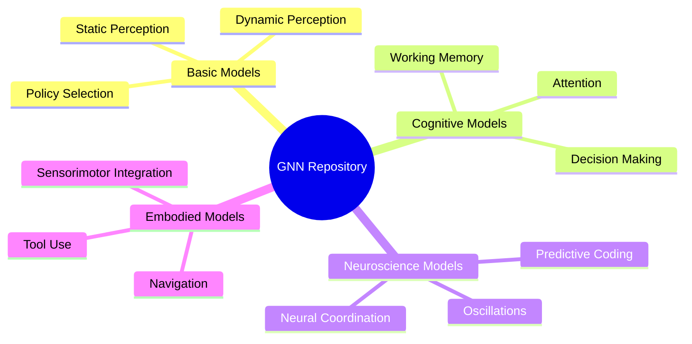
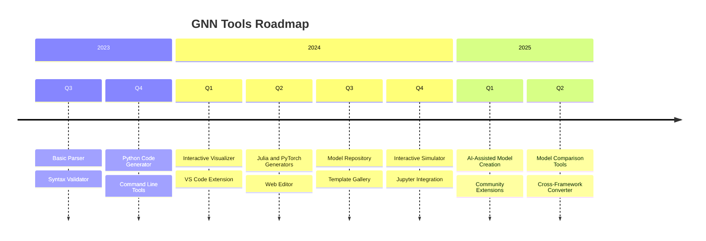

# GNN Tools and Resources

**Version**: v1.1.0  
**Last Updated**: February 9, 2026  
**Status**: ✅ Production Ready  
**Test Count**: 1,083 Tests Passing  

This document provides information about tools, libraries, and resources for working with Generalized Notation Notation (GNN).

## GNN Tool Ecosystem

The GNN ecosystem includes various tools for different aspects of working with GNN files:



## Parsing Tools

### GNN Parser (Python)

The `gnn-parser` Python package provides tools for parsing GNN files into structured data:

```python
import gnn_parser

# Parse a GNN file
model = gnn_parser.parse_file("models/dynamic_perception.gnn")

# Access model components
print(f"Model name: {model.name}")
print(f"Variables: {model.variables}")
print(f"Connections: {model.connections}")

# Convert to Python dictionary
model_dict = model.to_dict()
```

### GNN Parser API Reference

| Function | Description | Parameters | Return Value |
|----------|-------------|------------|--------------|
| `parse_file(file_path)` | Parse a GNN file from disk | `file_path`: Path to GNN file | `GNNModel` object |
| `parse_string(content)` | Parse GNN from a string | `content`: GNN content as string | `GNNModel` object |
| `validate(model)` | Validate a GNN model | `model`: `GNNModel` object | Boolean validity |
| `to_json(model)` | Convert model to JSON | `model`: `GNNModel` object | JSON string |
| `from_json(json_string)` | Create model from JSON | `json_string`: JSON representation | `GNNModel` object |

## Visualization Tools

### GNN Graph Visualizer

The GNN Graph Visualizer creates graphical representations of GNN models:



#### Command-Line Interface

```bash
# Generate SVG visualization
gnn-viz model.gnn --output model.svg

# Generate interactive HTML
gnn-viz model.gnn --output model.html --interactive

# Customize appearance
gnn-viz model.gnn --output model.svg --theme light --highlight-variables "s,o"
```

#### Python API

```python
from gnn_tools import visualize

# Create visualization
viz = visualize.create_graph("models/dynamic_perception.gnn")

# Customize appearance
viz.set_theme("light")
viz.highlight_variables(["s", "o"])
viz.set_layout("hierarchical")

# Save in different formats
viz.save_svg("model.svg")
viz.save_html("model.html", interactive=True)
```

## Conversion Tools

### GNN to Python Converter

The GNN to Python converter generates executable Python code from GNN files:

```python
from gnn_tools import converters

# Convert GNN to Python code
python_code = converters.to_python("models/dynamic_perception.gnn", 
                                   framework="numpy")

# Save to file
with open("dynamic_perception.py", "w") as f:
    f.write(python_code)

# You can also run the model directly
model = converters.to_python_object("models/dynamic_perception.gnn")
results = model.run(observations=my_observations)
```

### GNN to LaTeX Converter

Generate LaTeX equations from GNN models:

```python
from gnn_tools import converters

# Convert GNN equations to LaTeX
latex_equations = converters.to_latex("models/dynamic_perception.gnn",
                                     section="equations")

# Generate full LaTeX document
latex_doc = converters.to_latex_document("models/dynamic_perception.gnn")

# Save to file
with open("model_equations.tex", "w") as f:
    f.write(latex_doc)
```

## Validation Tools

### GNN Validator

The GNN Validator checks GNN files for syntax and semantic errors:

```python
from gnn_tools import validator

# Validate a GNN file
result = validator.validate("models/dynamic_perception.gnn")

if result.is_valid:
    print("Model is valid!")
else:
    print("Validation errors:")
    for error in result.errors:
        print(f"- Line {error.line}: {error.message}")
```

#### Common Validation Checks

- Syntax compliance with GNN specification
- Variable references consistency
- Dimensionality compatibility in equations
- Proper connection definitions
- Ontology mapping validity

## Editing Tools

### GNN Web Editor

The GNN Web Editor provides a browser-based interface for creating and editing GNN models:



Access the web editor at: [https://gnn-editor.activeinference.org](https://gnn-editor.activeinference.org)

### IDE Plugins

GNN support is available for various IDEs:

- **VS Code Extension**: Syntax highlighting, validation, and visualization
- **Jupyter Notebook Extension**: Interactive GNN editing and visualization
- **PyCharm Plugin**: GNN integration with Python development

## Integration with Active Inference Frameworks

GNN tools integrate with several Active Inference frameworks:



### Integration Examples

#### PyMDP Integration

```python
from gnn_tools import converters
import pymdp

# Convert GNN model to PyMDP compatible format
model_params = converters.to_pymdp("models/dynamic_perception.gnn")

# Create PyMDP agent
agent = pymdp.Agent(model_params)

# Run simulation
observations = [0, 1, 0, 1, 0]
for t in range(len(observations)):
    agent.infer_states(observations[t])
    agent.infer_policies()
    action = agent.sample_action()
```

## Model Repository

The GNN Model Repository contains a collection of pre-built GNN models:



Access the repository at: [https://github.com/ActiveInferenceInstitute/GNN-Models](https://github.com/ActiveInferenceInstitute/GNN-Models)

## Installation and Setup

### Python Tools

Install the Python GNN toolkit:

```bash
uv pip install gnn-toolkit
```

### Command Line Tools

Install command line tools:

```bash
uv pip install gnn-cli
```

Basic usage:

```bash
# Parse and validate a GNN file
gnn validate model.gnn

# Convert GNN to Python
gnn convert model.gnn --to python --output model.py

# Visualize a GNN model
gnn visualize model.gnn --output model.svg
```

## Documentation and Resources

### Official Documentation

- [GNN Specification](https://activeinferenceinstitute.github.io/gnn/specification)
- [API Reference](https://activeinferenceinstitute.github.io/gnn/api)
- [Tutorials](https://activeinferenceinstitute.github.io/gnn/tutorials)

### Learning Resources

- [GNN Introduction](https://activeinferenceinstitute.github.io/gnn/intro)
- [Video Tutorials](https://www.youtube.com/playlist?list=PLxxx)
- [Example Gallery](https://activeinferenceinstitute.github.io/gnn/examples)

### Community

- [GitHub Repository](https://github.com/ActiveInferenceInstitute/GeneralizedNotationNotation)
- [Discussion Forum](https://forum.activeinference.org/c/gnn)
- [Issue Tracker](https://github.com/ActiveInferenceInstitute/GeneralizedNotationNotation/issues)

## Future Tool Development

Planned tools and features:



## References

1. Smékal, J., & Friedman, D. A. (2023). Generalized Notation Notation for Active Inference Models. Active Inference Institute. <https://doi.org/10.5281/zenodo.7803328>
2. Active Inference Institute: [Generalized Notation Notation (GNN) GitHub Repository](https://github.com/ActiveInferenceInstitute/GeneralizedNotationNotation)
3. Smith, R., Friston, K.J., & Whyte, C.J. (2022). A step-by-step tutorial on active inference and its application to empirical data. Journal of Mathematical Psychology, 107, 102632.

## GNN Processing Pipeline (`src/main.py`)

The GNN project includes a comprehensive 25-step pipeline orchestrated by `src/main.py`. This main pipeline script is designed to process GNN files through the complete workflow from parsing to execution, visualization, and report generation.

For detailed architecture information, see:

- **[src/AGENTS.md](../../src/AGENTS.md)**: Complete module registry and architectural patterns
- **[src/README.md](../../src/README.md)**: Pipeline safety and reliability documentation
- **[Quickstart Tutorial](quickstart_tutorial.md)**: Step-by-step tutorial for using the pipeline

### Overview

The `src/main.py` script orchestrates 25 numbered Python scripts (steps 0-24) located in the `src/` directory. Each script corresponds to a specific processing stage following the **thin orchestrator pattern** - delegating core functionality to modular implementations in their associated directories.

The pipeline is designed to be flexible, allowing users to run the entire sequence, skip certain steps, or run only specific steps. It manages configurations like target directories for GNN files and output directories for generated artifacts.

### Running the Pipeline

To use the pipeline, navigate to the root directory of the GeneralizedNotationNotation project and execute:

```bash
python src/main.py [options]
```

### Command-Line Options

The `src/main.py` script accepts several command-line arguments:

- `--target-dir DIR`: Specifies the primary target directory for GNN files. Default: `input/gnn_files`
- `--output-dir DIR`: Defines the base directory where all output files will be saved. Default: `output/`
- `--recursive`: Enables recursive processing of directories
- `--skip-steps LIST`: Comma-separated list of step numbers to exclude. Example: `"3,5,7"` or `"3_gnn,5_type_checker"`
- `--only-steps LIST`: Comma-separated list of step numbers to run exclusively. Example: `"3,5,8,11,12"`
- `--verbose`: Enables detailed logging output
- `--strict`: Activates strict type checking mode (for step 5)
- `--estimate-resources`: Enables computational resource estimation (for step 5)

View all options: `python src/main.py --help`

### Complete Pipeline Stages (25 Steps)

The GNN processing pipeline consists of exactly 25 steps (0-24), executed in order:

0. **`0_template.py` (Template Initialization)** → `src/template/`
    - Purpose: Pipeline template and initialization

1. **`1_setup.py` (Environment Setup)** → `src/setup/`
    - Purpose: Environment setup, virtual environment management, dependency installation

2. **`2_tests.py` (Test Suite)** → `src/tests/`
    - Purpose: Comprehensive test suite execution

3. **`3_gnn.py` (GNN Core Processing)** → `src/gnn/`
    - Purpose: GNN file discovery, multi-format parsing, and validation
    - See: [src/gnn/AGENTS.md](../../src/gnn/AGENTS.md)

4. **`4_model_registry.py` (Model Registry)** → `src/model_registry/`
    - Purpose: Model registry management and versioning

5. **`5_type_checker.py` (Type Checking)** → `src/type_checker/`
    - Purpose: GNN syntax validation and resource estimation
    - Supports `--strict` and `--estimate-resources` flags

6. **`6_validation.py` (Validation)** → `src/validation/`
    - Purpose: Advanced validation and consistency checking

7. **`7_export.py` (Export)** → `src/export/`
    - Purpose: Multi-format export (JSON, XML, GraphML, GEXF, Pickle)

8. **`8_visualization.py` (Visualization)** → `src/visualization/`
    - Purpose: Graph and matrix visualization generation
    - See: [src/visualization/AGENTS.md](../../src/visualization/AGENTS.md)

9. **`9_advanced_viz.py` (Advanced Visualization)** → `src/advanced_visualization/`
    - Purpose: Advanced visualization and interactive plots

10. **`10_ontology.py` (Ontology Processing)** → `src/ontology/`
    - Purpose: Active Inference Ontology processing and validation
    - See: [src/ontology/AGENTS.md](../../src/ontology/AGENTS.md)

11. **`11_render.py` (Code Rendering)** → `src/render/`
    - Purpose: Code generation for PyMDP, RxInfer, ActiveInference.jl, DisCoPy, JAX
    - See: [src/render/AGENTS.md](../../src/render/AGENTS.md)

12. **`12_execute.py` (Execution)** → `src/execute/`
    - Purpose: Execute rendered simulation scripts with result capture
    - See: [src/execute/AGENTS.md](../../src/execute/AGENTS.md)

13. **`13_llm.py` (LLM Integration)** → `src/llm/`
    - Purpose: LLM-enhanced analysis, model interpretation, and AI assistance
    - See: [src/llm/AGENTS.md](../../src/llm/AGENTS.md)

14. **`14_ml_integration.py` (ML Integration)** → `src/ml_integration/`
    - Purpose: Machine learning integration and model training

15. **`15_audio.py` (Audio Generation)** → `src/audio/`
    - Purpose: Audio generation (SAPF, Pedalboard, and other backends)

16. **`16_analysis.py` (Analysis)** → `src/analysis/`
    - Purpose: Advanced analysis and statistical processing

17. **`17_integration.py` (System Integration)** → `src/integration/`
    - Purpose: System integration and cross-module coordination

18. **`18_security.py` (Security)** → `src/security/`
    - Purpose: Security validation and access control

19. **`19_research.py` (Research Tools)** → `src/research/`
    - Purpose: Research tools and experimental features

20. **`20_website.py` (Website Generation)** → `src/website/`
    - Purpose: Static HTML website generation from pipeline artifacts

21. **`21_mcp.py` (Model Context Protocol)** → `src/mcp/`
    - Purpose: Model Context Protocol processing and tool registration

22. **`22_gui.py` (GUI)** → `src/gui/`
    - Purpose: Interactive GUI for constructing/editing GNN models

23. **`23_report.py` (Report Generation)** → `src/report/`
    - Purpose: Comprehensive analysis report generation

### Key Pipeline Tools

#### GNN Parser and Type Checker (Steps 3 & 5)

- **Pipeline Steps:** `3_gnn.py` and `5_type_checker.py`
- **Functionality:** Parse GNN files, validate syntax, check type consistency, and estimate computational resources
- **Invocation:**

    ```bash
    # Parse and type-check GNN files
    python src/main.py --only-steps "3,5" --target-dir input/gnn_files
    
    # With resource estimation
    python src/main.py --only-steps "3,5" --estimate-resources --target-dir input/gnn_files
    ```

- **Outputs:** `output/3_gnn_output/` and `output/5_type_checker_output/`

#### GNN Visualization (Steps 8 & 9)

- **Pipeline Steps:** `8_visualization.py` and `9_advanced_viz.py`
- **Functionality:** Generate graphical representations, factor graphs, and interactive visualizations
- **Invocation:**

    ```bash
    # Generate visualizations
    python src/main.py --only-steps "8,9" --target-dir input/gnn_files
    ```

- **Outputs:** `output/8_visualization_output/` and `output/9_advanced_viz_output/`

#### Code Generation and Execution (Steps 11 & 12)

- **Pipeline Steps:** `11_render.py` and `12_execute.py`
- **Functionality:** Generate executable code for multiple frameworks and run simulations
- **Invocation:**

    ```bash
    # Generate and execute code
    python src/main.py --only-steps "11,12" --target-dir input/gnn_files
    
    # Execute specific frameworks
    python src/12_execute.py --frameworks "pymdp,jax" --verbose
    ```

- **Outputs:** `output/11_render_output/` and `output/12_execute_output/`

#### Post-Simulation Analysis (Step 16)

- **Pipeline Step:** `16_analysis.py`
- **Functionality:** Statistical analysis, post-simulation analysis (free energy, policy convergence, state distributions), Active Inference metric computation (entropy, KL divergence, VFE, EFE, information gain), cross-framework comparison, and visualization generation
- **Invocation:**

    ```bash
    # Run full render → execute → analyze pipeline
    python src/main.py --only-steps "3,11,12,16" --target-dir input/gnn_files --verbose

    # Run analysis on existing execution results
    python src/main.py --only-steps "16" --verbose
    ```

- **Outputs:** `output/16_analysis_output/` — includes `analysis_results.json`, `analysis_summary.md`, per-model post-simulation analysis, framework-specific visualizations, and cross-framework comparison dashboards
- **Key Capabilities:**
  - Per-GNN-file statistical analysis and complexity metrics
  - Post-simulation analysis consuming Step 12 execution results
  - Active Inference metrics: Shannon entropy, KL divergence, variational free energy, expected free energy, information gain
  - Framework-specific visualization generation (PyMDP, RxInfer, ActiveInference.jl, JAX, DisCoPy)
  - Cross-framework comparison reports and unified dashboards

### Pipeline Examples

```bash
# Run full pipeline
python src/main.py --target-dir input/gnn_files --verbose

# Run specific steps only
python src/main.py --only-steps "3,5,7,8,11,12" --verbose

# Skip certain steps
python src/main.py --skip-steps "15,16" --verbose

# Run with specific framework execution
python src/main.py --only-steps "11,12"
python src/12_execute.py --frameworks "lite" --verbose  # PyMDP, JAX, DisCoPy only
```

For more detailed information on each module, see **[src/AGENTS.md](../../src/AGENTS.md)**.

---
