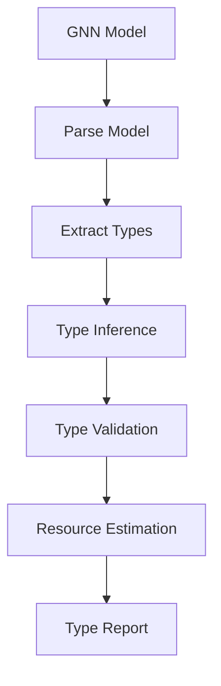
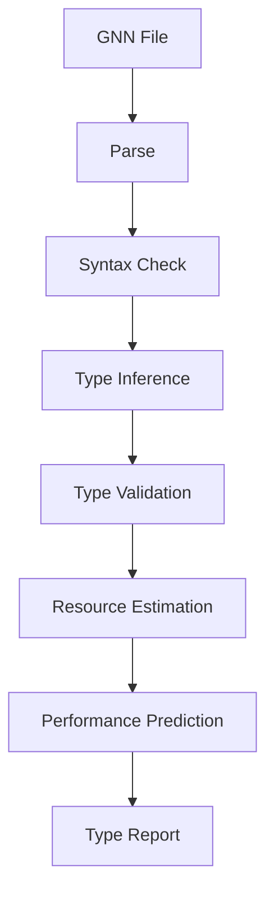

# GNN Type System Guide

This document provides comprehensive guidance on type checking and the type system for Generalized Notation Notation (GNN) models, including type inference, validation, and resource estimation.

## Overview

The GNN type system provides comprehensive type checking, validation, and resource estimation for GNN models. This ensures type safety, validates model structure, and estimates computational resources required for model execution.

The GNN type system provides:
- **Type Checking**: Comprehensive type checking and inference
- **Syntax Validation**: GNN syntax validation
- **Resource Estimation**: Computational resource estimation
- **Performance Prediction**: Performance prediction modeling
- **Structure Validation**: Model structure validation

## Type System Pipeline Integration

GNN type checking is integrated into the 24-step processing pipeline:

**Step 5: Type Checker** (`5_type_checker.py`)
- Type checking and validation
- Resource estimation
- See: [src/type_checker/AGENTS.md](../../src/type_checker/AGENTS.md)

**Quick Start:**
```bash
# Run type checking
python src/main.py --only-steps "3,5" --target-dir input/gnn_files --verbose

# Strict type checking with resource estimation
python src/5_type_checker.py --target-dir input/gnn_files --output-dir output --strict --estimate-resources
```

## Type System Components

### Type Categories

The GNN type system categorizes types:

- **State Types**: Hidden state variable types
- **Observation Types**: Observation variable types
- **Action Types**: Action variable types
- **Matrix Types**: Matrix dimension and type information
- **Function Types**: Function signature and type information

### Type Inference

The type system automatically infers types from GNN specifications:



## Type Checking

### Type Validation

Type checking validates model structure and type consistency:

```python
from type_checker import GNNTypeChecker

# Create type checker
checker = GNNTypeChecker()

# Validate GNN files
success = checker.validate_gnn_files(
    target_dir=Path("input/gnn_files"),
    output_dir=Path("output/5_type_checker_output"),
    strict=True,
    estimate_resources=True
)
```

### Validation Features

- **Syntax Validation**: GNN syntax validation
- **Type Consistency**: Type consistency checking
- **Structure Validation**: Model structure validation
- **Constraint Checking**: Constraint validation

## Resource Estimation

Resource estimation predicts computational resources required for model execution:

### Estimation Components

- **Memory Requirements**: Memory usage estimation
- **Computational Complexity**: Computational complexity analysis
- **Execution Time**: Execution time prediction
- **Storage Requirements**: Storage space estimation

### Resource Estimation Example

```python
from type_checker import estimate_file_resources

# Estimate resources for GNN file
resources = estimate_file_resources(gnn_content)

# Resources include:
# - memory_estimate: Estimated memory usage
# - computation_estimate: Computational complexity
# - execution_time: Predicted execution time
# - storage_estimate: Storage space requirements
```

## Performance Prediction

Performance prediction models estimate model performance:

### Prediction Features

- **Execution Time**: Execution time prediction
- **Memory Usage**: Memory usage prediction
- **Scalability**: Scalability analysis
- **Optimization Suggestions**: Performance optimization suggestions

## Type System Workflow

The type checking workflow:



## Type Safety

Type safety ensures models are correctly typed:

### Safety Features

- **Type Inference**: Automatic type inference
- **Type Checking**: Comprehensive type checking
- **Type Validation**: Type validation and verification
- **Error Reporting**: Detailed type error reporting

## Best Practices

### Type System Usage

- **Early Validation**: Validate types early in model development
- **Strict Mode**: Use strict type checking for production models
- **Resource Planning**: Use resource estimation for planning
- **Performance Optimization**: Apply performance optimization suggestions

### Model Development

- **Type Annotations**: Use explicit type annotations where helpful
- **Consistency**: Maintain type consistency across models
- **Validation**: Regular type validation during development
- **Documentation**: Document type requirements and constraints

## Integration with Pipeline

Type checking integrates throughout the pipeline:

1. **Core Processing** (Steps 0-9): Type checking during parsing and validation
2. **Simulation** (Steps 10-16): Type validation during execution
3. **Integration** (Steps 17-23): Type information in comprehensive outputs

## Related Documentation

- **[Type Checker Module](../../src/type_checker/AGENTS.md)**: Implementation details
- **[GNN Syntax](gnn_syntax.md)**: Complete syntax reference
- **[GNN Tools](gnn_tools.md)**: Complete GNN tools reference
- **[GNN Standards](gnn_standards.md)**: GNN domain knowledge and standards

## See Also

- **[Pipeline Documentation](../pipeline/README.md)**: Complete pipeline guide
- **[GNN Overview](gnn_overview.md)**: Core GNN concepts
- **[GNN Implementation Guide](gnn_implementation.md)**: Implementation guidance

---

**Status**: ✅ Production Ready  
**Last Updated**: 2025-12-30  
**Version**: 1.0.0


