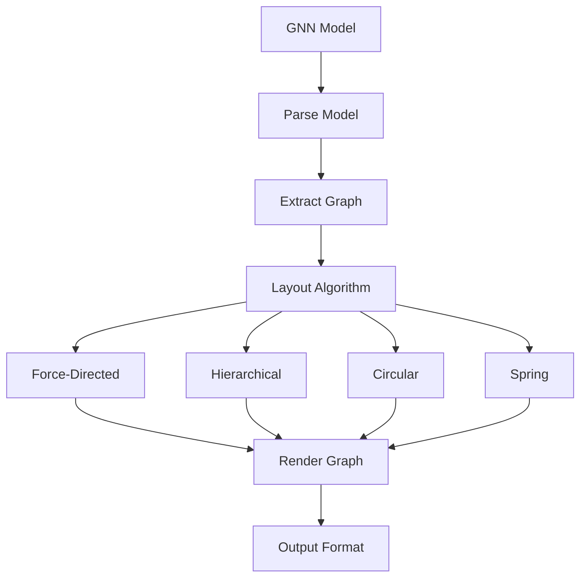

# GNN Visualization Guide

This document provides comprehensive guidance on visualization capabilities for Generalized Notation Notation (GNN) models, including graph visualization, matrix visualization, and interactive plotting techniques.

## Overview

Visualization is a critical component of the GNN ecosystem, enabling researchers and developers to understand, analyze, and communicate Active Inference models through graphical representations. The GNN visualization system provides multiple visualization modalities:

- **Graph Visualization**: Network topology and structure representation
- **Matrix Visualization**: Matrix heatmaps and structure analysis
- **Interactive Plotting**: Dynamic, explorable visualizations
- **Advanced Visualization**: Interactive dashboards and 3D visualizations

## Visualization Pipeline Integration

GNN visualization is integrated into the 25-step processing pipeline:

**Step 8: Visualization** (`8_visualization.py`)

- Basic graph and matrix visualization
- Static visualization generation
- See: [src/visualization/AGENTS.md](../../src/visualization/AGENTS.md)

**Step 9: Advanced Visualization** (`9_advanced_viz.py`)

- Interactive dashboards
- 3D visualizations
- Real-time visualization updates
- See: [src/advanced_visualization/AGENTS.md](../../src/advanced_visualization/AGENTS.md)

**Quick Start:**

```bash
# Generate visualizations
python src/main.py --only-steps "3,8,9" --target-dir input/gnn_files --verbose

# Generate specific visualization types
python src/8_visualization.py --target-dir input/gnn_files --output-dir output --visualization-types "graph,matrix"
```

## Graph Visualization

Graph visualization represents GNN models as networks, showing relationships between model components.

### Graph Structure

GNN models can be visualized as graphs with:

- **Nodes**: Representing states, observations, or model components
- **Edges**: Representing transitions, connections, or dependencies
- **Attributes**: Node and edge attributes (probabilities, weights, labels)

### Graph Layout Algorithms

The visualization system supports multiple layout algorithms:



**Layout Types:**

- **Force-Directed**: Natural, organic layouts using force simulation
- **Hierarchical**: Tree-like structures for hierarchical models
- **Circular**: Circular arrangements for symmetric structures
- **Spring**: Spring-based layouts for balanced positioning

### Graph Visualization Example

```python
from visualization import process_visualization
from pathlib import Path

# Generate graph visualizations
success = process_visualization(
    target_dir=Path("input/gnn_files"),
    output_dir=Path("output/8_visualization_output"),
    visualization_types=["graph"],
    layout_algorithm="force-directed",
    verbose=True
)
```

## Matrix Visualization

Matrix visualization provides heatmap representations of GNN matrices (A, B, C, D matrices).

### Matrix Types

GNN models contain several key matrices:

- **A Matrix**: Observation likelihood (observation × state)
- **B Matrix**: Transition probabilities (state × state)
- **C Matrix**: Prior preferences (state)
- **D Matrix**: Prior beliefs (state)

### Matrix Heatmap Features

Matrix visualizations include:

- **Color-Coded Values**: Visual representation of matrix values
- **Scale and Legend**: Value range indication
- **Annotations**: Labels and value annotations
- **Comparison**: Multi-matrix comparison views

### Matrix Visualization Example

```python
from visualization import visualize_matrices

# Create matrix heatmaps
success = visualize_matrices(
    content=gnn_content,
    output_path=Path("output/matrix_visualizations/"),
    matrices=["A", "B", "C", "D"],
    color_scheme="viridis"
)
```

## Interactive Plotting

Interactive plotting enables dynamic exploration of GNN models with zoom, pan, and hover capabilities.

### Interactive Features

- **Zoom and Pan**: Navigate large visualizations
- **Hover Information**: Display detailed information on hover
- **Click Interactions**: Interactive element selection
- **Dynamic Updates**: Real-time visualization updates
- **Export Functionality**: Export interactive visualizations

### Interactive Plotting Example

```python
from visualization import create_interactive_plots

# Generate interactive plots
success = create_interactive_plots(
    content=gnn_content,
    output_path=Path("output/interactive_plots/"),
    plot_types=["graph", "matrix", "network"]
)
```

## Advanced Visualization

Advanced visualization provides comprehensive dashboards and 3D visualizations.

### Interactive Dashboards

Interactive dashboards combine multiple visualization types:

- **Comprehensive Analysis**: Multiple visualization views
- **Navigation Controls**: Dashboard navigation
- **Filtering Options**: Data filtering and selection
- **Real-Time Updates**: Dynamic dashboard updates

### 3D Visualization

3D visualization enables spatial representation of models:

- **3D Graph Visualization**: Three-dimensional network visualization
- **3D Matrix Visualization**: Three-dimensional matrix representation
- **Spatial Analysis**: Spatial model analysis
- **Interactive 3D Navigation**: Interactive 3D exploration

### Advanced Visualization Example

```python
from advanced_visualization import process_advanced_visualization

# Generate advanced visualizations
success = process_advanced_visualization(
    target_dir=Path("input/gnn_files"),
    output_dir=Path("output/9_advanced_viz_output"),
    dashboard=True,
    three_d=True,
    verbose=True
)
```

## Output Formats

Visualizations can be exported in multiple formats:

- **HTML**: Interactive web-based visualizations
- **PNG**: Static image format
- **SVG**: Scalable vector graphics
- **PDF**: Document format
- **Interactive HTML**: Full-featured interactive dashboards

## Integration with Pipeline

Visualization results are integrated throughout the pipeline:

1. **Core Processing** (Steps 0-9): Visualization data extraction and generation
2. **Simulation** (Steps 10-16): Execution result visualization
3. **Integration** (Steps 17-24): Visualization integration into outputs
   - Website generation (Step 20) includes visualizations
   - Report generation (Step 23) includes visualizations

## Best Practices

### Visualization Selection

- **Graph Visualization**: Use for model structure and relationships
- **Matrix Visualization**: Use for probability distributions and transitions
- **Interactive Plotting**: Use for exploration and analysis
- **Advanced Visualization**: Use for comprehensive model analysis

### Performance Considerations

- **Large Models**: Use hierarchical layouts for large models
- **Batch Processing**: Process multiple models efficiently
- **Caching**: Cache visualization results for repeated access
- **Optimization**: Optimize visualization generation for performance

## Related Documentation

- **[Visualization Module](../../src/visualization/README.md)**: Implementation details
- **[Advanced Visualization Module](../../src/advanced_visualization/README.md)**: Advanced visualization implementation
- **[Visualization Documentation](../visualization/README.md)**: Visualization documentation overview
- **[GNN Tools](gnn_tools.md)**: Complete GNN tools reference

## See Also

- **[Pipeline Documentation](../gnn/gnn_tools.md)**: Complete pipeline guide
- **[GNN Overview](gnn_overview.md)**: Core GNN concepts
- **[Framework Integration](framework_integration_guide.md)**: Framework-specific visualization

---

**Status**: ✅ Production Ready  
**Last Updated**: 2025-12-30  
**Version**: 1.0.0
