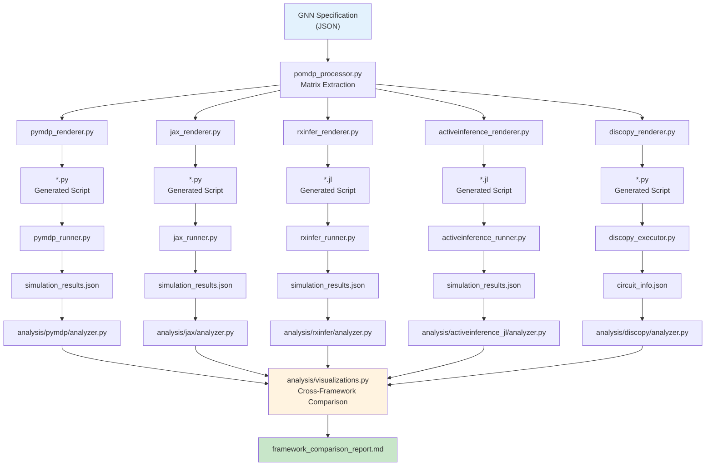

# GNN Implementations — Agent Scaffolding

## Overview

This directory contains comprehensive technical documentation for each Active Inference framework implementation within the GNN pipeline. Each document traces the full data flow from GNN JSON specification through code generation, execution, and telemetry export.

---

## Module Registry

### Rendering Layer (Step 11: Code Generation)

| Framework | Renderer Module | Language | Source |
|---|---|---|---|
| PyMDP | `render/pymdp/pymdp_renderer.py` | Python | [pymdp.md](pymdp.md) |
| JAX | `render/jax/jax_renderer.py` | Python/XLA | [jax.md](jax.md) |
| RxInfer | `render/rxinfer/rxinfer_renderer.py` | Julia | [rxinfer.md](rxinfer.md) |
| ActiveInference.jl | `render/activeinference_jl/activeinference_renderer.py` | Julia | [activeinference_jl.md](activeinference_jl.md) |
| DisCoPy | `render/discopy/discopy_renderer.py` | Python | [discopy.md](discopy.md) |
| CatColab | `export/catcolab/catcolab_exporter.py` | Python | [catcolab.md](catcolab.md) |
| PyTorch | `render/pytorch/pytorch_renderer.py` | Python | [pytorch.md](pytorch.md) |
| NumPyro | `render/numpyro/numpyro_renderer.py` | Python/JAX | [numpyro.md](numpyro.md) |

### Execution Layer (Step 12: Script Execution)

| Framework | Runner Module | Subprocess | Timeout |
|---|---|---|---|
| PyMDP | `execute/pymdp/pymdp_runner.py` | `sys.executable` (Python) | Default |
| JAX | `execute/jax/jax_runner.py` | `sys.executable` (Python) | 300s |
| RxInfer | `execute/rxinfer/rxinfer_runner.py` | `julia` | 600s |
| ActiveInference.jl | `execute/activeinference_jl/activeinference_runner.py` | `julia` | 600s |
| DisCoPy | `execute/discopy/discopy_executor.py` | `sys.executable` (Python) | 300s |
| CatColab | `export/catcolab/catcolab_exporter.py` | N/A (export only) | N/A |
| PyTorch | `execute/pytorch/pytorch_runner.py` | `sys.executable` (Python) | 300s |
| NumPyro | `execute/numpyro/numpyro_runner.py` | `sys.executable` (Python) | 600s |

### Analysis Layer (Step 16: Visualization & Comparison)

| Framework | Analyzer Module | Entry Point | Visualization Count |
|---|---|---|---|
| PyMDP | `analysis/pymdp/analyzer.py` | `generate_analysis_from_logs()` | 7+ per-framework plots |
| JAX | `analysis/jax/analyzer.py` | `generate_analysis_from_logs()` | 5+ per-framework plots |
| RxInfer | `analysis/rxinfer/analyzer.py` | `generate_analysis_from_logs()` | 4+ per-framework plots |
| ActiveInference.jl | `analysis/activeinference_jl/analyzer.py` | `generate_analysis_from_logs()` | 3+ per-framework plots |
| DisCoPy | `analysis/discopy/analyzer.py` | `generate_analysis_from_logs()` | 2+ structural diagrams |
| **Cross-Framework** | `analysis/visualizations.py` | `generate_unified_comparison()` | 6+ dashboard panels |

---

## Data Flow Architecture



---

## Unified POMDP Generative Process

All four numerical frameworks implement the identical generative loop:

```
for t in 1:T
    observation ~ A[:, true_state]        ← Environment generates observation
    belief = infer(observation)            ← Agent updates beliefs
    efe = compute_efe(belief, A, B, C)     ← Agent evaluates policies
    action = select(softmax(-efe))         ← Agent selects action
    true_state ~ B[:, true_state, action]  ← Environment transitions
end
```

---

## Cross-Framework Improvement Assessment

### Rendering Layer

| ID | Finding | Frameworks Affected | Severity | Recommendation |
|---|---|---|---|---|
| R-1 | No shared base class for renderers | All | Low | Create `BaseRenderer` ABC with `render_file()`, `_parse_gnn()`, `_generate_code()` |
| R-2 | Matrix normalization is duplicated across all renderers | All | Medium | Extract into shared `normalize_matrices()` utility |
| R-3 | Preference vector `C` handling differs (raw vs softmax) | RxInfer | Low | Document convention explicitly; both are valid |
| R-4 | ~~ActiveInference.jl had 4 renderer variants~~ — consolidated to single canonical renderer | ActiveInference.jl | ✅ FIXED | — |

### Execution Layer

| ID | Finding | Frameworks Affected | Severity | Recommendation |
|---|---|---|---|---|
| E-1 | ~~JAX runner lacked execution timing/log persistence~~ — now saves `execution_log.json`, `stdout.txt`, `stderr.txt` | JAX | ✅ FIXED | — |
| E-2 | ~~RxInfer runner had no `validate_and_clean` pre-check~~ — now validates file readability before execution | RxInfer | ✅ FIXED | — |
| E-3 | ~~DisCoPy had no dedicated runner module~~ — added `execute_discopy_script()` to `discopy_executor.py` | DisCoPy | ✅ FIXED | — |
| E-4 | ~~Inconsistent timeout defaults across runners~~ — all runners now accept configurable `timeout` param (default 300s) | All | ✅ FIXED | — |
| E-5 | ~~ActiveInference.jl runner had 598-line env setup~~ — `is_julia_available()` now delegates to shared `julia_setup` | ActiveInference.jl, RxInfer | ✅ FIXED | — |

### Analysis Layer

| ID | Finding | Frameworks Affected | Severity | Recommendation |
|---|---|---|---|---|
| A-1 | ~~ActiveInference.jl validation dict missing from JSON~~ — now includes `validation` block | ActiveInference.jl | ✅ FIXED | — |
| A-2 | No per-action EFE heatmap in cross-framework viz | All | Low | Add `generate_efe_per_action_heatmap()` leveraging 2D EFE data |
| A-3 | Jensen-Shannon divergence (JSD) warning on edge cases | Cross-framework | Low | Already mitigated with `np.clip`; add unit test coverage |

---

## File Index

| Document | Description |
|---|---|
| [README.md](README.md) | Index, architecture overview, correlation results |
| [pymdp.md](pymdp.md) | PyMDP: Parameter extraction, Agent init, generative loop, neg_efe convention |
| [jax.md](jax.md) | JAX: PRNGKey splitting, categorical sampling, JIT EFE, stateless functions |
| [rxinfer.md](rxinfer.md) | RxInfer: @model factor graph, message passing, Ambiguity+Risk EFE |
| [activeinference_jl.md](activeinference_jl.md) | ActiveInference.jl: init_aif, .G mapping, E-vector, NaN-safe JSON |
| [discopy.md](discopy.md) | DisCoPy: Monoidal types, morphism boxes, circuit composition |

---

**Last Updated**: 2026-02-22
**Documentation Version**: 0.4.1
**Frameworks Documented**: 5
**Source Code Modules Audited**: 16 (5 renderers + 5 runners/executors + 5 analyzers + 1 shared utility)
**Issues Fixed This Session**: 14 (P-2, J-1, J-4, RX-1, RX-2, RX-3, RX-5, AIF-1, AIF-2, AIF-4, E-1 through E-5, D-1, D-3, R-4, A-1)
