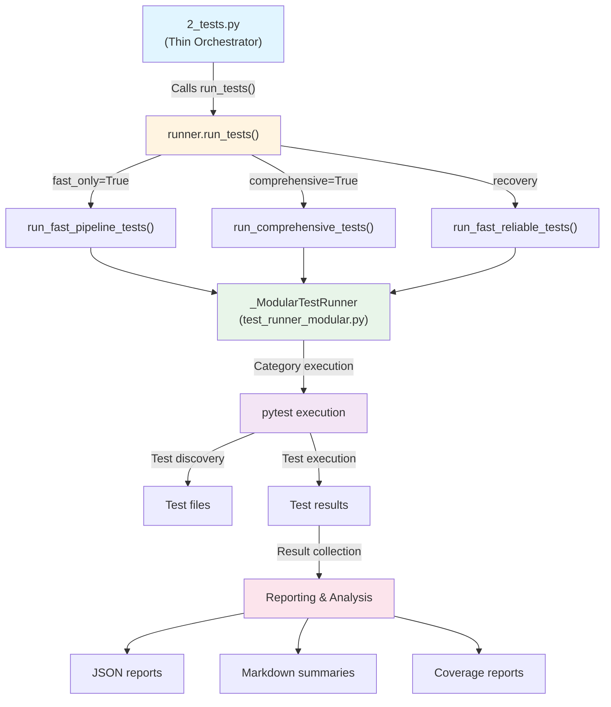

# Step 2: Tests

## Architectural Mapping

**Orchestrator**: `src/2_tests.py` (104 lines)
**Implementation Layer**: `src/tests/`

## Module Description

This directory contains the comprehensive test suite for the GNN Processing Pipeline. The test infrastructure is modular: a single-source `TestRunner` lives in `infrastructure/test_runner.py` (re-exported by `tests.runner`), `runner.run_tests()` routes the fast/comprehensive/reliable execution modes, `categories.py` holds the typed category routing table, shared test helpers live in `helpers/`, and `tests/` holds the plumbing-contract tests that pin this architecture.


```bash
python src/2_tests.py --fast-only --verbose
```


```bash
python src/2_tests.py --comprehensive --verbose
```

## Agent Identity & Capabilities

# Tests Module - Agent Scaffolding

## Module Overview

**Purpose**: Comprehensive test suite execution and validation for the GNN processing pipeline

**Pipeline Step**: Step 2: Test suite execution (2_tests.py)

**Category**: Testing / Quality Assurance

**Status**: ✅ Production Ready

**Package version**: [pyproject.toml](../../../pyproject.toml) (canonical)

**Last Updated**: 2026-04-15

---

## Core Functionality

### Primary Responsibilities
1. Comprehensive test suite execution
2. Test result collection and analysis
3. Coverage analysis and reporting
4. Performance testing and benchmarking
5. Test environment management and validation

### Key Capabilities
- Multi-level test execution (unit, integration, performance)
- Comprehensive test reporting and analysis
- Coverage analysis and optimization
- Performance benchmarking and profiling
- Test environment validation and setup

---

## API Reference

### Public Functions

#### `run_tests(logger, output_dir, verbose=False, fast_only=True, comprehensive=False, generate_coverage=False, auto_fallback=True) -> bool`
**Description**: Main test execution function called by orchestrator (2_tests.py). Routes to appropriate test execution mode based on parameters.

**Parameters**:
- `logger` (logging.Logger): Logger instance for progress reporting
- `output_dir` (Path): Output directory for test results
- `verbose` (bool): Enable verbose output (default: False)
- `fast_only` (bool): Run only fast tests (default: True)
- `comprehensive` (bool): Run comprehensive test suite - all tests (default: False)
- `generate_coverage` (bool): Generate coverage reports (default: False)
- `auto_fallback` (bool): If fast mode collects zero tests, retry with comprehensive mode (default: True)

**Returns**: `True` if tests passed, `False` otherwise

**Behavior**:
- If `comprehensive=True`: Runs all tests via `run_comprehensive_tests()`
- If `fast_only=True` and `comprehensive=False`: Runs fast tests via `run_fast_pipeline_tests()`. If that fails and `auto_fallback=True` and the execution report shows **zero tests collected**, retries with `run_comprehensive_tests()`
- Otherwise: Runs reliable fast tests via `run_fast_reliable_tests()`

**Strict markers**: `pyproject.toml` enables `--strict-markers`. Unregistered markers (for example `anyio` without `pytest-anyio`) break collection. Prefer sync tests that call `asyncio.run()` for short async checks when the environment may omit dev extras; with `uv sync --extra dev`, `pytest-asyncio` and `@pytest.mark.asyncio` are available.

**Example**:
```python
from tests import run_tests

success = run_tests(
    logger=logger,
    output_dir=Path("output/2_tests_output"),
    verbose=True,
    fast_only=True,
    comprehensive=False,
)
```

#### `create_test_runner(args, logger) -> ModularTestRunner`
**Description**: Factory that returns a `_ModularTestRunner` for category-based test execution.

**Defined in**: [`test_runner_modular.py`](../../../src/tests/test_runner_modular.py). The package [`__init__.py`](../../../src/tests/__init__.py) imports it from there separately from `runner.run_tests` (which lives in [`runner.py`](../../../src/tests/runner.py)); a single combined import would fail because `create_test_runner` is not defined on `runner`.

**Parameters**:
- `args`: Parsed arguments (e.g. from the pipeline CLI)
- `logger` (logging.Logger): Logger instance

#### `run_fast_pipeline_tests(logger, output_dir, verbose=False) -> bool`
**Description**: Run fast test suite for quick pipeline validation

**Parameters**:
- `logger` (logging.Logger): Logger instance for progress reporting
- `output_dir` (Path): Output directory for test results
- `verbose` (bool): Enable verbose output

**Returns**: `True` if tests passed or collection errors detected and reported

**Features**:
- Automatic detection of collection errors (import errors, syntax errors)
- Clear error messages with actionable suggestions
- Fast test execution (skips slow tests)
- Comprehensive error reporting

#### `run_comprehensive_tests(logger, output_dir, verbose=False) -> bool`
**Description**: Run comprehensive test suite with all tests enabled. Includes slow tests, performance tests, and full coverage analysis.

**Parameters**:
- `logger` (logging.Logger): Logger instance for progress reporting
- `output_dir` (Path): Output directory for test results
- `verbose` (bool): Enable verbose output (default: False)

**Returns**: `True` if tests passed, `False` otherwise

**Features**:
- Executes all test categories from `MODULAR_TEST_CATEGORIES` (defined in [`categories.py`](../../../src/tests/categories.py))
- Includes slow and performance tests
- Uses category-based execution with resource monitoring

#### `run_fast_reliable_tests(logger, output_dir, verbose=False, timeout=600) -> bool`
**Description**: Run a reliable subset of fast tests with improved error handling. Focuses on essential tests that should always pass.

**Parameters**:
- `logger` (logging.Logger): Logger instance for progress reporting
- `output_dir` (Path): Output directory for test results
- `verbose` (bool): Enable verbose output (default: False)
- `timeout` (int): Subprocess timeout in seconds (default: 600; overridable via the `FAST_TESTS_TIMEOUT` environment variable)

**Returns**: `True` if tests passed, `False` otherwise

**Features**:
- Runs only essential test files: `test_core_modules.py`, `test_fast_suite.py`, `pipeline/test_main_orchestrator.py`
- Subprocess timeout (600 seconds by default, `FAST_TESTS_TIMEOUT` override)
- Improved error handling and reporting
- Used as recovery when fast pipeline tests are not suitable

#### `_extract_collection_errors(stdout, stderr) -> List[str]`
**Description**: Extract and parse collection errors from pytest output. Detects import errors, syntax errors, and other collection failures.

**Parameters**:
- `stdout` (str): Standard output from pytest
- `stderr` (str): Standard error from pytest

**Returns**: List of unique error messages (strings)

**Defined in**: [`infrastructure/utils.py`](../../../src/tests/infrastructure/utils.py) as `extract_collection_errors` (re-exported as `_extract_collection_errors`).

**Error Types Detected**:
- `ERROR collecting` - Test file collection failures
- `NameError` - Missing variable/import names
- `ImportError` - Module import failures
- `SyntaxError` - Code syntax issues

**Example**:
```python
errors = _extract_collection_errors(pytest_stdout, pytest_stderr)
# Returns: ["test_file.py: ImportError: No module named 'missing_module'"]
```

---

## Dependencies

### Required Dependencies
- `pytest` - Test framework
- `pytest-cov` - Coverage analysis
- `pathlib` - Path manipulation

### Optional Dependencies
- `pytest-xdist` - Parallel test execution
- `pytest-benchmark` - Performance benchmarking
- `pytest-html` - HTML test reports

### Internal Dependencies
- `utils.pipeline_template` - Pipeline utilities

---

## Configuration

### Test Settings

Shared constants live in [`src/utils/test_utils.py`](../../../src/utils/test_utils.py), re-exported by `tests` (`__init__.py`):

```python
TEST_CATEGORIES = {
    "fast": "Quick validation tests for core functionality",
    "standard": "Integration tests and moderate complexity",
    "slow": "Complex scenarios and benchmarks",
    "performance": "Resource usage and scalability tests",
    "safe_to_fail": "Tests with graceful degradation",
    "unit": "Individual component tests",
    "integration": "Multi-component workflow tests",
    "mcp": "Model Context Protocol integration tests",
}
```

`TEST_STAGES` (per-stage timeout/max-failures/parallel/coverage) and `TEST_CONFIG` (safe mode, timeouts, output dirs) are defined alongside it.

### Test Category Routing

The execution routing table is `MODULAR_TEST_CATEGORIES` in [`categories.py`](../../../src/tests/categories.py): a typed `Dict[str, TestCategory]` (`TypedDict` with `name`, `description`, `files`, and optional `markers`, `timeout_seconds`, `max_failures`, `parallel`). File paths are relative to `src/tests/`; `get_all_test_files()` returns a sorted, deduplicated list across all categories, and `missing_category_files()` reports entries whose files no longer exist (drift detection used by the plumbing-contract tests).

---

## Usage Examples

### Run Test Suite
```python
from tests.runner import run_tests

success = run_tests(
    logger=logger,
    output_dir=Path("output/2_tests_output"),
    verbose=True,
    comprehensive=True,
)
```

### Run Fast Tests Only
```python
from tests import run_tests
from pathlib import Path
import logging

logger = logging.getLogger(__name__)
success = run_tests(
    logger=logger,
    output_dir=Path("output/2_tests_output"),
    verbose=True,
    fast_only=True,
    comprehensive=False,
)
```

### Run Comprehensive Test Suite
```python
from tests import run_tests
from pathlib import Path
import logging

logger = logging.getLogger(__name__)
success = run_tests(
    logger=logger,
    output_dir=Path("output/2_tests_output"),
    verbose=True,
    comprehensive=True,
    generate_coverage=True,
)
```

### Run Fast Reliable Tests
```python
from tests.runner import run_fast_reliable_tests
from pathlib import Path
import logging

logger = logging.getLogger(__name__)
success = run_fast_reliable_tests(
    logger=logger, output_dir=Path("output/2_tests_output"), verbose=True
)
```

### Run Comprehensive Tests Directly
```python
from tests.runner import run_comprehensive_tests
from pathlib import Path
import logging

logger = logging.getLogger(__name__)
success = run_comprehensive_tests(
    logger=logger,
    output_dir=Path("output/2_tests_output"),
    verbose=True,
)
```

---

## Output Specification

### Output Products
- `test_results.json` - Test execution results
- `coverage.xml` - Coverage analysis report
- `test_report.html` - HTML test report
- `performance_report.json` - Performance analysis
- `test_summary.md` - Human-readable test summary

### Output Directory Structure
```
output/2_tests_output/
├── test_results.json
├── coverage.xml
├── test_report.html
├── performance_report.json
├── test_summary.md
└── test_details/
    ├── unit_tests/
    ├── integration_tests/
    └── performance_tests/
```

---

## Performance Characteristics

### Latest Execution
- **Duration**: ~5-15 minutes for comprehensive suite
- **Memory**: ~100-300MB during test execution
- **Status**: ✅ Production Ready

### Expected Performance
- **Fast Tests**: 1-3 minutes
- **Standard Tests**: 3-8 minutes
- **Slow Tests**: 5-15 minutes
- **Performance Tests**: 10-30 minutes

---

## Error Handling

### Test Errors
1. **Test Failures**: Individual test case failures
2. **Collection Errors**: Import errors, syntax errors, or missing dependencies during test collection
3. **Setup Errors**: Test environment setup failures
4. **Dependency Errors**: Missing test dependencies
5. **Timeout Errors**: Test execution timeouts
6. **Coverage Errors**: Coverage analysis failures

### Recovery Strategies
- **Collection Error Detection**: Automatic detection and reporting of import/syntax errors during test collection
- **Test Isolation**: Run tests in isolation on failure
- **Environment Reset**: Reset test environment
- **Dependency Installation**: Install missing dependencies
- **Timeout Adjustment**: Adjust test timeouts
- **Error Reporting**: Comprehensive error documentation with actionable suggestions

---

## Integration Points

### Orchestrated By
- **Script**: `2_tests.py` (Step 2)
- **Function**: `run_tests()`

### Imports From
- `utils.pipeline_template` - Pipeline utilities

### Imported By
- `main.py` - Pipeline orchestration
- `tests.test_*` - Individual test modules

### Architecture

The test infrastructure follows the **thin orchestrator pattern**:



**Component Responsibilities**:

- **2_tests.py**: Thin orchestrator that handles CLI arguments, logging setup, and delegates to test runner
- **runner.run_tests()**: Main entry point that routes to appropriate test execution mode
- **run_fast_pipeline_tests()**: Default mode - fast tests for quick pipeline validation
- **run_comprehensive_tests()**: Comprehensive mode - all tests with full coverage
- **run_fast_reliable_tests()**: Recovery mode - essential tests only
- **_ModularTestRunner**: Category-based test execution with resource monitoring (defined in `test_runner_modular.py`, routed by the typed category table in `categories.py`)
- **TestRunner** (`infrastructure/test_runner.py`): Single-source pytest subprocess runner with thread-safe execution history; builds commands with `--log-cli-level=WARNING` and generates execution reports. Re-exported by `tests.runner`
- **pytest**: Test framework for actual test discovery and execution

### Module Relationships

**2_tests.py** (Thin Orchestrator):
- Handles command-line arguments
- Sets up logging and output directories
- Delegates to `tests.run_tests()` from `tests/__init__.py`
- Returns standardized exit codes

**runner.py** (Core Implementation):
- Contains `run_tests()`, which routes the fast/comprehensive/reliable modes and applies the zero-tests-collected auto-fallback
- Re-exports the mode functions from `test_runner_modes.py` and `create_test_runner` from `test_runner_modular.py`
- Re-exports the canonical `TestRunner` and `check_test_dependencies` from `infrastructure/`
- No execution logic of its own beyond routing and dependency checks

**test_runner_modes.py** (Execution Modes):
- Implements `run_fast_pipeline_tests()`, `run_comprehensive_tests()`, and `run_fast_reliable_tests()`
- Composes reports from `infrastructure/` report generators

**test_runner_modular.py** (Category Execution):
- Implements `_ModularTestRunner` for category-based execution with resource monitoring, per-category timeouts, and fallback recovery
- Provides the `create_test_runner()` factory

**categories.py** (Typed Routing Table):
- Defines `MODULAR_TEST_CATEGORIES: Dict[str, TestCategory]` with subdir-relative file paths
- Provides `get_category_names()`, `get_category()`, `get_category_files()`, deterministic `get_all_test_files()`, and `missing_category_files()` drift detection

**infrastructure/** (Single-Source Runner + Reports):
- `test_runner.py` defines the canonical `TestRunner` (thread-safe execution history, `--log-cli-level=WARNING`); do not duplicate the class elsewhere
- `report_generator.py`, `resource_monitor.py`, `test_config.py`, and `utils.py` provide report generation, resource monitoring, result dataclasses, and pytest-output parsing

**helpers/** (Shared Test Helpers, importable as `tests.helpers`):
- `script_loader.load_module_from_path()` — importlib loader for standalone scripts with optional `sys_path` injection
- `gnn_samples` — canonical sample GNN markdown (`SAMPLE_GNN_CONTENT`, `write_sample_gnn_markdown()`)
- `mcp_stubs.MCPTools` — in-memory MCP registry test double for wiring tests
- `render_recovery.render_gnn_files()` — recovery-friendly bulk render for resilience tests

**tests/** (Plumbing-Contract Tests):
- 26 tests across 5 files pinning runner modes, category routing, helpers, infrastructure exports, and the unified `TestRunner` — guard against accidental re-fragmentation of the runner architecture

**src/utils/test_utils.py** (Shared Constants & Utilities):
- Defines `TEST_CATEGORIES`, `TEST_STAGES`, `TEST_CONFIG`, and test data/report utilities
- Re-exported by `tests/__init__.py`; used by both test files and the runner

**conftest.py** (Pytest Fixtures):
- Defines pytest fixtures for all tests
- Configures pytest markers
- Provides shared test setup/teardown
- Handles test environment configuration

### Data Flow
```
Test Discovery → Environment Setup → Test Execution → Result Collection → Report Generation
```

### Adding New Test Categories

To add a new test category to `MODULAR_TEST_CATEGORIES` in `categories.py` (file paths are relative to `src/tests/`):

```python
MODULAR_TEST_CATEGORIES["new_module"] = {
    "name": "New Module Tests",
    "description": "Tests for the new module",
    "files": ["test_template_overall.py", "test_new_module_integration.py"],
    "markers": ["new_module"],  # Optional pytest markers
    "timeout_seconds": 120,  # Category timeout
    "max_failures": 8,  # Max failures before stopping
    "parallel": True,  # Allow parallel execution
}
```

### Creating New Test Files

Follow the naming convention:
- `test_MODULENAME_overall.py` - Comprehensive module tests
- `test_MODULENAME_area.py` - Specific area tests (e.g., `test_gnn_parsing.py`)
- `test_MODULENAME_integration.py` - Integration tests

Example:
```python
# src/tests/template/test_template_overall.py
import pytest
from pathlib import Path


@pytest.mark.fast
def test_new_module_basic():
    """Test basic functionality."""
    # Test implementation
    pass


@pytest.mark.slow
def test_new_module_complex():
    """Test complex scenarios."""
    # Test implementation
    pass
```

---

## Testing

### Test Files
- **120+** `test_*.py` modules under `src/tests/` (exact count drifts; use `find src/tests -maxdepth 1 -name 'test_*.py' | wc -l`)
- **26** plumbing-contract tests under `src/tests/tests/` (runner modes, category routing, helpers, infrastructure exports, unified `TestRunner`)
- **2,397** collected tests with standard Ollama integration ignores as measured by collect-only on 2026-06-12
- **20+ test categories** for organized execution (typed table in `categories.py`)
- **25+ test markers** for selective execution

### Test Coverage Statistics
- **Scale**: Treat `uv run --extra dev python -m pytest --collect-only -q` as ground truth for item counts; marker filters (`-m not slow`, ignores) change what runs in the pipeline fast suite.
- **Fast Tests**: Many functions use `@pytest.mark.fast`
- **Integration Tests**: `@pytest.mark.integration`
- **Unit Tests**: `@pytest.mark.unit`
- **Performance Tests**: `@pytest.mark.performance`
- **Safe-to-Fail Tests**: `@pytest.mark.safe_to_fail`

### Test Execution Modes
1. **Fast Tests** (`--fast-only`): 1-3 minutes, essential validation
2. **Comprehensive Tests** (`--comprehensive`): 5-15 minutes, all tests including slow/performance
3. **Reliable Tests**: Essential tests only, 600-second subprocess timeout (`FAST_TESTS_TIMEOUT` env override)

### Key Test Scenarios
1. **Module Import Validation**: All modules can be imported and have expected structure
2. **Core Functionality**: All core functions execute correctly with real data
3. **Integration Testing**: Cross-module integration with real data flow
4. **Error Handling**: Comprehensive error scenario testing with real failure modes
5. **Performance Benchmarking**: Performance regression detection
6. **Coverage Analysis**: Code coverage tracking and reporting
7. **Test Suite Execution**: Test runner functionality and management

### Test Quality Standards
- **No Simulated Usage**: All tests use real implementations per testing policy
- **Real Data**: All tests use real, representative data
- **Real Dependencies**: Tests use real dependencies (skip if unavailable, never simulated)
- **File-Based Assertions**: Tests assert on real file outputs and artifacts
- **Error Recovery**: Tests validate error handling with real failure modes
- **Performance Monitoring**: Built-in timing and resource usage tracking

---

## MCP Integration

### Tools Registered
- `run_all_tests` - Run the full test suite
- `run_unit_tests` - Run unit tests
- `run_integration_tests` - Run integration tests

### Tool Endpoints
```python
@mcp_tool("run_all_tests")
def run_test_suite_tool(output_dir):
    """Run comprehensive test suite"""
    # Implementation
```

---

---
## Documentation
- **[README](../../../src/tests/README.md)**: Module Overview
- **[AGENTS](../../../src/tests/AGENTS.md)**: Agentic Workflows
- **[SPEC](../../../src/tests/SPEC.md)**: Architectural Specification
- **[SKILL](../../../src/tests/SKILL.md)**: Capability API


---

**Source Reference**: [src/tests](../../../src/tests)
