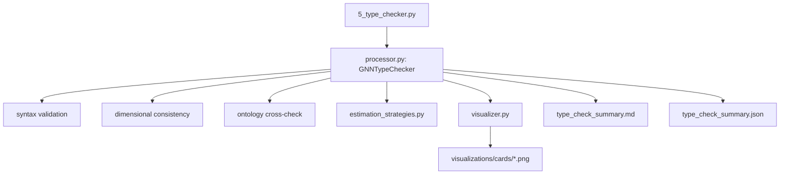

# Step 5: Type Checker

## Architectural Mapping

**Orchestrator**: `src/5_type_checker.py` (thin script, ~65 lines)
**Implementation Layer**: `src/type_checker/`
**Canonical Entry Point**: `type_checker.processor.GNNTypeChecker`

## Module Description

Step 5 is the pipeline's static-analysis and validation gate. It ingests parsed
GNN specifications from Step 3, validates each model's structural, dimensional,
and ontological consistency, estimates computational resources required for
downstream execution, and emits per-model "trading card" visualizations that
summarize the findings.

The Type Checker was structurally unified in v1.6.0, consolidating previously
fragmented validation layers into a single orchestrator class. It operates as
the first hard validation stage for every GNN file, prior to code generation
(Step 11) or simulation (Step 12).



## CLI

Step 5 is invoked through the standard pipeline orchestrator:

```bash
# Run only step 5 against the sample corpus
python src/main.py --only-steps 5 --verbose

# Strict mode: treat every warning as an error
python src/main.py --only-steps 5 --strict

# With resource estimation
python src/main.py --only-steps 5 --estimate-resources
```

Direct invocation (bypass orchestrator, useful for CI):

```bash
python src/5_type_checker.py --target-dir input/gnn_files \
                             --output-dir output \
                             --strict \
                             --estimate-resources
```

## Public API

`type_checker/__init__.py` exposes:

| Name | Kind | Purpose |
|------|------|---------|
| `GNNTypeChecker` | class | Per-directory orchestrator; holds configuration + results. |
| `check_gnn_file(path: Path) -> TypeCheckResult` | function | Single-file entry point (used by LSP, MCP). |
| `process_type_checking(target_dir, output_dir, ...) -> bool\|int` | function | Pipeline-standard processor (Phase 0.1 contract). |
| `estimate_resources(model) -> ResourceEstimate` | function | Delegated to `estimation_strategies.py`. |
| `render_trading_card(model, output_path)` | function | Delegated to `visualizer.py`. |

## Validation Rules

| Rule ID | Description | Default Severity |
|---------|-------------|------------------|
| `GNN-E001` | Unknown section header | error |
| `GNN-E002` | StateSpaceBlock variable not declared | error |
| `GNN-E003` | Connection references undefined variable | error |
| `GNN-E004` | Matrix dimensions mismatch declared shape | error |
| `GNN-W001` | Ontology annotation uses unknown term | warning |
| `GNN-W002` | Missing optional section present in every other sample | warning |
| `GNN-W003` | Non-stochastic matrix (columns don't sum to 1.0±ε) | warning |
| `GNN-W004` | ModelParameters missing a canonical key (num_hidden_states etc.) | warning |

In `--strict` mode, all warnings are promoted to errors and the step exits
with code 1. Without `--strict`, the step exits 0 on success, 1 only on hard
errors, 2 when no GNN files are found (per Phase 1.1 contract).

## Resource Estimation Outputs

For each model, `estimate_resources()` produces:

```
{
  "state_space_dim": 48,          # product of all state-variable dimensions
  "observation_space_dim": 12,
  "action_space_dim": 4,
  "total_parameters": 2304,       # across A, B, C, D matrices
  "estimated_flops_per_step": 9.8e3,
  "estimated_memory_bytes": 18432,
  "complexity_class": "moderate"  # one of: trivial | small | moderate | large | extreme
}
```

These are fed to Step 12 (execute) for wall-time / memory prediction and to
Step 16 (analysis) for cross-model comparison.

## Output Artifacts

Per run, Step 5 produces in `output/5_type_checker_output/`:

- `type_check_summary.md` — human-readable Markdown summary with inline card images
- `type_check_summary.json` — machine-readable summary for downstream steps
- `visualizations/cards/<model_name>_card.png` — per-model trading card
- `validation_errors.json` — structured error list for LSP / Step 24 remediation
- `resource_estimates.json` — output of estimation_strategies for the corpus

## Testing

Test file: `src/tests/test_type_checker_overall.py`

Key coverage areas:

- `test_type_checker_validates_sample_corpus` — runs against every file in
  `input/gnn_files/` and asserts all pass without errors.
- `test_type_checker_rejects_dimension_mismatch` — hand-crafted GNN with
  `A[2,3]` declared but `{(0.5,0.5),(0.5,0.5)}` initialized (shape 2×2) must
  emit GNN-E004.
- `test_type_checker_flags_unknown_ontology_term` — `s=NotARealTerm`
  produces GNN-W001.
- `test_type_checker_strict_mode_promotes_warnings` — same corpus with
  `--strict` exits non-zero when any warning is present.

Per CLAUDE.md zero-mock policy, tests use real parsed GNN models from the
sample corpus rather than MagicMock fixtures.

## Troubleshooting

| Symptom | Likely Cause | Remediation |
|---------|-------------|-------------|
| Step 5 reports "no GNN files found" with exit code 2 | `--target-dir` points at an empty or non-existent dir | Verify path; Step 3 (GNN parse) should have populated it. |
| Trading card images missing but summary present | matplotlib unavailable in venv | `uv sync --extra visualization` |
| Resource estimates show `complexity_class: extreme` for small models | ModelParameters missing `num_hidden_states` so estimator fell back on StateSpaceBlock parsing | Add canonical keys to ModelParameters section; see GNN-W004. |

## Source References

- Module root: [src/type_checker/](../../../src/type_checker)
- Processor: [src/type_checker/processor.py](../../../src/type_checker/processor.py)
- Estimation: [src/type_checker/estimation_strategies.py](../../../src/type_checker/estimation_strategies.py)
- Visualizer: [src/type_checker/visualizer.py](../../../src/type_checker/visualizer.py)
- Tests: [src/tests/test_type_checker_overall.py](../../../src/tests/test_type_checker_overall.py)
