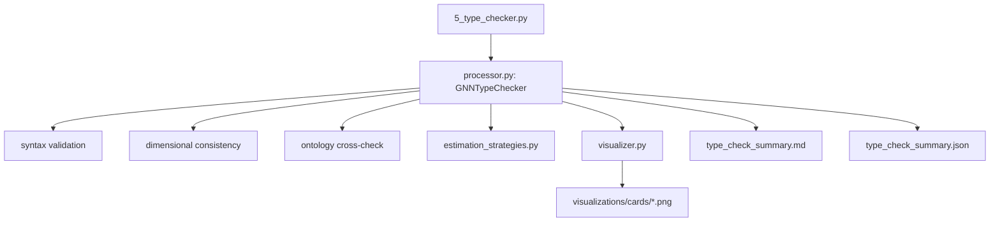

# Step 5: Type Checker

## Architectural Mapping

**Orchestrator**: `src/5_type_checker.py` (thin script, 70 lines)
**Implementation Layer**: `src/type_checker/`
**Canonical Entry Point**: `type_checker.processor.GNNTypeChecker`

## Module Description

Step 5 is the pipeline's static-analysis and validation gate. It ingests parsed
GNN specifications from Step 3, validates each model's structural, dimensional,
and ontological consistency, estimates computational resources required for
downstream execution, and emits per-model "trading card" visualizations that
summarize the findings.

The Type Checker consolidates validation in a single orchestrator class. It operates as
the first hard validation stage for every GNN file, prior to code generation
(Step 11) or simulation (Step 12).


```mermaid
graph TD
    Pipeline[5_type_checker.py] --> Orchestrator[processor.py: GNNTypeChecker]
    Orchestrator --> Syntax[syntax validation]
    Orchestrator --> Dims[dimensional consistency]
    Orchestrator --> Ontology[ontology cross-check]
    Orchestrator --> Estim[estimation_strategies.py]
    Orchestrator --> Viz[visualizer.py]
    Viz --> Cards[visualizations/cards/*.png]
    Orchestrator --> Summary[type_check_summary.md]
    Orchestrator --> SummaryJson[type_check_summary.json]
```

## CLI

Step 5 is invoked through the standard pipeline orchestrator:

```bash
# Run only step 5 against the sample corpus
python src/main.py --only-steps 5 --verbose

# Strict mode: treat every warning as an error
python src/main.py --only-steps 5 --strict

# With resource estimation
python src/main.py --only-steps 5 --estimate-resources
```

Direct invocation (bypass orchestrator, useful for CI):

```bash
python src/5_type_checker.py --target-dir input/gnn_files \
                             --output-dir output \
                             --strict \
                             --estimate-resources
```

## Public API

`type_checker/__init__.py` exposes:

| Name | Kind | Purpose |
|------|------|---------|
| `GNNTypeChecker` | class | Orchestrator (`src/type_checker/checking/core.py`); `check_file(path)` validates a single file, `validate_gnn_files(target_dir, output_dir, ...)` validates a directory, `generate_report(...)` and `generate_json_data(...)` write the Markdown/JSON summaries. |
| `estimate_file_resources(content: str) -> ResourceEstimate` | function | Estimates computational resources (state/observation/action space size, parameters, FLOPs, memory, complexity class) for one GNN file's content; defined in `src/type_checker/checking/core.py`, bridging to `estimation/estimator.py`. |

## Validation Rules

The type checker itself emits one code, `GNN-E004` (matrix dimensions mismatch the
declared shape). The remaining codes come from the schema validator in
`src/gnn/schema.py`; their normative meanings are in
[gnn_syntax.md § 8 Error Taxonomy](../gnn_syntax.md) and are summarised here:

| Rule ID | Emitted by | Meaning | Default Severity |
|---------|-----------|---------|------------------|
| `GNN-E001` | `gnn/schema.py` | Missing required section | error |
| `GNN-E002` | `gnn/schema.py` | Variable dimension mismatch (declaration vs parameterization) | error |
| `GNN-E004` | `type_checker/` and `gnn/schema.py` | Matrix dimensions mismatch declared shape / duplicate variable declaration | error |
| `GNN-E005` | `gnn/schema.py` | Unparseable connection syntax | error |
| `GNN-W002` | `gnn/schema.py` | Connection references undeclared variable | warning |
| `GNN-W003` | `gnn/schema.py` | Parameterization provided for undeclared variable | warning |

In `--strict` mode, B-orientation contradictions (`GNN-E002`) are promoted
from warnings to errors and the step exits with code 1. Without `--strict`,
the step exits 0 when every file validates, 1 only on hard errors
(exceptions while processing), and 2 when the run completed but is only a
warning-level outcome — some files are invalid, or no GNN files were found
(per the Phase 1.1 widened contract: "nothing to do" is
`SUCCESS_WITH_WARNINGS`, matching Steps 12/16 and the render step).

## Resource Estimation Outputs

For each model, `estimate_file_resources(content)` produces:

```
{
  "state_space_dim": 48,          # product of all state-variable dimensions
  "observation_space_dim": 12,
  "action_space_dim": 4,
  "total_parameters": 2304,       # across A, B, C, D matrices
  "estimated_flops_per_step": 9.8e3,
  "estimated_memory_bytes": 18432,
  "complexity_class": "moderate"  # one of: trivial | small | moderate | large | extreme
}
```

These are fed to Step 12 (execute) for wall-time / memory prediction and to
Step 16 (analysis) for cross-model comparison.

## Output Artifacts

Per run, Step 5 produces in `output/5_type_checker_output/`:

- `type_check_summary.md` — human-readable Markdown summary with inline card images
- `type_check_summary.json` — machine-readable summary for downstream steps
- `visualizations/cards/<model_name>_card.png` — per-model trading card
- `type_check_results.json` / `type_check_data.json` / `type_check_report.md` — structured per-file results and report
- `resource_data.json` / `resource_report.md` — resource estimates for the corpus

## Testing

Test file: `src/tests/type_checker/test_type_checker_overall.py`

Key coverage areas:

- `test_check_file_valid` — a valid GNN file passes `check_file`.
- `test_check_file_with_errors` — a file with type errors is reported as invalid.
- `test_check_directory` — directory-level checking over a corpus.
- `test_check_nonexistent_file_returns_error` / `test_check_unreadable_file_returns_error`
  — missing or unreadable inputs surface as errors, not crashes.
- Strict promotion of B-orientation contradictions (`GNN-E002`) is pinned by
  `test_strict_mode_constructor_promotes_b_contradiction_to_error` and
  `test_validate_content_strict_override_beats_instance_default` in
  `src/tests/type_checker/test_type_checker_content_validation.py`; the
  Phase 1.1 warning-continuation exits (invalid files → 2, no files → 2)
  are pinned by `test_validate_single_gnn_file_never_raises_on_content_error`
  and `test_validate_gnn_files_no_files_is_warning_exit_2` in the same file.

Per CLAUDE.md real-implementation policy, tests use real parsed GNN models from the
sample corpus rather than MagicMock fixtures.

## Troubleshooting

| Symptom | Likely Cause | Remediation |
|---------|-------------|-------------|
| Step 5 reports "no GNN files found" with exit code 2 | `--target-dir` points at an empty or non-existent dir | Verify path; Step 3 (GNN parse) should have populated it. |
| Trading card images missing but summary present | matplotlib unavailable in venv | `uv sync` |
| Resource estimates show `complexity_class: extreme` for small models | ModelParameters missing `num_hidden_states` so estimator fell back on StateSpaceBlock parsing | Add canonical keys to ModelParameters section; see GNN-W004. |

## Source References

- Module root: [src/type_checker/](../../../src/type_checker)
- Processor: [src/type_checker/processor.py](../../../src/type_checker/processor.py)
- Estimation: [src/type_checker/estimation_strategies.py](../../../src/type_checker/estimation_strategies.py)
- Visualizer: [src/type_checker/visualizer.py](../../../src/type_checker/visualizer.py)
- Tests: [src/tests/type_checker/test_type_checker_overall.py](../../../src/tests/type_checker/test_type_checker_overall.py)
