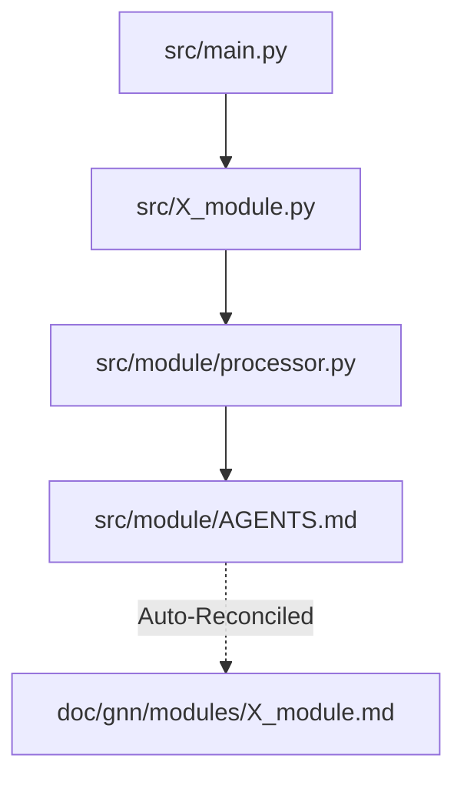

# GNN Modules Sub-Tree

**Version**: v1.6.0 Engine (Bundle v2.0.0)
**Status**: Zero-Mock Production Synchronization

This directory contains autogenerated mappings of the real internal codebase orchestration loops (`00-24`). As of v1.5.0, these modules include Neurosymbolic intelligence and autonomous heuristic discovery logic. 
Each file listed corresponds identically to a step within the overarching GNN execution pipeline, automatically extracting Agent configurations and logic layers directly from `src/*/AGENTS.md`.

## Indices Map
- `00_template.md` -> `src/0_template.py` 
- `01_setup.md` -> `src/1_setup.py`
...
- `24_intelligent_analysis.md` -> `src/24_intelligent_analysis.py`

## Architecture
The GNN Pipeline strictly aligns all modules utilizing the "Thin Orchestrator" pattern. 

