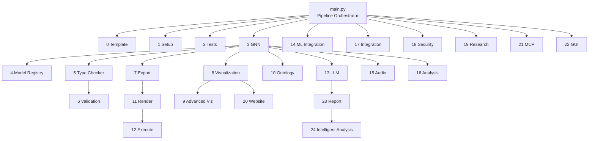

# GNN Pipeline Module Reference

Complete documentation for all 25 pipeline steps (0–24), plus the core package and main orchestrator.

## Pipeline Architecture

All numbered scripts follow the **thin orchestrator** pattern: each `N_step.py` script delegates to a corresponding `src/step/` module package. The scripts handle only argument parsing and logging setup via `create_standardized_pipeline_script()`.



## Module Index

| Step | Script | Module | Description |
|:----:|--------|--------|-------------|
| — | [\_\_init\_\_.py](init.md) | `src/` | Core package metadata and module discovery |
| — | [main.py](main.md) | — | 25-step pipeline orchestrator |
| 0 | [0_template.py](00_template.md) | `template/` | Pipeline pattern demonstration |
| 1 | [1_setup.py](01_setup.md) | `setup/` | UV environment setup and dependency management |
| 2 | [2_tests.py](02_tests.md) | `tests/` | Test suite execution (fast/comprehensive) |
| 3 | [3_gnn.py](03_gnn.md) | `gnn/` | GNN file discovery, parsing, multi-format serialization |
| 4 | [4_model_registry.py](04_model_registry.md) | `model_registry/` | Model versioning and lifecycle tracking |
| 5 | [5_type_checker.py](05_type_checker.md) | `type_checker/` | GNN type checking and validation |
| 6 | [6_validation.py](06_validation.md) | `validation/` | Semantic validation and quality assurance |
| 7 | [7_export.py](07_export.md) | `export/` | Multi-format export (JSON, XML, GraphML, GEXF, Pickle) |
| 8 | [8_visualization.py](08_visualization.md) | `visualization/` | Matrix and network visualization |
| 9 | [9_advanced_viz.py](09_advanced_viz.md) | `advanced_visualization/` | 3D, interactive, dashboard, POMDP, D2 visualization |
| 10 | [10_ontology.py](10_ontology.md) | `ontology/` | Ontology processing and term mapping |
| 11 | [11_render.py](11_render.md) | `render/` | POMDP-aware code rendering to 5 frameworks |
| 12 | [12_execute.py](12_execute.md) | `execute/` | Script execution across Python/Julia environments |
| 13 | [13_llm.py](13_llm.md) | `llm/` | LLM-powered analysis and processing |
| 14 | [14_ml_integration.py](14_ml_integration.md) | `ml_integration/` | ML framework integration |
| 15 | [15_audio.py](15_audio.md) | `audio/` | Audio sonification and analysis |
| 16 | [16_analysis.py](16_analysis.md) | `analysis/` | Statistical analysis, post-simulation visualization |
| 17 | [17_integration.py](17_integration.md) | `integration/` | Cross-module integration processing |
| 18 | [18_security.py](18_security.md) | `security/` | Security validation and scanning |
| 19 | [19_research.py](19_research.md) | `research/` | Research processing and literature integration |
| 20 | [20_website.py](20_website.md) | `website/` | Static website generation |
| 21 | [21_mcp.py](21_mcp.md) | `mcp/` | Model Context Protocol server |
| 22 | [22_gui.py](22_gui.md) | `gui/` | Interactive GUI constructor (Gradio) |
| 23 | [23_report.py](23_report.md) | `report/` | Pipeline report generation |
| 24 | [24_intelligent_analysis.py](24_intelligent_analysis.md) | `intelligent_analysis/` | LLM-powered pipeline analysis |

## Common CLI Interface

All steps accept the standard arguments:

```bash
python src/N_step.py --target-dir <input_dir> --output-dir <output_dir> [--verbose] [--recursive]
```

Steps produce output in `output/N_step_output/` by default.

## See Also

- [Architecture Reference](../architecture_reference.md) — Pipeline design and data flow
- [Framework Integration Guide](../framework_integration_guide.md) — Supported computational frameworks
- [Quickstart Tutorial](../quickstart_tutorial.md) — Getting started with the pipeline
