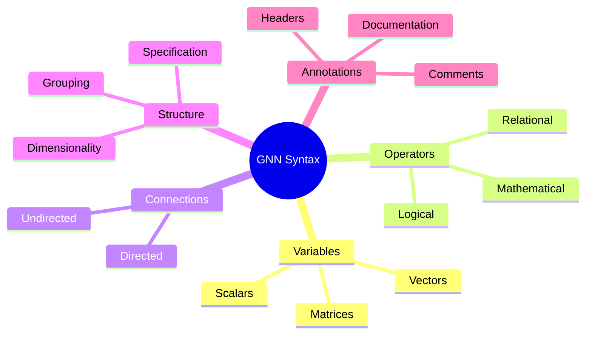
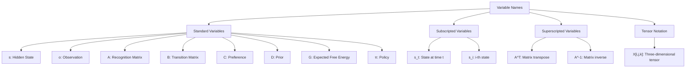
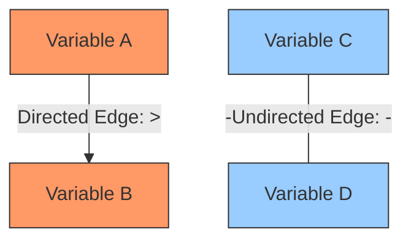
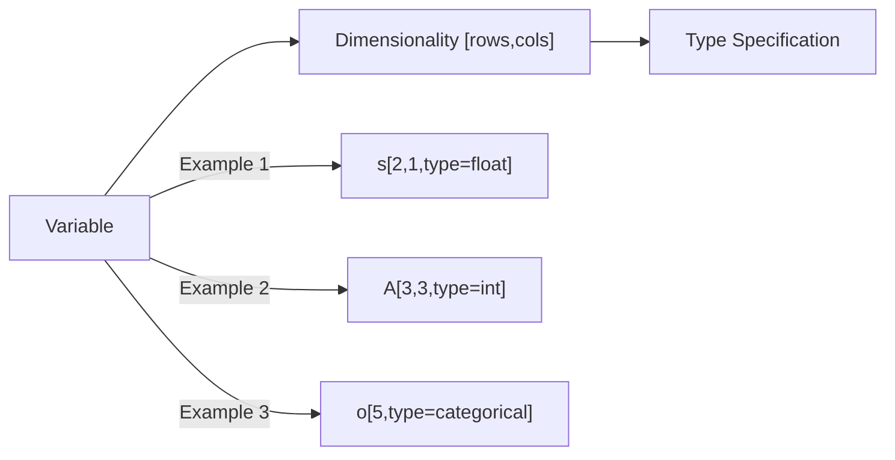
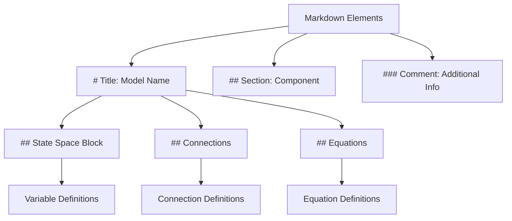

# GNN Syntax and Punctuation

This document provides a comprehensive reference for the syntax and punctuation used in Generalized Notation Notation (GNN).

## Syntax Overview

GNN uses standard ASCII characters to represent mathematical concepts, causal relationships, and model structures. The syntax is designed to be:

1. **Intuitive**: Symbols closely resemble their mathematical counterparts
2. **ASCII-compatible**: Uses only standard keyboard characters
3. **Unambiguous**: Each symbol has a clear, specific meaning
4. **Extensible**: Can be expanded to accommodate new notation needs



## Symbol Reference Table

Below is the complete reference for all GNN symbols and their usage:

| Symbol | Name                | Meaning                             | Example       | Interpretation                           |
|--------|---------------------|-------------------------------------|---------------|------------------------------------------|
| ,      | Comma               | List separator                      | X,Y           | Elements X and Y                         |
| _      | Underscore          | Subscript                           | X_2           | Variable X with subscript 2              |
| ^      | Caret               | Superscript                         | X^Y           | Variable X with superscript Y            |
| =      | Equals              | Equality or assignment              | X=5           | X is set to 5                            |
| >      | Greater than        | Directed causal edge                | X>Y           | Causal influence from X to Y             |
| -      | Hyphen              | Undirected causal edge              | X-Y           | Undirected relation between X and Y      |
| ( )    | Parentheses         | Grouping                            | (X+Y)         | Parenthesized expression                 |
| { }    | Curly braces        | Exact value specification           | X{1}          | X equals 1 exactly                       |
| [ ]    | Square brackets     | Dimensionality or indexing          | X[2,3]        | X is a 2×3 matrix                        |
| #      | Hash/Pound          | Title header                        | # Title       | Top-level section header                 |
| ##     | Double hash         | Section header                      | ## Section    | Section header                           |
| ###    | Triple hash         | Comment line                        | ### Comment   | Comment line                             |
| +      | Plus                | Addition                            | X+Y           | Sum of X and Y                           |
| *      | Asterisk            | Multiplication                      | X*Y           | Product of X and Y                       |
| /      | Forward slash       | Division                            | X/Y           | X divided by Y                           |
| \|     | Vertical bar        | Conditional probability             | P(X\|Y)       | Probability of X given Y                 |
| →      | Arrow (ASCII: ->)   | Direction or sequence               | X→Y           | X leads to Y                             |
| ∈      | Element of (ASCII: in) | Set membership                   | x∈X           | x is an element of set X                 |
| ∧      | Logical AND (ASCII: &) | Logical conjunction              | A∧B           | A and B                                  |
| ∨      | Logical OR (ASCII: \|) | Logical disjunction              | A∨B           | A or B                                   |

## Variable Naming Conventions



Variables in GNN should follow these conventions:

1. **Single-letter variables** are preferred for standard elements (e.g., s for state, o for observation)
2. **Subscripts** indicate indexing or specific instances (e.g., s_1 for first state)
3. **Superscripts** indicate mathematical operations or qualifiers (e.g., A^T for transpose)
4. **Dimensionality** is specified using square brackets (e.g., X[2,3] for a 2×3 matrix)
5. **Greek letters** are written out in ASCII (e.g., pi for π, sigma for σ)

## Connection Syntax

GNN provides two primary ways to represent connections between variables:



1. **Directed Connections** (A>B): Represent causal influence from A to B, indicating that A affects or causes changes in B.

2. **Undirected Connections** (A-B): Represent bidirectional or correlational relationships between A and B, where neither necessarily causes the other.

## Dimensionality and Type Specification

Variables in GNN can have their dimensionality and types specified:



Examples:
- `s[2,1,type=float]`: A 2×1 vector (column vector) of floating-point values
- `A[3,3,type=int]`: A 3×3 matrix of integers
- `o[5,type=categorical]`: A vector of size 5 containing categorical values

## Mathematical Expressions

GNN supports a variety of mathematical expressions:

```mermaid
graph TD
    EXPR[Mathematical Expressions] --> ADD[Addition: X+Y]
    EXPR --> SUB[Subtraction: X-Y]
    EXPR --> MULT[Multiplication: X*Y]
    EXPR --> DIV[Division: X/Y]
    EXPR --> FUNC[Function Application: f(X)]
    EXPR --> COMP[Complex Expressions]
    
    COMP --> EX1["softmax(ln(D)+ln(A^T*o))"]
    COMP --> EX2["sum_tau(s_{pi,tau}*ln(s_{pi,tau}))"]
```

Mathematical expressions can be combined to form complex equations representing model dynamics.

## Markdown Integration

GNN uses Markdown-style headers for structuring documents:



The Markdown structure helps organize the GNN file into logical sections and makes it more readable.

## Example Expressions

Here are some example GNN expressions demonstrating the syntax:

### Basic Variable Definition
```
s[2,1,type=float]  # Hidden state as a 2D column vector
```

### Connection Definition
```
s>o  # Hidden state causes observation
A-B  # Undirected relationship between A and B
```

### Complex Mathematical Expression
```
s_{pi,tau=1}=sigma((1/2)(lnD+ln(B^dagger_{pi,tau}s_{pi,tau+1}))+lnA^T*o_tau)
```

### Model Structure Section
```
## Connections
D-s_t
s_t-A
A-o
s_t-B
B-s_t+1
C>G
G>π
```

## Best Practices

When writing GNN expressions:

1. **Be consistent** in your variable naming and formatting
2. **Use meaningful variable names** that reflect their role in the model
3. **Include comments** (###) to explain complex parts of the model
4. **Structure your document** with clear section headers
5. **Specify dimensionality** for all variables where applicable
6. **Use exact value specification** `{}` for constants and initialization
7. **Follow the Active Inference Ontology** mappings for standard variables

## Advanced Syntax Examples

### Tensor Notation
```
X[2,3,4]  # 3D tensor with dimensions 2×3×4
```

### Conditional Probability
```
P(s|o)  # Probability of state s given observation o
```

### Time-indexed Variables
```
s_t  # State at time t
s_{t+1}  # State at next time step
```

### Nested Expressions
```
(A*(B+C))^T  # Transpose of A multiplied by (B plus C)
```

## References

1. Smékal, J., & Friedman, D. A. (2023). Generalized Notation Notation for Active Inference Models. Active Inference Institute. https://doi.org/10.5281/zenodo.7803328
2. Active Inference Institute: [Generalized Notation Notation (GNN) GitHub Repository](https://github.com/ActiveInferenceInstitute/GeneralizedNotationNotation)
3. Machine-readable specification: [GNN Punctuation Specification](../src/gnn/gnn_punctuation.md) 