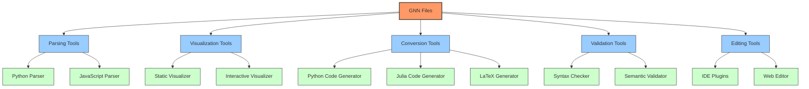
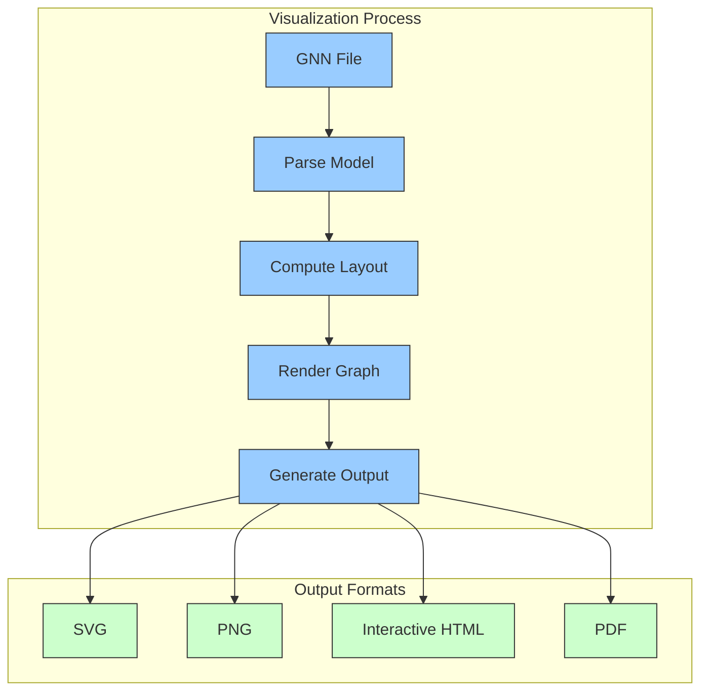
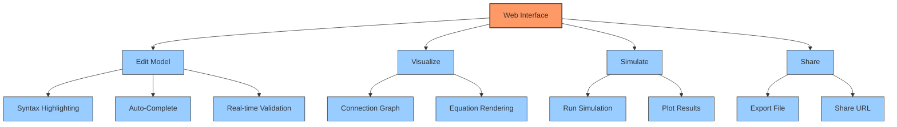
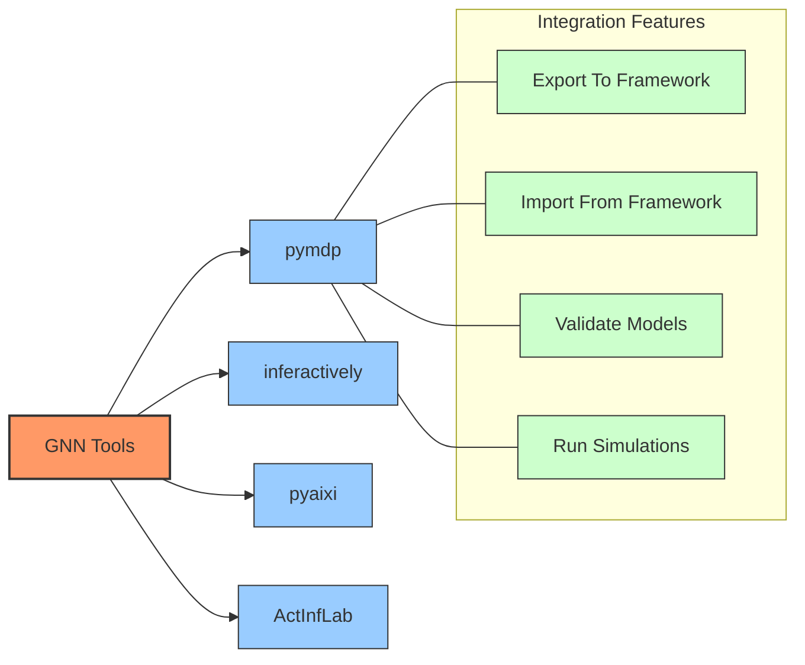
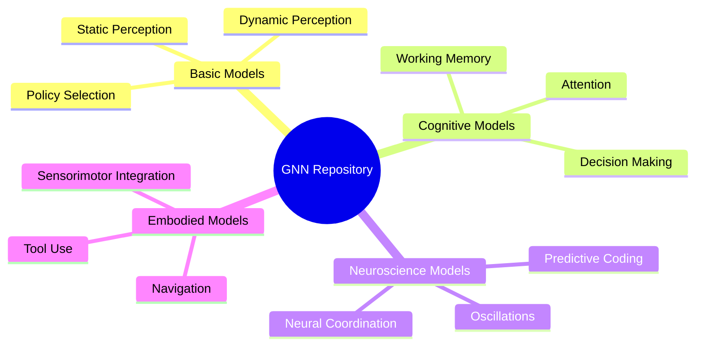
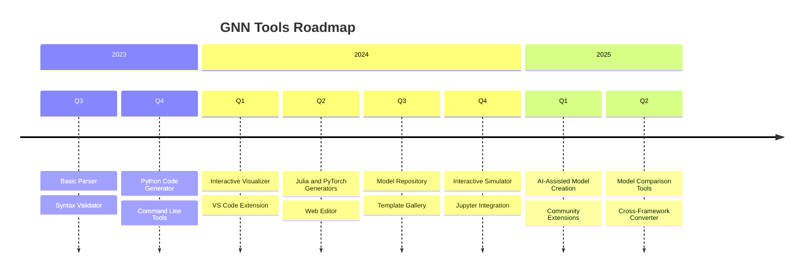

# GNN Tools and Resources

This document provides information about tools, libraries, and resources for working with Generalized Notation Notation (GNN).

## GNN Tool Ecosystem

The GNN ecosystem includes various tools for different aspects of working with GNN files:



## Parsing Tools

### GNN Parser (Python)

The `gnn-parser` Python package provides tools for parsing GNN files into structured data:

```python
import gnn_parser

# Parse a GNN file
model = gnn_parser.parse_file("models/dynamic_perception.gnn")

# Access model components
print(f"Model name: {model.name}")
print(f"Variables: {model.variables}")
print(f"Connections: {model.connections}")

# Convert to Python dictionary
model_dict = model.to_dict()
```

### GNN Parser API Reference

| Function | Description | Parameters | Return Value |
|----------|-------------|------------|--------------|
| `parse_file(file_path)` | Parse a GNN file from disk | `file_path`: Path to GNN file | `GNNModel` object |
| `parse_string(content)` | Parse GNN from a string | `content`: GNN content as string | `GNNModel` object |
| `validate(model)` | Validate a GNN model | `model`: `GNNModel` object | Boolean validity |
| `to_json(model)` | Convert model to JSON | `model`: `GNNModel` object | JSON string |
| `from_json(json_string)` | Create model from JSON | `json_string`: JSON representation | `GNNModel` object |

## Visualization Tools

### GNN Graph Visualizer

The GNN Graph Visualizer creates graphical representations of GNN models:



#### Command-Line Interface

```bash
# Generate SVG visualization
gnn-viz model.gnn --output model.svg

# Generate interactive HTML
gnn-viz model.gnn --output model.html --interactive

# Customize appearance
gnn-viz model.gnn --output model.svg --theme light --highlight-variables "s,o"
```

#### Python API

```python
from gnn_tools import visualize

# Create visualization
viz = visualize.create_graph("models/dynamic_perception.gnn")

# Customize appearance
viz.set_theme("light")
viz.highlight_variables(["s", "o"])
viz.set_layout("hierarchical")

# Save in different formats
viz.save_svg("model.svg")
viz.save_html("model.html", interactive=True)
```

## Conversion Tools

### GNN to Python Converter

The GNN to Python converter generates executable Python code from GNN files:

```python
from gnn_tools import converters

# Convert GNN to Python code
python_code = converters.to_python("models/dynamic_perception.gnn", 
                                   framework="numpy")

# Save to file
with open("dynamic_perception.py", "w") as f:
    f.write(python_code)

# You can also run the model directly
model = converters.to_python_object("models/dynamic_perception.gnn")
results = model.run(observations=my_observations)
```

### GNN to LaTeX Converter

Generate LaTeX equations from GNN models:

```python
from gnn_tools import converters

# Convert GNN equations to LaTeX
latex_equations = converters.to_latex("models/dynamic_perception.gnn",
                                     section="equations")

# Generate full LaTeX document
latex_doc = converters.to_latex_document("models/dynamic_perception.gnn")

# Save to file
with open("model_equations.tex", "w") as f:
    f.write(latex_doc)
```

## Validation Tools

### GNN Validator

The GNN Validator checks GNN files for syntax and semantic errors:

```python
from gnn_tools import validator

# Validate a GNN file
result = validator.validate("models/dynamic_perception.gnn")

if result.is_valid:
    print("Model is valid!")
else:
    print("Validation errors:")
    for error in result.errors:
        print(f"- Line {error.line}: {error.message}")
```

#### Common Validation Checks

- Syntax compliance with GNN specification
- Variable references consistency
- Dimensionality compatibility in equations
- Proper connection definitions
- Ontology mapping validity

## Editing Tools

### GNN Web Editor

The GNN Web Editor provides a browser-based interface for creating and editing GNN models:



Access the web editor at: [https://gnn-editor.activeinference.org](https://gnn-editor.activeinference.org)

### IDE Plugins

GNN support is available for various IDEs:

- **VS Code Extension**: Syntax highlighting, validation, and visualization
- **Jupyter Notebook Extension**: Interactive GNN editing and visualization
- **PyCharm Plugin**: GNN integration with Python development

## Integration with Active Inference Frameworks

GNN tools integrate with several Active Inference frameworks:



### Integration Examples

#### PyMDP Integration

```python
from gnn_tools import converters
import pymdp

# Convert GNN model to PyMDP compatible format
model_params = converters.to_pymdp("models/dynamic_perception.gnn")

# Create PyMDP agent
agent = pymdp.Agent(model_params)

# Run simulation
observations = [0, 1, 0, 1, 0]
for t in range(len(observations)):
    agent.infer_states(observations[t])
    agent.infer_policies()
    action = agent.sample_action()
```

## Model Repository

The GNN Model Repository contains a collection of pre-built GNN models:



Access the repository at: [https://github.com/ActiveInferenceInstitute/GNN-Models](https://github.com/ActiveInferenceInstitute/GNN-Models)

## Installation and Setup

### Python Tools

Install the Python GNN toolkit:

```bash
pip install gnn-toolkit
```

### Command Line Tools

Install command line tools:

```bash
pip install gnn-cli
```

Basic usage:

```bash
# Parse and validate a GNN file
gnn validate model.gnn

# Convert GNN to Python
gnn convert model.gnn --to python --output model.py

# Visualize a GNN model
gnn visualize model.gnn --output model.svg
```

## Documentation and Resources

### Official Documentation

- [GNN Specification](https://activeinferenceinstitute.github.io/gnn/specification)
- [API Reference](https://activeinferenceinstitute.github.io/gnn/api)
- [Tutorials](https://activeinferenceinstitute.github.io/gnn/tutorials)

### Learning Resources

- [GNN Introduction](https://activeinferenceinstitute.github.io/gnn/intro)
- [Video Tutorials](https://www.youtube.com/playlist?list=PLxxx)
- [Example Gallery](https://activeinferenceinstitute.github.io/gnn/examples)

### Community

- [GitHub Repository](https://github.com/ActiveInferenceInstitute/GeneralizedNotationNotation)
- [Discussion Forum](https://forum.activeinference.org/c/gnn)
- [Issue Tracker](https://github.com/ActiveInferenceInstitute/GeneralizedNotationNotation/issues)

## Future Tool Development

Planned tools and features:



## References

1. Smékal, J., & Friedman, D. A. (2023). Generalized Notation Notation for Active Inference Models. Active Inference Institute. https://doi.org/10.5281/zenodo.7803328
2. Active Inference Institute: [Generalized Notation Notation (GNN) GitHub Repository](https://github.com/ActiveInferenceInstitute/GeneralizedNotationNotation)
3. Smith, R., Friston, K.J., & Whyte, C.J. (2022). A step-by-step tutorial on active inference and its application to empirical data. Journal of Mathematical Psychology, 107, 102632.

## GNN Processing Pipeline (`src/main.py`)

The GNN project includes a main pipeline script, `src/main.py`, designed to orchestrate the entire workflow of processing GNN files and related artifacts. This script provides a unified interface to run various tools and processing stages in a predefined order.

### Overview

The `main.py` script dynamically discovers and executes numbered Python scripts located in the `src/` directory. Each script corresponds to a specific processing stage and often targets a subdirectory with the same initial name (e.g., `1_gnn.py` relates to tasks in the `src/gnn/` directory or for GNN files in general).

The pipeline is designed to be flexible, allowing users to run the entire sequence of operations, skip certain steps, or run only specific steps. It also manages common configurations like target directories for GNN files and output directories for generated artifacts.

### Running the Pipeline

To use the pipeline, navigate to the root directory of the GeneralizedNotationNotation project and execute the script using Python:

```bash
python src/main.py [options]
```

### Command-Line Options for `main.py`

The `main.py` script accepts several command-line arguments to customize its behavior:

*   `--target-dir DIR`: Specifies the primary target directory for GNN files. Default: `gnn/examples`. Individual pipeline steps might also target their own specific subdirectories (e.g., `src/mcp` for the MCP step).
*   `--output-dir DIR`: Defines the base directory where all output files from the pipeline steps will be saved. Default: `../output` (relative to `src/`, so it becomes `output/` from the project root).
*   `--recursive`: If specified, enables recursive processing of directories. This flag is passed down to relevant pipeline steps that support it.
*   `--skip-steps LIST`: Allows you to provide a comma-separated list of step numbers or script names (without the `.py` extension) to exclude from the run. For example: `"1_gnn,7_mcp"` or `"1,7"`.
*   `--only-steps LIST`: Allows you to provide a comma-separated list of step numbers or script names to run exclusively. All other steps will be skipped. For example: `"4_gnn_type_checker,6_visualization"` or `"4,6"`.
*   `--verbose`: Enables more detailed logging output during the pipeline execution, showing more information about each step's progress.
*   `--strict`: Activates a strict type checking mode. This option is specifically relevant for the `4_gnn_type_checker.py` step.
*   `--estimate-resources`: Enables the estimation of computational resources. This option is specifically relevant for the `4_gnn_type_checker.py` step.
*   `--ontology-terms-file FILE`: Specifies the path to a file containing ontology terms (e.g., `ontology/terms.json`). This is used by the `8_ontology.py` step to link GNN models with formal ontological definitions.

You can also view these options by running `python src/main.py --help`.

### Pipeline Stages (Scripts in `src/`)

The following describes the individual scripts that constitute the pipeline stages, executed in numerical order. Their specific functionalities are determined by their content, but their names and the `main.py` structure suggest their roles:

1.  **`1_gnn.py` (GNN Core Processing)**
    *   **Associated Folder:** `gnn/`
    *   **Purpose:** Likely handles fundamental parsing, processing, or validation of GNN files themselves. This could involve initial syntax checks, structural analysis, or preparing GNN data for subsequent steps.

2.  **`2_setup.py` (Project Setup)**
    *   **Associated Folder:** `setup/`
    *   **Purpose:** This script is designated as a **critical step**. It probably performs essential setup tasks, configurations, or environment checks required for the rest of conseguent pipeline. If this step fails, the entire pipeline halts.

3.  **`3_tests.py` (Testing)**
    *   **Associated Folder:** `tests/`
    *   **Purpose:** Executes automated tests for the GNN functionalities or the pipeline itself. This helps ensure the integrity and correctness of the GNN tools and processing logic.

4.  **`4_gnn_type_checker.py` (GNN Type Checker)**
    *   **Associated Folder:** `gnn_type_checker/`
    *   **Purpose:** Responsible for performing detailed type checking on GNN files. It validates the consistency of variable types, dimensions, and relationships defined in the GNN models. It can also estimate computational resources if the `--estimate-resources` flag is active.

5.  **`5_export.py` (Export Functionality)**
    *   **Associated Folder:** `export/`
    *   **Purpose:** Manages the export of GNN models or derived data into various formats. This could include exporting to different modeling languages, data formats for analysis, or generating reports.

6.  **`6_visualization.py` (Visualization Generation)**
    *   **Associated Folder:** `visualization/`
    *   **Purpose:** Generates graphical representations or visualizations of GNN models. This aids in understanding the model structure, dependencies, and other characteristics.

7.  **`7_mcp.py` (Meta-Circular Processing)**
    *   **Associated Folder:** `mcp/`
    *   **Purpose:** Handles tasks related to Meta-Circular Processing for GNN. The specifics would depend on the definition of MCP within the project, but it generally implies models or processes that operate on or describe other models/processes.

8.  **`8_ontology.py` (Ontology Integration)**
    *   **Associated Folder:** `ontology/`
    *   **Purpose:** Deals with linking GNN models to ontological concepts or managing ontology-related data. This could involve mapping GNN elements to terms in a defined Active Inference ontology or similar knowledge representation.

9.  **`9_render.py` (Rendering)**
    *   **Associated Folder:** `render/`
    *   **Purpose:** Handles rendering of GNN files into different formats (e.g., mathematical notation, structured text based on GNN content).

Each of these scripts is expected to have a `main(args)` function that `src/main.py` calls, passing the parsed command-line arguments to it.

## Existing Tools (Invoked via Pipeline)

While the `src/main.py` script is the primary entry point, it orchestrates tools that might have previously been standalone or invoked differently. The sections below describe some of these key tools, now integrated as steps within the main pipeline.

### GNN Type Checker and Resource Estimator

(Previously `gnn_type_checker.py` standalone utility)

*   **Pipeline Step:** `4_gnn_type_checker.py`
*   **Functionality:** Validates GNN files for correctness according to the GNN specification. Checks for proper structure, section presence, type consistency of variables, dimensional correctness, and valid connections. Can optionally estimate computational resources (memory, inference time, storage) based on the model's structure.
*   **Invocation via `main.py`:**
    ```bash
    # To run only the type checker (step 4)
    python src/main.py --only-steps 4 --target-dir path/to/gnn_files

    # To run type checker with resource estimation
    python src/main.py --only-steps 4 --estimate-resources --target-dir path/to/gnn_files
    ```
*   **Key Options (via `main.py`):** `--target-dir`, `--output-dir`, `--recursive`, `--strict`, `--estimate-resources`.
*   **Outputs:** Generates Markdown reports, HTML visualizations, and JSON data detailing the type check results and resource estimates. These are typically saved in a subdirectory within the main output directory specified by `--output-dir` (e.g., `output/4_gnn_type_checker_outputs/`).

### GNN Visualization

(Previously `visualize_gnn.py` standalone utility)

*   **Pipeline Step:** `6_visualization.py`
*   **Functionality:** Creates graphical representations of GNN models. This can include factor graphs or other diagrams that help visualize the model's structure and variable relationships.
*   **Invocation via `main.py`:**
    ```bash
    # To run only visualization (step 6)
    python src/main.py --only-steps 6 --target-dir path/to/gnn_file.md
    ```
*   **Key Options (via `main.py`):** `--target-dir`, `--output-dir`.
*   **Outputs:** Image files (e.g., PNG, SVG) or HTML reports containing the visualizations. These are saved in a subdirectory within the main output directory (e.g., `output/6_visualization_outputs/`).

---

*This section should be expanded as the individual functionalities of each numbered script (`1_*.py`, `2_*.py`, etc.) are further defined or if other tools are integrated into the pipeline.* 