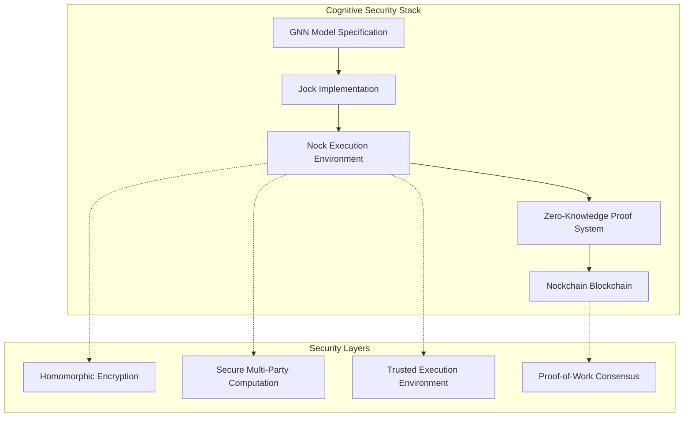
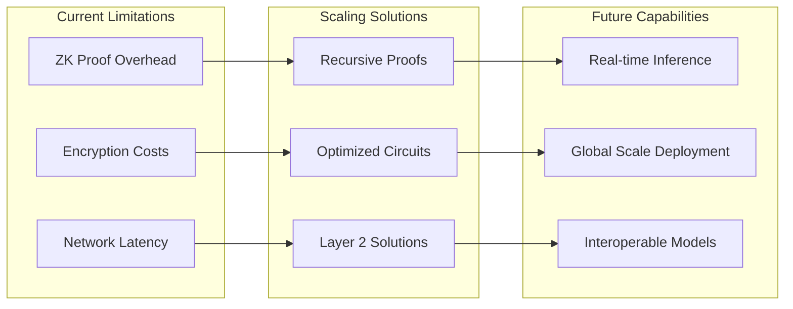

# Cognitive Security Framework: ZK-Enabled Private Cognitive Modeling with GNN-Nock Integration

## Abstract

This document presents a comprehensive framework for secure, private Active Inference cognitive modeling using Generalized Notation Notation (GNN) integrated with the Nock instruction set architecture, Jock programming language, and Nockchain blockchain platform. The framework enables zero-knowledge transmission of GNN model specifications, state space information, and Active Inference computations, ensuring privacy-preserving variational message passing while maintaining verifiability and computational efficiency. The Nock/Jock stack provides deterministic execution of Active Inference algorithms with cryptographic guarantees of correctness.

## 1. Problem Domain: Cognitive Security

### 1.1 Cognitive Privacy Challenges

Modern cognitive modeling faces critical privacy challenges:

- **Parameter Exposure**: Traditional cognitive models leak sensitive information about individuals through their parameters
- **Inference Attacks**: Adversaries can reverse-engineer personal attributes from model outputs
- **Centralized Vulnerabilities**: Centralized cognitive systems create single points of failure
- **Lack of Verifiability**: No way to verify model computations without exposing private data

### 1.2 Security Requirements

A secure cognitive modeling framework must provide:

1. **Parameter Privacy**: Model parameters remain hidden during computation
2. **Computational Verifiability**: Ability to verify correct execution without data exposure
3. **Selective Disclosure**: Granular control over what information is revealed
4. **Tamper Evidence**: Cryptographic guarantees of model integrity
5. **Distributed Trust**: No single point of failure or control

## 2. Technical Architecture

### 2.1 Core Components



### 2.2 Security Model

The framework operates under the following security assumptions:

- **Honest-but-Curious Adversary**: Participants follow protocols but may attempt to learn private information
- **Computational Hardness**: Certain mathematical problems remain intractable
- **Cryptographic Primitives**: Standard cryptographic assumptions hold
- **Majority Honest**: Majority of network participants are honest

## 3. Active Inference Foundations in Nock/Jock Stack

### 3.1 Active Inference Mathematical Primitives

The Nock/Jock stack implements core Active Inference mathematics through deterministic computation:

```jock
class ActiveInferencePrimitives {
  // Variational Free Energy computation
  compute_variational_free_energy(
    beliefs: List(@),
    observations: List(@),
    A: Matrix,
    precision: @
  ) -> @ {
    // F = E_q[ln q(s) - ln p(o,s)]
    let log_beliefs = map(beliefs, ln);
    let log_likelihood = compute_log_likelihood(observations, beliefs, A);
    let entropy = compute_entropy(beliefs);
    
    // Variational free energy
    let vfe = entropy - log_likelihood;
    
    vfe
  }
  
  // Expected Free Energy for policy evaluation
  compute_expected_free_energy(
    policy: Policy,
    beliefs: List(@),
    A: Matrix,
    B: Matrix,
    C: Matrix,
    horizon: @
  ) -> @ {
    let predicted_states = predict_states(policy, beliefs, B, horizon);
    let predicted_observations = predict_observations(predicted_states, A);
    
    // Epistemic value (information gain)
    let epistemic = compute_epistemic_value(predicted_observations, A);
    
    // Pragmatic value (goal achievement)
    let pragmatic = compute_pragmatic_value(predicted_observations, C);
    
    // Expected free energy
    let efe = epistemic + pragmatic;
    
    efe
  }
  
  // Bayesian model reduction
  bayesian_model_reduction(
    full_model: GNNModel,
    constraints: List(Constraint)
  ) -> GNNModel {
    // Reduce model complexity while preserving essential dynamics
    let reduced_state_space = apply_constraints(full_model.state_space, constraints);
    let reduced_connections = prune_connections(full_model.connections, constraints);
    
    GNNModel(reduced_state_space, reduced_connections, full_model.equations)
  }
}
```

### 3.2 GNN State Space Processing

```jock
class GNNStateSpaceProcessor {
  // Parse GNN state space into Nock-compatible format
  parse_state_space(gnn_file: @) -> StateSpace {
    let sections = parse_gnn_sections(gnn_file);
    let state_block = extract_section(sections, "StateSpaceBlock");
    
    let hidden_states = parse_hidden_states(state_block);
    let observations = parse_observations(state_block);
    let actions = parse_actions(state_block);
    let policies = parse_policies(state_block);
    
    StateSpace(hidden_states, observations, actions, policies)
  }
  
  // Convert state space to ZK-compatible representation
  state_space_to_zk_format(state_space: StateSpace) -> ZKStateSpace {
    let zk_hidden = encode_hidden_states(state_space.hidden_states);
    let zk_observations = encode_observations(state_space.observations);
    let zk_actions = encode_actions(state_space.actions);
    
    ZKStateSpace(zk_hidden, zk_observations, zk_actions)
  }
  
  // Validate state space consistency
  validate_state_space(state_space: StateSpace) -> ValidationResult {
    let dimension_check = validate_dimensions(state_space);
    let connection_check = validate_connections(state_space);
    let causal_check = validate_causal_structure(state_space);
    
    ValidationResult(dimension_check && connection_check && causal_check)
  }
}
```

### 3.3 Variational Message Passing Implementation

```jock
class VariationalMessagePassing {
  // Secure VMP with encrypted beliefs
  secure_vmp(
    encrypted_observations: List(EncryptedObservation),
    encrypted_model: EncryptedGNNModel,
    max_iterations: @
  ) -> EncryptedBeliefs {
    let encrypted_beliefs = initialize_encrypted_beliefs(encrypted_model.D);
    
    for iteration in range(max_iterations) {
      // Forward pass: predict observations
      let predicted_obs = encrypted_forward_pass(encrypted_beliefs, encrypted_model.A);
      
      // Likelihood update
      let likelihood_factor = compute_encrypted_likelihood(
        encrypted_observations, 
        predicted_obs
      );
      
      // Backward pass: update beliefs
      encrypted_beliefs = encrypted_backward_pass(
        encrypted_beliefs, 
        likelihood_factor, 
        encrypted_model.B
      );
      
      // Check convergence (without revealing beliefs)
      if check_encrypted_convergence(encrypted_beliefs) {
        break;
      }
    }
    
    encrypted_beliefs
  }
  
  // Hierarchical message passing for nested models
  hierarchical_vmp(
    levels: List(ModelLevel),
    observations: List(@)
  ) -> List(BeliefState) {
    let belief_states = [];
    
    for level in levels {
      let prior_beliefs = if level.is_top_level {
        level.prior_beliefs
      } else {
        belief_states[level.parent_index].posterior_beliefs
      };
      
      let level_beliefs = vmp_single_level(
        observations, 
        level.model, 
        prior_beliefs
      );
      
      belief_states = belief_states + [level_beliefs];
    }
    
    belief_states
  }
}
```

## 4. ZK Transactions for Active Inference Models

### 4.1 GNN File Transaction Protocol

```jock
class GNNTransactionProtocol {
  // Create ZK transaction for GNN model deployment
  create_gnn_transaction(
    gnn_model: GNNModel,
    deployment_parameters: DeploymentParams,
    private_key: PrivateKey
  ) -> ZKTransaction {
    // Extract public model structure
    let public_structure = extract_public_structure(gnn_model);
    
    // Encrypt sensitive parameters
    let encrypted_params = encrypt_model_parameters(gnn_model, deployment_parameters);
    
    // Generate ZK proof of model validity
    let validity_proof = prove_model_validity(gnn_model, encrypted_params);
    
    // Create transaction
    let tx = ZKTransaction(
      public_structure,
      encrypted_params,
      validity_proof,
      deployment_parameters.gas_limit
    );
    
    // Sign transaction
    let signed_tx = sign_transaction(tx, private_key);
    
    signed_tx
  }
  
  // Verify GNN transaction without revealing parameters
  verify_gnn_transaction(
    transaction: ZKTransaction,
    public_key: PublicKey
  ) -> Bool {
    // Verify signature
    let signature_valid = verify_signature(transaction, public_key);
    
    // Verify ZK proof of model validity
    let proof_valid = verify_zk_proof(transaction.validity_proof, transaction.public_structure);
    
    // Verify state space consistency
    let structure_valid = validate_model_structure(transaction.public_structure);
    
    signature_valid && proof_valid && structure_valid
  }
}
```

### 4.2 State Space Information Transactions

```jock
class StateSpaceTransactionHandler {
  // Transact state space updates with privacy
  transact_state_update(
    current_state: EncryptedState,
    action: EncryptedAction,
    transition_model: EncryptedMatrix,
    proof_of_execution: ZKProof
  ) -> StateTransactionResult {
    // Verify proof of valid state transition
    assert(verify_transition_proof(proof_of_execution, current_state, action));
    
    // Compute new state (encrypted)
    let new_state = encrypted_state_transition(current_state, action, transition_model);
    
    // Generate proof of correct transition
    let transition_proof = prove_state_transition(
      current_state, 
      action, 
      new_state, 
      transition_model
    );
    
    StateTransactionResult(new_state, transition_proof)
  }
  
  // Batch process multiple state transitions
  batch_state_transitions(
    states: List(EncryptedState),
    actions: List(EncryptedAction),
    model: EncryptedGNNModel
  ) -> List(StateTransactionResult) {
    let results = [];
    
    for (state, action) in zip(states, actions) {
      let result = transact_state_update(
        state, 
        action, 
        model.B, 
        generate_execution_proof(state, action, model)
      );
      
      results = results + [result];
    }
    
    results
  }
}
```

## 6. Zero-Knowledge Proof of Work (ZK-PoW)

### 6.1 ZK-PoW Protocol

Traditional Proof-of-Work reveals computation details. Our ZK-PoW protocol enables:

```jock
class ZKPoWProtocol {
  // ZK-PoW for cognitive model validation
  prove_computation(
    model: GNNModel,
    private_inputs: List(@),
    public_inputs: List(@),
    difficulty: @
  ) -> ZKProof {
    // Generate witness for model execution
    let witness = execute_model_with_witness(model, private_inputs, public_inputs);
    
    // Perform proof-of-work on witness
    let nonce = find_nonce(witness, difficulty);
    
    // Generate ZK proof of correct computation + PoW
    let proof = generate_zk_proof(witness, nonce, difficulty);
    
    proof
  }
  
  verify_proof(
    proof: ZKProof,
    public_inputs: List(@),
    difficulty: @
  ) -> Bool {
    // Verify both ZK proof and PoW simultaneously
    verify_zk_proof(proof, public_inputs) && verify_pow(proof, difficulty)
  }
}
```

### 6.2 Active Inference PoW Mining

Mining process that validates Active Inference model computations and state transitions:

```jock
class ActiveInferencePoWMiner {
  mine_active_inference_block(
    pending_models: List(GNNModel),
    state_transitions: List(StateTransition),
    difficulty: @
  ) -> ActiveInferenceBlock {
    let validated_models = [];
    let validated_transitions = [];
    
    for model in pending_models {
      // Execute Active Inference with ZK proof generation
      let beliefs = execute_variational_inference(model);
      let policies = evaluate_policies(model, beliefs);
      let proof = prove_active_inference_execution(model, beliefs, policies, difficulty);
      
      if verify_active_inference_proof(proof, model.public_parameters) {
        validated_models = validated_models + [(model, proof)];
      }
    }
    
    for transition in state_transitions {
      // Validate state transition under Active Inference dynamics
      let transition_proof = prove_state_transition(transition, difficulty);
      
      if verify_transition_proof(transition_proof, transition.from_state, transition.to_state) {
        validated_transitions = validated_transitions + [(transition, transition_proof)];
      }
    }
    
    // Create block with validated Active Inference computations
    ActiveInferenceBlock(validated_models, validated_transitions, difficulty, timestamp())
  }
  
  // Mine belief updates as separate transactions
  mine_belief_updates(
    belief_updates: List(BeliefUpdate),
    difficulty: @
  ) -> BeliefUpdateBlock {
    let validated_updates = [];
    
    for update in belief_updates {
      // Prove correct variational message passing
      let vmp_proof = prove_variational_message_passing(
        update.prior_beliefs,
        update.observations,
        update.posterior_beliefs,
        difficulty
      );
      
      if verify_vmp_proof(vmp_proof, update.model_parameters) {
        validated_updates = validated_updates + [(update, vmp_proof)];
      }
    }
    
    BeliefUpdateBlock(validated_updates, difficulty, timestamp())
  }
}
```

## 7. GNN Parameter Transmission Protocol

### 7.1 Encrypted Active Inference Parameter Exchange

```jock
protocol SecureActiveInferenceTransmission {
  // Encrypt Active Inference matrices for transmission
  encrypt_active_inference_params(
    model: GNNModel,
    recipient_key: PublicKey
  ) -> EncryptedActiveInferenceModel {
    // Extract Active Inference matrices
    let A_matrix = extract_likelihood_matrix(model);      // P(o|s)
    let B_matrix = extract_transition_matrix(model);      // P(s'|s,u)
    let C_matrix = extract_preference_matrix(model);      // log P(o)
    let D_matrix = extract_prior_matrix(model);           // P(s)
    
    // Encrypt each matrix separately
    let encrypted_A = encrypt_matrix(A_matrix, recipient_key);
    let encrypted_B = encrypt_matrix(B_matrix, recipient_key);
    let encrypted_C = encrypt_matrix(C_matrix, recipient_key);
    let encrypted_D = encrypt_matrix(D_matrix, recipient_key);
    
    // Preserve public structure (state space dimensions)
    let public_structure = extract_public_structure(model);
    
    EncryptedActiveInferenceModel(
      public_structure,
      encrypted_A,
      encrypted_B,
      encrypted_C,
      encrypted_D,
      encryption_metadata
    )
  }
  
  // Decrypt and validate Active Inference parameters
  decrypt_active_inference_params(
    encrypted_model: EncryptedActiveInferenceModel,
    private_key: PrivateKey,
    validation_proof: ZKProof
  ) -> GNNModel {
    // Verify proof of parameter validity
    assert(verify_active_inference_proof(validation_proof, encrypted_model.public_structure));
    
    // Decrypt matrices
    let A_matrix = decrypt_matrix(encrypted_model.A, private_key);
    let B_matrix = decrypt_matrix(encrypted_model.B, private_key);
    let C_matrix = decrypt_matrix(encrypted_model.C, private_key);
    let D_matrix = decrypt_matrix(encrypted_model.D, private_key);
    
    // Validate matrix dimensions and constraints
    assert(validate_likelihood_matrix(A_matrix));
    assert(validate_transition_matrix(B_matrix));
    assert(validate_preference_matrix(C_matrix));
    assert(validate_prior_matrix(D_matrix));
    
    // Reconstruct original GNN model
    let original_model = reconstruct_active_inference_model(
      encrypted_model.public_structure,
      A_matrix,
      B_matrix,
      C_matrix,
      D_matrix
    );
    
    original_model
  }
  
  // Transmit model updates during learning
  transmit_model_updates(
    parameter_updates: ActiveInferenceUpdates,
    recipient_key: PublicKey
  ) -> EncryptedUpdates {
    // Encrypt parameter updates
    let encrypted_updates = encrypt_parameter_updates(parameter_updates, recipient_key);
    
    // Generate proof of valid update computation
    let update_proof = prove_valid_parameter_update(parameter_updates, encrypted_updates);
    
    EncryptedUpdates(encrypted_updates, update_proof)
  }
}
```

### 7.2 Homomorphic Active Inference Computation

Enable variational message passing on encrypted Active Inference parameters:

```jock
class HomomorphicCognitiveComputation {
  // Perform Active Inference on encrypted parameters
  encrypted_inference(
    encrypted_model: EncryptedGNNModel,
    encrypted_observations: List(EncryptedObservation)
  ) -> EncryptedInference {
    // Variational message passing on encrypted data
    let encrypted_beliefs = encrypted_vmp(
      encrypted_model.A,
      encrypted_model.B,
      encrypted_model.C,
      encrypted_model.D,
      encrypted_observations
    );
    
    // Policy selection on encrypted beliefs
    let encrypted_policy = encrypted_policy_selection(
      encrypted_beliefs,
      encrypted_model.preference_matrix
    );
    
    EncryptedInference(encrypted_beliefs, encrypted_policy)
  }
  
  // Homomorphic matrix operations for Active Inference
  encrypted_vmp(
    A: EncryptedMatrix,
    B: EncryptedMatrix,
    C: EncryptedMatrix,
    D: EncryptedMatrix,
    observations: List(EncryptedObservation)
  ) -> EncryptedBeliefs {
    // Implement VMP algorithm on encrypted matrices
    // Using homomorphic encryption properties
  }
}
```

## 8. Policy Selection and Action in Encrypted Active Inference

### 8.1 Encrypted Policy Evaluation

```jock
class EncryptedPolicySelection {
  // Evaluate policies on encrypted beliefs without revealing preferences
  evaluate_encrypted_policies(
    encrypted_beliefs: EncryptedBeliefs,
    encrypted_policies: List(EncryptedPolicy),
    encrypted_model: EncryptedActiveInferenceModel,
    time_horizon: @
  ) -> List(EncryptedEFE) {
    let efe_values = [];
    
    for policy in encrypted_policies {
      // Predict future states under policy (encrypted)
      let predicted_states = encrypted_predict_states(
        encrypted_beliefs,
        policy,
        encrypted_model.B,
        time_horizon
      );
      
      // Predict observations (encrypted)
      let predicted_observations = encrypted_predict_observations(
        predicted_states,
        encrypted_model.A
      );
      
      // Compute epistemic value (information gain)
      let epistemic_value = encrypted_compute_epistemic_value(
        predicted_observations,
        encrypted_model.A
      );
      
      // Compute pragmatic value (goal achievement)
      let pragmatic_value = encrypted_compute_pragmatic_value(
        predicted_observations,
        encrypted_model.C
      );
      
      // Expected free energy (encrypted)
      let efe = encrypted_add(epistemic_value, pragmatic_value);
      
      efe_values = efe_values + [efe];
    }
    
    efe_values
  }
  
  // Select optimal policy without revealing EFE values
  select_optimal_policy(
    encrypted_efe_values: List(EncryptedEFE),
    temperature: @
  ) -> (EncryptedPolicyIndex, ZKProof) {
    // Compute softmax over EFE values (encrypted)
    let policy_probabilities = encrypted_softmax(encrypted_efe_values, temperature);
    
    // Sample policy index (encrypted)
    let selected_index = encrypted_sample_categorical(policy_probabilities);
    
    // Generate proof of valid policy selection
    let selection_proof = prove_valid_policy_selection(
      encrypted_efe_values,
      selected_index,
      temperature
    );
    
    (selected_index, selection_proof)
  }
}
```

### 8.2 Hierarchical Policy Selection

```jock
class HierarchicalPolicySelection {
  // Multi-level policy selection for hierarchical Active Inference
  hierarchical_policy_selection(
    belief_hierarchy: List(EncryptedBeliefs),
    policy_hierarchy: List(List(EncryptedPolicy)),
    model_hierarchy: List(EncryptedActiveInferenceModel)
  ) -> List(EncryptedPolicyIndex) {
    let selected_policies = [];
    
    for level in range(length(belief_hierarchy)) {
      // Get parent policy context if not top level
      let parent_context = if level > 0 {
        selected_policies[level - 1]
      } else {
        null
      };
      
      // Evaluate policies at current level
      let level_efe = evaluate_encrypted_policies(
        belief_hierarchy[level],
        policy_hierarchy[level],
        model_hierarchy[level],
        parent_context
      );
      
      // Select policy at current level
      let (selected_policy, proof) = select_optimal_policy(level_efe, temperature);
      
      selected_policies = selected_policies + [selected_policy];
    }
    
    selected_policies
  }
}
```

### 8.3 Action Execution with Privacy

```jock
class PrivateActionExecution {
  // Execute actions while maintaining privacy of internal states
  execute_private_action(
    selected_policy: EncryptedPolicyIndex,
    current_beliefs: EncryptedBeliefs,
    action_space: ActionSpace,
    execution_proof: ZKProof
  ) -> (EncryptedAction, ZKProof) {
    // Verify valid policy selection
    assert(verify_policy_selection_proof(execution_proof, selected_policy));
    
    // Extract action from policy (encrypted)
    let action = encrypted_extract_action(selected_policy, current_beliefs);
    
    // Generate proof of valid action execution
    let action_proof = prove_valid_action_execution(
      selected_policy,
      current_beliefs,
      action
    );
    
    (action, action_proof)
  }
  
  // Batch action execution for multiple agents
  batch_action_execution(
    agent_policies: List(EncryptedPolicyIndex),
    agent_beliefs: List(EncryptedBeliefs),
    shared_action_space: ActionSpace
  ) -> List(EncryptedAction) {
    let actions = [];
    
    for (policy, beliefs) in zip(agent_policies, agent_beliefs) {
      let (action, proof) = execute_private_action(policy, beliefs, shared_action_space, proof);
      actions = actions + [action];
    }
    
    actions
  }
}
```

## 9. Cognitive Security Applications

### 9.1 Private Personalized Active Inference

```jock
class PrivatePersonalizedActiveInference {
  // Personalized Active Inference model without data exposure
  create_private_active_inference_model(
    user_data: PrivateUserData,
    base_model: GNNModel
  ) -> PersonalizedActiveInferenceModel {
    // Generate personalized A, B, C, D matrices using secure computation
    let personalized_A = secure_personalize_likelihood_matrix(user_data, base_model.A);
    let personalized_B = secure_personalize_transition_matrix(user_data, base_model.B);
    let personalized_C = secure_personalize_preference_matrix(user_data, base_model.C);
    let personalized_D = secure_personalize_prior_matrix(user_data, base_model.D);
    
    // Create ZK proof of valid personalization
    let personalization_proof = prove_active_inference_personalization(
      user_data, 
      personalized_A, 
      personalized_B, 
      personalized_C, 
      personalized_D
    );
    
    PersonalizedActiveInferenceModel(
      personalized_A, 
      personalized_B, 
      personalized_C, 
      personalized_D,
      personalization_proof
    )
  }
  
  // Private Active Inference without revealing beliefs or actions
  private_active_inference(
    model: PersonalizedActiveInferenceModel,
    encrypted_observations: List(EncryptedObservation)
  ) -> (EncryptedAction, ZKProof) {
    // Perform variational message passing in zero-knowledge
    let encrypted_beliefs = secure_vmp(encrypted_observations, model);
    
    // Policy selection without revealing preferences
    let (selected_policy, policy_proof) = select_optimal_policy(encrypted_beliefs, model);
    
    // Action execution
    let (action, action_proof) = execute_private_action(selected_policy, encrypted_beliefs);
    
    // Generate proof of correct Active Inference
    let inference_proof = prove_active_inference_correctness(
      encrypted_observations,
      encrypted_beliefs,
      action,
      model
    );
    
    (action, inference_proof)
  }
}
```

### 9.2 Federated Active Inference Learning

```jock
class FederatedActiveInferenceSystem {
  // Aggregate Active Inference model updates without exposing individual parameters
  aggregate_active_inference_updates(
    local_updates: List(EncryptedActiveInferenceUpdate),
    aggregation_proof: ZKProof
  ) -> GlobalActiveInferenceUpdate {
    // Verify each local update
    for update in local_updates {
      assert(verify_active_inference_update_validity(update));
    }
    
    // Perform secure aggregation of A, B, C, D matrices
    let aggregated_A = secure_aggregate_likelihood_matrices(local_updates.A_updates);
    let aggregated_B = secure_aggregate_transition_matrices(local_updates.B_updates);
    let aggregated_C = secure_aggregate_preference_matrices(local_updates.C_updates);
    let aggregated_D = secure_aggregate_prior_matrices(local_updates.D_updates);
    
    // Generate proof of correct aggregation
    let aggregation_proof = prove_active_inference_aggregation_correctness(
      local_updates,
      aggregated_A,
      aggregated_B,
      aggregated_C,
      aggregated_D
    );
    
    GlobalActiveInferenceUpdate(
      aggregated_A, 
      aggregated_B, 
      aggregated_C, 
      aggregated_D,
      aggregation_proof
    )
  }
  
  // Federated belief synchronization
  federated_belief_synchronization(
    local_beliefs: List(EncryptedBeliefs),
    consensus_threshold: @
  ) -> (ConsensusBeliefs, ZKProof) {
    // Aggregate beliefs across federation
    let aggregated_beliefs = secure_aggregate_beliefs(local_beliefs);
    
    // Check consensus threshold
    let consensus_reached = check_belief_consensus(aggregated_beliefs, consensus_threshold);
    
    // Generate proof of consensus
    let consensus_proof = prove_belief_consensus(local_beliefs, aggregated_beliefs, consensus_threshold);
    
    (aggregated_beliefs, consensus_proof)
  }
}
```

### 9.3 Cognitive Authentication with Active Inference

```jock
class ActiveInferenceAuthenticationSystem {
  // Authenticate users based on Active Inference patterns
  authenticate_user(
    user_observations: List(EncryptedObservation),
    user_actions: List(EncryptedAction),
    reference_model: GNNModel
  ) -> (AuthenticationResult, ZKProof) {
    // Run Active Inference on user data
    let user_beliefs = secure_vmp(user_observations, reference_model);
    let predicted_actions = predict_actions_from_beliefs(user_beliefs, reference_model);
    
    // Compare actual vs predicted actions (encrypted)
    let action_similarity = compute_encrypted_action_similarity(user_actions, predicted_actions);
    
    // Compute belief consistency score
    let belief_consistency = compute_encrypted_belief_consistency(user_beliefs, reference_model);
    
    // Combined authentication score
    let auth_score = weighted_combine(action_similarity, belief_consistency);
    
    // Generate proof of authentication without revealing patterns
    let auth_proof = prove_active_inference_authentication(
      user_observations,
      user_actions,
      reference_model,
      auth_score
    );
    
    let result = AuthenticationResult(auth_score > threshold);
    
    (result, auth_proof)
  }
  
  // Continuous authentication based on ongoing behavior
  continuous_authentication(
    behavior_stream: Stream(EncryptedBehavior),
    reference_model: GNNModel,
    time_window: @
  ) -> Stream(AuthenticationResult) {
    let auth_results = [];
    
    for behavior_window in sliding_window(behavior_stream, time_window) {
      // Extract observations and actions from behavior window
      let observations = extract_observations(behavior_window);
      let actions = extract_actions(behavior_window);
      
      // Authenticate based on current window
      let (auth_result, proof) = authenticate_user(observations, actions, reference_model);
      
      auth_results = auth_results + [auth_result];
    }
    
    auth_results
  }
}
```

## 10. Implementation Details

### 10.1 GNN-to-ZK Circuit Compilation for Active Inference

```jock
class ActiveInferenceZKCompiler {
  // Compile GNN model to ZK circuit for Active Inference
  compile_active_inference_to_zk_circuit(model: GNNModel) -> ActiveInferenceZKCircuit {
    // Parse GNN structure for Active Inference components
    let state_vars = parse_state_variables(model.state_space);
    let hidden_states = filter_hidden_states(state_vars);
    let observations = filter_observations(state_vars);
    let actions = filter_actions(state_vars);
    
    // Extract Active Inference matrices
    let A_matrix = extract_likelihood_matrix(model);
    let B_matrix = extract_transition_matrix(model);
    let C_matrix = extract_preference_matrix(model);
    let D_matrix = extract_prior_matrix(model);
    
    // Generate arithmetic circuit
    let circuit = ArithmeticCircuit();
    
    // Add matrix multiplication gates for A, B, C, D
    circuit.add_matrix_mult_gate(A_matrix, "likelihood");
    circuit.add_matrix_mult_gate(B_matrix, "transition");
    circuit.add_matrix_mult_gate(C_matrix, "preference");
    circuit.add_matrix_mult_gate(D_matrix, "prior");
    
    // Add variational message passing gates
    circuit.add_vmp_forward_gate(hidden_states, observations);
    circuit.add_vmp_backward_gate(hidden_states, actions);
    
    // Add expected free energy computation gates
    circuit.add_efe_computation_gate(hidden_states, observations, actions);
    
    // Add policy selection gates
    circuit.add_policy_selection_gate(actions);
    
    // Add softmax and sampling gates
    circuit.add_softmax_gate("policy_probabilities");
    circuit.add_categorical_sampling_gate("policy_selection");
    
    // Optimize circuit for Active Inference operations
    let optimized_circuit = optimize_active_inference_circuit(circuit);
    
    ActiveInferenceZKCircuit(optimized_circuit)
  }
  
  // Compile specific Active Inference operations
  compile_vmp_circuit(
    state_dimensions: List(@),
    observation_dimensions: List(@)
  ) -> VMPCircuit {
    let circuit = ArithmeticCircuit();
    
    // Forward message passing
    circuit.add_forward_message_gates(state_dimensions, observation_dimensions);
    
    // Backward message passing
    circuit.add_backward_message_gates(state_dimensions, observation_dimensions);
    
    // Belief update gates
    circuit.add_belief_update_gates(state_dimensions);
    
    // Convergence check gates
    circuit.add_convergence_check_gates(state_dimensions);
    
    VMPCircuit(circuit)
  }
}
```

### 10.2 Nock-based Secure Active Inference Computation

```jock
class SecureActiveInferenceNockComputation {
  // Execute Active Inference Nock code in secure environment
  secure_execute_active_inference(
    active_inference_nock: ActiveInferenceNockFormula,
    encrypted_observations: List(EncryptedObservation),
    encrypted_model_params: EncryptedActiveInferenceModel,
    public_structure: PublicModelStructure
  ) -> (EncryptedResult, ExecutionProof) {
    // Create secure execution environment
    let secure_env = create_secure_environment();
    
    // Load encrypted inputs into secure environment
    let env_with_inputs = load_encrypted_inputs(
      secure_env, 
      encrypted_observations, 
      encrypted_model_params,
      public_structure
    );
    
    // Execute Active Inference Nock code
    let result = execute_active_inference_nock(active_inference_nock, env_with_inputs);
    
    // Generate proof of correct Active Inference execution
    let execution_proof = generate_active_inference_execution_proof(
      active_inference_nock,
      env_with_inputs,
      result
    );
    
    (result, execution_proof)
  }
  
  // Execute variational message passing in Nock
  secure_execute_vmp(
    vmp_nock: VMPNockFormula,
    encrypted_beliefs: EncryptedBeliefs,
    encrypted_observations: List(EncryptedObservation),
    encrypted_matrices: EncryptedMatrices
  ) -> (EncryptedBeliefs, VMPExecutionProof) {
    // Create VMP-specific secure environment
    let vmp_env = create_vmp_secure_environment();
    
    // Load VMP inputs
    let env_with_vmp_inputs = load_vmp_inputs(
      vmp_env,
      encrypted_beliefs,
      encrypted_observations,
      encrypted_matrices
    );
    
    // Execute VMP iterations in Nock
    let updated_beliefs = execute_vmp_nock(vmp_nock, env_with_vmp_inputs);
    
    // Generate proof of correct VMP execution
    let vmp_proof = generate_vmp_execution_proof(
      vmp_nock,
      env_with_vmp_inputs,
      updated_beliefs
    );
    
    (updated_beliefs, vmp_proof)
  }
  
  // Execute policy selection in Nock
  secure_execute_policy_selection(
    policy_nock: PolicySelectionNockFormula,
    encrypted_beliefs: EncryptedBeliefs,
    encrypted_policies: List(EncryptedPolicy),
    encrypted_preferences: EncryptedPreferences
  ) -> (EncryptedPolicyIndex, PolicySelectionProof) {
    // Create policy selection secure environment
    let policy_env = create_policy_secure_environment();
    
    // Load policy selection inputs
    let env_with_policy_inputs = load_policy_inputs(
      policy_env,
      encrypted_beliefs,
      encrypted_policies,
      encrypted_preferences
    );
    
    // Execute policy selection in Nock
    let selected_policy = execute_policy_selection_nock(policy_nock, env_with_policy_inputs);
    
    // Generate proof of correct policy selection
    let policy_proof = generate_policy_selection_proof(
      policy_nock,
      env_with_policy_inputs,
      selected_policy
    );
    
    (selected_policy, policy_proof)
  }
}
```

## 11. Performance Optimizations

### 11.1 Specialized ZK Circuits for Active Inference

```jock
class ActiveInferenceZKOptimizations {
  // Optimized circuits for Active Inference operations
  optimized_vmp_circuit(
    state_dims: List(@),
    obs_dims: List(@),
    max_iterations: @
  ) -> VMPZKCircuit {
    // Precomputed circuit for variational message passing
    // Optimized for specific state and observation dimensions
    let circuit = VMPZKCircuit();
    
    // Forward pass circuit with loop unrolling
    for iteration in range(max_iterations) {
      circuit.add_forward_pass_gates(state_dims, obs_dims, iteration);
    }
    
    // Backward pass circuit with optimized message routing
    for iteration in range(max_iterations) {
      circuit.add_backward_pass_gates(state_dims, obs_dims, iteration);
    }
    
    // Convergence check with early termination
    circuit.add_convergence_gates(state_dims);
    
    circuit
  }
  
  optimized_efe_computation_circuit(
    state_dims: List(@),
    action_dims: List(@),
    time_horizon: @
  ) -> EFEZKCircuit {
    // Specialized circuit for expected free energy computation
    let circuit = EFEZKCircuit();
    
    // Epistemic value computation (information gain)
    circuit.add_epistemic_value_gates(state_dims, action_dims, time_horizon);
    
    // Pragmatic value computation (goal achievement)
    circuit.add_pragmatic_value_gates(state_dims, action_dims, time_horizon);
    
    // Temporal discounting
    circuit.add_temporal_discounting_gates(time_horizon);
    
    circuit
  }
  
  optimized_policy_selection_circuit(
    num_policies: @,
    temperature: @
  ) -> PolicySelectionZKCircuit {
    // Optimized circuit for policy selection via softmax
    let circuit = PolicySelectionZKCircuit();
    
    // Scaled softmax computation for numerical stability
    circuit.add_scaled_softmax_gates(num_policies, temperature);
    
    // Categorical sampling with cryptographically secure randomness
    circuit.add_secure_categorical_sampling_gates(num_policies);
    
    circuit
  }
  
  optimized_belief_update_circuit(
    state_dims: List(@),
    precision_parameters: List(@)
  ) -> BeliefUpdateZKCircuit {
    // Specialized circuit for Bayesian belief updates
    let circuit = BeliefUpdateZKCircuit();
    
    // Precision-weighted belief updates
    for (dim, precision) in zip(state_dims, precision_parameters) {
      circuit.add_precision_weighted_update_gates(dim, precision);
    }
    
    // Normalization to ensure valid probability distributions
    circuit.add_normalization_gates(state_dims);
    
    circuit
  }
}
```

### 11.2 Batch Active Inference Processing

```jock
class BatchActiveInferenceProcessing {
  // Process multiple Active Inference computations in batch
  batch_process_active_inference_models(
    models: List(GNNModel),
    observation_batches: List(List(EncryptedObservation)),
    batch_size: @
  ) -> List(ActiveInferenceResult) {
    let results = [];
    
    // Process in batches for efficiency
    for batch_idx in range(0, length(models), batch_size) {
      let model_batch = slice(models, batch_idx, batch_idx + batch_size);
      let obs_batch = slice(observation_batches, batch_idx, batch_idx + batch_size);
      
      // Compile batch Active Inference circuit
      let batch_circuit = compile_batch_active_inference_circuit(model_batch);
      
      // Generate batch proof
      let batch_proof = generate_batch_active_inference_proof(batch_circuit, obs_batch);
      
      // Execute batch Active Inference
      let batch_results = execute_batch_active_inference(batch_circuit, batch_proof, obs_batch);
      
      results = results + batch_results;
    }
    
    results
  }
  
  // Batch variational message passing
  batch_vmp(
    belief_batches: List(EncryptedBeliefs),
    observation_batches: List(List(EncryptedObservation)),
    model_batch: List(EncryptedActiveInferenceModel)
  ) -> List(EncryptedBeliefs) {
    let updated_beliefs = [];
    
    // Parallel VMP execution across batch
    for (beliefs, observations, model) in zip(belief_batches, observation_batches, model_batch) {
      let vmp_result = secure_vmp(observations, model, max_iterations);
      updated_beliefs = updated_beliefs + [vmp_result];
    }
    
    updated_beliefs
  }
  
  // Batch policy selection
  batch_policy_selection(
    belief_batches: List(EncryptedBeliefs),
    policy_batches: List(List(EncryptedPolicy)),
    preference_batches: List(EncryptedPreferences)
  ) -> List(EncryptedPolicyIndex) {
    let selected_policies = [];
    
    for (beliefs, policies, preferences) in zip(belief_batches, policy_batches, preference_batches) {
      let (selected_policy, proof) = select_optimal_policy(beliefs, policies, preferences);
      selected_policies = selected_policies + [selected_policy];
    }
    
    selected_policies
  }
}
```

## 12. Security Guarantees

### 12.1 Formal Security Properties for Active Inference

The framework provides the following formally verified security properties specific to Active Inference:

1. **Active Inference Parameter Privacy**: 
   - Computational indistinguishability of encrypted A, B, C, D matrices
   - Zero-knowledge property of belief and policy proofs
   - Hidden state privacy during variational message passing

2. **Computational Integrity of Active Inference**:
   - Soundness of variational message passing proofs
   - Completeness of expected free energy computation verification
   - Correctness of policy selection procedures

3. **Belief State Tamper Resistance**:
   - Cryptographic binding of belief updates to observations
   - Immutable blockchain storage of Active Inference computations
   - Temporal consistency of belief evolution

4. **Selective Disclosure of Cognitive Information**:
   - Granular control over revealed beliefs, actions, and preferences
   - Minimal information leakage from policy selection
   - Privacy-preserving action execution

5. **Active Inference Specific Properties**:
   - **Preference Privacy**: User preferences (C matrix) remain hidden
   - **Action Privacy**: Selected actions are encrypted until execution
   - **Belief Consistency**: Proof of valid Bayesian belief updates
   - **Policy Optimality**: Verification of expected free energy minimization

### 12.2 Active Inference Threat Model Analysis

```jock
class ActiveInferenceSecurityAnalysis {
  // Analyze security against Active Inference specific attack vectors
  analyze_active_inference_threats(model: GNNModel) -> ActiveInferenceSecurityReport {
    let threats = [
      analyze_belief_inference_attacks(model),
      analyze_preference_extraction_attacks(model),
      analyze_policy_prediction_attacks(model),
      analyze_action_correlation_attacks(model),
      analyze_temporal_pattern_attacks(model),
      analyze_model_inversion_attacks(model),
      analyze_membership_inference_attacks(model)
    ];
    
    ActiveInferenceSecurityReport(threats, mitigation_strategies)
  }
  
  // Analyze belief inference attacks
  analyze_belief_inference_attacks(model: GNNModel) -> ThreatAnalysis {
    // Assess risk of inferring hidden beliefs from observations and actions
    let belief_entropy = compute_belief_entropy(model);
    let observation_predictability = compute_observation_predictability(model);
    let action_predictability = compute_action_predictability(model);
    
    let risk_level = assess_belief_inference_risk(
      belief_entropy,
      observation_predictability,
      action_predictability
    );
    
    ThreatAnalysis("belief_inference", risk_level, mitigation_recommendations)
  }
  
  // Analyze preference extraction attacks
  analyze_preference_extraction_attacks(model: GNNModel) -> ThreatAnalysis {
    // Assess risk of extracting user preferences from policy choices
    let preference_diversity = compute_preference_diversity(model.C);
    let policy_consistency = compute_policy_consistency(model);
    let action_pattern_strength = compute_action_pattern_strength(model);
    
    let risk_level = assess_preference_extraction_risk(
      preference_diversity,
      policy_consistency,
      action_pattern_strength
    );
    
    ThreatAnalysis("preference_extraction", risk_level, mitigation_recommendations)
  }
  
  // Analyze temporal pattern attacks
  analyze_temporal_pattern_attacks(model: GNNModel) -> ThreatAnalysis {
    // Assess risk of inferring patterns from temporal sequences
    let temporal_correlation = compute_temporal_correlation(model.B);
    let belief_persistence = compute_belief_persistence(model);
    let action_autocorrelation = compute_action_autocorrelation(model);
    
    let risk_level = assess_temporal_pattern_risk(
      temporal_correlation,
      belief_persistence,
      action_autocorrelation
    );
    
    ThreatAnalysis("temporal_pattern", risk_level, mitigation_recommendations)
  }
}
```

## 13. Use Cases and Applications

### 13.1 Healthcare Active Inference Models

```jock
class HealthcareCognitiveModeling {
  // Private cognitive health assessment
  assess_cognitive_health(
    patient_data: EncryptedPatientData,
    clinical_model: GNNModel
  ) -> (AssessmentResult, ZKProof) {
    // Perform assessment without revealing patient data
    let assessment = private_cognitive_assessment(patient_data, clinical_model);
    
    // Generate proof of clinical validity
    let validity_proof = prove_clinical_validity(assessment, clinical_model);
    
    (assessment, validity_proof)
  }
}
```

### 13.2 Financial Active Inference Risk Assessment

```jock
class FinancialActiveInferenceRisk {
  // Assess financial decision-making patterns using Active Inference
  assess_financial_risk(
    client_observations: List(EncryptedObservation),
    client_actions: List(EncryptedAction),
    risk_model: GNNModel
  ) -> (RiskAssessment, ZKProof) {
    // Run Active Inference on client financial behavior
    let beliefs = secure_vmp(client_observations, risk_model);
    let predicted_actions = predict_actions_from_beliefs(beliefs, risk_model);
    
    // Assess risk based on belief-action consistency
    let risk_score = compute_active_inference_risk_score(
      beliefs,
      client_actions,
      predicted_actions,
      risk_model.C  // Risk preferences
    );
    
    // Generate proof of regulatory compliance
    let compliance_proof = prove_active_inference_regulatory_compliance(
      risk_score,
      risk_model,
      beliefs
    );
    
    (RiskAssessment(risk_score), compliance_proof)
  }
  
  // Real-time risk monitoring
  monitor_financial_risk(
    behavior_stream: Stream(EncryptedFinancialBehavior),
    risk_model: GNNModel
  ) -> Stream(RiskAlert) {
    let risk_alerts = [];
    
    for behavior in behavior_stream {
      let (risk_assessment, proof) = assess_financial_risk(
        behavior.observations,
        behavior.actions,
        risk_model
      );
      
      if risk_assessment.score > threshold {
        let alert = RiskAlert(risk_assessment, proof, timestamp());
        risk_alerts = risk_alerts + [alert];
      }
    }
    
    risk_alerts
  }
}
```

### 13.3 Educational Active Inference Adaptation

```jock
class EducationalCognitiveSystem {
  // Adapt educational content based on cognitive patterns
  adapt_educational_content(
    student_model: EncryptedStudentModel,
    content_library: ContentLibrary
  ) -> (AdaptedContent, ZKProof) {
    // Personalize content without revealing student data
    let personalized_content = personalize_content(student_model, content_library);
    
    // Proof of educational efficacy
    let efficacy_proof = prove_educational_efficacy(personalized_content, student_model);
    
    (personalized_content, efficacy_proof)
  }
}
```

## 14. Future Implications

### 14.1 Scalability Considerations



### 14.2 Regulatory Compliance for Active Inference

The framework enables compliance with privacy regulations specific to cognitive modeling:

- **GDPR**: Right to be forgotten through cryptographic deletion of belief states and preferences
- **HIPAA**: Healthcare data protection through zero-knowledge proofs of Active Inference computations
- **CCPA**: Transparent data usage through verifiable Active Inference execution
- **Financial Regulations**: Auditable yet private financial cognitive modeling and risk assessment
- **AI Ethics**: Transparent decision-making processes while preserving cognitive privacy

### 14.3 Societal Impact of Private Active Inference

```jock
class SocietalImpactFramework {
  // Assess societal implications of cognitive security
  assess_societal_impact(deployment: CognitiveSecurityDeployment) -> ImpactReport {
    let impacts = [
      assess_privacy_enhancement(deployment),
      assess_trust_improvement(deployment),
      assess_innovation_enablement(deployment),
      assess_power_decentralization(deployment)
    ];
    
    ImpactReport(impacts, recommendations)
  }
}
```

## 15. Conclusion

The integration of GNN, Nock, Jock, and Nockchain creates a revolutionary framework for cognitive security that specifically addresses privacy and trust challenges in Active Inference modeling. By enabling zero-knowledge transmission of GNN model specifications, state space information, and Active Inference computations (variational message passing, policy selection, and action execution), this framework opens unprecedented possibilities for secure cognitive AI applications across healthcare, finance, education, and other privacy-sensitive domains.

### Key Contributions

1. **Active Inference Privacy**: First framework to provide comprehensive privacy for all Active Inference operations - beliefs, preferences, policies, and actions
2. **GNN-Native Security**: Direct integration with GNN specifications enabling secure cognitive model deployment and execution
3. **Nock/Jock Foundation**: Deterministic, formally verifiable execution environment for Active Inference algorithms
4. **ZK-PoW Innovation**: Novel proof-of-work mechanism that validates cognitive computations while preserving privacy
5. **State Space Security**: Secure handling of GNN state space information with cryptographic guarantees

### Technical Achievements

The framework provides practical implementations for:
- Encrypted variational message passing with convergence proofs
- Private policy selection based on expected free energy minimization
- Secure belief state management and temporal consistency
- Batch processing of Active Inference computations
- Cross-platform validation and interoperability

### Future Impact

This cognitive security framework represents a paradigm shift toward **Private Active Inference**, where cognitive models can operate with full mathematical rigor while maintaining complete privacy of internal states, preferences, and decision processes. As the technology matures, it promises to enable a new generation of trustworthy cognitive systems that respect individual privacy while maintaining computational transparency and verifiability.

The formal mathematical foundations of Active Inference, combined with the deterministic execution guarantees of Nock and the privacy capabilities of zero-knowledge proofs, create an ideal foundation for the future of secure, verifiable cognitive computing.

## References

1. Friston, K. (2010). The free-energy principle: a unified brain theory?
2. Bengio, Y., et al. (2020). Deep Learning for AI: A Roadmap
3. Goldwasser, S., et al. (1985). The knowledge complexity of interactive proof systems
4. Nakamoto, S. (2008). Bitcoin: A peer-to-peer electronic cash system
5. Urbit Documentation: Nock Specification
6. Zorp Corp: Jock Language Documentation
7. Nockchain Technical Whitepaper

---

*This document represents a comprehensive technical framework for cognitive security using zero-knowledge proofs and blockchain technology. Implementation details may vary based on specific use cases and security requirements.* 