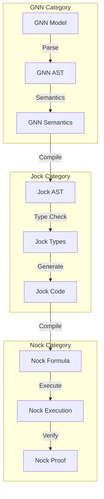
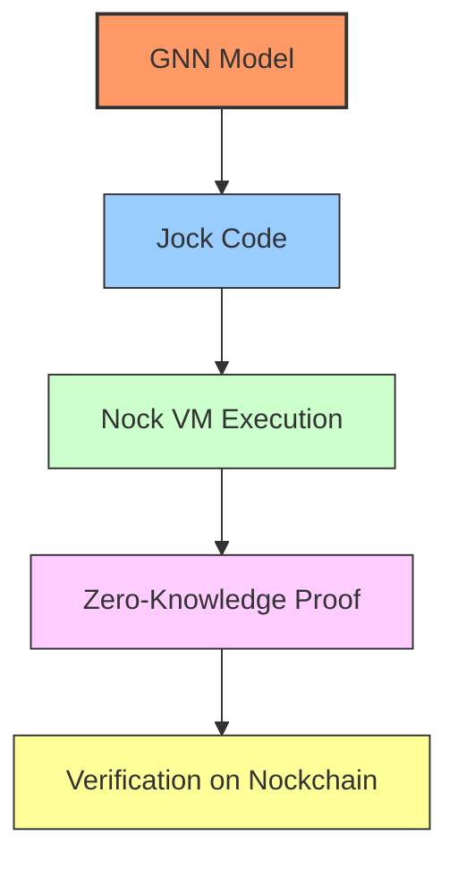
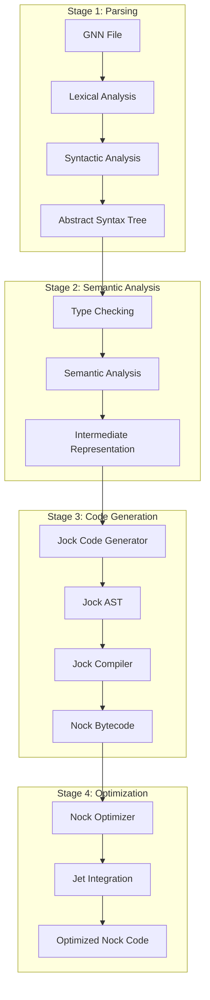
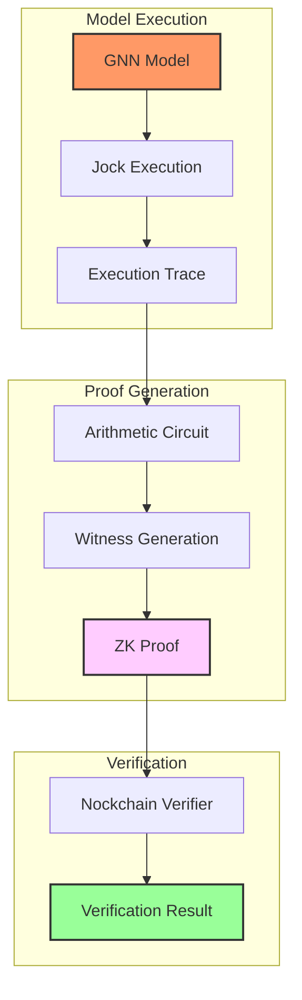
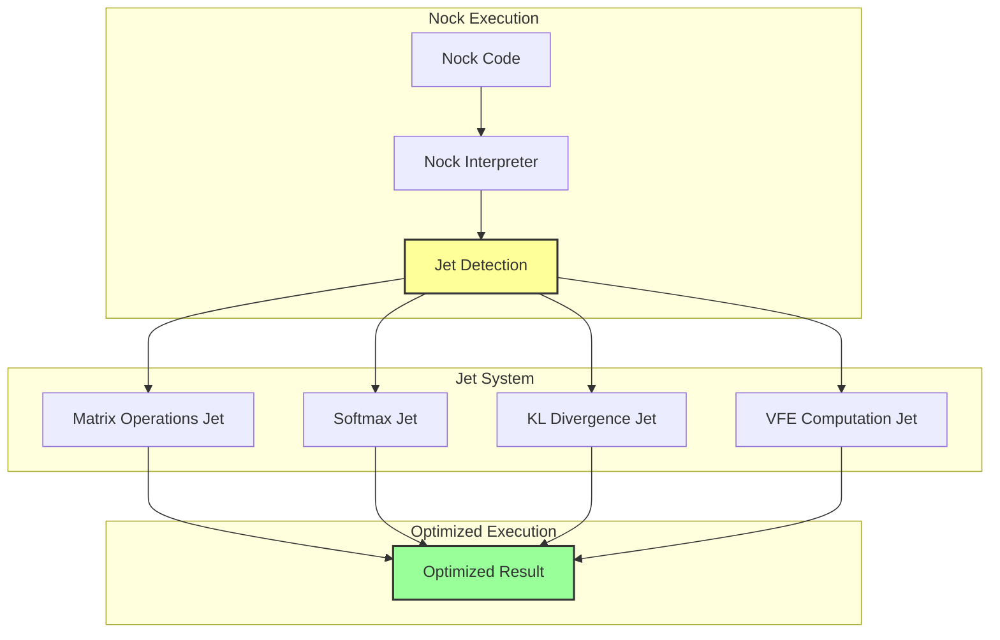
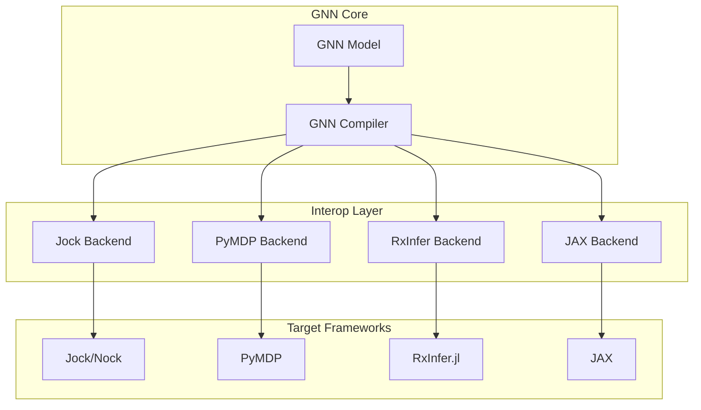

# Integrating Generalized Notation Notation with Nockchain and Jock

## Introduction: Bridging Formal Systems

This document explores the potential integration of Generalized Notation Notation (GNN), a standardized language for Active Inference generative models, with Nockchain and Jock—two complementary technologies built on the Nock instruction set architecture. This integration represents a powerful convergence of formal systems: GNN's structured representation of cognitive models with Nockchain's deterministic computation platform and Jock's expressive programming capabilities.

## Conceptual Foundations

### Complementary Formal Systems

| System | Core Purpose | Formal Foundation | Key Strengths |
|--------|-------------|-------------------|---------------|
| **GNN** | Standardized representation of Active Inference models | Markdown-based DSL with defined syntax | Human-readable, machine-parsable, interoperable |
| **Nockchain** | Blockchain platform with zero-knowledge capabilities | Nock instruction set (12 opcodes) | Deterministic computation, formal verification, zkVM |
| **Jock** | High-level programming language | Compiles to Nock bytecode | Modern syntax, type system, OOP and functional paradigms |

The integration of these systems creates a powerful framework for representing, verifying, and executing cognitive models with formal guarantees.

## Category Theory Framework

### Functorial Relationships

The integration can be understood through category theory, where each system forms a category with morphisms representing transformations:



### Categorical Constructions

```jock
// Category of GNN models
class GNNCategory {
  objects: Set(GNNModel);
  morphisms: Set(GNNTransformation);
  
  compose(f:GNNTransformation, g:GNNTransformation) -> GNNTransformation {
    // Composition of model transformations
  }
  
  identity(model:GNNModel) -> GNNTransformation {
    // Identity transformation
  }
}

// Functor from GNN to Jock
class GNNToJockFunctor {
  map_object(gnn:GNNModel) -> JockProgram {
    // Map GNN model to Jock program
  }
  
  map_morphism(trans:GNNTransformation) -> JockTransformation {
    // Map GNN transformation to Jock transformation
  }
}
```

## Formal Specification Framework

### Type System Correspondence

```mermaid
graph LR
    subgraph "GNN Types"
        GNN_State[Hidden State s_f0]
        GNN_Obs[Observation o_m0]
        GNN_Action[Action u_c0]
        GNN_Matrix[Matrix A[2,3]]
    end
    
    subgraph "Jock Types"
        Jock_State[State:@]
        Jock_Obs[Observation:@]
        Jock_Action[Action:@]
        Jock_Matrix[Matrix:List(List(@))]
    end
    
    subgraph "Nock Types"
        Nock_Atom[Atom]
        Nock_Cell[Cell]
        Nock_Formula[Formula]
    end
    
    GNN_State -->|maps to| Jock_State
    GNN_Obs -->|maps to| Jock_Obs
    GNN_Action -->|maps to| Jock_Action
    GNN_Matrix -->|maps to| Jock_Matrix
    
    Jock_State -->|compiles to| Nock_Atom
    Jock_Obs -->|compiles to| Nock_Atom
    Jock_Action -->|compiles to| Nock_Atom
    Jock_Matrix -->|compiles to| Nock_Cell
```

### Formal Semantics

```jock
// Formal semantics for GNN constructs
protocol GNNSemantics {
  // State space semantics
  interpret_state_space(block:StateSpaceBlock) -> Map(Identifier, Type);
  
  // Connection semantics
  interpret_connections(connections:List(Connection)) -> Graph;
  
  // Equation semantics
  interpret_equations(equations:List(Equation)) -> List(Function);
  
  // Temporal semantics
  interpret_time(time:TimeSpec) -> TemporalLogic;
}
```

## Technical Integration Pathways

### 1. GNN-to-Jock Compiler

A GNN-to-Jock compiler would translate GNN model specifications directly into executable Jock code:

```
GNN Source File → Parser → AST → Jock Code Generator → Jock Program → Nock Bytecode
```

This pathway enables Active Inference models specified in GNN to be executed on any Nock-compatible virtual machine, including Nockchain's zkVM.

#### Implementation Strategy

```jock
import hoon;

class GNNModel(state_space:Map, connections:List, equations:List) {
  parse_gnn(file_path:@) -> GNNModel {
    // Parse GNN file sections
    let state_space = parse_state_space_block(file_path);
    let connections = parse_connections(file_path);
    let equations = parse_equations(file_path);
    
    GNNModel(state_space, connections, equations)
  }
  
  compile_to_jock() -> @ {
    // Generate Jock code from GNN model components
    let jock_code = generate_variable_declarations(state_space);
    jock_code = jock_code + generate_connection_logic(connections);
    jock_code = jock_code + translate_equations(equations);
    
    jock_code
  }
}
```

### 2. Verifiable Active Inference on Nockchain

Nockchain's zero-knowledge capabilities enable privacy-preserving execution and verification of Active Inference models:



This enables:
- Privacy-preserving cognitive modeling
- Verifiable model execution without revealing sensitive parameters
- Trustless collaboration on Active Inference research

### 3. GNN Ontology as Nockchain Smart Contracts

The Active Inference Ontology embedded in GNN can be implemented as smart contracts on Nockchain:

```jock
class ActiveInferenceOntology {
  terms:Map;
  
  constructor() {
    terms = {
      "HiddenState": {
        "definition": "Internal model state variable",
        "properties": ["latent", "causal", "generative"]
      },
      "Observation": {
        "definition": "Observable outcome variable",
        "properties": ["sensory", "data", "evidence"]
      },
      // Additional ontology terms
    };
  }
  
  validate_model(gnn_model:GNNModel) -> Bool {
    // Validate model against ontology constraints
    // Return true if valid, false otherwise
  }
}
```

## Compilation Architecture

### Multi-Stage Compilation Pipeline



### Compiler Implementation

```jock
class GNNCompiler {
  lexer: GNNLexer;
  parser: GNNParser;
  type_checker: GNNTypeChecker;
  code_generator: JockCodeGenerator;
  
  compile(source:@) -> NockProgram {
    // Stage 1: Lexical and syntactic analysis
    let tokens = lexer.tokenize(source);
    let ast = parser.parse(tokens);
    
    // Stage 2: Semantic analysis
    let typed_ast = type_checker.check(ast);
    let ir = semantic_analyzer.analyze(typed_ast);
    
    // Stage 3: Code generation
    let jock_code = code_generator.generate(ir);
    let nock_code = jock_compiler.compile(jock_code);
    
    // Stage 4: Optimization
    let optimized = optimizer.optimize(nock_code);
    
    NockProgram(optimized)
  }
}
```

## Active Inference Primitives

### Core Mathematical Operations

```jock
// Variational message passing
func variational_message_passing(
  A:Matrix,      // Likelihood mapping
  B:Matrix,      // Transition dynamics
  C:Matrix,      // Preferences
  D:Matrix,      // Priors
  observations:List(@)
) -> List(@) {
  // Implement VMP algorithm
  let beliefs = initialize_beliefs(D);
  
  loop {
    // Forward pass
    let predictions = forward_pass(beliefs, B);
    
    // Likelihood update
    let likelihood = compute_likelihood(predictions, A, observations);
    
    // Backward pass
    beliefs = backward_pass(likelihood, B);
    
    // Check convergence
    if converged(beliefs) {
      break;
    }
  }
  
  beliefs
}

// Expected free energy computation
func expected_free_energy(
  beliefs:List(@),
  policies:List(Policy),
  A:Matrix,
  B:Matrix,
  C:Matrix
) -> List(@) {
  let efe_values = [];
  
  for policy in policies {
    let predicted_states = predict_states(beliefs, policy, B);
    let predicted_observations = predict_observations(predicted_states, A);
    
    // Epistemic value (information gain)
    let epistemic = compute_epistemic_value(predicted_observations, A);
    
    // Pragmatic value (goal achievement)
    let pragmatic = compute_pragmatic_value(predicted_observations, C);
    
    let efe = epistemic + pragmatic;
    efe_values = efe_values + [efe];
  }
  
  efe_values
}
```

### Specialized Jets for Performance

```jock
// Nock jets for common Active Inference operations
class ActiveInferenceJets {
  // Matrix multiplication jet
  ++  matrix_multiply
    |=  [a=matrix b=matrix]
    ^-  matrix
    // Optimized matrix multiplication
  
  // Softmax jet
  ++  softmax
    |=  vector=list(@)
    ^-  list(@)
    // Optimized softmax computation
  
  // KL divergence jet
  ++  kl_divergence
    |=  [p=list(@) q=list(@)]
    ^-  @
    // Optimized KL divergence computation
  
  // Variational free energy jet
  ++  variational_free_energy
    |=  [beliefs=list(@) observations=list(@) model=gnn-model]
    ^-  @
    // Optimized VFE computation
}
```

## Practical Applications

### 1. Formally Verified Active Inference

The integration enables formally verified Active Inference models with mathematical guarantees:

1. **Specification**: Define cognitive model in GNN
2. **Compilation**: Translate to Jock code
3. **Verification**: Generate formal proofs of model properties
4. **Execution**: Run on Nock VM with performance optimizations

This addresses a critical need in computational cognitive science for rigorous, reproducible models.

### 2. Privacy-Preserving Cognitive Modeling

Sensitive cognitive models (e.g., for healthcare or personalized AI) can be executed with privacy guarantees:

1. **Model Definition**: Specify personalized cognitive model in GNN
2. **Private Execution**: Run on Nockchain's zkVM
3. **Verifiable Results**: Generate proofs of correct execution
4. **Selective Disclosure**: Reveal only necessary outputs

### 3. Decentralized Cognitive Architecture Registry

A decentralized registry of cognitive architectures can be implemented on Nockchain:

1. **Standardization**: GNN provides the formal specification language
2. **Registration**: Models are registered on Nockchain with formal verification
3. **Composition**: Jock enables combining model components
4. **Execution**: Models can be executed with formal guarantees

## Concrete Example: Perceptual Inference Model

### GNN Specification

```markdown
## GNNSection
perceptual_inference_model

## GNNVersionAndFlags
GNN v1.0

## ModelName
Basic Perceptual Inference with Policy Selection

## ModelAnnotation
A simple Active Inference model demonstrating perceptual inference
with policy selection based on expected free energy minimization.

## StateSpaceBlock
s_f0[2]     # Hidden state factor 0 (location: {0,1})
o_m0[2]     # Observation modality 0 (sensory input: {0,1})
u_c0[2]     # Action factor 0 (movement: {stay,move})
π_c0[2]     # Policy factor 0 (policy selection)

## Connections
s_f0 > o_m0    # Hidden states generate observations
u_c0 > s_f0    # Actions influence state transitions
π_c0 > u_c0    # Policies determine actions

## InitialParameterization
# Observation model (likelihood mapping)
A_0 = [[0.9, 0.1], [0.1, 0.9]]

# Transition model (state dynamics)
B_0 = [[[0.8, 0.2], [0.2, 0.8]], [[0.3, 0.7], [0.7, 0.3]]]

# Preferences (log preferences over observations)
C_0 = [0.0, 2.0]

# Priors over initial states
D_0 = [0.5, 0.5]

## Equations
# Variational free energy
F = E_q[ln q(s) - ln p(o,s)]

# Expected free energy
G = E_q[ln q(s) - ln p(o,s|π)]

# Policy posterior
q(π) ∝ exp(-γ * G(π))

## Time
Dynamic
DiscreteTime = t
ModelTimeHorizon = 10

## ActInfOntologyAnnotation
s_f0 = HiddenState
o_m0 = Observation
u_c0 = Action
π_c0 = Policy
A_0 = ObservationModel
B_0 = TransitionModel
C_0 = PreferenceModel
D_0 = PriorModel
```

### Generated Jock Code

```jock
import hoon;

class PerceptualInferenceModel {
  // Model parameters
  A:Matrix;  // Observation model
  B:Matrix;  // Transition model
  C:List(@); // Preferences
  D:List(@); // Priors
  
  // State variables
  beliefs:List(@);
  observations:List(@);
  actions:List(@);
  policies:List(Policy);
  
  constructor() {
    // Initialize from GNN specification
    A = [[0.9, 0.1], [0.1, 0.9]];
    B = [[[0.8, 0.2], [0.2, 0.8]], [[0.3, 0.7], [0.7, 0.3]]];
    C = [0.0, 2.0];
    D = [0.5, 0.5];
    
    beliefs = D;
    policies = generate_policies();
  }
  
  // Perceptual inference
  infer(observation:@) -> @ {
    observations = observations + [observation];
    
    // Variational message passing
    beliefs = variational_update(beliefs, observation, A, B);
    
    // Return most likely state
    argmax(beliefs)
  }
  
  // Policy selection
  select_policy() -> Policy {
    let efe_values = [];
    
    for policy in policies {
      let efe = compute_expected_free_energy(policy, beliefs, A, B, C);
      efe_values = efe_values + [efe];
    }
    
    // Select policy with minimum expected free energy
    let best_policy_index = argmin(efe_values);
    policies[best_policy_index]
  }
  
  // Action selection
  act() -> @ {
    let selected_policy = select_policy();
    let action = sample_action(selected_policy, beliefs);
    actions = actions + [action];
    action
  }
  
  // Model update
  update() -> @ {
    // Update beliefs based on new observations
    for obs in observations {
      beliefs = variational_update(beliefs, obs, A, B);
    }
    
    // Update policies based on new beliefs
    policies = update_policies(policies, beliefs);
  }
}

// Usage example
let model = PerceptualInferenceModel();

// Simulation loop
for t in range(10) {
  let observation = get_observation();
  let inferred_state = model.infer(observation);
  let action = model.act();
  
  print("Time: " + t);
  print("Observation: " + observation);
  print("Inferred State: " + inferred_state);
  print("Action: " + action);
  
  model.update();
}
```

## Zero-Knowledge Proof System

### Proof Generation Architecture



### ZK-SNARK Implementation

```jock
class ZKProofSystem {
  // Circuit representation of Active Inference model
  circuit: ArithmeticCircuit;
  
  // Setup phase
  setup(model:GNNModel) -> (ProvingKey, VerifyingKey) {
    circuit = compile_to_circuit(model);
    let (pk, vk) = trusted_setup(circuit);
    (pk, vk)
  }
  
  // Proof generation
  prove(
    model:GNNModel,
    private_inputs:List(@),
    public_inputs:List(@),
    pk:ProvingKey
  ) -> Proof {
    let witness = generate_witness(model, private_inputs, public_inputs);
    let proof = generate_proof(circuit, witness, pk);
    proof
  }
  
  // Proof verification
  verify(
    proof:Proof,
    public_inputs:List(@),
    vk:VerifyingKey
  ) -> Bool {
    verify_proof(proof, public_inputs, vk)
  }
}

// Privacy-preserving inference
func private_inference(
  model:GNNModel,
  private_observations:List(@),
  public_parameters:List(@)
) -> (List(@), Proof) {
  let zk_system = ZKProofSystem();
  let (pk, vk) = zk_system.setup(model);
  
  // Run inference privately
  let results = model.infer(private_observations);
  
  // Generate proof of correct execution
  let proof = zk_system.prove(model, private_observations, public_parameters, pk);
  
  (results, proof)
}
```

## Technical Implementation Details

### GNN Parser in Jock

```jock
func parse_gnn_file(file_path:@) -> GNNModel {
  let content = read_file(file_path);
  let sections = split_sections(content);
  
  let state_space = parse_section(sections, "StateSpaceBlock");
  let connections = parse_section(sections, "Connections");
  let equations = parse_section(sections, "Equations");
  let time = parse_section(sections, "Time");
  
  GNNModel(state_space, connections, equations, time)
}
```

### Active Inference Simulation in Jock

```jock
class ActiveInferenceAgent(model:GNNModel) {
  // Model components
  A:Matrix;  // Likelihood mapping (observation model)
  B:Matrix;  // Transition dynamics
  C:Matrix;  // Preferences
  D:Matrix;  // Priors
  
  // Initialize from GNN model
  constructor(model:GNNModel) {
    A = extract_matrix(model, "A");
    B = extract_matrix(model, "B");
    C = extract_matrix(model, "C");
    D = extract_matrix(model, "D");
  }
  
  // Belief updating (variational inference)
  infer_states(observations:List) -> List {
    // Implement variational message passing
    // based on GNN equations
  }
  
  // Policy selection
  select_policy() -> @ {
    // Compute expected free energy
    // Select policy minimizing EFE
  }
  
  // Action selection
  act() -> @ {
    let policy = select_policy();
    let action = extract_action(policy);
    action
  }
}
```

### Zero-Knowledge Proof Generation

```jock
func generate_zk_proof(model:GNNModel, execution_trace:List) -> Proof {
  // Generate zero-knowledge proof of model execution
  // without revealing model parameters or states
}
```

## Performance Optimization

### Jet System Integration



### Performance Benchmarks

```jock
class PerformanceBenchmark {
  // Benchmark Active Inference operations
  benchmark_variational_inference(model:GNNModel, iterations:@) -> @ {
    let start_time = current_time();
    
    for i in range(iterations) {
      let beliefs = variational_update(model.beliefs, model.observations, model.A, model.B);
    }
    
    let end_time = current_time();
    end_time - start_time
  }
  
  // Benchmark policy selection
  benchmark_policy_selection(model:GNNModel, iterations:@) -> @ {
    let start_time = current_time();
    
    for i in range(iterations) {
      let policy = select_policy(model.policies, model.beliefs, model.A, model.B, model.C);
    }
    
    let end_time = current_time();
    end_time - start_time
  }
  
  // Compare jet vs. interpreted performance
  compare_performance(model:GNNModel) -> Map {
    let jet_time = benchmark_with_jets(model);
    let interpreted_time = benchmark_without_jets(model);
    
    {
      "jet_time": jet_time,
      "interpreted_time": interpreted_time,
      "speedup": interpreted_time / jet_time
    }
  }
}
```

## Error Handling and Debugging

### Comprehensive Error System

```jock
class GNNError {
  error_type: ErrorType;
  message: @;
  location: SourceLocation;
  suggestions: List(@);
  
  constructor(type:ErrorType, msg:@, loc:SourceLocation) {
    error_type = type;
    message = msg;
    location = loc;
    suggestions = generate_suggestions(type, msg);
  }
}

enum ErrorType {
  ParseError,
  TypeMismatch,
  DimensionError,
  ConnectionError,
  EquationError,
  RuntimeError
}

class GNNDebugger {
  // Debug GNN model compilation
  debug_compilation(model:GNNModel) -> DebugInfo {
    let parse_info = debug_parsing(model);
    let type_info = debug_type_checking(model);
    let codegen_info = debug_code_generation(model);
    
    DebugInfo(parse_info, type_info, codegen_info)
  }
  
  // Trace execution
  trace_execution(model:GNNModel, inputs:List(@)) -> ExecutionTrace {
    let trace = [];
    
    // Instrument model for tracing
    let instrumented = instrument_model(model);
    
    // Run with tracing
    let results = execute_with_tracing(instrumented, inputs);
    
    ExecutionTrace(trace, results)
  }
}
```

## Testing Framework

### Comprehensive Test Suite

```jock
class GNNTestSuite {
  // Unit tests for GNN components
  test_parser() -> TestResult {
    let test_cases = [
      ("simple_model.gnn", expected_ast_1),
      ("complex_model.gnn", expected_ast_2),
      ("invalid_model.gnn", ParseError)
    ];
    
    let results = [];
    for (file, expected) in test_cases {
      let result = test_parse_file(file, expected);
      results = results + [result];
    }
    
    TestResult(results)
  }
  
  // Integration tests
  test_compilation() -> TestResult {
    let models = load_test_models();
    let results = [];
    
    for model in models {
      let compiled = compile_gnn_to_jock(model);
      let executed = execute_jock_code(compiled);
      let verified = verify_execution(executed);
      
      results = results + [TestCase(model, compiled, executed, verified)];
    }
    
    TestResult(results)
  }
  
  // Property-based tests
  test_properties() -> TestResult {
    // Test mathematical properties of Active Inference
    let property_tests = [
      test_free_energy_minimization,
      test_belief_consistency,
      test_policy_optimality,
      test_temporal_consistency
    ];
    
    let results = [];
    for test in property_tests {
      let result = run_property_test(test);
      results = results + [result];
    }
    
    TestResult(results)
  }
}
```

## Interoperability Layer

### Multi-Framework Support



### Cross-Platform Validation

```jock
class CrossPlatformValidator {
  // Validate model behavior across platforms
  validate_cross_platform(model:GNNModel) -> ValidationResult {
    let jock_result = execute_on_jock(model);
    let pymdp_result = execute_on_pymdp(model);
    let rxinfer_result = execute_on_rxinfer(model);
    
    let consistency = check_consistency([jock_result, pymdp_result, rxinfer_result]);
    
    ValidationResult(consistency, jock_result, pymdp_result, rxinfer_result)
  }
  
  // Performance comparison
  compare_performance(model:GNNModel) -> PerformanceReport {
    let platforms = ["jock", "pymdp", "rxinfer", "jax"];
    let results = [];
    
    for platform in platforms {
      let execution_time = benchmark_platform(model, platform);
      let memory_usage = measure_memory(model, platform);
      
      results = results + [PlatformResult(platform, execution_time, memory_usage)];
    }
    
    PerformanceReport(results)
  }
}
```

## Synergistic Benefits

### For GNN

1. **Formal Verification**: Leverage Nock's formal properties for model verification
2. **Execution Environment**: Gain a deterministic, reproducible execution platform
3. **Privacy Features**: Enable privacy-preserving cognitive modeling
4. **Distributed Collaboration**: Facilitate trustless collaboration on cognitive models

### For Nockchain/Jock

1. **Application Domain**: Gain a compelling use case in cognitive science and AI
2. **Model Representation**: Adopt a standardized format for representing complex models
3. **Scientific Rigor**: Connect to the scientific Active Inference community
4. **Ontological Framework**: Leverage the Active Inference Ontology for semantic consistency

## Technical Challenges and Solutions

| Challenge | Solution Approach |
|-----------|------------------|
| **Semantic Gap** | Develop formal mappings between GNN constructs and Jock/Nock primitives |
| **Performance** | Implement specialized jets for common Active Inference operations |
| **Verification Complexity** | Develop modular verification strategies for model components |
| **Usability** | Create developer tools that abstract low-level details |

## Roadmap for Integration

1. **Phase 1: Foundational Mapping**
   - Formal correspondence between GNN and Jock type systems
   - Basic GNN parser implemented in Jock
   - Proof-of-concept model translation

2. **Phase 2: Execution Environment**
   - Complete GNN-to-Jock compiler
   - Active Inference library in Jock
   - Performance optimization with jets

3. **Phase 3: Verification Framework**
   - Formal verification of model properties
   - Zero-knowledge proof generation
   - Nockchain integration for model registry

4. **Phase 4: Ecosystem Development**
   - Developer tools and documentation
   - Standard library of cognitive components
   - Integration with existing Active Inference frameworks

## Conclusion: A New Paradigm for Cognitive Modeling

The integration of GNN with Nockchain and Jock creates a powerful new paradigm for cognitive modeling that combines:

- **Standardized Representation**: GNN's clear, interoperable model specification
- **Formal Verification**: Nockchain's deterministic computation and proof capabilities
- **Expressive Implementation**: Jock's modern programming features

This convergence addresses critical needs in computational cognitive science for reproducibility, verifiability, and interoperability, while opening new possibilities for privacy-preserving AI and collaborative cognitive modeling.

By bringing together these complementary formal systems, we can advance the state of the art in both Active Inference research and blockchain-based computation, creating a foundation for the next generation of trustworthy, transparent cognitive architectures. 