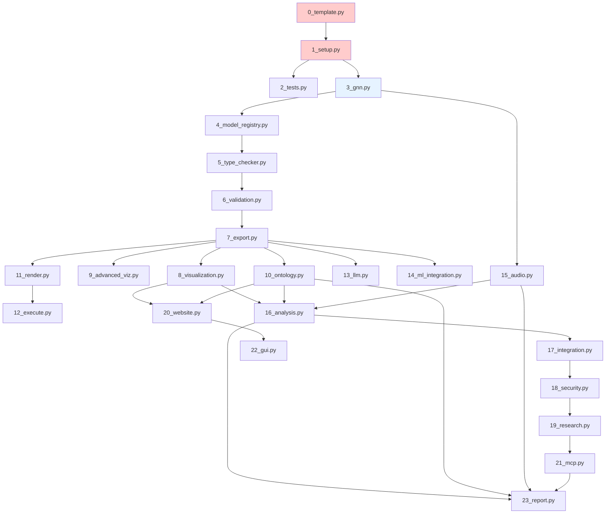

# GNN Pipeline Architecture

## Overview

The GNN Processing Pipeline is a comprehensive, modular 24-step system (steps 0-23) for processing Generalized Notation Notation (GNN) files through a series of well-defined stages. Each stage performs specific operations and outputs results that can be consumed by subsequent stages or used independently.

## Pipeline Flow



## Stage Descriptions

### Core Processing Stages

| Stage | Script | Purpose | Timeout | Critical |
|-------|--------|---------|---------|----------|
| 0 | `0_template.py` | Template initialization | 1 min | No |
| 1 | `1_setup.py` | Environment setup and dependency management | **20 min** | **Yes** |
| 2 | `2_tests.py` | Test execution | 5 min | No |
| 3 | `3_gnn.py` | GNN file discovery and basic parsing | 2 min | **Yes** |
| 4 | `4_model_registry.py` | Model registry management | 2 min | No |
| 5 | `5_type_checker.py` | Type checking and resource estimation | 2 min | No |
| 6 | `6_validation.py` | Advanced validation and consistency checking | 2 min | No |
| 7 | `7_export.py` | Export to multiple formats (JSON, XML, etc.) | 2 min | No |
| 8 | `8_visualization.py` | Generate visual representations | 5 min | No |
| 9 | `9_advanced_viz.py` | Advanced visualization and interactive plots | 5 min | No |
| 10 | `10_ontology.py` | Ontology validation and mapping | 2 min | No |
| 11 | `11_render.py` | Code generation for simulators | 2 min | No |
| 12 | `12_execute.py` | Execute rendered simulator code | 5 min | No |
| 13 | `13_llm.py` | LLM-powered analysis and documentation | Configurable | No |
| 14 | `14_ml_integration.py` | Machine learning integration | 5 min | No |
| 15 | `15_audio.py` | Audio generation (SAPF, Pedalboard, etc.) | 5 min | No |
| 16 | `16_analysis.py` | Advanced analysis and statistical processing | 5 min | No |
| 17 | `17_integration.py` | System integration and coordination | 2 min | No |
| 18 | `18_security.py` | Security validation and access control | 2 min | No |
| 19 | `19_research.py` | Research tools and experimental features | 5 min | No |
| 20 | `20_website.py` | Static website generation | 2 min | No |
| 21 | `21_mcp.py` | Model Context Protocol processing | 2 min | No |
| 22 | `22_gui.py` | GUI (Interactive GNN Constructor) | 5 min | No |
| 23 | `23_report.py` | Comprehensive analysis report generation | 2 min | No |

### Step Dependencies

- **Step 0 (template.py)** provides pipeline initialization
- **Step 1 (setup.py)** is critical - pipeline halts on failure
- **Step 2 (tests.py)** is optional and can run independently
- **Step 3 (gnn.py)** is critical - pipeline halts on failure
- **Step 4 (model_registry.py)** depends on Step 3 for GNN file discovery
- **Step 5 (type_checker.py)** depends on Step 4 for model registry
- **Step 6 (validation.py)** depends on Step 5 for type checking
- **Step 7 (export.py)** depends on Step 6 for validated GNN data
- **Steps 8-14** depend on Step 7 for exported data
- **Step 15 (audio.py)** depends on Step 3 for GNN file discovery
- **Step 16 (analysis.py)** depends on Steps 8, 10, and 15 for comprehensive analysis
- **Step 17 (integration.py)** depends on Step 16 for analysis results
- **Step 18 (security.py)** depends on Step 17 for integration results
- **Step 19 (research.py)** depends on Step 18 for security validation
- **Step 20 (website.py)** depends on Steps 8 and 10 for visualizations and ontology
- **Step 21 (mcp.py)** depends on Step 19 for research results and tool registration
- **Step 22 (gui.py)** depends on Step 20 for website components and interactive elements
- **Step 23 (report.py)** depends on Steps 10, 15, 16, and 21 for comprehensive reporting

## Configuration Management

### Step Configuration

Steps can be enabled/disabled via `PIPELINE_STEP_CONFIGURATION` in `src/pipeline/config.py`:

```python
PIPELINE_STEP_CONFIGURATION = {
    "1_setup.py": True,
"3_gnn.py": True,
    "2_tests.py": False,  # Disabled by default
    # ... etc
}
```

### Timeout Configuration

Each step has a configured timeout in `STEP_TIMEOUTS`:

- **Short steps** (2 minutes): Basic processing, exports
- **Medium steps** (5 minutes): Visualization, execution, testing
- **Long steps** (20 minutes): Environment setup
- **Configurable**: LLM processing (via `--llm-timeout`)

### Critical Steps

**Steps 1 (setup.py)** and **Step 3 (gnn.py)** are marked as critical. If either fails, the entire pipeline halts to prevent cascading failures from missing dependencies or GNN files.

## Output Structure

```bash
output/
├── 0_template_output/            # Step 0: Template initialization
├── 1_setup_output/               # Step 1: Environment setup
├── 2_tests_output/               # Step 2: Test execution
├── 3_gnn_output/                 # Step 3: GNN file processing
├── 4_model_registry_output/      # Step 4: Model registry
├── 5_type_checker_output/        # Step 5: Type checking
├── 6_validation_output/          # Step 6: Validation
├── 7_export_output/              # Step 7: Multi-format export
├── 8_visualization_output/       # Step 8: Visualization
├── 9_advanced_viz_output/        # Step 9: Advanced visualization
├── 10_ontology_output/           # Step 10: Ontology processing
├── 11_render_output/             # Step 11: Code rendering
├── 12_execute_output/            # Step 12: Execution
├── 13_llm_output/                # Step 13: LLM processing
├── 14_ml_integration_output/     # Step 14: ML integration
├── 15_audio_output/              # Step 15: Audio processing
├── 16_analysis_output/           # Step 16: Analysis
├── 17_integration_output/        # Step 17: Integration
├── 18_security_output/           # Step 18: Security
├── 19_research_output/           # Step 19: Research
├── 20_website_output/            # Step 20: Website generation
├── 21_mcp_output/                # Step 21: MCP processing
├── 22_gui_output/                # Step 22: GUI
├── 23_report_output/             # Step 23: Report generation
├── execution_results/            # Cross-step execution artifacts
├── test_artifacts/               # Cross-step test artifacts
├── logs/                         # Pipeline logs
├── pipeline_execution_summary.json
└── gnn_pipeline_summary_site.html
```

## Error Handling

### Error Types

1. **SUCCESS**: Step completed without issues
2. **FAILED_NONZERO_EXIT**: Process exited with error code
3. **FAILED_TIMEOUT**: Step exceeded configured timeout
4. **ERROR_UNHANDLED_EXCEPTION**: Unexpected error during execution

### Recovery Strategies

- **Non-critical steps**: Pipeline continues on failure
- **Critical steps**: Pipeline halts immediately
- **Timeout handling**: Graceful termination with output capture
- **Detailed logging**: Full stdout/stderr capture for debugging

## Performance Monitoring

The pipeline tracks:

- **Memory usage**: Peak memory consumption per step
- **Execution time**: Duration of each step
- **System resources**: CPU, disk space, etc.
- **Step dependencies**: Which steps were skipped/failed

## Command Line Interface

### Basic Usage

```bash
python main.py                          # Run with defaults
python main.py --verbose               # Enable detailed logging
python main.py --skip-steps 3,13       # Skip optional steps
python main.py --only-steps 1,4,5      # Run only specific steps
```

### Advanced Options

```bash
python main.py \
  --target-dir /path/to/gnn/files \
  --output-dir /custom/output \
  --llm-timeout 300 \
  --strict \
  --no-estimate-resources
```

## Extension Points

### Adding New Steps

1. Create `N_name.py` script in `src/`
2. Add entry to `PIPELINE_STEP_CONFIGURATION`
3. Define timeout in `STEP_TIMEOUTS`
4. Add argument support in `SCRIPT_ARG_SUPPORT`
5. Update documentation

### Custom Configuration

- Override defaults via command line arguments
- Use environment variables for sensitive data (API keys)
- Modify configuration files for persistent changes

## Best Practices

### Development

- **Test individual steps**: Each script can run standalone
- **Use verbose mode**: `--verbose` for detailed debugging
- **Check logs**: Pipeline and step-specific log files
- **Monitor resources**: Use built-in performance tracking

### Production

- **Set appropriate timeouts**: Based on expected data volumes
- **Enable critical steps only**: Disable experimental features
- **Monitor disk space**: Outputs can be large for complex models
- **Regular cleanup**: Archive old pipeline runs

## Troubleshooting

### Common Issues

1. **Step 1 (setup) fails**: Check internet connection, disk space, Python version
2. **Step 2 (gnn) fails**: Check GNN file format, file permissions, target directory
3. **Timeout errors**: Increase timeouts for slow systems
4. **Memory issues**: Reduce concurrent processing or increase system RAM
5. **Missing dependencies**: Ensure virtual environment is properly set up

### Debug Mode

Run with maximum verbosity:

```bash
python main.py --verbose --only-steps 1,4 --target-dir small_test_set/
```

### Log Analysis

Check specific log files:

- `output/logs/pipeline.log`: Main pipeline log
- `output/pipeline_execution_summary.json`: Structured execution data
- Step-specific outputs in respective directories