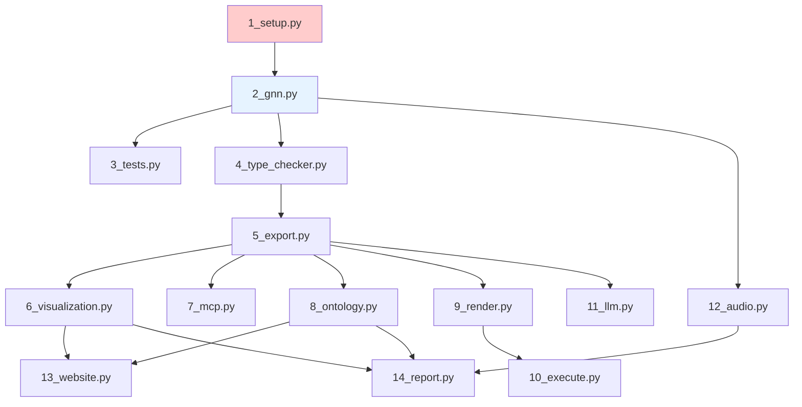

# GNN Pipeline Architecture

## Overview

The GNN Processing Pipeline is a comprehensive, modular system for processing Generalized Notation Notation (GNN) files through a series of well-defined stages. Each stage performs specific operations and outputs results that can be consumed by subsequent stages or used independently.

## Pipeline Flow



## Stage Descriptions

### Core Processing Stages

| Stage | Script | Purpose | Timeout | Critical |
|-------|--------|---------|---------|----------|
| 1 | `1_setup.py` | Environment setup and dependency management | **20 min** | **Yes** |
| 2 | `2_gnn.py` | GNN file discovery and basic parsing | 2 min | **Yes** |
| 3 | `3_tests.py` | Test execution (optional) | 5 min | No |
| 4 | `4_type_checker.py` | Type checking and resource estimation | 2 min | No |
| 5 | `5_export.py` | Export to multiple formats (JSON, XML, etc.) | 2 min | No |
| 6 | `6_visualization.py` | Generate visual representations | 5 min | No |
| 7 | `7_mcp.py` | MCP integration analysis | 2 min | No |
| 8 | `8_ontology.py` | Ontology validation and mapping | 2 min | No |
| 9 | `9_render.py` | Code generation for simulators | 2 min | No |
| 10 | `10_execute.py` | Execute rendered simulator code | 5 min | No |
| 11 | `11_llm.py` | LLM-powered analysis and documentation | Configurable | No |
| 12 | `12_audio.py` | Audio generation (SAPF, Pedalboard, etc.) | 5 min | No |
| 13 | `13_website.py` | Static website generation | 2 min | No |
| 14 | `14_report.py` | Comprehensive analysis report generation | 2 min | No |

### Step Dependencies

- **Step 1 (setup.py)** is critical - pipeline halts on failure
- **Step 2 (gnn.py)** is critical - pipeline halts on failure
- **Step 3 (tests.py)** is optional and disabled by default
- **Step 4 (type_checker.py)** depends on Step 2 for GNN file discovery
- **Step 5 (export.py)** depends on Step 4 for validated GNN data
- **Steps 6-11** depend on Step 5 for exported data
- **Step 12 (audio.py)** depends on Step 2 for GNN file discovery
- **Step 13 (website.py)** depends on Steps 6 and 8 for visualizations and ontology
- **Step 14 (report.py)** depends on Steps 6, 8, and 12 for comprehensive analysis

## Configuration Management

### Step Configuration

Steps can be enabled/disabled via `PIPELINE_STEP_CONFIGURATION` in `src/pipeline/config.py`:

```python
PIPELINE_STEP_CONFIGURATION = {
    "1_setup.py": True,
"2_gnn.py": True,
    "3_tests.py": False,  # Disabled by default
    # ... etc
}
```

### Timeout Configuration

Each step has a configured timeout in `STEP_TIMEOUTS`:

- **Short steps** (2 minutes): Basic processing, exports
- **Medium steps** (5 minutes): Visualization, execution, testing
- **Long steps** (20 minutes): Environment setup
- **Configurable**: LLM processing (via `--llm-timeout`)

### Critical Steps

**Steps 1 (setup.py)** and **Step 2 (gnn.py)** are marked as critical. If either fails, the entire pipeline halts to prevent cascading failures from missing dependencies or GNN files.

## Output Structure

```
output/
├── setup_artifacts/              # Step 1 output
├── gnn_processing_step/          # Step 2 output
├── test_reports/                 # Step 3 output
├── type_check/                   # Step 4 output
├── gnn_exports/                  # Step 5 output
├── visualization/                # Step 6 output
├── mcp_processing_step/          # Step 7 output
├── ontology_processing/          # Step 8 output
├── gnn_rendered_simulators/      # Step 9 output
├── execution_results/            # Step 10 output
├── llm_processing_step/          # Step 11 output
├── audio_processing_step/        # Step 12 output
├── website/                      # Step 13 output
├── report_processing_step/       # Step 14 output
├── logs/                         # Pipeline logs
├── pipeline_execution_summary.json
└── gnn_pipeline_summary_site.html
```

## Error Handling

### Error Types

1. **SUCCESS**: Step completed without issues
2. **FAILED_NONZERO_EXIT**: Process exited with error code
3. **FAILED_TIMEOUT**: Step exceeded configured timeout
4. **ERROR_UNHANDLED_EXCEPTION**: Unexpected error during execution

### Recovery Strategies

- **Non-critical steps**: Pipeline continues on failure
- **Critical steps**: Pipeline halts immediately
- **Timeout handling**: Graceful termination with output capture
- **Detailed logging**: Full stdout/stderr capture for debugging

## Performance Monitoring

The pipeline tracks:

- **Memory usage**: Peak memory consumption per step
- **Execution time**: Duration of each step
- **System resources**: CPU, disk space, etc.
- **Step dependencies**: Which steps were skipped/failed

## Command Line Interface

### Basic Usage

```bash
python main.py                          # Run with defaults
python main.py --verbose               # Enable detailed logging
python main.py --skip-steps 3,13       # Skip optional steps
python main.py --only-steps 1,4,5      # Run only specific steps
```

### Advanced Options

```bash
python main.py \
  --target-dir /path/to/gnn/files \
  --output-dir /custom/output \
  --llm-timeout 300 \
  --strict \
  --no-estimate-resources
```

## Extension Points

### Adding New Steps

1. Create `N_name.py` script in `src/`
2. Add entry to `PIPELINE_STEP_CONFIGURATION`
3. Define timeout in `STEP_TIMEOUTS`
4. Add argument support in `SCRIPT_ARG_SUPPORT`
5. Update documentation

### Custom Configuration

- Override defaults via command line arguments
- Use environment variables for sensitive data (API keys)
- Modify configuration files for persistent changes

## Best Practices

### Development

- **Test individual steps**: Each script can run standalone
- **Use verbose mode**: `--verbose` for detailed debugging
- **Check logs**: Pipeline and step-specific log files
- **Monitor resources**: Use built-in performance tracking

### Production

- **Set appropriate timeouts**: Based on expected data volumes
- **Enable critical steps only**: Disable experimental features
- **Monitor disk space**: Outputs can be large for complex models
- **Regular cleanup**: Archive old pipeline runs

## Troubleshooting

### Common Issues

1. **Step 1 (setup) fails**: Check internet connection, disk space, Python version
2. **Step 2 (gnn) fails**: Check GNN file format, file permissions, target directory
3. **Timeout errors**: Increase timeouts for slow systems
4. **Memory issues**: Reduce concurrent processing or increase system RAM
5. **Missing dependencies**: Ensure virtual environment is properly set up

### Debug Mode

Run with maximum verbosity:

```bash
python main.py --verbose --only-steps 1,4 --target-dir small_test_set/
```

### Log Analysis

Check specific log files:

- `output/logs/pipeline.log`: Main pipeline log
- `output/pipeline_execution_summary.json`: Structured execution data
- Step-specific outputs in respective directories 