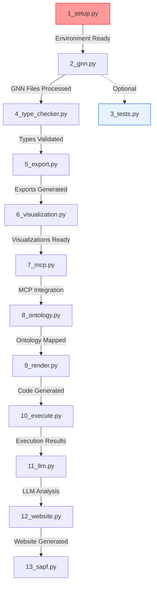

# GNN Pipeline Flow and Dependencies

> **📋 Document Metadata**  
> **Type**: Technical Guide | **Audience**: Developers & Operators | **Complexity**: Intermediate  
> **Last Updated**: July 2025 | **Status**: Active  
> **Cross-References**: [Pipeline Architecture](README.md) | [Error Recovery](../troubleshooting/pipeline_error_recovery.md)

## Pipeline Flow Diagram



## Step Dependencies

### Critical Path
1. **1_setup.py** → **2_gnn.py** → **4_type_checker.py** → **5_export.py**
   - Setup is critical - pipeline halts on failure
   - GNN processing and type checking form core validation
   - Export provides base for visualization and analysis

### Parallel Execution Groups
1. **Group 1**: 3_tests.py (can run independently)
2. **Group 2**: 6_visualization.py, 7_mcp.py, 8_ontology.py
3. **Group 3**: 11_llm.py, 12_website.py, 13_sapf.py

## Step Details

### 1. Setup (1_setup.py)
- **Critical**: Yes
- **Dependencies**: None
- **Timeout**: 20 minutes
- **Recovery**: Auto-retry with reduced feature set

### 2. GNN Processing (2_gnn.py)
- **Critical**: Yes
- **Dependencies**: 1_setup.py
- **Timeout**: 5 minutes
- **Recovery**: Fallback to lightweight processing

### 3. Testing (3_tests.py)
- **Critical**: No
- **Dependencies**: None (independent)
- **Timeout**: 10 minutes
- **Recovery**: Continue with warnings

### 4. Type Checking (4_type_checker.py)
- **Critical**: Yes
- **Dependencies**: 2_gnn.py
- **Timeout**: 5 minutes
- **Recovery**: Fallback to basic validation

### 5. Export (5_export.py)
- **Critical**: Yes
- **Dependencies**: 4_type_checker.py
- **Timeout**: 5 minutes
- **Recovery**: Retry individual formats

### 6. Visualization (6_visualization.py)
- **Critical**: No
- **Dependencies**: 5_export.py
- **Timeout**: 10 minutes
- **Recovery**: Skip complex visualizations

### 7. MCP (7_mcp.py)
- **Critical**: No
- **Dependencies**: 5_export.py
- **Timeout**: 5 minutes
- **Recovery**: Operate in standalone mode

### 8. Ontology (8_ontology.py)
- **Critical**: No
- **Dependencies**: 5_export.py
- **Timeout**: 5 minutes
- **Recovery**: Use basic mappings

### 9. Render (9_render.py)
- **Critical**: Yes
- **Dependencies**: 8_ontology.py
- **Timeout**: 10 minutes
- **Recovery**: Adjust recursion limits

### 10. Execute (10_execute.py)
- **Critical**: Yes
- **Dependencies**: 9_render.py
- **Timeout**: 15 minutes
- **Recovery**: Fallback to CPU execution

### 11. LLM (11_llm.py)
- **Critical**: No
- **Dependencies**: 10_execute.py
- **Timeout**: 10 minutes
- **Recovery**: Retry with backoff

### 12. Website (12_website.py)
- **Critical**: No
- **Dependencies**: 11_llm.py
- **Timeout**: 5 minutes
- **Recovery**: Generate minimal site

### 13. SAPF (13_sapf.py)
- **Critical**: No
- **Dependencies**: 10_execute.py
- **Timeout**: 10 minutes
- **Recovery**: Skip complex audio

## Resource Requirements

### Memory Usage
- **Minimum**: 2GB RAM
- **Recommended**: 8GB RAM
- **Large Models**: 16GB+ RAM

### Disk Space
- **Minimum**: 1GB free
- **Recommended**: 5GB free
- **Full Pipeline**: 10GB+ free

### CPU
- **Minimum**: 2 cores
- **Recommended**: 4 cores
- **Parallel Processing**: 8+ cores

## Performance Characteristics

### Small Models (<100 states)
- **Processing Time**: ~1 second
- **Memory Usage**: ~100MB
- **Disk Usage**: ~10MB

### Medium Models (100-1000 states)
- **Processing Time**: ~5 seconds
- **Memory Usage**: ~500MB
- **Disk Usage**: ~50MB

### Large Models (>1000 states)
- **Processing Time**: ~20 seconds
- **Memory Usage**: ~2GB
- **Disk Usage**: ~200MB

## Monitoring and Metrics

### Key Metrics
1. Step execution time
2. Memory usage patterns
3. Disk I/O operations
4. Network request timing
5. Resource scaling factors

### Performance Monitoring
```bash
# Monitor pipeline execution
python src/utils/monitor_resources.py --watch-pipeline

# Check step performance
python src/utils/monitor_resources.py --step-metrics

# Generate performance report
python src/utils/monitor_resources.py --generate-report
```

## Contributing

When modifying pipeline flow:

1. Update dependencies in `src/pipeline/config.py`
2. Adjust timeouts if needed
3. Update recovery procedures
4. Add/update tests
5. Document changes here

## References

- [Pipeline Architecture](README.md)
- [Error Recovery Guide](../troubleshooting/pipeline_error_recovery.md)
- [Performance Guide](../performance/README.md)
- [Testing Guide](../testing/README.md) 