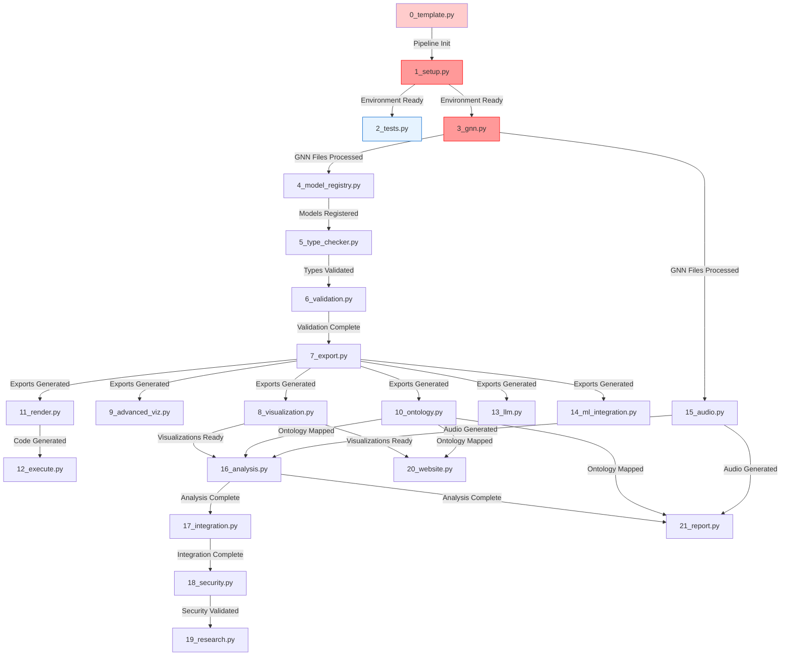

# GNN Pipeline Flow and Dependencies

> **📋 Document Metadata**  
> **Type**: Technical Guide | **Audience**: Developers & Operators | **Complexity**: Intermediate  
> **Last Updated**: January 2025 | **Status**: Active  
> **Cross-References**: [Pipeline Architecture](PIPELINE_ARCHITECTURE.md) | [Error Recovery](../troubleshooting/pipeline_error_recovery.md)

## Pipeline Flow Diagram



## Complete 22-Step Pipeline

### Critical Path
1. **0_template.py** → **1_setup.py** → **3_gnn.py** → **4_model_registry.py** → **5_type_checker.py** → **6_validation.py** → **7_export.py**
   - Template initialization, setup, and GNN processing are critical foundation
   - Type checking, validation, and export form core validation pipeline
   - Export provides base for all visualization, analysis, and execution steps

### Parallel Execution Groups
1. **Group 1**: 2_tests.py (can run independently after setup)
2. **Group 2**: 8_visualization.py, 9_advanced_viz.py, 10_ontology.py, 11_render.py, 13_llm.py, 14_ml_integration.py (depend on export)
3. **Group 3**: 15_audio.py (depends on GNN files)
4. **Group 4**: 12_execute.py (depends on render)
5. **Group 5**: 16_analysis.py (depends on visualization, ontology, audio)
6. **Group 6**: 17_integration.py → 18_security.py → 19_research.py (sequential integration chain)
7. **Group 7**: 20_website.py, 21_report.py (final output generation)

## Step Details (22 Steps: 0-21)

### 0. Template (0_template.py)
- **Critical**: No
- **Dependencies**: None
- **Timeout**: 2 minutes
- **Recovery**: Continue pipeline

### 1. Setup (1_setup.py)
- **Critical**: Yes
- **Dependencies**: None
- **Timeout**: 20 minutes
- **Recovery**: Auto-retry with reduced feature set

### 2. Tests (2_tests.py)
- **Critical**: No
- **Dependencies**: 1_setup.py (recommended)
- **Timeout**: 10 minutes
- **Recovery**: Continue with warnings

### 3. GNN Processing (3_gnn.py)
- **Critical**: Yes
- **Dependencies**: 1_setup.py
- **Timeout**: 5 minutes
- **Recovery**: Fallback to lightweight processing

### 4. Model Registry (4_model_registry.py)
- **Critical**: No
- **Dependencies**: 3_gnn.py
- **Timeout**: 3 minutes
- **Recovery**: Basic model tracking

### 5. Type Checking (5_type_checker.py)
- **Critical**: No
- **Dependencies**: 3_gnn.py, 4_model_registry.py
- **Timeout**: 5 minutes
- **Recovery**: Fallback to basic validation

### 6. Validation (6_validation.py)
- **Critical**: No
- **Dependencies**: 5_type_checker.py
- **Timeout**: 5 minutes
- **Recovery**: Basic consistency checks

### 7. Export (7_export.py)
- **Critical**: No
- **Dependencies**: 6_validation.py
- **Timeout**: 5 minutes
- **Recovery**: Retry individual formats

### 8. Visualization (8_visualization.py)
- **Critical**: No
- **Dependencies**: 7_export.py
- **Timeout**: 10 minutes
- **Recovery**: Skip complex visualizations

### 9. Advanced Visualization (9_advanced_viz.py)
- **Critical**: No
- **Dependencies**: 7_export.py
- **Timeout**: 10 minutes
- **Recovery**: Fallback to basic HTML reports

### 10. Ontology (10_ontology.py)
- **Critical**: No
- **Dependencies**: 7_export.py
- **Timeout**: 5 minutes
- **Recovery**: Use basic mappings

### 11. Render (11_render.py)
- **Critical**: No
- **Dependencies**: 7_export.py
- **Timeout**: 10 minutes
- **Recovery**: Adjust recursion limits

### 12. Execute (12_execute.py)
- **Critical**: No
- **Dependencies**: 11_render.py
- **Timeout**: 15 minutes
- **Recovery**: Fallback execution modes

### 13. LLM (13_llm.py)
- **Critical**: No
- **Dependencies**: 7_export.py
- **Timeout**: 10 minutes
- **Recovery**: Retry with backoff

### 14. ML Integration (14_ml_integration.py)
- **Critical**: No
- **Dependencies**: 7_export.py
- **Timeout**: 10 minutes
- **Recovery**: Basic ML features

### 15. Audio (15_audio.py)
- **Critical**: No
- **Dependencies**: 3_gnn.py
- **Timeout**: 10 minutes
- **Recovery**: Skip complex audio

### 16. Analysis (16_analysis.py)
- **Critical**: No
- **Dependencies**: 8_visualization.py, 10_ontology.py, 15_audio.py
- **Timeout**: 8 minutes
- **Recovery**: Basic analysis

### 17. Integration (17_integration.py)
- **Critical**: No
- **Dependencies**: 16_analysis.py
- **Timeout**: 5 minutes
- **Recovery**: Basic integration

### 18. Security (18_security.py)
- **Critical**: No
- **Dependencies**: 17_integration.py
- **Timeout**: 5 minutes
- **Recovery**: Basic security checks

### 19. Research (19_research.py)
- **Critical**: No
- **Dependencies**: 18_security.py
- **Timeout**: 5 minutes
- **Recovery**: Skip experimental features

### 20. Website (20_website.py)
- **Critical**: No
- **Dependencies**: 8_visualization.py, 10_ontology.py
- **Timeout**: 5 minutes
- **Recovery**: Generate minimal site

### 21. Report (21_report.py)
- **Critical**: No
- **Dependencies**: 10_ontology.py, 15_audio.py, 16_analysis.py
- **Timeout**: 5 minutes
- **Recovery**: Generate basic report


## Safety and Reliability Features

### Safe-to-Fail Patterns
- **Steps 8, 9, 12**: Comprehensive safe-to-fail implementations
- **All Steps**: Pipeline continuation guaranteed (return 0)
- **Error Recovery**: Multiple fallback levels with detailed diagnostics

### Monitoring and Metrics
1. Step execution time and performance tracking
2. Memory usage patterns and resource monitoring
3. Correlation IDs for end-to-end traceability
4. Comprehensive error classification and recovery
5. Output generation guarantees regardless of internal failures

### Performance Monitoring
```bash
# Monitor pipeline execution
python src/main.py --verbose

# Check individual step performance
python src/8_visualization.py --verbose --target-dir test_files/

# Generate comprehensive reports
python src/21_report.py --verbose
```

## Contributing

When modifying pipeline flow:

1. Update dependencies in `src/pipeline/config.py`
2. Adjust timeouts if needed
3. Update recovery procedures
4. Add/update tests
5. Document changes here and in `PIPELINE_ARCHITECTURE.md`

## References

- [Complete Pipeline Architecture](PIPELINE_ARCHITECTURE.md)
- [Individual Step Documentation](README.md)
- [Error Recovery Guide](../troubleshooting/pipeline_error_recovery.md)
- [Performance Guide](../performance/README.md)
- [Safety Patterns Documentation](../../src/README.md) 