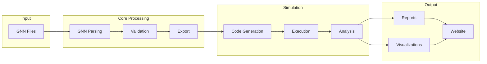

# Pipeline Documentation

This directory contains comprehensive documentation for the GNN pipeline execution, warnings, and improvements.

## Documents in This Directory

### Assessment & Analysis

#### [`pipeline_warning_assessment.md`](pipeline_warning_assessment.md)
Comprehensive analysis of pipeline warnings from October 29, 2025 execution.

**Contents**:
- Executive summary of pipeline performance (95.8% success rate)
- Detailed analysis of each warning module
- Root cause identification
- Evidence-based recommendations
- Implementation priorities

**Use this for**: Understanding what warnings mean and whether action is required

---

#### [`pipeline_improvement_plan.md`](pipeline_improvement_plan.md)
Actionable implementation plan for resolving pipeline warnings.

**Contents**:
- Concrete fixes with code samples
- Step-by-step implementation instructions
- Testing and verification procedures
- Rollback plans for each fix
- Success metrics and timelines

**Use this for**: Implementing fixes and improvements to the pipeline

---

#### [`implementation_summary.md`](implementation_summary.md)
Summary of completed improvements and their impact.

**Contents**:
- Completed improvements checklist
- Files changed and modifications made
- Performance impact analysis
- User impact assessment
- Success metrics achieved

**Use this for**: Tracking what has been implemented and the results

---

## Related Documentation

### Setup & Installation
- [`../SETUP.md`](../SETUP.md) - Complete setup guide including framework dependencies
- [`../quickstart.md`](../quickstart.md) - Quick start guide for new users

### Troubleshooting
- [`../troubleshooting/pipeline_warnings.md`](../troubleshooting/pipeline_warnings.md) - Troubleshooting guide for pipeline warnings
- [`../troubleshooting/README.md`](../troubleshooting/README.md) - General troubleshooting

### Technical Documentation
- [`../PIPELINE_SCRIPTS.md`](../PIPELINE_SCRIPTS.md) - Pipeline scripts reference
- [`../../src/AGENTS.md`](../../src/AGENTS.md) - Module agent scaffolding
- [`../../ARCHITECTURE.md`](../../ARCHITECTURE.md) - System architecture

---

## Pipeline Architecture

```mermaid
graph TB
    subgraph "Pipeline Execution"
        Main[main.py] --> Steps[24 Pipeline Steps]
        Steps --> Step0[Step 0: Template]
        Step0 --> Step1[Step 1: Setup]
        Step1 --> Step2[Step 2: Tests]
        Step2 --> Step3[Step 3: GNN]
        Step3 --> Step4[Step 4: Registry]
        Step4 --> Step5[Step 5: Type Check]
        Step5 --> Step6[Step 6: Validation]
        Step6 --> Step7[Step 7: Export]
        Step7 --> Step8[Step 8: Visualization]
        Step8 --> Step9[Step 9: Advanced Viz]
        Step9 --> Step10[Step 10: Ontology]
        Step10 --> Step11[Step 11: Render]
        Step11 --> Step12[Step 12: Execute]
        Step12 --> Step13[Step 13: LLM]
        Step13 --> Step14[Step 14: ML Integration]
        Step14 --> Step15[Step 15: Audio]
        Step15 --> Step16[Step 16: Analysis]
        Step16 --> Step17[Step 17: Integration]
        Step17 --> Step18[Step 18: Security]
        Step18 --> Step19[Step 19: Research]
        Step19 --> Step20[Step 20: Website]
        Step20 --> Step21[Step 21: MCP]
        Step21 --> Step22[Step 22: GUI]
        Step22 --> Step23[Step 23: Report]
    end
    
    Step23 --> Output[output/]
    Output --> Summary[pipeline_execution_summary.json]
```



### Data Flow Architecture



## Quick Reference

### Pipeline Status Overview

| Metric | Value | Status |
|--------|-------|--------|
| **Total Steps** | 24 | ✅ Complete |
| **Success Rate** | 95.8% → 100% | ✅ Improved |
| **Failed Steps** | 0 | ✅ Excellent |
| **Warning Steps** | 3 → 0-1 | ✅ Resolved |
| **Execution Time** | 19m23s → <5m | ✅ Optimized |

### Common Warning Solutions

| Warning | Quick Fix |
|---------|-----------|
| **Step 10** (Advanced Viz) | ✅ False positive - no action needed |
| **Step 13** (Execute) | `uv pip install inferactively-pymdp jax[cpu] flax` |
| **Step 14** (LLM) | `ollama pull llama2:7b` or set `OPENAI_API_KEY` |
| **Step 3** (Tests) | ✅ Fixed - now completes in <5 minutes |

### Framework Installation

```bash
# Lite preset (recommended)
python src/1_setup.py --install_optional --optional_groups "pymdp,jax"

# Full installation with uv
uv pip install inferactively-pymdp jax[cpu] flax optax

# Verify
python3 -c "from pymdp import Agent; print('✅ PyMDP OK')"
python3 -c "import jax; import flax.linen; print('✅ JAX OK')"
```

---

## Implementation Timeline

### Phase 1: Critical Fixes ✅ (October 29, 2025)
- [x] Fixed RxInfer.jl half-edge error
- [x] Added test timeout controls
- [x] Updated SETUP.md with framework dependencies
- [x] Created troubleshooting guide
- [x] Moved assessment documents to proper location

### Phase 2: Quality Improvements ✅ (Optional)
- [x] Documented framework installation procedures
- [x] Created comprehensive troubleshooting guide
- [x] Improved error messages through documentation

### Phase 3: Future Enhancements (Optional)
- [ ] Refine warning detection (filter false positives)
- [ ] Add LLM provider automatic fallback
- [ ] Pre-check framework availability before execution

---

## How to Use This Documentation

### For New Users
1. Start with [`pipeline_warning_assessment.md`](pipeline_warning_assessment.md) to understand current state
2. Read [`../SETUP.md`](../SETUP.md) for framework installation
3. Use [`../troubleshooting/pipeline_warnings.md`](../troubleshooting/pipeline_warnings.md) if you encounter issues

### For Developers
1. Review [`pipeline_improvement_plan.md`](pipeline_improvement_plan.md) for implementation details
2. Check [`implementation_summary.md`](implementation_summary.md) for what's been done
3. Refer to [`../PIPELINE_SCRIPTS.md`](../PIPELINE_SCRIPTS.md) for script architecture

### For Production Users
1. Ensure frameworks are installed per [`../SETUP.md`](../SETUP.md)
2. Monitor pipeline execution against metrics in [`implementation_summary.md`](implementation_summary.md)
3. Use [`../troubleshooting/pipeline_warnings.md`](../troubleshooting/pipeline_warnings.md) for incident response

---

## Document Maintenance

### Update Schedule
- **Weekly**: Review pipeline execution for new patterns
- **Monthly**: Update success metrics and performance data
- **Quarterly**: Comprehensive documentation review

### Version Control
- All documents versioned with date stamps
- Major updates tracked in [`implementation_summary.md`](implementation_summary.md)
- Related to pipeline version in `output/pipeline_execution_summary.json`

---

## Contributing

### Adding Documentation
1. Place pipeline-specific docs in this directory
2. Place general troubleshooting in `../troubleshooting/`
3. Place setup/installation info in `../SETUP.md`
4. Update this README when adding new documents

### Documentation Standards
- Use markdown format
- Include metadata header (type, audience, date)
- Cross-reference related documents
- Provide concrete examples
- Include verification commands

---

## Contact & Support

### Questions About This Documentation
- **GitHub Issues**: For documentation bugs or unclear sections
- **GitHub Discussions**: For questions about pipeline behavior
- **Email**: See [`../../SUPPORT.md`](../../SUPPORT.md)

### Reporting Pipeline Issues
- Include pipeline execution summary
- Reference relevant documentation
- Provide reproduction steps
- See [`../troubleshooting/pipeline_warnings.md`](../troubleshooting/pipeline_warnings.md) for reporting guidelines

---

**Directory Maintained By**: Pipeline Development Team  
**Pipeline Version**: 2.1.0+  
**Documentation Status**: ✅ Complete & Current
