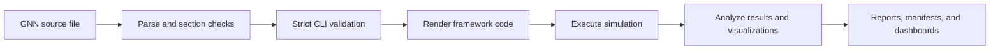
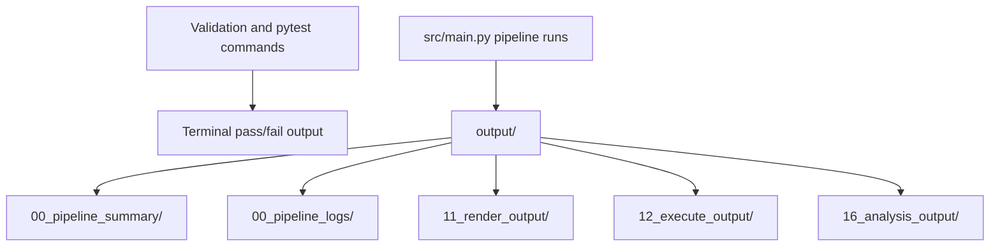

# Validation Evidence Guide

**Last Updated**: 2026-06-13

This guide maps GNN validation claims to concrete commands and artifacts. Treat command output from the current checkout as the evidence source; generated files under `output/` are run evidence, not maintained source.

## Evidence Flow



## Certification Commands

| Surface | Command | Certifies |
| --- | --- | --- |
| README POMDP example | `uv run --extra dev gnn validate input/gnn_files/discrete/actinf_pomdp_agent.md --strict` | Public CLI validation accepts the showcased Active Inference POMDP shape contract. |
| Packaged templates | `for template in src/cli/template_assets/*.md; do uv run --extra dev gnn validate "$template" --strict; done` | All templates exposed by `gnn templates list`, `gnn templates show`, and `gnn pull` pass strict CLI validation. |
| Schema and template regressions | `uv run --extra dev python -m pytest src/tests/gnn/test_gnn_schema.py src/tests/cli/test_templates_cli.py -q --tb=short` | Structural tensor validation, negative controls, and packaged template CLI validation. |
| Focused PyMDP proof path | `uv run --extra dev python -m pytest src/tests/execute/test_pymdp_contracts.py src/tests/execute/test_discrete_models_pymdp.py src/tests/visualization/test_visualization_matrices.py -q --tb=short` | Render, execute, analysis, and visualization behavior for representative discrete models. |
| Documentation integrity | `uv run --extra dev python doc/development/docs_audit.py --strict --check-anchors --no-write` | Relative links, anchors, and AGENTS/README coverage. |
| GNN doc terminology | `uv run --extra dev python scripts/check_gnn_doc_patterns.py --strict` | Maintained GNN docs avoid known-stale syntax and path patterns. |
| Capability claims | `uv run --extra dev python scripts/check_capability_contracts.py` | Roadmap-visible capability claims have source support. |
| Renderer generator modules | `uv run --extra dev gnn health` | Renderer generator modules import and environment preflight issues are reported. |
| Runtime-ready environment | `uv run --extra dev gnn health --strict` | Same health report, with nonzero exit when core runtime dependencies are missing. |
| Test inventory | `uv run --extra dev python -m pytest --collect-only src/tests/ -q --tb=no --ignore=src/tests/llm/test_llm_ollama.py --ignore=src/tests/llm/test_llm_ollama_integration.py` | Current collected test count with Ollama integration tests excluded. |

## Generated Evidence



- `output/00_pipeline_summary/` records pipeline summaries and performance dashboards.
- `output/00_pipeline_logs/` records structured and human-readable run logs.
- `output/11_render_output/` contains generated framework scripts and render summaries.
- `output/12_execute_output/` contains collected simulation data and execution summaries.
- `output/16_analysis_output/` contains analysis reports, plots, and framework comparisons.

Do not commit regenerated `output/` artifacts as maintained source. Re-run the commands above when fresh evidence is needed.

## GridWorld Cross-Framework Proof Path

For the strict multi-framework GridWorld path, use the maintained review command:

```bash
uv run python src/main.py --only-steps "3,5,8,11,12,16" --target-dir input/gnn_files/pomdp_gridworld --frameworks "pymdp,rxinfer,activeinference_jl" --verbose
```

This path is documented in [pipeline_stage_hardening_review.md](pipeline_stage_hardening_review.md). Julia framework execution depends on local Julia packages; use the focused Python/PyMDP tests above when Julia is unavailable.
