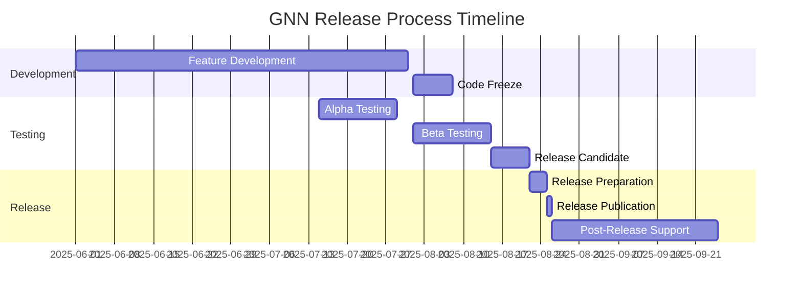

# GNN Release Management

> **📋 Document Metadata**  
> **Type**: Release Management | **Audience**: Maintainers, Contributors, Release Managers | **Complexity**: Intermediate  
> **Cross-References**: [Contributing Guide](../../CONTRIBUTING.md) | [Development Guide](../development/README.md) | [Deployment Guide](../deployment/README.md)

## Overview

This document outlines the comprehensive release management process for the GNN (Generalized Notation Notation) project, including versioning strategy, release cycles, testing requirements, and deployment procedures.

## 📋 **Versioning Strategy**

### **Semantic Versioning (SemVer)**

GNN follows [Semantic Versioning 2.0.0](https://semver.org/) with the format `MAJOR.MINOR.PATCH`:

```
Version Format: X.Y.Z[-PRE_RELEASE][+BUILD_METADATA]

Examples:
- 1.0.0      (Major release)
- 1.1.0      (Minor release - new features)
- 1.1.1      (Patch release - bug fixes)
- 1.2.0-rc.1 (Release candidate)
- 1.2.0-beta.3 (Beta release)
- 1.2.0-alpha.1 (Alpha release)
```

### **Version Increment Guidelines**

| Change Type | Version Impact | Examples |
|-------------|----------------|----------|
| **MAJOR** | Breaking changes | GNN syntax changes, API removals, incompatible pipeline changes |
| **MINOR** | New features (backward compatible) | New pipeline steps, framework integrations, template additions |
| **PATCH** | Bug fixes (backward compatible) | Security patches, performance improvements, documentation fixes |

### **Pre-Release Versions**

- **`alpha`**: Early development, internal testing only
- **`beta`**: Feature-complete, community testing
- **`rc` (Release Candidate)**: Production-ready candidate

## 🚀 **Release Cycles**

### **Regular Release Schedule**

```yaml
release_schedule:
  major_releases: 
    frequency: "Every 12-18 months"
    focus: "Major architectural changes, breaking changes"
    
  minor_releases:
    frequency: "Every 2-3 months"
    focus: "New features, framework integrations"
    
  patch_releases:
    frequency: "As needed (weekly to monthly)"
    focus: "Bug fixes, security patches"
    
  security_releases:
    frequency: "Emergency (within 24-48 hours)"
    focus: "Critical security vulnerabilities"
```

### **Release Timeline**



## 🔄 **Release Process**

### **1. Pre-Release Phase**

#### **Feature Freeze & Code Review**

```bash
# Release branch creation
git checkout -b release/v1.2.0
git push -u origin release/v1.2.0

# Update version numbers
python scripts/update_version.py 1.2.0

# Generate changelog
python scripts/generate_changelog.py --version 1.2.0
```

#### **Quality Assurance**

```yaml
qa_requirements:
  test_coverage: ">= 85%"
  documentation_coverage: ">= 90%"
  security_scan: "PASS"
  performance_regression: "< 5%"
  
required_tests:
  - unit_tests: "All passing"
  - integration_tests: "All pipeline steps"
  - framework_tests: "PyMDP, RxInfer, DisCoPy"
  - security_tests: "SAST, dependency scan"
  - performance_tests: "Baseline comparison"
```

### **2. Release Candidate Phase**

#### **RC Creation Process**

```bash
# Create release candidate
git tag -a v1.2.0-rc.1 -m "Release candidate 1.2.0-rc.1"
git push origin v1.2.0-rc.1

# Build and test release artifacts
python scripts/build_release.py --version 1.2.0-rc.1
python scripts/test_release.py --version 1.2.0-rc.1

# Deploy to staging environment
python scripts/deploy_staging.py --version 1.2.0-rc.1
```

#### **RC Testing Checklist**

- [ ] **Functional Testing**: All 13 pipeline steps execute successfully
- [ ] **Integration Testing**: Framework compatibility (PyMDP, RxInfer, DisCoPy)
- [ ] **Performance Testing**: Benchmark comparison with previous version
- [ ] **Security Testing**: Vulnerability scan and penetration testing
- [ ] **Documentation Testing**: All examples and tutorials work
- [ ] **Backwards Compatibility**: Existing GNN files process correctly
- [ ] **Multi-Platform Testing**: Linux, macOS, Windows (if applicable)

### **3. Release Phase**

#### **Final Release Creation**

```bash
# Merge release branch to main
git checkout main
git merge release/v1.2.0
git tag -a v1.2.0 -m "Release v1.2.0"
git push origin main
git push origin v1.2.0

# Create release artifacts
python scripts/create_release_artifacts.py --version 1.2.0

# Publish release
gh release create v1.2.0 \
  --title "GNN v1.2.0" \
  --notes-file CHANGELOG.md \
  --latest
```

#### **Release Artifact Components**

```yaml
release_artifacts:
  source_code:
    - "gnn-v1.2.0.tar.gz"
    - "gnn-v1.2.0.zip"
  
  documentation:
    - "gnn-docs-v1.2.0.pdf"
    - "gnn-api-docs-v1.2.0.zip"
  
  examples:
    - "gnn-examples-v1.2.0.zip"
    - "gnn-templates-v1.2.0.zip"
  
  checksums:
    - "SHA256SUMS"
    - "SHA256SUMS.sig"  # GPG signature
```

### **4. Post-Release Phase**

#### **Release Communication**

1. **GitHub Release**: Detailed release notes with changelog
2. **Documentation Updates**: Version compatibility matrices
3. **Community Notification**: Announcements on relevant channels
4. **Security Advisory**: If security fixes are included

#### **Release Monitoring**

```yaml
post_release_monitoring:
  metrics:
    - download_statistics
    - issue_reports
    - performance_metrics
    - user_feedback
  
  support_duration:
    major_releases: "2 years"
    minor_releases: "6 months"
    patch_releases: "Until next patch"
```

## 📝 **Changelog Management**

### **Changelog Format**

Following [Keep a Changelog](https://keepachangelog.com/) format:

```markdown
# Changelog

All notable changes to the GNN project will be documented in this file.

The format is based on [Keep a Changelog](https://keepachangelog.com/en/1.0.0/),
and this project adheres to [Semantic Versioning](https://semver.org/spec/v2.0.0.html).

## [Unreleased]

### Added
- New MCP tool for advanced model validation
- Support for custom JAX backends in DisCoPy integration

### Changed
- Improved performance of GNN type checker by 40%
- Enhanced error messages with more contextual information

### Deprecated
- Legacy PyMDP v0.1.x compatibility (use v0.2.x+)

### Removed
- Deprecated experimental syntax features from v1.1.x

### Fixed
- Memory leak in large model processing
- Cross-platform path handling issues

### Security
- Updated dependencies with security vulnerabilities
- Enhanced input validation for LLM integration

## [1.2.0] - 2025-06-25

### Added
- **[NEW]** Advanced cognitive phenomena modeling templates
- **[NEW]** Multi-agent trajectory planning examples
- **[NEW]** Enhanced DisCoPy categorical diagram support
- **[NEW]** Comprehensive security documentation
- **[NEW]** MCP (Model Context Protocol) integration

### Changed
- **[IMPROVED]** Pipeline execution performance optimized by 35%
- **[IMPROVED]** Documentation navigation with cross-reference system
- **[IMPROVED]** Type checking accuracy and error reporting
- **[UPDATED]** Framework compatibility (PyMDP v0.2.x, RxInfer v1.3.x)

### Fixed
- **[BUG]** Resolved memory issues with large GNN files
- **[BUG]** Fixed cross-platform compatibility issues
- **[BUG]** Corrected visualization rendering edge cases

### Security
- **[SECURITY]** Enhanced LLM prompt injection prevention
- **[SECURITY]** Improved API authentication mechanisms
- **[SECURITY]** Updated all dependencies to latest secure versions
```

### **Automated Changelog Generation**

```python
# scripts/generate_changelog.py
class ChangelogGenerator:
    def __init__(self):
        self.git_repo = GitRepository()
        self.pr_analyzer = PullRequestAnalyzer()
        self.commit_analyzer = CommitAnalyzer()
    
    def generate_changelog(self, from_version: str, to_version: str) -> str:
        """Generate changelog between versions."""
        
        # Get commits between versions
        commits = self.git_repo.get_commits_between(from_version, to_version)
        
        # Categorize changes
        changes = {
            'added': [],
            'changed': [],
            'deprecated': [],
            'removed': [],
            'fixed': [],
            'security': []
        }
        
        for commit in commits:
            category = self.commit_analyzer.categorize_commit(commit)
            description = self.commit_analyzer.extract_description(commit)
            
            if category in changes:
                changes[category].append(description)
        
        # Generate markdown
        return self.format_changelog(to_version, changes)
```

## 🔐 **Security Release Process**

### **Critical Security Vulnerabilities**

```yaml
security_release_process:
  severity_levels:
    critical:
      response_time: "24 hours"
      process: "Emergency release"
      notification: "Immediate security advisory"
    
    high:
      response_time: "48 hours"
      process: "Expedited release"
      notification: "Security advisory with release"
    
    medium:
      response_time: "1 week"
      process: "Next scheduled release"
      notification: "Included in release notes"
```

### **Security Release Checklist**

- [ ] **Vulnerability Assessment**: Confirm impact and severity
- [ ] **Fix Development**: Minimal, focused security fix
- [ ] **Security Testing**: Verify fix without introducing regressions
- [ ] **Coordinated Disclosure**: Notify stakeholders before public release
- [ ] **Security Advisory**: Prepare detailed security advisory
- [ ] **Release Process**: Follow expedited release process
- [ ] **Post-Release**: Monitor for successful deployment

## 🤝 **Release Team Roles**

### **Release Manager**
- Overall release coordination
- Timeline management
- Stakeholder communication
- Risk assessment and mitigation

### **Quality Assurance Lead**
- Test execution oversight
- Quality gate validation
- Release readiness assessment
- Performance regression analysis

### **Security Lead**
- Security testing coordination
- Vulnerability assessment
- Security advisory preparation
- Compliance validation

### **Documentation Lead**
- Changelog preparation
- Release notes creation
- Documentation updates
- Tutorial validation

## 📊 **Release Metrics**

### **Quality Metrics**

```yaml
quality_metrics:
  test_coverage: ">= 85%"
  documentation_coverage: ">= 90%"
  security_scan_pass_rate: "100%"
  performance_regression: "< 5%"
  
  bug_metrics:
    critical_bugs: "0"
    high_bugs: "< 3"
    regression_bugs: "0"
```

### **Process Metrics**

```yaml
process_metrics:
  release_cycle_time: "Target: 12 weeks"
  time_to_fix_critical: "< 24 hours"
  release_preparation_time: "2 weeks"
  post_release_support_time: "4 weeks"
```

## 🔗 **Integration with Development Workflow**

### **Branch Strategy**

```
main (production-ready)
├── develop (integration branch)
├── feature/new-mcp-tools
├── feature/enhanced-visualization
├── release/v1.2.0
├── hotfix/security-patch
└── docs/release-documentation
```

### **Automated Release Pipeline**

```yaml
# .github/workflows/release.yml
name: Release Pipeline
on:
  push:
    tags:
      - 'v*'

jobs:
  validate:
    runs-on: ubuntu-latest
    steps:
      - name: Validate Release Tag
      - name: Run Full Test Suite
      - name: Security Scan
      - name: Performance Benchmark
  
  build:
    needs: validate
    runs-on: ubuntu-latest
    steps:
      - name: Build Release Artifacts
      - name: Generate Documentation
      - name: Create Checksums
  
  release:
    needs: build
    runs-on: ubuntu-latest
    steps:
      - name: Create GitHub Release
      - name: Upload Artifacts
      - name: Update Documentation
      - name: Notify Community
```

---

**Release Team**: GNN Maintainers  
**Next Release**: v1.2.0 (Target: August 2025)  
**Current Stable**: v1.1.0 