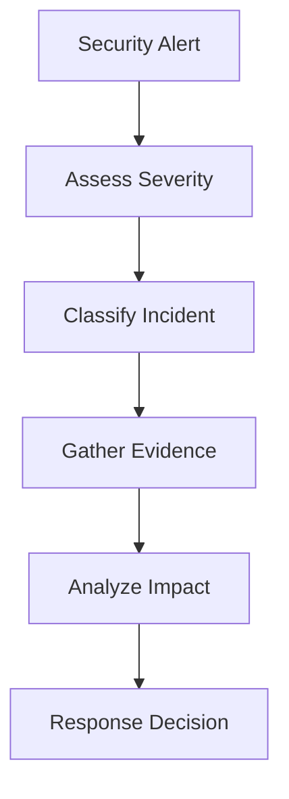

# Security Incident Response Procedures

> **📋 Document Metadata**  
> **Type**: Security Procedures | **Audience**: Security Teams, System Administrators | **Complexity**: Advanced  
> **Cross-References**: [Security Framework](security_framework.md) | [Vulnerability Assessment](vulnerability_assessment.md) | [Security Monitoring](monitoring.md) | [Main Documentation](../README.md)

## Overview

This document outlines comprehensive security incident response procedures for the GNN ecosystem. It provides structured workflows for detecting, responding to, and recovering from security incidents.

**Incident Response Philosophy**: Rapid detection, containment, eradication, and recovery with comprehensive documentation and post-incident analysis.

## Incident Classification

### Severity Levels

**Critical (P0)**
- Active exploitation
- Data breach confirmed
- System compromise
- Service disruption

**High (P1)**
- Potential data exposure
- Unauthorized access attempts
- Vulnerability exploitation attempts
- Performance degradation

**Medium (P2)**
- Suspicious activity
- Policy violations
- Configuration issues
- Non-critical vulnerabilities

**Low (P3)**
- Informational alerts
- Minor policy violations
- Configuration recommendations
- Best practice suggestions

## Incident Response Workflow

### Phase 1: Detection and Analysis

**Detection Sources:**
- Security monitoring alerts
- User reports
- Automated detection systems
- External threat intelligence

**Initial Analysis:**


**Analysis Steps:**
1. **Verify Incident**: Confirm incident is real
2. **Classify Severity**: Determine severity level
3. **Gather Evidence**: Collect logs, artifacts, indicators
4. **Assess Impact**: Evaluate potential impact
5. **Document Findings**: Record all findings

### Phase 2: Containment

**Containment Strategies:**

**Short-Term Containment:**
- Isolate affected systems
- Block malicious IPs
- Disable compromised accounts
- Implement emergency patches

**Long-Term Containment:**
- Implement permanent fixes
- Update security controls
- Enhance monitoring
- Improve defenses

**Containment Actions:**
```python
# Example containment automation
def contain_incident(incident_id: str, severity: str):
    """Contain security incident."""
    
    if severity == "Critical":
        # Immediate containment
        isolate_affected_systems(incident_id)
        block_malicious_ips(incident_id)
        disable_compromised_accounts(incident_id)
        enable_emergency_patches(incident_id)
    
    # Log containment actions
    log_containment_actions(incident_id, actions)
```

### Phase 3: Eradication

**Eradication Steps:**
1. **Remove Threats**: Eliminate malicious code/access
2. **Patch Vulnerabilities**: Apply security patches
3. **Update Systems**: Update affected systems
4. **Verify Cleanup**: Confirm threat removal
5. **Document Actions**: Record eradication steps

### Phase 4: Recovery

**Recovery Steps:**
1. **Restore Systems**: Restore from clean backups
2. **Verify Integrity**: Confirm system integrity
3. **Monitor Closely**: Enhanced monitoring
4. **Validate Functionality**: Test system functionality
5. **Resume Operations**: Gradually resume normal operations

### Phase 5: Post-Incident Analysis

**Analysis Components:**
- **Timeline Reconstruction**: Detailed incident timeline
- **Root Cause Analysis**: Identify root causes
- **Impact Assessment**: Evaluate full impact
- **Lessons Learned**: Document lessons learned
- **Improvement Recommendations**: Security improvements

## Incident Response Team

### Team Roles

**Incident Commander:**
- Overall incident coordination
- Decision making
- Resource allocation
- Communication management

**Technical Lead:**
- Technical analysis
- System investigation
- Evidence collection
- Technical remediation

**Security Analyst:**
- Threat analysis
- Vulnerability assessment
- Security monitoring
- Threat intelligence

**Communications Lead:**
- Stakeholder communication
- Status updates
- Public relations
- Documentation

## Communication Procedures

### Internal Communication

**Immediate Notifications:**
- Incident response team
- Security team
- System administrators
- Management

**Status Updates:**
- Regular status updates
- Progress reports
- Resolution updates
- Post-incident reports

### External Communication

**When to Communicate:**
- Data breach confirmed
- Public disclosure required
- Regulatory notification required
- Customer impact significant

**Communication Channels:**
- Security advisories
- Public statements
- Customer notifications
- Regulatory filings

## Documentation Requirements

### Incident Documentation

**Required Documentation:**
- Incident report
- Timeline of events
- Evidence collected
- Actions taken
- Impact assessment
- Lessons learned
- Improvement recommendations

### Documentation Template

```markdown
# Security Incident Report

## Incident Summary
- Incident ID: [ID]
- Date/Time: [Timestamp]
- Severity: [Level]
- Status: [Status]

## Incident Details
- Description: [Description]
- Detection Method: [Method]
- Affected Systems: [Systems]
- Impact: [Impact]

## Timeline
- [Timestamp]: [Event]
- [Timestamp]: [Event]

## Response Actions
- [Action]: [Details]
- [Action]: [Details]

## Resolution
- Resolution Date: [Date]
- Resolution Method: [Method]
- Verification: [Verification]

## Lessons Learned
- [Lesson]: [Details]

## Recommendations
- [Recommendation]: [Details]
```

## Best Practices

1. **Prepare in Advance**: Maintain incident response plan
2. **Practice Regularly**: Conduct incident response drills
3. **Document Everything**: Comprehensive documentation
4. **Communicate Clearly**: Clear communication channels
5. **Learn from Incidents**: Continuous improvement
6. **Update Procedures**: Regular plan updates
7. **Train Team**: Regular team training
8. **Test Systems**: Regular system testing

## Related Documentation

- **[Security Framework](security_framework.md)**: Comprehensive security guide
- **[Vulnerability Assessment](vulnerability_assessment.md)**: Vulnerability assessment procedures
- **[Security Monitoring](monitoring.md)**: Security monitoring procedures

## See Also

- **[Security Framework](security_framework.md)**: Complete security framework
- **[Vulnerability Assessment](vulnerability_assessment.md)**: Vulnerability assessment
- **[Main Documentation](../README.md)**: Return to main documentation

---

**Status**: ✅ Production Ready  
**Compliance**: Professional security standards  
**Last Updated**: 2025-12-30  
**Version**: 1.0.0


