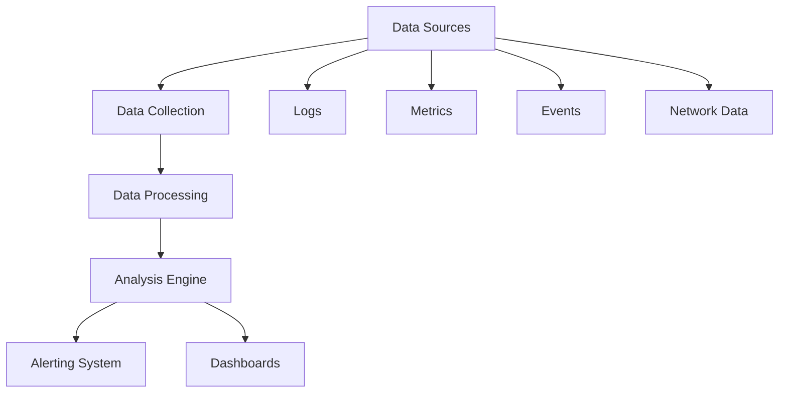

# Security Monitoring and Alerting

> **📋 Document Metadata**  
> **Type**: Security Procedures | **Audience**: Security Teams, System Administrators | **Complexity**: Advanced  
> **Cross-References**: [Security Framework](security_framework.md) | [Incident Response](incident_response.md) | [Vulnerability Assessment](vulnerability_assessment.md) | [Main Documentation](../README.md)

## Overview

This document provides comprehensive guidance on security monitoring and alerting for the GNN ecosystem. It outlines procedures for detecting security threats, monitoring system activity, and responding to security alerts.

**Monitoring Philosophy**: Continuous monitoring with intelligent alerting and rapid response capabilities.

## Monitoring Architecture

### Monitoring Components



**Components:**
- **Data Collection**: Log aggregation and collection
- **Data Processing**: Event processing and normalization
- **Analysis Engine**: Threat detection and analysis
- **Alerting System**: Alert generation and notification
- **Dashboards**: Visualization and reporting

## Monitoring Data Sources

### Application Logs

**Log Types:**
- Authentication logs
- Access logs
- Error logs
- Application logs
- Security logs

**Log Collection:**
```python
# Example log collection
def collect_security_logs():
    """Collect security-relevant logs."""
    
    logs = {
        'authentication': collect_auth_logs(),
        'access': collect_access_logs(),
        'errors': collect_error_logs(),
        'security': collect_security_logs()
    }
    
    return normalize_logs(logs)
```

### System Metrics

**Metric Types:**
- Performance metrics
- Resource usage
- Network traffic
- System health
- Security metrics

### Security Events

**Event Types:**
- Authentication events
- Authorization events
- Policy violations
- Threat detections
- Anomaly detections

## Threat Detection

### Detection Methods

**Signature-Based Detection:**
- Known attack patterns
- Malware signatures
- Threat intelligence
- Pattern matching

**Anomaly Detection:**
- Behavioral analysis
- Statistical analysis
- Machine learning
- Baseline comparison

**Heuristic Detection:**
- Rule-based detection
- Behavioral heuristics
- Context-aware detection
- Multi-factor analysis

### Detection Rules

**Example Detection Rules:**
```python
# Example detection rules
detection_rules = {
    'brute_force': {
        'condition': 'failed_logins > 5 in 5 minutes',
        'severity': 'High',
        'action': 'block_ip'
    },
    'privilege_escalation': {
        'condition': 'unusual_permission_change',
        'severity': 'Critical',
        'action': 'alert_and_investigate'
    },
    'data_exfiltration': {
        'condition': 'large_data_transfer',
        'severity': 'High',
        'action': 'alert_and_block'
    }
}
```

## Alerting System

### Alert Classification

**Alert Severity:**
- **Critical**: Immediate response required
- **High**: Urgent attention needed
- **Medium**: Important but not urgent
- **Low**: Informational alerts

### Alert Channels

**Notification Channels:**
- Email notifications
- SMS alerts
- Slack/Teams integration
- PagerDuty integration
- Dashboard alerts

### Alert Management

**Alert Lifecycle:**
1. **Generation**: Alert created
2. **Notification**: Alert sent
3. **Acknowledgment**: Alert acknowledged
4. **Investigation**: Alert investigated
5. **Resolution**: Alert resolved
6. **Documentation**: Alert documented

## Monitoring Dashboards

### Dashboard Types

**Security Dashboard:**
- Real-time security metrics
- Threat detection status
- Alert summary
- System health

**Operational Dashboard:**
- System performance
- Resource usage
- Application health
- Network status

**Compliance Dashboard:**
- Compliance metrics
- Policy adherence
- Audit status
- Compliance reports

## Log Analysis

### Analysis Techniques

**Pattern Analysis:**
- Log pattern matching
- Sequence analysis
- Correlation analysis
- Trend analysis

**Statistical Analysis:**
- Baseline comparison
- Anomaly detection
- Trend analysis
- Predictive analysis

### Analysis Tools

**Tools:**
- Log analysis platforms
- SIEM systems
- Security analytics
- Machine learning tools

## Best Practices

1. **Comprehensive Coverage**: Monitor all systems
2. **Real-Time Monitoring**: Continuous monitoring
3. **Intelligent Alerting**: Reduce false positives
4. **Rapid Response**: Quick alert response
5. **Regular Review**: Review and tune rules
6. **Documentation**: Document all alerts
7. **Continuous Improvement**: Improve detection
8. **Training**: Regular team training

## Related Documentation

- **[Security Framework](security_framework.md)**: Comprehensive security guide
- **[Incident Response](incident_response.md)**: Incident response procedures
- **[Vulnerability Assessment](vulnerability_assessment.md)**: Vulnerability assessment

## See Also

- **[Security Framework](security_framework.md)**: Complete security framework
- **[Incident Response](incident_response.md)**: Incident response procedures
- **[Main Documentation](../README.md)**: Return to main documentation

---

**Status**: ✅ Production Ready  
**Compliance**: Professional security standards  
**Last Updated**: 2025-12-30  
**Version**: 1.0.0

