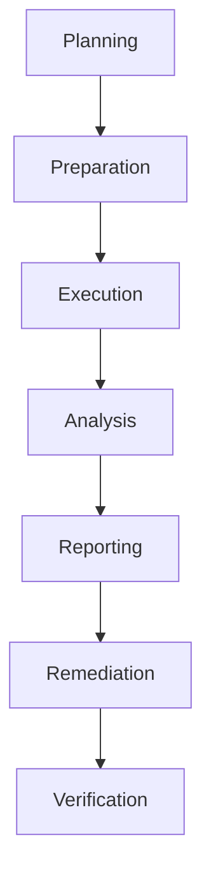

# Security Assessment Procedures

> **📋 Document Metadata**  
> **Type**: Security Framework | **Audience**: Security Teams, Auditors | **Complexity**: Advanced  
> **Cross-References**: [Security Framework](security_framework.md) | [Vulnerability Assessment](vulnerability_assessment.md) | [Compliance Guide](compliance_guide.md) | [Main Documentation](../README.md)

## Overview

This document provides comprehensive security assessment procedures for the GNN ecosystem. It outlines frameworks for conducting security audits, evaluating security posture, and identifying security improvements.

**Assessment Philosophy**: Comprehensive evaluation with actionable recommendations and continuous improvement.

## Assessment Types

### Comprehensive Security Assessment

**Full System Assessment:**
- Complete security evaluation
- All components assessed
- Comprehensive reporting
- Detailed recommendations

**Assessment Scope:**
- Architecture review
- Code security review
- Configuration review
- Process review
- Compliance review

### Targeted Assessment

**Focused Assessment:**
- Specific component evaluation
- Targeted security review
- Focused recommendations
- Quick assessment

**Use Cases:**
- New feature assessment
- Critical component review
- Incident follow-up
- Compliance verification

## Assessment Framework

### Assessment Phases



**Phase 1: Planning**
- Define assessment scope
- Identify stakeholders
- Set objectives
- Plan timeline

**Phase 2: Preparation**
- Gather documentation
- Prepare tools
- Set up environment
- Brief team

**Phase 3: Execution**
- Conduct assessment
- Collect evidence
- Document findings
- Track progress

**Phase 4: Analysis**
- Analyze findings
- Assess risks
- Prioritize issues
- Develop recommendations

**Phase 5: Reporting**
- Create report
- Present findings
- Discuss recommendations
- Obtain approval

**Phase 6: Remediation**
- Implement fixes
- Verify fixes
- Update documentation
- Re-assess if needed

## Assessment Areas

### Architecture Security

**Assessment Areas:**
- System architecture
- Security controls
- Access controls
- Data flow
- Integration security

### Code Security

**Assessment Areas:**
- Code quality
- Security patterns
- Vulnerability patterns
- Best practices
- Code review

### Configuration Security

**Assessment Areas:**
- System configuration
- Security settings
- Access controls
- Network configuration
- Service configuration

### Process Security

**Assessment Areas:**
- Development processes
- Deployment processes
- Incident response
- Change management
- Security operations

## Security Audit Frameworks

### OWASP Assessment

**OWASP Top 10:**
- Injection vulnerabilities
- Broken authentication
- Sensitive data exposure
- XML external entities
- Broken access control
- Security misconfiguration
- XSS vulnerabilities
- Insecure deserialization
- Known vulnerabilities
- Insufficient logging

### NIST Framework

**NIST Cybersecurity Framework:**
- Identify
- Protect
- Detect
- Respond
- Recover

### ISO 27001

**ISO 27001 Controls:**
- Information security policies
- Organization of information security
- Human resource security
- Asset management
- Access control
- Cryptography
- Physical security
- Operations security
- Communications security
- System acquisition
- Supplier relationships
- Incident management
- Business continuity
- Compliance

## Assessment Reporting

### Report Structure

**Report Components:**
- Executive summary
- Assessment methodology
- Findings summary
- Detailed findings
- Risk assessment
- Recommendations
- Remediation plan
- Appendices

### Report Template

```markdown
# Security Assessment Report

## Executive Summary
- Assessment Overview
- Key Findings
- Risk Summary
- Recommendations Summary

## Assessment Methodology
- Assessment Scope
- Assessment Approach
- Tools and Techniques
- Timeline

## Findings
- Critical Findings
- High Findings
- Medium Findings
- Low Findings

## Risk Assessment
- Risk Analysis
- Risk Prioritization
- Risk Matrix

## Recommendations
- Immediate Actions
- Short-Term Actions
- Long-Term Actions

## Remediation Plan
- Remediation Timeline
- Resource Requirements
- Success Criteria
```

## Best Practices

1. **Regular Assessments**: Schedule regular assessments
2. **Comprehensive Coverage**: Assess all areas
3. **Risk-Based Approach**: Focus on high-risk areas
4. **Actionable Recommendations**: Provide specific recommendations
5. **Follow-Up**: Track remediation progress
6. **Documentation**: Comprehensive documentation
7. **Continuous Improvement**: Learn and improve
8. **Stakeholder Engagement**: Engage all stakeholders

## Related Documentation

- **[Security Framework](security_framework.md)**: Comprehensive security guide
- **[Vulnerability Assessment](vulnerability_assessment.md)**: Vulnerability assessment procedures
- **[Compliance Guide](compliance_guide.md)**: Compliance requirements

## See Also

- **[Security Framework](security_framework.md)**: Complete security framework
- **[Incident Response](incident_response.md)**: Incident response procedures
- **[Main Documentation](../README.md)**: Return to main documentation

---

**Status**: ✅ Production Ready  
**Compliance**: Professional security standards  
**Last Updated**: 2025-12-30  
**Version**: 1.0.0

