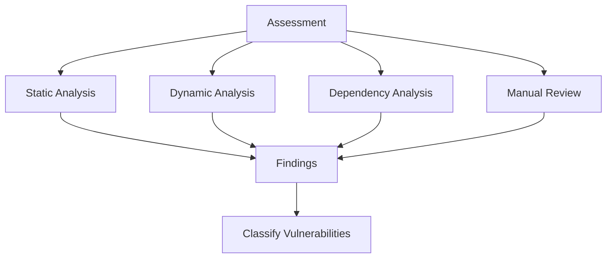

# Vulnerability Assessment Framework

> **📋 Document Metadata**  
> **Type**: Security Framework | **Audience**: Security Teams, Developers | **Complexity**: Advanced  
> **Cross-References**: [Security Framework](security_framework.md) | [Security Assessment](security_assessment.md) | [Compliance Guide](compliance_guide.md) | [Main Documentation](../README.md)

## Overview

This document provides comprehensive vulnerability assessment frameworks for the GNN ecosystem. It outlines procedures for identifying, assessing, and remediating security vulnerabilities.

**Assessment Philosophy**: Proactive vulnerability identification with risk-based prioritization and systematic remediation.

## Vulnerability Assessment Types

### Static Analysis

**Code Analysis:**
- Source code scanning
- Dependency vulnerability scanning
- Configuration analysis
- Security pattern detection

**Tools:**
- Static analysis tools (SAST)
- Dependency scanners
- Configuration analyzers
- Security linters

### Dynamic Analysis

**Runtime Analysis:**
- Runtime vulnerability scanning
- Penetration testing
- Fuzzing
- Behavior analysis

**Tools:**
- Dynamic analysis tools (DAST)
- Penetration testing frameworks
- Fuzzing tools
- Runtime monitors

### Dependency Analysis

**Dependency Scanning:**
- Package vulnerability scanning
- License compliance checking
- Outdated dependency detection
- Supply chain analysis

**Tools:**
- Dependency scanners
- Package managers
- License checkers
- Supply chain analyzers

## Vulnerability Classification

### Severity Levels

**Critical:**
- Remote code execution
- Authentication bypass
- Data breach potential
- System compromise

**High:**
- Privilege escalation
- Information disclosure
- Denial of service
- Significant data exposure

**Medium:**
- Limited information disclosure
- Configuration issues
- Weak authentication
- Moderate impact

**Low:**
- Informational issues
- Best practice violations
- Minor configuration issues
- Low impact

## Assessment Workflow

### Phase 1: Planning

**Planning Steps:**
1. **Define Scope**: Identify systems and components
2. **Select Tools**: Choose assessment tools
3. **Set Objectives**: Define assessment goals
4. **Schedule Assessment**: Plan assessment timeline
5. **Prepare Environment**: Set up test environment

### Phase 2: Discovery

**Discovery Methods:**

**Discovery Activities:**
- Automated scanning
- Manual code review
- Configuration review
- Dependency analysis
- Threat modeling

### Phase 3: Analysis

**Analysis Steps:**
1. **Verify Findings**: Confirm vulnerabilities
2. **Assess Impact**: Evaluate potential impact
3. **Determine Exploitability**: Assess exploit difficulty
4. **Calculate Risk**: Risk scoring
5. **Prioritize**: Prioritize remediation

### Phase 4: Reporting

**Report Components:**
- Executive summary
- Detailed findings
- Risk assessment
- Remediation recommendations
- Timeline and priorities

### Phase 5: Remediation

**Remediation Steps:**
1. **Plan Remediation**: Develop remediation plan
2. **Implement Fixes**: Apply security fixes
3. **Test Fixes**: Verify fix effectiveness
4. **Re-assess**: Confirm vulnerability closure
5. **Document**: Document remediation actions

## Risk Assessment

### Risk Scoring

**CVSS (Common Vulnerability Scoring System):**
- Base score calculation
- Temporal score adjustment
- Environmental score adjustment
- Final risk score

**Risk Factors:**
- Exploitability
- Impact
- Exposure
- Mitigation effectiveness

### Risk Prioritization

**Prioritization Criteria:**
- Severity level
- Exploitability
- Impact assessment
- Business criticality
- Remediation effort

## Remediation Strategies

### Immediate Remediation

**Critical Vulnerabilities:**
- Emergency patches
- System isolation
- Access restrictions
- Enhanced monitoring

### Planned Remediation

**High/Medium Vulnerabilities:**
- Scheduled patches
- Configuration updates
- Security enhancements
- Process improvements

### Long-Term Remediation

**Low Vulnerabilities:**
- Best practice implementation
- Security training
- Process improvements
- Architecture enhancements

## Continuous Assessment

### Ongoing Activities

**Regular Assessments:**
- Weekly dependency scans
- Monthly code reviews
- Quarterly penetration tests
- Annual comprehensive assessments

**Automated Monitoring:**
- Continuous vulnerability scanning
- Real-time threat detection
- Automated patch management
- Security monitoring

## Best Practices

1. **Regular Assessments**: Schedule regular assessments
2. **Comprehensive Coverage**: Assess all components
3. **Risk-Based Approach**: Prioritize by risk
4. **Timely Remediation**: Fix vulnerabilities promptly
5. **Documentation**: Comprehensive documentation
6. **Continuous Improvement**: Learn and improve
7. **Automation**: Automate where possible
8. **Training**: Regular security training

## Related Documentation

- **[Security Framework](security_framework.md)**: Comprehensive security guide
- **[Security Assessment](security_assessment.md)**: Security assessment procedures
- **[Compliance Guide](compliance_guide.md)**: Compliance requirements

## See Also

- **[Security Framework](security_framework.md)**: Complete security framework
- **[Incident Response](incident_response.md)**: Incident response procedures
- **[Main Documentation](../README.md)**: Return to main documentation

---

**Status**: ✅ Production Ready  
**Compliance**: Professional security standards  
**Last Updated**: 2025-12-30  
**Version**: 1.0.0

